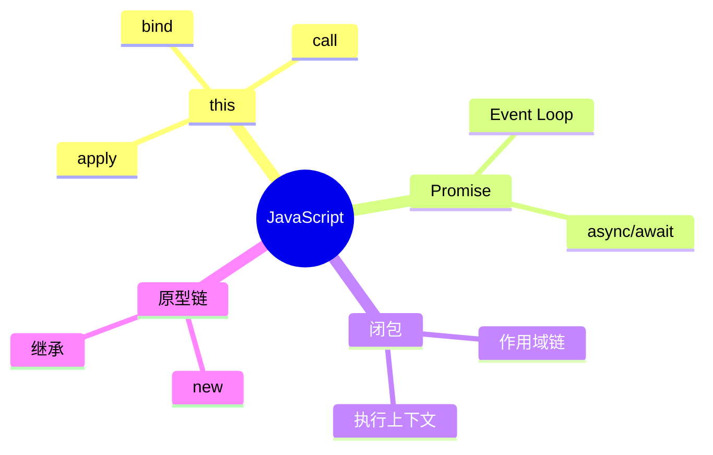

# Spec: 前端面试知识库（interview-notes）

> 状态：已确认 | 版本：v1.1 | 日期：2026-07-05

---

## 1. 项目目标

为 3 年经验中级前端开发者构建一套**可长期维护的体系化前端面试知识库**，以真实大厂面试（阿里、腾讯、字节、美团）为标准，目标是"通过技术面试"而非"学习基础知识"。

### 用户画像

- 工作经验：3 年中级前端
- 技术栈：JavaScript ES6+ / TypeScript / Vue3 / Pinia / Vue Router / Vite / Axios / Element Plus / Node.js 基础 / Git
- 项目类型：后台管理系统 + 组件库封装
- 复习状态：中期，基础知识过了一遍但记忆不深刻、理解不到位

---

## 2. 技术选型

**VitePress** — 静态站点生成器，支持：
- 自动侧边栏/导航
- 内置搜索（Algolia 或本地搜索）
- Mermaid 图表原生渲染
- Markdown + Vue 混合编写
- 断链检测（dead links）
- 部署至 GitHub Pages

选型原因：用户为 Vue 技术栈，零学习成本；VitePress 本身是 Vue 项目，可复用 Vue 组件增强 Markdown。

---

## 3. 命名规范

| 层级 | 规则 | 示例 |
|------|------|------|
| 模块目录 | 技术名词英文，业务分类中文 | `JavaScript/`、`浏览器/`、`项目实战/` |
| Markdown 文件 | 英文 kebab-case | `event-loop.md`、`login-auth.md` |
| 静态资源 | 放在 `docs/public/` 下 | `docs/public/images/diff.png` |
| Frontmatter tag | 英文 kebab-case | `event-loop`, `vue3` |

---

## 4. 目录结构

```
interview-notes/
│
├── .vitepress/
│   └── config.ts
│
├── docs/
│   ├── index.md
│   ├── roadmap.md
│   ├── writing-rules.md
│   ├── changelog.md
│   │
│   ├── public/
│   │   ├── images/
│   │   ├── diagrams/
│   │   └── favicon.ico
│   │
│   ├── JavaScript/
│   │   ├── index.md
│   │   ├── this.md
│   │   ├── call-apply-bind.md
│   │   ├── new.md
│   │   ├── closure.md
│   │   ├── prototype-chain.md
│   │   ├── promise.md
│   │   ├── event-loop.md
│   │   ├── async-await.md
│   │   ├── deep-clone.md
│   │   └── debounce-throttle.md
│   │
│   ├── CSS/
│   │   ├── index.md
│   │   ├── bfc.md
│   │   ├── flexbox.md
│   │   ├── grid.md
│   │   ├── center-layout.md
│   │   ├── box-model.md
│   │   ├── responsive.md
│   │   └── stacking-context.md
│   │
│   ├── TypeScript/
│   │   ├── index.md
│   │   ├── generics.md
│   │   ├── extends-infer.md
│   │   ├── keyof-mapped-conditional.md
│   │   ├── utility-types.md
│   │   ├── satisfies.md
│   │   └── any-unknown-never.md
│   │
│   ├── Vue3/
│   │   ├── index.md
│   │   ├── reactivity.md
│   │   ├── computed-watch.md
│   │   ├── nextTick.md
│   │   ├── lifecycle.md
│   │   ├── diff-patch.md
│   │   ├── keepalive.md
│   │   ├── teleport-suspense.md
│   │   ├── composition-api.md
│   │   ├── renderer.md
│   │   └── scheduler.md
│   │
│   ├── 浏览器/
│   │   ├── index.md
│   │   ├── render-process.md
│   │   ├── reflow-repaint.md
│   │   ├── cache.md
│   │   ├── storage.md
│   │   └── web-worker.md
│   │
│   ├── 网络/
│   │   ├── index.md
│   │   ├── http-https.md
│   │   ├── http2-http3.md
│   │   ├── tcp.md
│   │   ├── dns-cdn.md
│   │   ├── websocket-sse.md
│   │   └── cors.md
│   │
│   ├── 工程化/
│   │   ├── index.md
│   │   ├── vite.md
│   │   ├── webpack.md
│   │   ├── babel-esbuild.md
│   │   ├── tree-shaking.md
│   │   └── pnpm.md
│   │
│   ├── Node/
│   │   ├── index.md
│   │   ├── commonjs-esm.md
│   │   ├── node-event-loop.md
│   │   └── package-manager.md
│   │
│   ├── 算法/
│   │   ├── index.md
│   │   ├── array.md
│   │   ├── tree.md
│   │   ├── linked-list.md
│   │   ├── sort.md
│   │   └── common-questions.md
│   │
│   ├── 安全/
│   │   ├── index.md
│   │   ├── xss.md
│   │   ├── csrf.md
│   │   └── token-storage.md
│   │
│   ├── 性能优化/
│   │   ├── index.md
│   │   ├── web-vitals.md
│   │   ├── first-screen.md
│   │   ├── bundle-optimization.md
│   │   ├── virtual-list.md
│   │   └── image-optimization.md
│   │
│   ├── 项目实战/
│   │   ├── index.md
│   │   ├── 基础设施/
│   │   │   ├── axios-encapsulation.md
│   │   │   ├── request-dedup.md
│   │   │   └── mock.md
│   │   ├── 认证鉴权/
│   │   │   ├── login-auth.md
│   │   │   └── token-refresh.md
│   │   ├── 权限系统/
│   │   │   ├── dynamic-route.md
│   │   │   └── permission-rbac.md
│   │   ├── 业务场景/
│   │   │   ├── file-upload.md
│   │   │   ├── excel-import-export.md
│   │   │   └── big-data-table.md
│   │   └── 项目优化/
│   │       └── project-optimization.md
│   │
│   ├── 手写题/
│   │   ├── index.md
│   │   ├── promise.md
│   │   ├── bind-call-apply.md
│   │   ├── new.md
│   │   ├── debounce-throttle.md
│   │   ├── deep-clone.md
│   │   ├── event-emitter.md
│   │   └── compose-pipe.md
│   │
│   ├── 面试题库/
│   │   ├── index.md
│   │   ├── JavaScript.md
│   │   ├── Vue3.md
│   │   ├── TypeScript.md
│   │   ├── 浏览器.md
│   │   ├── 网络.md
│   │   ├── 工程化.md
│   │   ├── 项目.md
│   │   └── HR.md
│   │
│   ├── HR/
│   │   ├── index.md
│   │   ├── self-intro.md
│   │   ├── project-intro.md
│   │   ├── leave-reason.md
│   │   ├── strength-weakness.md
│   │   └── career-plan.md
│   │
│   ├── 模拟面试/
│   │   ├── index.md
│   │   ├── round-1-js.md
│   │   ├── round-1-vue.md
│   │   ├── round-2-project.md
│   │   └── round-3-hr.md
│   │
│   ├── 面试回答/
│   │   ├── index.md
│   │   ├── JavaScript/
│   │   │   └── promise.md
│   │   ├── Vue3/
│   │   │   └── reactivity.md
│   │   └── 项目/
│   │       └── login-auth.md
│   │
│   └── snippets/
│       ├── ts/
│       │   ├── deep-clone.ts
│       │   ├── promise.ts
│       │   ├── event-emitter.ts
│       │   └── debounce-throttle.ts
│       ├── vue/
│       │   ├── useTable.ts
│       │   └── useRequest.ts
│       ├── css/
│       │   └── center.css
│       ├── config/
│       │   ├── vite.config.ts
│       │   └── eslint.config.js
│       └── tests/
│           ├── promise.test.ts
│           └── deep-clone.test.ts
│
└── package.json
```

---

## 5. 统一文档模板

每个知识点文件必须遵循以下模板（9 个板块）：

```markdown
---
title: <知识点名称>
description: <一句话描述>
category: <模块名>
difficulty: 初级 | 中级 | 高级
frequency: ⭐⭐⭐⭐⭐
status: draft | reviewing | stable
created: 2026-07-05
updated: 2026-07-05
reviewed: null
tags:
  - <tag1>
  - <tag2>
---

# <知识点名称>

> ⭐⭐⭐⭐⭐｜难度：中级｜项目：★★★★★

## 一句话总结

（面试开场第一句话，说清"是什么"）

## 核心机制

（1~2 分钟回答，占全文 40%~50%）

## 深度拓展

### 追问点 1
### 追问点 2
### 追问点 3

## 手写实现

（有则写，无则删除整个板块，不要写"无"）

## 项目实战

（结合后台管理系统/组件库举例）

## 易错点

❌ 错误认知 1
❌ 错误认知 2
❌ 错误认知 3

## 面试信号

- 面试官问"XXX" → 下一问大概率是 YYY
- 面试官问"AAA" → 注意准备 BBB

## 相关阅读

- [上一篇](./prev-topic.md)
- [下一篇](./next-topic.md)
- [知识点 A](./topic-a.md)
- [手写题：知识点 A](../手写题/topic-a.md)
- [面试题：知识点 A 真题](../面试题库/JavaScript.md#topic-a)

## 更新记录

- 2026-07：初始版本
```

---

## 6-bis. writing-rules.md（写作规范一页纸）

独立于 spec 的精简版写作规范，放在 `docs/writing-rules.md`，方便快速查阅。内容固定为一页纸：

```markdown
# Writing Rules

> 本知识库所有文档必须遵循以下 7 条规则。

## 1. 不写教材式内容

❌ Promise 是 ECMAScript 2015 引入的一种异步编程解决方案……
✅ 面试中可以这样回答：Promise 本质上是一个状态机，解决了回调嵌套问题……

## 2. 每篇只讲一个核心知识点

一篇文档只回答一个问题。如果发现自己在写第二个知识点，拆成新文件。

## 3. 优先解释"为什么"，而不是"是什么"

面试官不考定义。考的是：为什么需要这个东西？它解决了什么问题？

## 4. 必须结合项目经验

每个知识点必须有「项目实战」板块，结合 Vue3 后台管理系统举例。

## 5. 面试回答优先于概念定义

开篇第一句话就是"面试中怎么回答"，而不是"什么是XXX"。

## 6. 能画图就少写文字

优先用 Mermaid 图表，减少纯文字描述。一张好的流程图胜过 500 字。

## 7. 不重复，通过链接引用（DRY）

同一个知识点只在一处深入写。其他地方通过「相关阅读」链接。
Promise 原理 → 只在 JavaScript/promise.md 中写
手写 Promise → 链接到 手写题/promise.md
Promise 真题 → 链接到 面试题库/JavaScript.md
```

---

## 6. 文档质量规范（Documentation Style Guide）

| 规范项 | 约束 |
|--------|------|
| 单篇长度 | 100~200 行 Markdown |
| 图片数量 | ≤ 3 张 |
| Mermaid 图表 | ≤ 2 个 |
| 代码块 | ≤ 80 行 |
| 相关阅读链接 | **3~6 条**，优先质量而非数量，禁止无限扩散 |
| 核心原则 | 一篇一个核心思想，禁止百科式长文 |
| **DRY 原则** | **同一知识点只在一处深入写，其他地方只通过链接引用，禁止复制粘贴内容** |

### 模板分级：必选 + 可选

> **模板服务于内容，而不是内容服务于模板。**

| 级别 | 板块 | 说明 |
|------|------|------|
| ✅ 必选 | Frontmatter、一句话总结、核心机制、相关阅读 | 所有文档必须有 |
| ⭐ 推荐 | 深度拓展、项目实战、易错点 | 多数文档应该有 |
| ⭕ 按需 | 手写实现、面试信号、Mermaid、图片 | 有则写，无则删，禁止保留空标题 |

- Promise 可以写 200 行、有 5 个追问、有手写实现。
- `satisfies` 写 100 行、1 个追问就够了。
- `BFC` 没有手写实现，就不要保留"## 手写实现"这个空标题。

---

## 7. 交叉引用设计

每个知识点的「相关阅读」板块包含 3 类链接：

| 类型 | 作用 | 示例 |
|------|------|------|
| 线性导航 | 上一篇 / 下一篇（学习路径） | `上一篇：prototype-chain.md` |
| 横向网络 | 相关知识点的**双向链接** | `相关：Event Loop, async/await` |
| 实战入口 | 跳转到手写题 / 面试题库 | `手写题：Promise 完整实现` |

**双向链接强制规则：** 如果 A 的「相关阅读」链接了 B，则 B 的「相关阅读」也必须链接 A。形成真正的知识网络，不允许单向链接。

**交叉引用关系表（核心链路）：**

```
Promise → Event Loop → async/await → 微任务
Diff → LIS → Key → Vue 更新机制
响应式 → effect → track → trigger → scheduler → computed → watch
HTTP → HTTPS → HTTP2 → HTTP3 → TCP → DNS → CDN
Token → Cookie → HttpOnly → SameSite → XSS → CSRF
闭包 → 作用域链 → 执行上下文 → this → call/apply/bind → new
```

---

## 8. index.md 规范

每个模块的 `index.md` 必须是**知识地图**而非目录列表。使用 Mermaid mindmap：

```markdown
# JavaScript 知识地图



### 推荐学习顺序

按面试出现频率和知识依赖排序：

```markdown
## 推荐学习顺序

1. ⭐⭐⭐⭐⭐ [this](./this.md)
2. ⭐⭐⭐⭐⭐ [闭包](./closure.md)
3. ⭐⭐⭐⭐⭐ [Promise](./promise.md)
4. ⭐⭐⭐⭐⭐ [Event Loop](./event-loop.md)
5. ⭐⭐⭐⭐   [async/await](./async-await.md)
6. ⭐⭐⭐⭐   [call/apply/bind](./call-apply-bind.md)
7. ⭐⭐⭐⭐   [原型链](./prototype-chain.md)
8. ⭐⭐⭐⭐   [new](./new.md)
9. ⭐⭐⭐     [深拷贝](./deep-clone.md)
10. ⭐⭐⭐    [防抖节流](./debounce-throttle.md)
```

| 知识点 | 频率 | 难度 | 手写 |
|--------|------|------|------|
| [Promise](./promise.md) | ⭐⭐⭐⭐⭐ | 中级 | [✅](../手写题/promise.md) |
| ... | ... | ... | ... |
```

---

## 9. 面试题库文档规范

### 目录结构（按技术领域组织）

面试题库**按技术领域**划分文件，公司作为每道题的 metadata，避免同一知识点在不同公司目录下重复出现：

```
面试题库/
├── index.md           # 题库总览
├── JavaScript.md
├── Vue3.md
├── TypeScript.md
├── 浏览器.md
├── 网络.md
├── 工程化.md
├── 项目.md
└── HR.md
```

### 题目格式

每道题记录**题目 + 出现公司 + 关联链接**，不重复写知识点内容：

```markdown
## Promise 为什么能链式调用？

> ⭐⭐⭐⭐⭐ | 公司：字节(2025一面)、腾讯(2024二面)、阿里(2025一面)

考察点：Promise Resolution Procedure、then 返回新 Promise

> 答案参考：[JavaScript/Promise - 深度拓展](../JavaScript/promise.md#深度拓展)
```

### Frontmatter 规范

每篇面试题库文档必须包含 Frontmatter 元数据：

```markdown
---
title: JavaScript 高频面试题
category: 面试题库
difficulty: 中级
tags:
  - JavaScript
  - Promise
  - EventLoop
companies:
  - 字节跳动
  - 腾讯
  - 阿里
  - 美团
---
```

---

## 10. roadmap.md 四阶段设计

每个阶段包含**学习路径 + 完成标准**，让学习目标明确可衡量：

```
第一阶段：JS 基础（4周）
  学习路径：this → 闭包 → 原型链 → Promise → Event Loop → async/await
  完成标准：能够手写 Promise、bind、深拷贝；能完整回答 Event Loop 机制；
            所有 ⭐⭐⭐⭐⭐ 知识点达到"稳定"状态

第二阶段：Vue 框架（3周）
  学习路径：响应式 → computed/watch → Diff → 生命周期 → KeepAlive → 手写题
  完成标准：能画出响应式原理流程图；能默写 Diff 核心逻辑；
            能手写 nextTick 简化版

第三阶段：项目经验（2周）
  学习路径：登录鉴权 → 权限系统 → Axios 封装 → 性能优化
  完成标准：能用 STAR 法则描述 3 个以上项目难点；
            能画权限系统架构图；能列出 5 个以上性能优化点

第四阶段：冲刺模拟（1周）
  学习路径：算法高频 30 题 → 模拟面试 3 轮 → 真题刷题 → HR 准备
  完成标准：模拟面试连续 3 次无卡顿；
            自我介绍 1 分钟版本和 3 分钟版本都能流畅表达
```

---

## 11. snippets 目录规范

| 子目录 | 内容 | 引用方式 |
|--------|------|---------|
| `ts/` | TypeScript 工具函数完整实现 | `<<< @/snippets/ts/deep-clone.ts` |
| `vue/` | Vue3 Composition API hooks | `<<< @/snippets/vue/useTable.ts` |
| `css/` | 常用 CSS 布局代码 | `<<< @/snippets/css/center.css` |
| `config/` | 项目配置参考 | `<<< @/snippets/config/vite.config.ts` |
| `tests/` | 手写题单元测试 | `snippets/tests/promise.test.ts` |

测试文件可配合 Vitest 直接运行，确保手写实现正确性。

---

## 12. changelog.md 规范

记录每次知识库更新：

```markdown
# Changelog

## 2026-07-05

### 新增
- JavaScript: Promise, Event Loop, async-await
- Vue3: 响应式原理, Diff

### 完善
- 手写题: Promise 增加边界 Case 处理

### 修复
- 浏览器: render-process.md 流程图修正
```

---

## 13. JavaScript vs 手写题 分工规范

| 维度 | JavaScript/ | 手写题/ |
|------|-------------|---------|
| 侧重点 | 原理 + 面试回答 | 完整代码 + 边界 Case |
| Promise | 状态机、链式调用、微任务 | Promise/A+ 规范、resolvePromise、all/race/finally |
| 代码量 | 少量核心代码 | 完整可运行实现 |
| 关系 | 互相链接 | 互相链接 |

---

## 14. 实施策略

| 阶段 | 内容 | 预估文件数 |
|------|------|-----------|
| **Phase 1A：工程初始化** | VitePress 配置 + 目录结构 + 根级页面 + 规范文件 | ~15 个文件 |
| **Phase 1B：骨架生成** | 所有模块 index.md + 占位文档 + snippets + 面试题库骨架 | ~115 个文件 |
| **Phase 2：核心** | JavaScript(11) + Vue3(11) + 手写题(8) 深度填充 | ~30 篇 |
| **Phase 3：扩展** | CSS(8) + TypeScript(7) + 浏览器(6) + 网络(7) + 项目实战(11) | ~39 篇 |
| **Phase 4：完善** | 工程化(6) + Node(3) + 算法(6) + 安全(4) + 性能优化(6) + HR(6) + 模拟面试(5) + 面试题库(9) + 面试回答(Phase 2后启动) + snippets + tests | ~60 篇 |
| **Phase 5（远期）** | AI/ 模块（cursor/claude-code/mcp/agent/prompt） | 视情况 |

> **面试回答/ 模块说明：** 在 Phase 2 核心知识填充完成后启动。与知识点文档不同，「面试回答」记录的是**真实面试中的逐字回答稿**，而非知识讲解。例如 `JavaScript/promise.md` 讲原理，`面试回答/JavaScript/promise.md` 记录"如果面试官问 X，我该怎么组织语言回答"。

---

## 15. 前端领域核心交叉引用链路

```
JavaScript 核心链路：
  this → call/apply/bind → new → 原型链 → 闭包 → 作用域 → 执行上下文
  Promise → Event Loop → async/await → Generator → 微任务/宏任务
  深拷贝 →  WeakMap → 循环引用 → 结构化克隆

Vue3 核心链路：
  响应式原理 → effect → track → trigger → scheduler → computed → watch
  Diff → patch → patchKeyedChildren → LIS → Key → Block Tree → PatchFlag
  KeepAlive → 缓存策略 → LRU
  nextTick → 微任务 → 事件循环

项目核心链路：
  登录鉴权 → Token刷新 → 动态路由 → RBAC → 按钮权限 → 路由权限
  Axios封装 → 拦截器 → 防重复请求 → 取消请求
  虚拟列表 → 大数据表格 → 性能优化

工程化核心链路：
  Vite → ESBuild → Rollup → Tree Shaking → SourceMap
  Webpack → Babel → AST → 插件机制
  pnpm → workspace → monorepo

网络核心链路：
  HTTP → HTTPS → HTTP2 → HTTP3 → TCP → DNS → CDN
  CORS → CSRF → XSS → CSP

安全核心链路：
  XSS → CSP → HttpOnly
  CSRF → SameSite → Token
  Token存储 → Cookie → LocalStorage → SessionStorage
```

---

## 16. 约束与原则

1. **一切内容服务于面试**：不写教程式内容，不堆砌概念。
2. **结合源码**：Vue3/TypeScript 相关知识点必须结合源码说明。
3. **结合项目**：每个知识点必须有"项目实战"板块，结合后台管理系统。
4. **增量更新**：后续只修改对应 Markdown + 自动更新 changelog，不重复生成已有内容。
5. **文档质量规范**：所有文档遵循 Section 6 的长度和结构约束。
6. **Frontmatter 必填**：所有 Markdown 文件必须包含 Frontmatter。
7. **统一写作语气**：所有文档采用"面试回答"口吻，而非教材口吻。

   | ❌ 教材口吻（禁止） | ✅ 面试口吻（必须） |
   |---|---|
   | Promise 是 JavaScript 中用于管理异步操作的对象 | 面试中可以这样回答：Promise 本质上是一个状态机 + 回调队列，它解决了异步回调嵌套的问题 |
   | BFC 全称 Block Formatting Context，是 CSS 视觉渲染的一部分 | 面试官问"什么是 BFC"时，你可以先一句话说清楚——BFC 是一个独立的渲染区域，内部的布局不受外部影响，常用于清除浮动和防止 margin 重叠 |

8. **DRY 原则（Don't Repeat Yourself）**：同一个知识点只在一处深入撰写，其他地方通过「相关阅读」链接引用。例如 Promise 原理只在 `JavaScript/promise.md` 中写，「手写题/promise.md」侧重代码实现，「面试题库/JavaScript.md」只记题目+链接。半年后不会出现 5 份 Promise 原理的不同版本。
