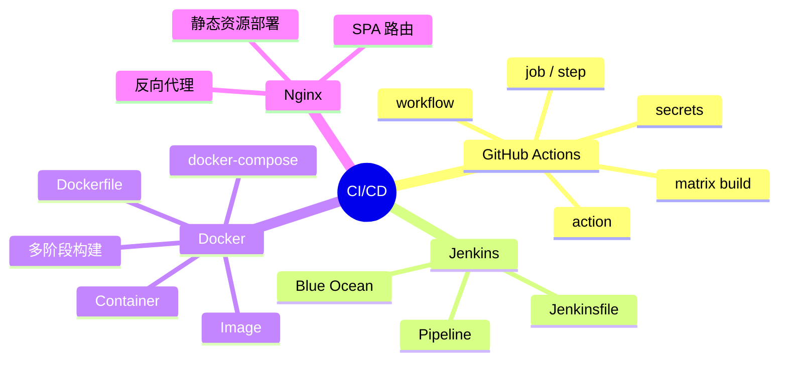

# CI/CD 知识地图

## 推荐学习顺序

1. ⭐⭐⭐⭐   [CI/CD 概述](./overview.md) —— 先理解整体概念和流水线思想
2. ⭐⭐⭐⭐⭐ [GitHub Actions](./github-actions.md) —— 面试最高频，必须能手写 workflow
3. ⭐⭐⭐⭐   [Docker 基础](./docker.md) —— 前端容器化部署的必备技能
4. ⭐⭐⭐     [Jenkins](./jenkins.md) —— 了解传统 CI/CD 工具即可

## 知识点索引

| 知识点 | 频率 | 难度 | 手写 | 状态 |
|--------|------|------|------|------|
| [CI/CD 概述](./overview.md) | ⭐⭐⭐⭐ | 初级 | — | filled |
| [GitHub Actions](./github-actions.md) | ⭐⭐⭐⭐⭐ | 中级 | ✅ workflow 文件 | filled |
| [Docker 基础](./docker.md) | ⭐⭐⭐⭐ | 中级 | ✅ Dockerfile | filled |
| [Jenkins](./jenkins.md) | ⭐⭐⭐ | 高级 | — | filled |
