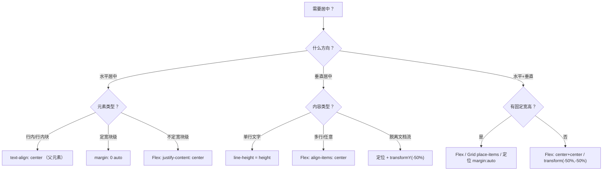

# 居中方案

> ⭐⭐⭐⭐｜难度：初级

## 一句话总结

> CSS 居中要根据**元素类型**（块级 or 行内）和**方向**（水平 or 垂直 or 双向）来选择方案，没有万能方法，但现代项目里 Flexbox/Grid 一行代码解决 90% 的居中需求，剩下的用定位 + transform 兜底。

面试开场："居中看起来简单，但面试官考察的是你对各种方案的**适用场景**是否清楚，以及背后的**原理**——比如 `margin: auto` 为什么能水平居中但不能垂直居中，`translate(-50%, -50%)` 和 Flex 居中到底有什么区别。"

## 核心机制

### 水平居中

按元素类型分四类方案：

```css
/* 1. 行内/行内块元素 → 给父元素设置 */
.parent { text-align: center; }

/* 2. 定宽块级元素 → 自身设置 */
.block { width: 200px; margin-left: auto; margin-right: auto; }

/* 3. 不定宽块级元素 → Flex */
.parent { display: flex; justify-content: center; }

/* 4. 不定宽块级元素 → 定位 + transform（万能但麻烦） */
.block {
  position: relative; /* 或 absolute */
  left: 50%;
  transform: translateX(-50%);
}
```

**`margin: auto` 为什么只能水平居中？** 因为在正常文档流中，块级元素的宽度默认是 `100% - margin`，水平方向的 `auto` 有剩余空间可以分配，所以能居中。但高度方向，块级元素默认由内容撑开，`margin-top/bottom: auto` 计算为 0——**没有剩余空间，就无法居中**。这就是为什么 `margin: auto` 不垂直居中的根本原因。

### 垂直居中

```css
/* 1. 单行文字 → line-height 等于容器高度 */
.single-line { height: 40px; line-height: 40px; }

/* 2. 多行文字 → table-cell */
.parent { display: table-cell; vertical-align: middle; height: 200px; }

/* 3. Flex -- 现代首选 */
.parent { display: flex; align-items: center; }

/* 4. Grid */
.parent { display: grid; align-items: center; }

/* 5. 定位 + transform -- 不定高 */
.child {
  position: absolute; /* 或 relative */
  top: 50%;
  transform: translateY(-50%);
}
```

### 水平垂直居中（面试必问）

```css
/* 方案一：Flex -- 最推荐，代码最少 */
.parent {
  display: flex;
  justify-content: center;
  align-items: center;
}

/* 方案二：Grid + place-items -- 最简练 */
.parent {
  display: grid;
  place-items: center; /* justify-items + align-items 的简写 */
}

/* 方案三：定位 + transform -- 不定宽高也 OK */
.child {
  position: absolute;
  top: 50%;
  left: 50%;
  transform: translate(-50%, -50%);
}

/* 方案四：定位 + margin: auto -- 需要定宽高 */
.child {
  position: absolute;
  top: 0; right: 0; bottom: 0; left: 0;
  width: 200px;
  height: 100px;
  margin: auto; /* 四方向 auto！神奇吧 */
}
```

四种方案的对比：

| 方案 | 需知宽高 | 脱离文档流 | 兼容性 | 推荐度 |
|---|---|---|---|---|
| Flex | 否 | 否 | IE11+ | ⭐⭐⭐⭐⭐ |
| Grid + place-items | 否 | 否 | 现代浏览器 | ⭐⭐⭐⭐⭐ |
| 定位 + transform | 否 | 是 | IE10+ | ⭐⭐⭐ |
| 定位 + margin auto | 是 | 是 | IE8+ | ⭐⭐ |
| table-cell | 否 | 否 | IE8+ | ⭐（过时） |

## 深度拓展

### 追问：`position: absolute + margin: auto` 怎么同时水平垂直居中？

这是个有趣的高阶知识点。当你给一个绝对定位的元素设置 `top/right/bottom/left: 0`，浏览器会同时满足"靠左"和"靠右"两个约束——这就在水平方向产生了剩余空间。此时 `margin: auto` 就能工作了，水平和垂直方向都能平分剩余空间，实现居中。

**条件**：元素必须有**确定的宽高**，否则 `margin: auto` 计算为 0。

```css
.modal {
  position: fixed;  /* 或 absolute，相对于定位父元素 */
  top: 0;
  right: 0;
  bottom: 0;
  left: 0;
  width: 500px;
  height: 300px;
  margin: auto;     /* 四方向平分剩余空间 → 居中 */
}
```

这个方案在某些旧项目里能看到（比如老 Modal 组件），但现在 Flex/Grid 更简洁。

### 追问：`place-items` 和 `place-content` 的区别

Grid 里的两个简写属性，容易混淆：

```css
/* place-items：作用于每个网格项目的对齐（默认 stretch） */
/* = justify-items + align-items */
grid: place-items: center;

/* place-content：作用于整个网格内容在容器内的对齐（多行/多列场景） */
/* = justify-content + align-content */
grid: place-content: center;
```

简单理解：`items` 管单个格子内，`content` 管整块网格在容器里的位置。Flexbox 也支持 `place-content`（换行模式下）和 `place-items`。

### 兼容性对比表

| 方案 | Chrome | Firefox | Safari | IE |
|---|---|---|---|---|
| Flex + center | 29+ | 28+ | 9+ | 11（部分） |
| Grid + place-items | 57+ | 52+ | 10.1+ | 不支持 |
| transform: translate | 36+ | 16+ | 9+ | 10+ |
| margin: auto（定位） | 全支持 | 全支持 | 全支持 | 8+ |
| table-cell | 全支持 | 全支持 | 全支持 | 8+ |

实际项目中不用纠结 IE 兼容性了——Vue3 + Element Plus 本身就抛弃了 IE。

## Mermaid



## 项目实战

### Loading 遮罩层居中

后台系统最常见：全局 loading 或局部 loading 遮罩层居中。

```vue
<template>
  <div class="loading-overlay" v-if="loading">
    <el-icon class="loading-icon"><Loading /></el-icon>
    <span>加载中...</span>
  </div>
</template>

<style scoped>
.loading-overlay {
  /* 方案一：Flex -- 最常用 */
  display: flex;
  flex-direction: column;
  justify-content: center;
  align-items: center;
  gap: 8px;

  position: absolute;
  inset: 0;              /* = top/right/bottom/left: 0 */
  background: rgba(255, 255, 255, 0.8);
  z-index: 1000;
}
.loading-icon {
  font-size: 32px;
  animation: spin 1s linear infinite;
}
@keyframes spin {
  to { transform: rotate(360deg); }
}
</style>
```

### Modal 弹窗居中（Teleport 后）

Element Plus 的 Dialog 通过 Teleport 渲染到 body，居中计算在组件内部完成。但如果自己封装 Modal：

```vue
<template>
  <Teleport to="body">
    <div class="modal-mask" @click.self="$emit('close')">
      <div class="modal-box" :style="modalStyle">
        <slot />
      </div>
    </div>
  </Teleport>
</template>

<style scoped>
.modal-mask {
  position: fixed;
  inset: 0;
  /* Flex 居中 -- 遮罩层负责居中弹窗内容 */
  display: flex;
  justify-content: center;
  align-items: center;
  background: rgba(0, 0, 0, 0.45);
  z-index: 2000;
}
.modal-box {
  background: #fff;
  border-radius: 8px;
  /* 宽高由调用方 props 传入，不给默认值避免空弹窗 */
}
</style>
```

### 空状态占位图居中

```vue
<template>
  <div class="empty-state">
    
    <p>暂无数据</p>
  </div>
</template>

<style scoped>
.empty-state {
  /* Grid 一行搞定 */
  display: grid;
  place-items: center;
  min-height: 300px;
  color: #999;
}
</style>
```

### 图表容器内 ECharts 居中

```vue
<template>
  <div class="chart-wrapper">
    <div ref="chartRef" class="chart-inner" />
  </div>
</template>

<style scoped>
.chart-wrapper {
  display: flex;
  justify-content: center;
  align-items: center;
  width: 100%;
  /* 保持 16:9 比例 */
  aspect-ratio: 16 / 9;
}
.chart-inner {
  width: 100%;
  height: 100%;
}
</style>
```

## 易错点

- ❌ **所有居中都用 `flex + center`** → 虽然能解决大部分场景，但面试官会考察方案选择能力——单行文字用 line-height 更简洁，行内元素 text-align 更方便。
- ❌ **`margin: 0 auto` 能垂直居中** → 错。`margin-top/bottom: auto` 在正常流中计算为 0，除非元素是绝对定位且四方向设为 0。
- ❌ **`transform: translate(-50%, -50%)` 会影响其他元素** → 不完全是。`transform` 不触发回流（layout）和重绘（paint），只触发合成（composite）——GPU 加速，性能最优。但它会创建新的层叠上下文和包含块，可能影响 z-index 和 fixed 子元素的定位参照。
- ❌ **`place-items: center` 在 Flex 中不能单独用** → 对。`place-items` 在 Flex 中只支持 `align-items` 部分，`justify-items` 在 Flex 中被忽略（用 `justify-content` 替代）。
- ❌ **`text-align: center` 能居中块级元素** → 错。它只对行内/行内块元素生效。块级元素会被继承 `text-align` 但自身不受影响。
- ❌ **`vertical-align: middle` 在块级元素上有效** → 错。`vertical-align` 只对行内元素和 `table-cell` 有效。

## 面试信号表

| 面试官问 | 下一问大概率是 |
|----------|-------------|
| "水平垂直居中怎么实现" | 追问 5 种方案分别的适用场景和局限性 |
| "不定宽高的元素怎么居中" | 追问 Flexbox 和 Grid 的居中写法差异 |
| "transform 居中为什么比 margin 好" | 追问 transform 不依赖元素自身尺寸、不触发回流 |

## 相关阅读

- [CSS-Tricks: Centering in CSS -- A Complete Guide](https://css-tricks.com/centering-css-complete-guide/)
- [MDN: CSS Box Alignment](https://developer.mozilla.org/en-US/docs/Web/CSS/CSS_box_alignment)
- [W3C: CSS Box Alignment Module Level 3](https://www.w3.org/TR/css-align-3/)
- [flexbox](./flexbox.md)
- [grid](./grid.md)
- [bfc](./bfc.md)
