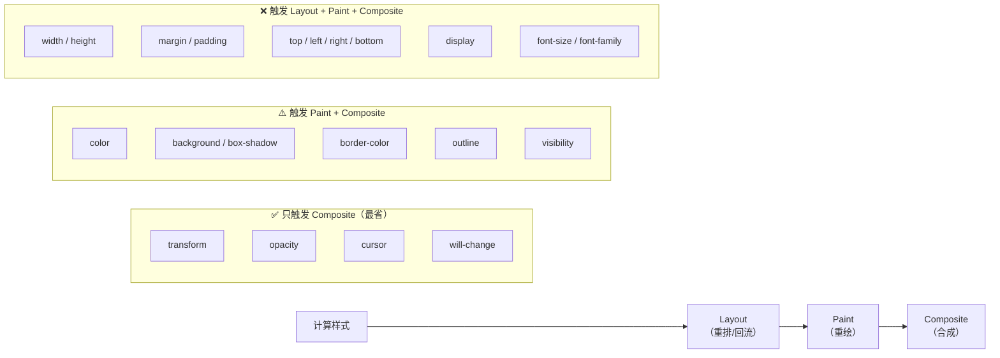

# CSS 渲染性能

> &#11088;&#11088;&#11088;&#11088;｜难度：高级｜项目：&#9733;&#9733;&#9733;

## 一句话总结

**不是所有 CSS 属性的性能都一样——有些触发 Layout（重排），有些只触发 Paint（重绘），最省的是只触发 Composite（合成）。** 写好 CSS 的性能黄金法则：动画只用 `transform` + `opacity`，提前声明 `will-change`，用 `contain` 限制重排影响范围。

> 本文聚焦 CSS 开发者视角的**性能优化实践**。浏览器渲染管线的底层原理请参阅 [重绘 / 回流](../浏览器/reflow-repaint.md)。

## 核心机制

### CSS Triggers —— 每个属性触发什么阶段



**CSS Triggers 速查表**（核心属性）：

| 触发阶段 | 典型属性 | 耗时 |
|----------|---------|------|
| **Composite only** | `transform`, `opacity`, `cursor`, `will-change` | ~0.5ms |
| **Paint + Composite** | `color`, `background`, `box-shadow`, `outline`, `visibility`, `border-color` | ~2ms |
| **Layout + Paint + Composite** | `width`, `height`, `margin`, `padding`, `top`, `left`, `display`, `font-size`, `position` | ~10ms+ |

### 动画黄金法则：只用 transform + opacity

```css
/* ❌ 用 left 做平移动画 → 触发 Layout，每帧 10ms+ */
.box { transition: left 0.3s; }
.box:hover { left: 100px; }

/* ✅ 用 translateX → 只触发 Composite，每帧 0.5ms */
.box { transition: transform 0.3s; }
.box:hover { transform: translateX(100px); }

/* ❌ 用 width/height 做缩放动画 */
.box { transition: width 0.3s; }

/* ✅ 用 scaleX/scaleY */
.box { transition: transform 0.3s; }
.box:hover { transform: scale(1.2); }
```

### will-change —— 提前告诉浏览器"这个属性要变了"

```css
/* ⚠️ will-change 的正确用法：动画前加，动画后移除 */
.box {
  transition: transform 0.3s;
}
.box:hover {
  will-change: transform; /* 鼠标悬停时才告诉浏览器 */
  transform: scale(1.1);
}

/* ❌ 错误：全局加 will-change */
* { will-change: transform; }
/* 每个元素都创建 GPU 层 → GPU 显存爆满 → 反而更卡 */

/* ❌ 错误：will-change 写死了不取消 */
.box { will-change: transform; }
/* 动画结束后 GPU 层仍然占用内存 → 内存泄漏 */
```

**will-change 使用原则**：
1. **动画前加，动画后删** —— 配合 JS 在动画 `start` 时加、`end` 时删
2. **不要贪多** —— 只给真正会动的元素加
3. **不要预加到所有元素** —— GPU 层本质是占用显存，层太多反而合成变慢

### contain —— 限制重排的影响范围

```css
/* contain: layout —— 告诉浏览器"我的布局变化不影响外面" */
.widget {
  contain: layout;
  /* 内部 reflow 不会扩散到外部 → 浏览器可以跳过外部布局计算 */
}

/* contain: strict —— 最强隔离（layout + paint + size + style） */
.isolated-component {
  contain: strict;
}

/* content-visibility —— 浏览器自动跳过视口外元素的渲染 */
.lazy-section {
  content-visibility: auto;
  contain-intrinsic-size: 0 500px; /* 占位高度，防止滚动条跳动 */
}
/* auto = 视口外跳过渲染，滚动到附近时自动渲染
   这是 CSS 层面最接近"虚拟列表"的原生能力 */
```

## 深度拓展

### 为什么说"transform 只触发 Composite"？

浏览器渲染管线中，Composite（合成）是最后一步：不同图层由 GPU 合成到屏幕上。`transform` 和 `opacity` 的特殊之处在于——它们**不改变文档流、不影响元素几何、不改变像素颜色**，只是改变图层的位置/透明度。浏览器可以直接在合成线程处理，不动主线程。

```
Layout（主线程） → Paint（主线程） → Composite（合成线程 + GPU）
                                            ↑
                            transform/opacity 直接走这一步
```

### 哪些属性"静悄悄"触发 Layout？

```css
/* 这些看起来无害的操作会触发 Layout —— 浏览器不得不重新计算几何 */

/* 1. 读取几何属性 —— Forced Synchronous Layout */
el.offsetHeight      /* 触发 Layout */
el.offsetWidth       /* 触发 Layout */
el.getBoundingClientRect() /* 触发 Layout */
el.scrollTop         /* 触发 Layout */
window.getComputedStyle(el) /* 可能触发 Layout */

/* 2. 写-读-写 交替 → Layout Thrashing */
for (const el of elements) {
  el.style.width = el.offsetWidth + 10 + 'px';  
  /* ❌ 每次循环：写 → 读 → Layout → 写 → 读 → Layout → ... */
}

/* ✅ 正确：先读后写，批量操作 */
const widths = elements.map(el => el.offsetWidth)  /* 批量读 */
elements.forEach((el, i) => { el.style.width = widths[i] + 10 + 'px' }) /* 批量写 */
```

## 项目实战

### ECharts 容器 resize 避免反复 Layout

```ts
// 多个图表同时 resize，批量操作防止 Layout Thrashing
const charts: EChartsInstance[] = [...]
const resizeAll = () => {
  // 先读：收集所有容器尺寸
  const sizes = charts.map(c => ({
    w: c.getDom().clientWidth,
    h: c.getDom().clientHeight
  }))
  // 后写：批量 resize
  charts.forEach((c, i) => c.resize({ width: sizes[i].w, height: sizes[i].h }))
}

window.addEventListener('resize', debounce(resizeAll, 200))
```

### 动画列表用 transform 替代 top

```ts
// ❌ 用 top 做拖拽排序动画 → Layout Thrashing
el.style.top = newY + 'px'

// ✅ 用 transform translateY → Composite only
el.style.transform = `translateY(${newY - originalY}px)`
```

### content-visibility 优化长列表首屏

```css
/* 500 条数据渲染的列表，不用虚拟列表也能加速首屏 */
.list-item {
  content-visibility: auto;
  contain-intrinsic-size: 0 60px;  /* 告诉浏览器"不渲染时先按 60px 高度预留" */
}
/* 视口外的 .list-item 浏览器直接跳过渲染，首屏快了 3-5 倍 */
```

## 易错点

1. **动画用 `left`/`top`/`width`** —— 每次都触 Layout，60fps 做不到。全部改为 `transform`
2. **全局 `* { will-change }`** —— GPU 显存爆炸，合成层过多反而性能下降
3. **`will-change` 写死不删** —— 动画结束后 GPU 层仍然占用内存
4. **"Composite only"不等于"零开销"** —— 只能说不触发主线程的 Layout/Paint，但合成线程+GPU 也有开销
5. **`@import` 阻塞渲染** —— CSS `@import` 在 CSSOM 构建中造成串行加载，应避免使用，用 `<link>` 替代

## 面试信号表

| 面试官问 | 下一问大概率是 |
|----------|-------------|
| "为什么动画要用 transform" | 追问 Layout/Paint/Composite 三阶段区别 |
| "will-change 用过吗" | 追问 will-change 有什么坑（不能全局写、要及时删） |
| "怎么优化长列表渲染" | content-visibility（CSS 层）和虚拟列表（JS 层）的对比 |
| "@import 有什么问题" | 追问 CSS 加载阻塞渲染的机制 |

## 相关阅读

- [重绘 / 回流](../浏览器/reflow-repaint.md) —— 浏览器渲染管线的底层原理
- [transition vs animation](./transition-animation.md)
- [性能优化总览](../性能优化/index.md)

## 更新记录

- 2026-07-08：新建（CSS Triggers 三阶段 + 动画黄金法则 + will-change/contain/content-visibility + Layout Thrashing 实战）
