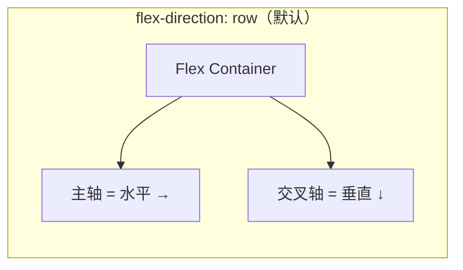
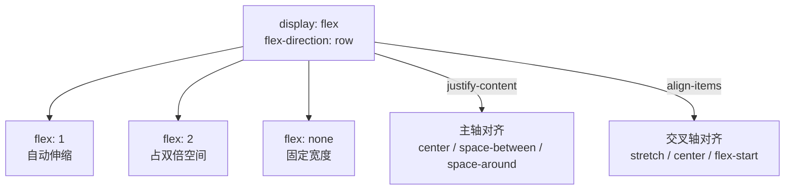

# Flexbox

> ⭐⭐⭐⭐⭐｜难度：初级｜项目：★★★

## 一句话总结

> Flexbox 是 CSS3 引入的**一维弹性布局模型**，通过给容器设置 `display: flex` 来激活，然后通过容器属性控制子元素的**对齐方式、分布方向和伸缩行为**。一句话：你想让一堆东西在一行（或一列）上灵活排列，首选 Flex。

面试开场："Flexbox 解决的是一维布局问题。后台管理系统的导航栏、工具栏、表单行、卡片列表——我用 Flex 搞定 90% 的布局需求，剩下 10% 的复杂二维布局才用 Grid。"

## 核心机制

### 主轴 vs 交叉轴

理解 Flex 最关键的是分清两根轴：



- **主轴** (`main axis`)：由 `flex-direction` 决定，子元素沿主轴排列。
  - `row`（默认）：主轴水平，从左到右
  - `column`：主轴垂直，从上到下
  - `row-reverse` / `column-reverse`：方向反转
- **交叉轴** (`cross axis`)：永远垂直于主轴。
- 所有 `justify-*` 管主轴，`align-*` 管交叉轴——这样记不会乱。

### flex-grow / flex-shrink / flex-basis 计算公式

这是面试官最可能追问的点：

```
flex-basis: 基准大小（在分配剩余空间之前，项目占据的主轴空间）
flex-grow: 扩张因子（有剩余空间时，按比例瓜分）
flex-shrink: 收缩因子（空间不够时，按比例压缩）
```

**flex-grow 计算公式：**

```
某个项目的最终宽度 = flex-basis + (剩余空间 × 该项目的 flex-grow / 所有项目 flex-grow 之和)
```

举例：容器 600px，三个项目各 `flex-basis: 100px`，剩余空间 = 600 - 300 = 300px。

```css
.item1 { flex: 1 1 100px; } /* → 100 + 300 × 1/3 = 200px */
.item2 { flex: 2 1 100px; } /* → 100 + 300 × 2/3 = 300px */
.item3 { flex: 0 1 100px; } /* → 100 + 300 × 0/3 = 100px */
```

每个项目分配剩余空间 = 总剩余空间 × (自己的 grow / 所有人 grow 之和)。关键是分母是 grow **总和**，不是 grow 值本身。

### 容器属性和项目属性速查

**容器属性（写在父元素上）**：`flex-direction`（主轴方向）、`flex-wrap`（是否换行）、`justify-content`（主轴对齐）、`align-items`（交叉轴对齐）、`align-content`（多行时的交叉轴对齐）、`gap`（间距）。

**项目属性（写在子元素上）**：`flex-grow`、`flex-shrink`、`flex-basis`、`flex`（简写）、`align-self`（单个项目覆盖 align-items）、`order`（排序）。

### `flex: 1` 到底是什么

面试高频题。答案是：

```css
flex: 1;
/* 等价于 */
flex-grow: 1;
flex-shrink: 1;
flex-basis: 0%; /* 注意是 0%，不是 auto！ */
```

搞清楚 `flex: 1` vs `flex: auto` 的区别：

- `flex: 1` → `1 1 0%` → 完全均分容器空间，不关心内容大小
- `flex: auto` → `1 1 auto` → 先按内容大小分配，再按比例瓜分剩余空间

```css
/* 实操中最常用的几个 */
flex: 1;       /* 弹性伸缩，均分 */
flex: none;    /* 0 0 auto -- 刚性，不伸缩 */
flex: initial; /* 0 1 auto -- 可收缩不扩张（默认值） */
```

## 深度拓展

### 追问：`flex-basis` vs `width` 的优先级

当 `flex-basis` 和 `width` 同时存在时，**`flex-basis` 优先级更高**（在主轴方向上）。但注意：

- `flex-basis` 只有在**主轴方向**才起效。`flex-direction: column` 时它替代的是 `height`。
- 如果 `flex-basis: auto`，则回退使用 `width`/`height` 的值。
- 如果 `flex-basis: content`（部分浏览器支持），则以内容大小为基准。

### 追问：flex-shrink 为什么不生效？

经典坑：你给子元素设置 `flex-shrink: 1` 但它就是缩不小。原因是：**元素的 `min-width` 默认为 `auto`（即内容的最小宽度，比如一个单词不会断行）**。

```css
/* 解法：覆盖 min-width */
.flex-item {
  flex-shrink: 1;
  min-width: 0; /* 允许收缩到比内容更窄 */
  overflow: hidden; /* 配合使用，隐藏溢出 */
}
```

这个坑在后台管理系统中非常常见——表格列宽自适应时，内容长的列缩不小，就是 `min-width: auto` 在阻止。

### 追问：Flex 和 Grid 怎么选？

简单决策规则：

- **一维布局** → Flex（导航栏、工具栏、标签列表、表单单行）
- **二维布局** → Grid（Dashboard 卡片区、整体页面布局、表单多行多列）
- **数量不确定** → Flex（内容数量是动态的）
- **严格的行列对齐** → Grid（需要行和列都对齐）

实际开发中不是二选一：Grid 容器里放 Flex 子项（比如页面用 Grid 划分区域，每个区域的工具栏用 Flex），很常见。

## Mermaid



## 项目实战

### 表单 label 固定宽度 + 输入框 flex:1 自适应

后台管理表单最常见的布局模式：

```vue
<template>
  <el-form>
    <el-form-item class="form-row">
      <span class="form-label">用户名</span>
      <el-input v-model="form.username" class="form-input" />
    </el-form-item>
  </el-form>
</template>

<style scoped>
.form-row {
  display: flex;
  align-items: center;
  gap: 12px;
}
.form-label {
  flex: none;           /* label 不伸缩 */
  width: 100px;         /* 固定宽度 */
  text-align: right;
}
.form-input {
  flex: 1;              /* 输入框占满剩余空间 */
  min-width: 0;         /* 防止内容过长撑开 */
}
</style>
```

### 操作栏按钮用 flex + gap

```vue
<template>
  <div class="toolbar">
    <el-button type="primary">新增</el-button>
    <el-button type="danger" :disabled="!selected.length">批量删除</el-button>
    <div style="flex: 1" />  <!-- 占位，把后面按钮推到右边 -->
    <el-input v-model="keyword" placeholder="搜索" style="width: 200px" />
    <el-button>搜索</el-button>
  </div>
</template>

<style scoped>
.toolbar {
  display: flex;
  align-items: center;
  gap: 8px;
  margin-bottom: 16px;
  flex-wrap: wrap; /* 小屏幕自动换行 */
}
</style>
```

### 顶部导航栏 space-between 布局

```css
.navbar {
  display: flex;
  justify-content: space-between; /* 两端对齐 */
  align-items: center;
  height: 56px;
  padding: 0 20px;
  background: #fff;
}
.navbar__left  { display: flex; align-items: center; gap: 16px; }
.navbar__right { display: flex; align-items: center; gap: 12px; }
```

## 易错点

- ❌ **`flex: 1` 等价于 `flex: 1 1 auto`** → 错！`flex: 1` 等价于 `flex: 1 1 0%`，`flex: auto` 才是 `flex: 1 1 auto`。
- ❌ **`align-items` 和 `align-content` 一样** → 错。`align-items` 是**单行**内对齐，`align-content` 是**多行**之间的分布方式（需要 `flex-wrap: wrap` 才生效）。
- ❌ **Flex 子项的 `float` 仍然有效** → 错。Flex 容器内的子元素 `float` 不生效，因为它们在弹性格式化上下文（FFC）中。
- ❌ **`flex-shrink` 设置了就能一直缩小** → 错，受 `min-width` 限制，常见踩坑。需要显式设置 `min-width: 0`。
- ❌ **Flexbox 可以替代所有布局** → 错。二维对齐（行列同时对齐）用 Grid 更合适，Flex 做不了或者需要很 hack 的实现。
- ❌ **`gap` 在 Flexbox 中不支持** → 曾经是，但现在所有现代浏览器都支持 `gap`（包括 `row-gap` / `column-gap`）。

## 相关阅读

- [MDN: Flexbox 基本概念](https://developer.mozilla.org/en-US/docs/Web/CSS/CSS_flexible_box_layout/Basic_concepts_of_flexbox)
- [CSS-Tricks: A Complete Guide to Flexbox](https://css-tricks.com/snippets/css/a-guide-to-flexbox/)
- [flex 简写的三个值详解](https://developer.mozilla.org/en-US/docs/Web/CSS/flex)
- [grid](./grid.md)
- [center-layout](./center-layout.md)
- [bfc](./bfc.md)
