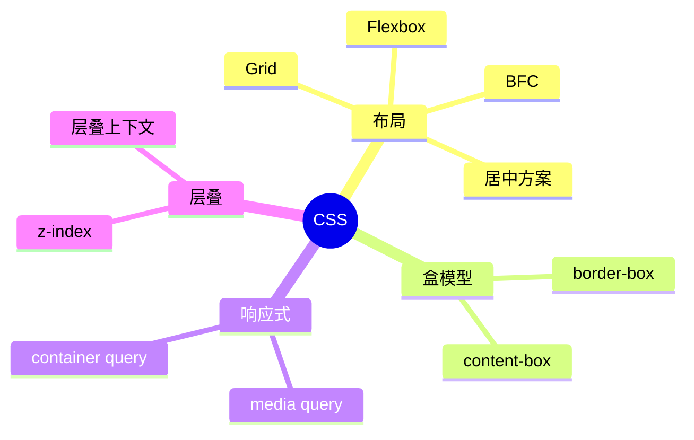

# CSS 知识地图

## 推荐学习顺序

1. ⭐⭐⭐⭐⭐ [BFC](./bfc.md)
2. ⭐⭐⭐⭐⭐ [Flexbox](./flexbox.md)
3. ⭐⭐⭐⭐   [盒模型](./box-model.md)
4. ⭐⭐⭐⭐   [居中方案](./center-layout.md)
5. ⭐⭐⭐⭐   [Grid](./grid.md)
6. ⭐⭐⭐     [响应式](./responsive.md)
7. ⭐⭐⭐     [层叠上下文](./stacking-context.md)

## 知识点索引

| 知识点 | 频率 | 难度 | 手写 | 状态 |
|--------|------|------|------|------|
| [BFC](./bfc.md) | ⭐⭐⭐⭐⭐ | 中级 | — | draft |
| [Flexbox](./flexbox.md) | ⭐⭐⭐⭐⭐ | 初级 | — | draft |
| [Grid](./grid.md) | ⭐⭐⭐⭐ | 中级 | — | draft |
| [居中方案](./center-layout.md) | ⭐⭐⭐⭐ | 初级 | — | draft |
| [盒模型](./box-model.md) | ⭐⭐⭐⭐ | 初级 | — | draft |
| [响应式](./responsive.md) | ⭐⭐⭐ | 中级 | — | draft |
| [层叠上下文](./stacking-context.md) | ⭐⭐⭐ | 中级 | — | draft |
