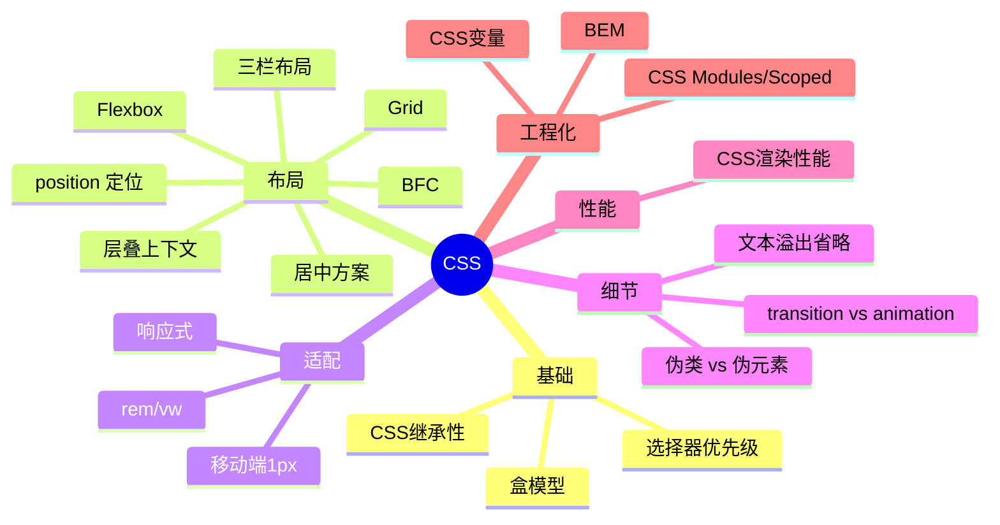

# CSS 知识地图

## 推荐学习顺序

1. ⭐⭐⭐⭐⭐ [盒模型](./box-model.md)
2. ⭐⭐⭐⭐⭐ [选择器优先级](./specificity.md)
3. ⭐⭐⭐⭐⭐ [position 定位](./position.md)
4. ⭐⭐⭐⭐⭐ [BFC](./bfc.md)
5. ⭐⭐⭐⭐⭐ [Flexbox](./flexbox.md)
6. ⭐⭐⭐⭐⭐ [居中方案](./center-layout.md)
7. ⭐⭐⭐⭐   [CSS 继承性](./inheritance.md)
8. ⭐⭐⭐⭐   [Grid](./grid.md)
9. ⭐⭐⭐⭐   [三栏布局](./three-column-layout.md)
10. ⭐⭐⭐⭐   [层叠上下文](./stacking-context.md)
11. ⭐⭐⭐⭐   [rem / vw 移动端适配](./rem-vw.md)
12. ⭐⭐⭐⭐   [移动端 1px 问题](./mobile-1px.md)
13. ⭐⭐⭐⭐   [文本溢出省略](./text-overflow.md)
14. ⭐⭐⭐⭐   [transition vs animation](./transition-animation.md)
15. ⭐⭐⭐⭐   [伪类 vs 伪元素](./pseudo.md)
16. ⭐⭐⭐⭐   [CSS 渲染性能](./css-performance.md)
17. ⭐⭐⭐⭐   [CSS 变量](./css-variables.md)
18. ⭐⭐⭐⭐   [BEM 命名规范](./bem.md)
19. ⭐⭐⭐⭐   [CSS Modules / Scoped](./css-modules-scoped.md)
20. ⭐⭐⭐     [响应式](./responsive.md)

## 知识点索引

| 知识点 | 频率 | 难度 | 手写 | 状态 |
|--------|------|------|------|------|
| [盒模型](./box-model.md) | ⭐⭐⭐⭐⭐ | 初级 | — | draft |
| [选择器优先级](./specificity.md) | ⭐⭐⭐⭐⭐ | 中级 | — | draft |
| [position 定位](./position.md) | ⭐⭐⭐⭐⭐ | 中级 | — | draft |
| [BFC](./bfc.md) | ⭐⭐⭐⭐⭐ | 中级 | — | draft |
| [Flexbox](./flexbox.md) | ⭐⭐⭐⭐⭐ | 初级 | — | draft |
| [居中方案](./center-layout.md) | ⭐⭐⭐⭐⭐ | 初级 | — | draft |
| [CSS 继承性](./inheritance.md) | ⭐⭐⭐⭐ | 初级 | — | draft |
| [Grid](./grid.md) | ⭐⭐⭐⭐ | 中级 | — | draft |
| [三栏布局](./three-column-layout.md) | ⭐⭐⭐⭐ | 中级 | ✅ | draft |
| [层叠上下文](./stacking-context.md) | ⭐⭐⭐⭐ | 中级 | — | draft |
| [rem / vw](./rem-vw.md) | ⭐⭐⭐⭐ | 中级 | — | filled |
| [移动端 1px](./mobile-1px.md) | ⭐⭐⭐ | 中级 | — | draft |
| [文本溢出省略](./text-overflow.md) | ⭐⭐⭐⭐ | 初级 | — | draft |
| [transition vs animation](./transition-animation.md) | ⭐⭐⭐⭐ | 中级 | — | draft |
| [伪类 vs 伪元素](./pseudo.md) | ⭐⭐⭐⭐ | 初级 | — | draft |
| [CSS 渲染性能](./css-performance.md) | ⭐⭐⭐⭐ | 高级 | — | draft |
| [CSS 变量](./css-variables.md) | ⭐⭐⭐⭐ | 中级 | — | filled |
| [BEM 命名](./bem.md) | ⭐⭐⭐⭐ | 初级 | — | filled |
| [CSS Modules / Scoped](./css-modules-scoped.md) | ⭐⭐⭐⭐ | 中级 | — | filled |
| [响应式](./responsive.md) | ⭐⭐⭐ | 中级 | — | draft |
