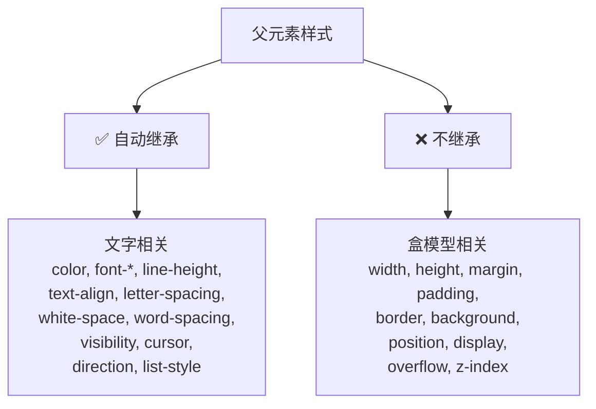
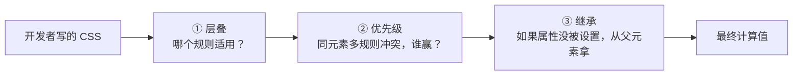

# CSS 继承性

> &#11088;&#11088;&#11088;&#11088;｜难度：初级&#9733;&#9733;

## 一句话总结

**CSS 继承是某些属性自动从父元素传递给子元素的机制——但不是所有属性都会继承。** 记住"文字相关大多继承，盒模型相关绝不继承"这条铁律，再用 `inherit`/`initial`/`unset`/`revert` 四个关键字显式控制，就能搞定 90% 的继承问题。

## 核心机制

### 哪些属性会继承？两条铁律



**铁律一**：文字/字体相关属性**大多继承**。`color`、`font-family`、`font-size`、`line-height`、`text-align`、`letter-spacing`、`word-spacing`、`white-space`、`text-indent`。

**铁律二**：盒模型/布局相关属性**绝不继承**。`width`、`height`、`margin`、`padding`、`border`、`display`、`position`、`overflow`。

```css
body {
  color: #333;       /* ✅ 所有子元素继承 */
  font-family: Arial; /* ✅ 所有子元素继承 */
  width: 100%;        /* ❌ 子元素不继承，各自独立 */
  margin: 0;          /* ❌ 只有 body 自己的外边距为 0 */
}
```

### 四个控制继承的关键字

| 关键字 | 行为 | 典型场景 |
|--------|------|---------|
| `inherit` | 强制继承父元素值 | 让 `<a>` 继承父级颜色 |
| `initial` | 重置为 CSS 规范默认值 | `color: initial` → 黑色（canvastext） |
| `unset` | 可继承属性 = inherit，不可继承 = initial | 组件重置 |
| `revert` | 回退到浏览器默认样式 | 撤销作者样式 |

```css
/* inherit —— 最常用：让不继承的属性强制继承 */
.child { height: inherit; }  /* height 默认不继承，现在继承父元素高度 */

/* initial —— 重置到 CSS 规范定义的初始值 */
p { color: initial; }   /* → canvastext（浏览器默认文字色，通常黑色） */
p { font-size: initial; } /* → medium（通常 16px） */

/* unset —— 智能重置，等价于"撤销自定义" */
.unset-all { all: unset; }
/* 等价于：可继承的 → inherit，不可继承的 → initial */

/* revert —— 回到浏览器原生样式 */
div { display: revert; } /* → block（浏览器默认的 display 值） */
h1 { font-size: revert; } /* → 浏览器默认的 h1 字号 */
```

### 经典面试题：为什么 a 标签不继承父元素的 color？

```html
<div style="color: red;">
  <p>我是红色</p>                    <!-- ✅ 继承，红色 -->
  <a href="#">我不是红色</a>           <!-- ❌ 不继承！是蓝色 -->
</div>
```

**原理**：浏览器的 **User Agent 样式表**中已经给 `a` 标签设置了 `color: -webkit-link`（蓝色），这个 UA 样式虽然权重很低，但它的存在使得 a 标签的 `color` **不再走继承链**。继承只有在属性"未被设置"时才生效，一旦任何样式表（包括 UA）设置了该属性，继承就被阻断。

```css
/* 解决方案 */
a { color: inherit; }       /* ✅ 强制继承父元素颜色 */
a { color: unset; }         /* ✅ unset 对可继承属性 = inherit */
a { color: currentColor; }  /* ✅ 使用当前文字色 */
```

## 深度拓展

### 继承 vs 层叠 vs 优先级 —— CSS 三大核心机制的关系



三者的执行顺序：先层叠（收集所有来源的规则）→ 再优先级（冲突时决定胜负）→ 最后继承（属性值空缺时补位）。继承是**最后一步的兜底机制**，不是主动覆盖。

### 项目中用 `all: unset` 做组件样式隔离

```css
/* 第三方组件放入页面后，继承了一堆不该继承的样式 */
.third-party-widget { all: unset; }
/* 等价于重置所有属性：可继承 → inherit，不可继承 → initial */
/* 然后在干净基线上重新写样式 */
.third-party-widget {
  font-family: inherit; /* 恢复继承 */
  /* 自己定义其余样式... */
}
```

### `line-height` 的特殊继承 —— 百分比 vs 无单位

```css
body { line-height: 1.5; }    /* ✅ 推荐：无单位 × 元素自身 font-size */
body { line-height: 150%; }   /* ⚠️ 计算后的值继承，子元素不会重新计算 */
body { line-height: 24px; }   /* ⚠️ 固定值继承，子元素字号变化线高不变 */

/* 150% 的坑 */
body { font-size: 16px; line-height: 150%; }  /* 计算为 24px → 子元素继承 24px */
.child { font-size: 32px; }                    /* line-height 仍是 24px，太紧！ */
```

## 易错点

1. **`background` 不继承** —— `body { background: #fff }` 不会让子元素有白色背景，子元素的 `background` 是 `transparent`，透过去看到 body 的白底
2. **`a` 标签的 `color` 不继承** —— UA 样式阻断了继承链，需要显式 `color: inherit`
3. **`line-height` 用百分比会埋坑** —— 百分比在继承前先计算，子元素拿到的是固定值
4. **`all: initial` 不是重置到浏览器默认** —— 是重置到 CSS 规范定义的初始值，不是你的预期值
5. **表单元素不继承 `font-family`/`font-size`** —— `input`/`textarea`/`select` 有 UA 默认值阻断了继承

## 面试信号表

| 面试官问 | 下一问大概率是 |
|----------|-------------|
| "哪些属性会继承" | 追问 a 标签颜色为什么不继承 |
| "inherit 和 initial 区别" | 追问 unset 和 revert 的差异 |
| "line-height 怎么写最好" | 追问百分比继承的坑 |
| "怎么重置第三方组件的样式" | all: unset / all: revert 选哪个 |

## 相关阅读

- [选择器优先级](./specificity.md) —— 层叠 + 优先级 + 继承，CSS 三大机制
- [盒模型](./box-model.md)
- [层叠上下文](./stacking-context.md)

## 更新记录

- 2026-07-08：新建（继承属性速查 + 四个关键字 + a 标签不继承 + line-height 继承坑 + Mermaid 流程图）
