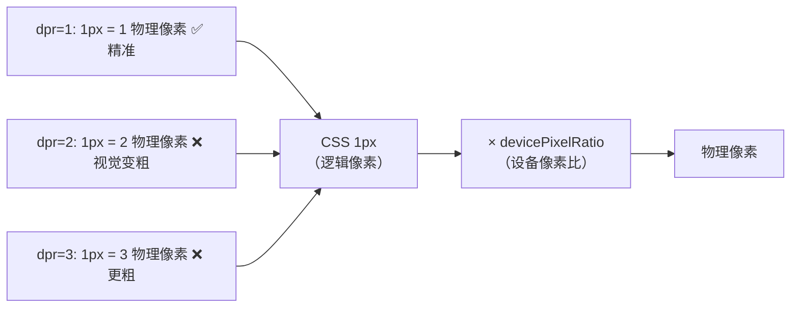

# 移动端 1px 问题

> &#11088;&#11088;&#11088;｜难度：中级｜项目：&#9733;&#9733;&#9733;

## 一句话总结

**设计师说的"1px"是 CSS 逻辑像素，但在 dpr=2/3 的 Retina 屏上，`border: 1px` 实际渲染为 2-3 个物理像素，视觉上看起来像"2px 粗"。** 解决方案核心思路是"写 1px → 用 transform scale 缩小到 0.5px 或 0.33px"，或"用 viewport 让 CSS 1px = 物理 1px"。

## 核心机制

### 为什么 `border: 1px` 在手机上显得粗？



```js
// 在浏览器 Console 查看当前设备的 dpr
console.log(window.devicePixelRatio)
// iPhone 14 Pro: 3
// iPhone 11: 2
// 普通显示器: 1
```

## 解决方案对比

### 方案一：`transform: scale(0.5)` + 伪元素（推荐）

```css
/* 最推荐：兼容性好、无副作用、精确到任意 dpr */
.hairline-border {
  position: relative;
}
.hairline-border::after {
  content: '';
  position: absolute;
  left: 0;
  bottom: 0;
  width: 100%;
  height: 1px;
  background: #e5e5e5;
  transform: scaleY(0.5);            /* dpr=2 时缩到 0.5px */
  transform-origin: 0 0;
}

/* 适配 dpr=3 */
@media (-webkit-min-device-pixel-ratio: 3) {
  .hairline-border::after {
    transform: scaleY(0.333);         /* dpr=3 时缩到 0.33px */
  }
}
```

**优点**：圆角边框也能做、支持四边独立、颜色可控。**缺点**：多写一个伪元素。

### 方案二：viewport + rem（整体缩放）

```html
<!-- 通过 initial-scale 让 CSS 1px = 物理 1px -->
<meta name="viewport" content="width=device-width, initial-scale=0.5">
<!-- 然后 CSS 里写 2px → 实际渲染 2*0.5 = 1 物理像素 -->
```

不推荐单独为 1px 调整 viewport——影响全局布局。

### 方案三：border-image / box-shadow

```css
/* border-image：用 0.5px 半透明渐变模拟细线 */
.border-1px {
  border-bottom: 1px solid transparent;
  border-image: linear-gradient(to bottom, #e5e5e5 50%, transparent 50%) 0 0 100% 0;
}

/* box-shadow：非 border 方案，不影响盒模型 */
.box-shadow-1px {
  box-shadow: 0 1px 0 0 #e5e5e5;  /* 模拟底部边框，实际比 1px 粗 */
  /* 不支持 scale，无法真正做到 0.5px */
}
```

不推荐：border-image 做不了圆角，box-shadow 没法缩小。

### 方案对比

| 方案 | 精准度 | 兼容性 | 圆角支持 | 推荐度 |
|------|--------|--------|----------|--------|
| 伪元素 + scale | ⭐⭐⭐ 精准 | iOS 8+ | ✅ | ⭐⭐⭐ 首选 |
| viewport 缩放 | ⭐⭐⭐ 精准 | 全兼容 | ✅ | ⭐ 影响全局 |
| border-image | ⭐ 不完美 | iOS 8+ | ❌ | ⭐ 不推荐 |
| box-shadow | ⭐ 不完美 | 全兼容 | ❌ | ⭐ 不推荐 |

## 深度拓展

### 四边框的写法

```css
/* 全四边框 0.5px —— 伪元素模拟 border */
.hairline {
  position: relative;
}
.hairline::after {
  content: '';
  position: absolute;
  top: 0; left: 0;
  width: 200%;
  height: 200%;
  border: 1px solid #e5e5e5;
  transform: scale(0.5);
  transform-origin: 0 0;
  border-radius: 0;     /* 如果需要圆角，这里也 ×2 */
  pointer-events: none; /* 不影响交互 */
}
/* 如果元素需要圆角 8px，伪元素设置 border-radius: 16px → scale(0.5) 后 = 8px */
```

### CSS 变量统一管理

```css
:root {
  --hairline: 1px;
}
@media (-webkit-min-device-pixel-ratio: 2) {
  :root { --hairline: 0.5px; }
}
/* ⚠️ 注意：大多数浏览器不支持 0.5px 直接写 border，不会被渲染为半像素 */
/* 所以 CSS 变量方案只能配合 min-device-pixel-ratio 做条件判断 */
```

## 项目实战

### Element Plus 中的处理方式

Element Plus 内部对 1px 问题有统一处理，`el-table` 的边框在 Retina 屏上会自动使用 `transform: scaleY(0.5)` 伪元素方案。业务代码中如果自定义组件，遵循同一套方案即可。

### 移动端 H5 项目的全局方案

```css
/* 项目中的 hairline mixin（用 SCSS 或直接用 CSS） */
/* 底部 1px 线 */
.hairline-bottom::after {
  content: '';
  position: absolute;
  left: 0;
  bottom: 0;
  width: 100%;
  height: 2px;                      /* 先写 2px */
  background: var(--border-color);
  transform: scaleY(0.5);
  transform-origin: 0 100%;
}

/* 顶部 1px 线 */
.hairline-top::before {
  content: '';
  position: absolute;
  left: 0;
  top: 0;
  width: 100%;
  height: 2px;
  background: var(--border-color);
  transform: scaleY(0.5);
  transform-origin: 0 0;
}
```

## 易错点

1. **直接写 `border: 0.5px`** —— iOS Safari 支持但 Android Chrome 渲染为 1px，不可靠
2. **伪元素 scale 后忘了 `pointer-events: none`** —— 0.5px 的伪元素会遮挡点击
3. **`initial-scale=0.5` 让所有内容缩小** —— 不是只影响 border，而是影响了整个页面
4. **伪元素方案需要父元素 `position: relative`** —— 否则伪元素定位会跑偏
5. **圆角适配需要 ×2** —— scale(0.5) 的情况下 border-radius 要乘以 2

## 面试信号表

| 面试官问 | 下一问大概率是 |
|----------|-------------|
| "移动端 1px 边框为什么粗" | 追问 dpr 是什么 + CSS 像素和物理像素的关系 |
| "怎么解决 1px 问题" | 追问伪元素 scale 方案的细节（四边/圆角/pointer-events） |
| "为什么不直接写 0.5px" | 追问不同浏览器的渲染差异 |

## 相关阅读

- [rem / vw](./rem-vw.md) —— 移动端适配体系
- [响应式](./responsive.md)
- [伪类 vs 伪元素](./pseudo.md) —— 伪元素 scale 方案依赖 ::after

## 更新记录

- 2026-07-08：新建（dpr 原理 + 四种方案对比 + 四边框写法 + Element Plus 实践）
