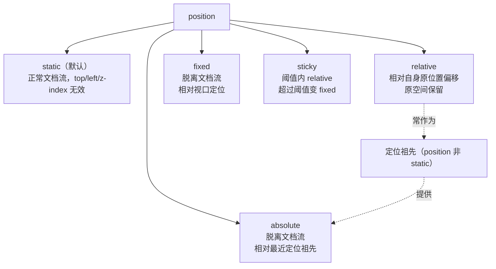

# Position 定位

> &#11088;&#11088;&#11088;&#11088;&#11088;｜难度：中级｜项目：&#9733;&#9733;&#9733;

## 一句话总结

**`position` 决定元素在页面中的"参照坐标系"——`absolute` 相对于最近的定位祖先，`fixed` 相对于视口，`sticky` 在阈值内 `relative`、超过阈值变 `fixed`。** 面试关键在于定位参照的包含块规则、sticky 的失效场景，以及五种模式在项目中的选型依据。

## 核心机制

### 五种定位模式一张图



### 包含块（Containing Block）—— absolute 到底相对于谁？

**这是面试最高频追问：**

```css
/* 规则：absolute 元素相对于最近的 position ≠ static 的祖先定位 */
/* 没有定位祖先 → 相对于初始包含块（即视口/根元素） */

/* 例 1：没有定位祖先 → 相对视口 */
<div>                          <!-- position: static -->
  <div style="position: absolute; top: 0; left: 0;">
    <!-- 定位参照：视口（没有定位祖先） -->
  </div>
</div>

/* 例 2：父元素 relative → 相对父元素 */
<div style="position: relative;">  <!-- 定位祖先 ✅ -->
  <div style="position: absolute; bottom: 0; right: 0;">
    <!-- 定位参照：relative 父元素的 padding-box 边界 -->
  </div>
</div>

/* 例 3：嵌套定位祖先 → 最近的那个 */
<div style="position: relative;">          <!-- 祖先 A -->
  <div style="position: sticky; top: 0;">  <!-- 祖先 B（也是定位祖先） -->
    <div style="position: absolute; top: 0;">
      <!-- 定位参照：祖先 B（最近的定位祖先） -->
    </div>
  </div>
</div>
```

### fixed 的"背叛"—— 四种情况 fixed 不相对视口

```css
/* 1. 祖先有 transform → fixed 相对于该祖先，而非视口 */
.fixed-parent {
  transform: translateZ(0);   /* 创建了新的 containing block */
}
.fixed-parent .child {
  position: fixed;              /* ❌ 现在相对于 .fixed-parent，不是视口！ */
}

/* 2. 祖先有 filter */
.ancestor { filter: blur(1px); }  /* 同样破坏 fixed */

/* 3. 祖先有 perspective */
.ancestor { perspective: 1000px; }

/* 4. 祖先有 will-change: transform */
.ancestor { will-change: transform; }

/* 5. 祖先有 contain: paint 或 contain: layout */
.ancestor { contain: paint; }

/* 这些属性都会创建新的"层叠上下文 + 包含块"，
   让 fixed 的子元素"背叛"视口 */
```

### sticky —— 最容易翻车的定位

```css
/* sticky 生效的三个必要条件，缺一不可 */
.sticky-header {
  position: sticky;
  top: 0;                 /* ① 必须指定阈值（top/right/bottom/left 至少一个） */
  /* ② 父元素高度 > sticky 元素高度（否则没有滚动空间） */
  /* ③ 祖先不能有 overflow: hidden（会切断滚动容器） */
}
```

**sticky 失效的常见原因**：

```css
/* ❌ 原因 1：没有指定阈值 */
.sticky { position: sticky; }  /* 不指定 top/left 等于没写 */

/* ❌ 原因 2：父元素 overflow: hidden */
.parent { overflow: hidden; }           /* sticky 被切断了 */
.parent { overflow: auto; }             /* ✅ 这个可以 */
.parent { overflow: visible; }          /* ✅ 默认值，可以 */
.parent { overflow: clip; }             /* ❌ 和 hidden 一样会切断 */

/* ❌ 原因 3：父元素高度等于 sticky 元素高度 */
.parent { height: 50px; }
.child { height: 50px; position: sticky; top: 0; }
/* 没有滚动空间，sticky 永远不触发 */

/* ❌ 原因 4：祖先没有高度（全靠内容撑开） */
/* 滚动容器是 body，但祖先 div 由内容撑开 = 没有滚动空间 */

/* ❌ 原因 5：Flex/Grid 子元素的 align-items: stretch */
.flex-parent { display: flex; align-items: flex-start; }
/* sticky 在 flex 子元素上要保证不被拉伸到和父级一样高 */
```

## 深度拓展

### absolute 的 margin: auto 居中

```css
/* absolute 元素可以同时设置 top: 0; bottom: 0; + margin: auto 居中 */
/* 这是比 flex/grid 更古老的居中方案 */
.centered {
  position: absolute;
  top: 0; right: 0; bottom: 0; left: 0;
  width: 200px;
  height: 100px;
  margin: auto; /* ✅ 水平垂直居中，IE8+ 支持 */
}
/* 原理：top/bottom/left/right = 0 强制元素占满，margin: auto 平分剩余空间 */
```

### relative + absolute 的 z-index 问题

```css
/* 定位元素的层叠顺序由 z-index 决定，但不是任何情况都生效 */
.parent { position: relative; z-index: 1; }
.child { position: absolute; z-index: 999; }
/* child 虽然 z-index 很高，但被 parent 的层叠上下文"锁"在里面 */
/* 如果 parent 的兄弟有 z-index: 2，整个 parent + child 都在其下面 */
```

## 项目实战

### 后台管理系统的导航栏固定（sticky）

```css
/* 顶部导航栏 sticky 固定 */
.admin-header {
  position: sticky;
  top: 0;
  z-index: 100;
  background: #fff;
}
/* 滚动时导航栏始终在视口顶部 */

/* 侧边栏 sticky，与顶部联动 */
.admin-sidebar {
  position: sticky;
  top: 60px;           /* 离顶部 60px（导航栏高度），导航栏下方才 sticky */
  height: calc(100vh - 60px);
  overflow-y: auto;
}
```

### 模态框遮罩层（fixed）

```css
/* 全屏遮罩 + 居中弹窗 */
.modal-overlay {
  position: fixed;
  inset: 0;            /* 等价于 top/right/bottom/left: 0 */
  background: rgba(0, 0, 0, 0.5);
  z-index: 1000;
}

.modal-content {
  position: absolute;  /* relative to overlay */
  top: 50%;
  left: 50%;
  transform: translate(-50%, -50%);
}
```

### 气泡提示定位（absolute + relative）

```ts
// 下拉菜单/气泡卡片：父容器 relative + 子 absolute 动态定位
const placementMap = {
  'bottom-start': { top: '100%', left: 0 },
  'bottom-end': { top: '100%', right: 0 },
  'top-start': { bottom: '100%', left: 0 },
  // ...
}
```

## 易错点

1. **absolute 不指定 top/left 时留在原位置** —— 垂直位置不变但脱离文档流，后面元素会上移
2. **`transform`/`filter` 让 fixed 相对于祖先** —— 这是 CSS 规范行为，不是 bug，开发前先检查组件的祖先树
3. **sticky 在 `overflow: hidden` 父级中失效** —— 最经典的反直觉场景
4. **z-index 只在定位元素上生效** —— `position: static` 的元素 z-index 无效
5. **relative 的元素原有空间保留** —— 不会导致其他元素重新排列

## 面试信号表

| 面试官问 | 下一问大概率是 |
|----------|-------------|
| "absolute 相对谁定位" | 追问包含块定义 + 没有定位祖先时相对谁 |
| "fixed 有什么坑" | 追问 transform 祖先破坏 fixed 的场景 |
| "sticky 用过吗" | 追问 sticky 失效的 N 种原因 |
| "relative 和 absolute 区别" | 追问 absolute 不设 top/left 会怎样 |

## 相关阅读

- [层叠上下文](./stacking-context.md) —— position 与 z-index 的深层关系
- [居中方案](./center-layout.md)
- [三栏布局](./three-column-layout.md)

## 更新记录

- 2026-07-08：新建（五种定位 + 包含块规则 + fixed 背叛 + sticky 失效全景 + 项目实战）
