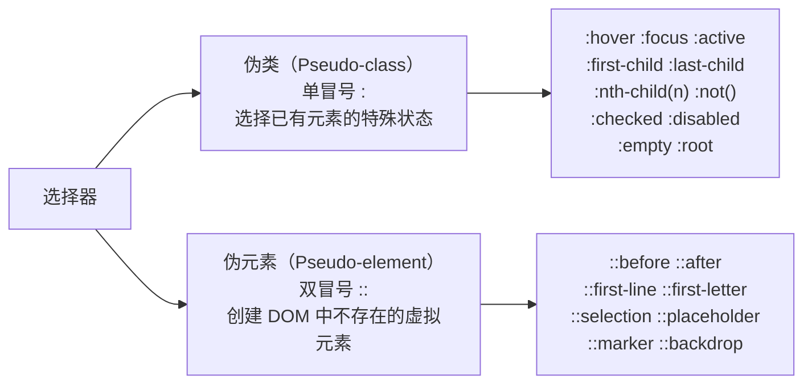

# 伪类 vs 伪元素

> &#11088;&#11088;&#11088;&#11088;｜难度：初级｜项目：&#9733;&#9733;

## 一句话总结

**伪类是"选择处于特定状态的元素"（如 `:hover`、`:nth-child`），伪元素是"创建不存在的虚拟元素"（如 `::before`、`::selection`）。** 一句话区分：伪类用**单冒号**，修饰已有的；伪元素用**双冒号**，创造虚拟的。

## 核心机制

### 一张表说清楚



**关键是 `content` 属性**：`::before` 和 `::after` 只有设置了 `content` 才会显示，这是伪元素最容易被忽略的前提条件。

```css
/* ❌ 不会显示——缺少 content */
.box::before { width: 10px; height: 10px; background: red; }

/* ✅ 即使不需要文字内容，也要写 content: '' */
.box::before { content: ''; width: 10px; height: 10px; background: red; display: inline-block; }
```

### 伪类 —— 按功能分四大类

```css
/* 1. 动态伪类 —— 用户交互状态 */
a:link { }          /* 未访问 */
a:visited { }       /* 已访问 */
a:hover { }         /* 悬停 */
a:active { }        /* 激活 */
/* 记忆口诀：LoVe / HAte → link → visited → hover → active */

input:focus { }     /* 聚焦 */
input:disabled { }  /* 禁用 */
input:checked { }   /* 选中（checkbox/radio） */

/* 2. 结构伪类 —— 在 DOM 中的位置 */
li:first-child { }          /* 第一个子元素 */
li:last-child { }           /* 最后一个子元素 */
li:nth-child(2) { }         /* 第 2 个 */
li:nth-child(odd) { }       /* 奇数个 */
li:nth-child(even) { }      /* 偶数个 */
li:nth-child(3n+1) { }      /* 第 1, 4, 7, 10... 个 */
li:nth-last-child(1) { }    /* 倒数第一个 */
li:only-child { }           /* 唯一子元素 */
li:first-of-type { }        /* 同类型第一个 */
li:nth-of-type(2) { }       /* 同类型第 2 个 */
li:only-of-type { }         /* 同类型唯一 */

/* 3. 逻辑伪类 */
:not(.active) { }           /* 排除 */
:is(header, main, footer) { }  /* 匹配任意 */
:where(header, main) { }    /* 匹配任意（权重 = 0） */
:has(> img) { }             /* 包含 img 子元素的父元素（父选择器！） */

/* 4. 其他 */
:root { }                   /* 根元素（html） */
:empty { }                  /* 无子元素的元素 */
:target { }                 /* URL hash 匹配的元素 */
```

### 伪元素 —— 不占用 DOM 节点的虚拟元素

```css
/* ::before / ::after — 最常用的两个 */
.quote::before { content: '\201C'; }  /* 左引号 */
.quote::after  { content: '\201D'; }  /* 右引号 */

/* ::first-line / ::first-letter — 排版伪元素 */
p::first-line { font-weight: bold; }            /* 第一行 */
p::first-letter { font-size: 200%; float: left; } /* 首字下沉 */

/* ::selection — 用户选中的文字 */
::selection { background: #3451b2; color: white; }

/* ::placeholder — 输入框占位文字 */
input::placeholder { color: #999; font-style: italic; }

/* ::marker — 列表项标记 */
li::marker { color: red; font-weight: bold; }
```

## 深度拓展

### clearfix —— 伪元素最重要的实践应用

浮动元素的父容器会高度塌陷（高度变为 0），clearfix 用 `::after` 创建一个看不见的块级元素来清除浮动：

```css
/* 经典 clearfix —— 2010 年代的标准写法 */
.clearfix::after {
  content: '';          /* 必须！没有 content 伪元素不存在 */
  display: block;       /* 块级元素才能撑开 */
  clear: both;          /* 清除左右浮动 */
}

/* 现代写法 —— 更简洁 */
.clearfix::after {
  content: '';
  display: table;       /* table 比 block 更可靠（避免 margin collapse） */
  clear: both;
}

/* 2026 年推荐：用 display: flow-root 替代 clearfix */
.container { display: flow-root; }
/* flow-root 创建 BFC，自然包裹浮动子元素，无需伪元素 */
```

```html
<!-- 使用示例 -->
<div class="clearfix">
  <div style="float: left; width: 50%;">左</div>
  <div style="float: right; width: 50%;">右</div>
</div>
<!-- clearfix 确保父 div 有高度，不会塌陷 -->
```

### clearfix vs BFC 清除浮动的区别

```css
/* 方案 1：clearfix（伪元素） */
.parent::after { content: ''; display: block; clear: both; }
/* 原理：在浮动元素后面插入一个清除浮动的虚拟元素 */

/* 方案 2：BFC（overflow: hidden） */
.parent { overflow: hidden; }
/* 原理：触发 BFC，BFC 自动包裹浮动子元素 */
/* 缺点：内容可能被裁剪（overflow: hidden 的副作用） */

/* 方案 3：display: flow-root（最佳） */
.parent { display: flow-root; }
/* 原理：创建 BFC，但无 overflow 副作用 */
/* 兼容性：IE 不支持，2026 年主流项目可以放心用 */
```

### `:nth-child` vs `:nth-of-type` —— 最容易被混淆的伪类

```html
<div>
  <p>段落 1</p>
  <span>文本 A</span>
  <p>段落 2</p>
</div>
```

```css
p:nth-child(2)     /* ❌ 匹配不到任何元素！
  → 第二个子元素是 <span>，不是 <p>，不匹配 */
p:nth-of-type(2)   /* ✅ 匹配"段落 2"
  → 同类型 <p> 中的第二个，跳过中间的 <span> */

/* 记忆方法：
   nth-child    = 在所有兄弟中排第 N 位 + 必须匹配选择器
   nth-of-type  = 在同类型兄弟中排第 N 位 */
```

## 项目实战

### 表格斑马条纹（`:nth-child` 经典应用）

```css
/* Element Plus 表格的斑马条纹 */
.el-table__body tr:nth-child(even) {
  background-color: #fafafa;
}
.el-table__body tr:nth-child(odd) {
  background-color: #fff;
}

/* 也可以用 :nth-child(2n) / :nth-child(2n+1) */
```

### 必填字段星号（`::after`）

```css
/* 表单 label 后有 * */
.form-label.required::after {
  content: '*';
  color: #f56c6c;
  margin-left: 4px;
}
```

### 链接外部图标标识（`::after` + attr）

```css
/* 给外部链接自动添加图标 */
a[href^="http"]:not([href*="mysite.com"])::after {
  content: '\2197';       /* ↗ */
  font-size: 0.8em;
  margin-left: 2px;
}
```

## 易错点

1. **`::before`/`::after` 忘记 `content`** —— 没有 `content` 伪元素根本不存在，所有样式都白写
2. **伪元素不能用于 `img`/`input` 等替换元素** —— 这些元素没有"内容容器"，伪元素无处渲染
3. **`:nth-child` 基于所有子元素计数，不是过滤后计数** —— 计算时先数总数再判断类型
4. **伪元素不能被 JS 直接操作** —— 它们是 CSS 创建的，不存在于 DOM 中，`querySelector` 选不到
5. **单冒号和双冒号** —— CSS3 后伪元素用双冒号，但浏览器向后兼容单冒号写法（`::before` 和 `:before` 都生效，但仍推荐双冒号）

## 面试信号表

| 面试官问 | 下一问大概率是 |
|----------|-------------|
| "伪类和伪元素有什么区别" | 追问 `:nth-child` 和 `:nth-of-type` 的区别 |
| "怎么清除浮动" | 追问 clearfix 的 `content: ''` 为什么不能省略 |
| "`::before` 有什么用" | 追问伪元素能否绑定点击事件 |
| "`::after` 动态插入内容" | 追问 `attr()` 函数怎么配合使用 |

## 相关阅读

- [BFC](./bfc.md) —— clearfix 的 BFC 替代方案
- [选择器优先级](./specificity.md)
- [CSS继承性](./inheritance.md)

## 更新记录

- 2026-07-08：新建（四大伪类分类 + 伪元素全景 + clearfix 详解 + nth-child/nth-of-type 对比 + 项目实战）
