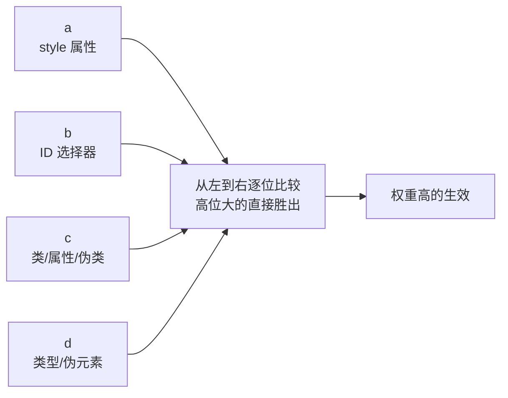

# 选择器优先级

> &#11088;&#11088;&#11088;&#11088;&#11088;｜难度：中级｜项目：&#9733;&#9733;&#9733;

## 一句话总结

**CSS 优先级是"权重计算器"：每个选择器有四位数权重 (a, b, c, d)，比较规则是"从左到右逐位对比，高位大的胜出，高位相同再看下一位"。** 理解了这个模型，`!important` 不是银弹、`:where()` 为什么权重为 0、`@layer` 如何改写优先级，一切都能推导出来。

## 核心机制

### 四位数权重模型 (a, b, c, d)



```css
/* 权重计算演示 */
/* a-b-c-d 格式 */

*               /* 0-0-0-0  通配符权重为 0 */
p               /* 0-0-0-1  类型选择器 */
.container      /* 0-0-1-0  类选择器 */
#app            /* 0-1-0-0  ID 选择器 */
style="..."     /* 1-0-0-0  内联样式 */

/* 组合选择器：各组分相加 */
p.container             /* 0-0-1-1 */
#app .list li           /* 0-1-1-1 */
.nav > ul li:first-child /* 0-0-2-2 */

/* 比较规则：不是十进制进位！11 个类选择器也敌不过 1 个 ID */
.a.b.c.d.e.f.g.h.i.j.k  /* 0-0-11-0  权重 0,0,11,0 */
#x                       /* 0-1-0-0   权重 0,1,0,0  → #x 胜 */
```

### `!important` —— 破坏优先级体系的终极武器

```css
/* !important 凌驾于一切之上，包括内联样式 */
p { color: red !important; } /* ← 权重变为"无穷大" */
/* style="color: blue" 也覆盖不了 */

/* 两个 !important 冲突时，权重规则重新生效 */
p.special { color: red !important; }  /* 权重 0-0-1-1 + !important */
p { color: blue !important; }         /* 权重 0-0-0-1 + !important */
/* red 胜出！因为基础权重 .special 更高 */

/* ⚠️ 不要用 !important 解决权重问题——
    用更具体的选择器或重构 CSS 架构 */
```

### 现代 CSS 对优先级的三个颠覆性补充

```css
/* 1. :is() —— 取参数中权重最高的那个 */
:is(#app, .container, p) { }  /* 权重 = #app 的权重 = 0-1-0-0 */
/* ⚠️ 危险：里面如果混入 ID 选择器，整个 :is() 权重被拉高 */

/* 2. :where() —— 权重始终为 0 */
:where(#app, .container, p) { }  /* 权重 = 0-0-0-0 */
/* ✅ 作为"默认样式"不会阻碍覆盖，非常适合基础组件 */

/* 3. @layer —— 层叠层，权重维度之外的新维度 */
@layer base, components, utilities;

@layer base {
  p { color: black; }             /* base 层优先 */
}

@layer utilities {
  p { color: red; }               /* utilities 层中的 p 覆盖 base 层中的 p */
  /* 不管选择器权重如何，后声明的 @layer 永远高于先声明的 */
}
/* 规则：layer 优先级 > 选择器权重 */
```

## 深度拓展

### `@layer` 的优先级规则

```css
/* layer 声明顺序决定优先级 */
@layer base, theme, components;
/* theme 层覆盖 base 层，components 覆盖 theme 层 */

/* 未分层样式默认在最高层（匿名最高层） */
p { margin: 0; }  /* 在所有 @layer 之上 */

/* !important 反转 layer 顺序：
   低优先级 layer 中的 !important 覆盖高优先级 layer 中的 !important */
@layer base {
  .btn { color: red !important; }  /* base 是低层，!important 反而最高 */
}
@layer components {
  .btn { color: blue !important; } /* components 是高层，!important 反而无效 */
}
/* 结果：red 生效！这是 CSS 设计中最反直觉的地方 */
```

### 调试技巧：浏览器 DevTools 怎么看优先级

```
DevTools Styles 面板中：
- 被覆盖的声明 = 划线 + 灰色
- 声明右上角的三角形 = 继承的样式
- 悬停选择器 = 显示具体权重值 "(0,1,1)" 格式
- Computed 面板 = 最终生效值（跳过所有权重推理）
```

## 项目实战

### Element Plus 样式覆盖的正确姿势

```css
/* ❌ 暴力覆盖 —— 权重战争 */
.el-button { color: red !important; }

/* ❌ 抄源码选择器 —— 脆弱，组件升级就失效 */
.el-button.el-button--primary.is-plain { color: red; }

/* ✅ Element Plus 推荐：CSS 变量覆盖 */
:root {
  --el-color-primary: #1890ff;
  --el-border-radius-base: 6px;
}

/* ✅ 必要时用 :where() 降低自定义组件的权重 */
:where(.my-card) .title { font-size: 16px; }
/* 权重 = 0-0-1-0，外部可以轻松覆盖 */
```

### Vue Scoped 的权重考量

```vue
<style scoped>
/* Scoped 通过 data-v-xxx 属性增加权重 */
.title { color: red; }  
/* 编译后：.title[data-v-xxx]  ← 权重 0-0-2-0 */

/* 子组件根元素同时被父组件 Scoped 影响：
   父 .parent[data-v-parent] .child[data-v-child] ← 权重 0-0-3-0 */
</style>
```

## 易错点

1. **以为权重是十进制** —— `0-0-11-0` 不会进位到 `0-1-0-0`，11 个类选择器永远干不过 1 个 ID
2. **通配符 `*` 权重是 0** —— `* { color: red }` 会被任何带标签的选择器覆盖
3. **`:is()` 取最高权重** —— 用 `:is(#id, .class)` 时权重是 ID 级别，和直接写 `#id` 一样高
4. **`!important` 不能解决所有问题** —— 两个 `!important` 冲突时权重规则重新生效，`!important` 战争只会让代码更烂
5. **`:where()` 权重永远是 0** —— 非常适合做组件库的基础样式，调用方可以轻松覆盖

## 面试信号表

| 面试官问 | 下一问大概率是 |
|----------|-------------|
| "CSS 优先级怎么算" | 给两个冲突的选择器让你比权重 |
| "!important 什么情况用" | 追问 !important 为什么是坏实践 |
| "怎么覆盖第三方库样式" | CSS 变量 vs 提高权重 vs `@layer` 方案 |
| "`:is()` 和 `:where()` 区别" | 追问为什么要设计权重为 0 的选择器 |

## 相关阅读

- [CSS继承性](./inheritance.md) —— 继承 + 层叠 + 优先级，CSS 三大核心机制
- [层叠上下文](./stacking-context.md)
- [BEM 命名](./bem.md)
- [CSS Modules / Scoped](./css-modules-scoped.md)

## 更新记录

- 2026-07-08：新建（四位数权重 + !important + :is/:where/@layer 三大现代补充 + Element Plus 覆盖实战）
