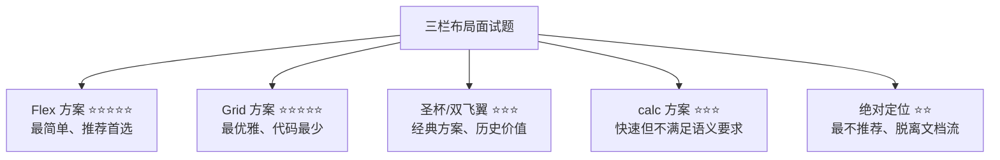

# 三栏布局

> &#11088;&#11088;&#11088;&#11088;｜难度：中级｜手写：&#9733;&#9733;&#9733;&#9733;

## 一句话总结

**三栏布局是"左右固定宽度、中间自适应"的经典 CSS 布局面试题。** 它同时考察布局基础、BFC 理解、Flex/Grid 熟练度和语义化 HTML 意识。面试时 Flex 方案最快最推荐，Grid 方案最优雅，圣杯/双飞翼方案体现历史知识的深度。

## 需求定义

```
┌──────────────────────────────────────────────┐
│  Header                                        │
├────────┬──────────────────────────┬───────────┤
│  Left  │       Main (自适应)       │   Right   │
│ 200px  │     宽度随视口变化         │   200px   │
├────────┴──────────────────────────┴───────────┤
│  Footer                                        │
└──────────────────────────────────────────────┘

要求：
1. 左右固定 200px，中间自适应
2. 中间列在 HTML 中必须写在最前面（优先加载主要内容）
3. 三列等高（可选加分项）
```

## 方案对比



### 方案一：Flex（面试首选）

```html
<div class="container">
  <div class="main">中间内容（在 HTML 中写在最前面）</div>
  <div class="left">左侧</div>
  <div class="right">右侧</div>
</div>
```

```css
.container { display: flex; }
.left  { width: 200px; order: -1; }  /* order 让它排到最左 */
.main  { flex: 1; }                    /* 自适应 */
.right { width: 200px; }
```

**优点**：只 5 行核心代码、HTML 顺序正确（main 在前）、等高自动处理。**缺点**：IE 不支持（需要的话加前缀）。

### 方案二：Grid（最优雅）

```css
.container {
  display: grid;
  grid-template-columns: 200px 1fr 200px;  /* 固定-自适应-固定 */
  gap: 0;
}
/* HTML 顺序不重要，grid-template-columns 直接分配位置 */
```

比 Flex 更简洁，且三列天然等高（grid 子元素被拉伸）。

### 方案三：圣杯布局（经典浮动手写题）

```html
<div class="container">
  <div class="main">中间</div>
  <div class="left">左侧</div>
  <div class="right">右侧</div>
</div>
```

```css
.container { padding: 0 200px; }       /* 左右预留空间 */
.main  { float: left; width: 100%; }    /* 占满 */
.left  { float: left; width: 200px; margin-left: -100%; position: relative; left: -200px; }
.right { float: left; width: 200px; margin-left: -200px; position: relative; right: -200px; }
```

原理：`margin-left: -100%` 让左侧元素"跳"到上一行的最左边，再用 `position: relative; left: -200px` 将它移到 container padding 的预留空间里。

### 方案四：双飞翼布局

```html
<div class="main-wrap">
  <div class="main">中间</div>
</div>
<div class="left">左侧</div>
<div class="right">右侧</div>
```

```css
.main-wrap { float: left; width: 100%; }
.main-wrap .main { margin: 0 200px; }  /* 用 margin 而不是 container padding */
.left  { float: left; width: 200px; margin-left: -100%; }
.right { float: left; width: 200px; margin-left: -200px; }
```

**圣杯 vs 双飞翼的区别**：
- 圣杯：用**父容器 padding** 预留空间，配合 `position: relative` 移动
- 双飞翼：用**主内容区 margin** 预留空间，不需要 relative

### 方案五：calc（最简单但不满足 HTML 顺序要求）

```css
.main  { float: left; width: calc(100% - 400px); }
.left  { float: left; width: 200px; }
.right { float: left; width: 200px; }
/* 要求 HTML 中 left 和 right 在 main 之前，不符合"主要内容优先" */
```

## 深度拓展

### 等高列的实现

```css
/* Flex 方案自带等高 */
.container { display: flex; }

/* Grid 方案自带等高 */
.container { display: grid; }

/* 传统方案：用 padding-bottom + margin-bottom 黑魔法 */
.column { padding-bottom: 9999px; margin-bottom: -9999px; overflow: hidden; }
```

### 响应式三栏：小屏变堆叠

```css
@media (max-width: 768px) {
  .container { flex-direction: column; }
  .left, .right { width: 100%; order: 0; }
}
```

## 面试信号表

| 面试官问 | 下一问大概率是 |
|----------|-------------|
| "三栏布局怎么实现" | 追问圣杯和双飞翼有什么区别 |
| "为什么中间列要写在前面" | 追问 SEO / 内容优先加载的考量 |
| "Flex 方案的 order 属性" | 追问改变视觉顺序是否影响 tab 键顺序 |

## 相关阅读

- [Flexbox](./flexbox.md)
- [Grid](./grid.md)
- [居中方案](./center-layout.md)
- [BFC](./bfc.md)

## 更新记录

- 2026-07-08：新建（五种方案代码 + 圣杯/双飞翼对比 + 等高列 + 响应式变体）
