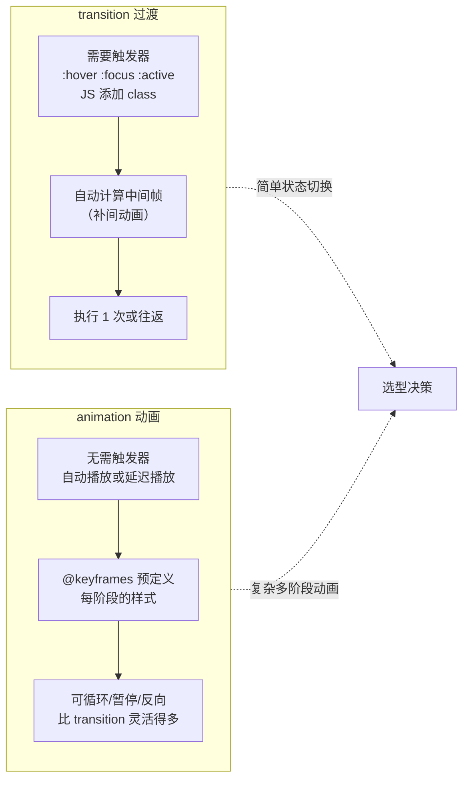

# transition vs animation

> &#11088;&#11088;&#11088;&#11088;｜难度：中级&#9733;&#9733;&#9733;

## 一句话总结

**`transition` 是"状态变化时自动补间"（被动触发，A → B 平滑过渡），`animation` 是"预定义关键帧动画"（主动执行，不依赖状态切换，可循环、可暂停）。** 一句话选型：hover/focus/切换等状态变化用 transition；入场动画、循环动画、多阶段动画用 animation。

## 核心机制

### 一张表说清楚区别



### transition —— 状态变化补间

```css
/* transition: property duration timing-function delay */
.btn {
  background: #3451b2;
  /* 只过渡 background，0.3s，ease 缓动 */
  transition: background 0.3s ease;
}
.btn:hover {
  background: #5c73e7;  /* 触发 transition */
}

/* 多属性过渡 */
.card {
  transition:
    transform 0.3s ease,
    box-shadow 0.3s ease,
    opacity 0.2s ease;
}
.card:hover {
  transform: translateY(-4px);
  box-shadow: 0 8px 24px rgba(0,0,0,0.12);
}

/* ⚡ 性能关键：过渡的只应该用 transform 和 opacity */
/* ❌ transition: width 0.3s;  → 每帧触发 Layout */
/* ✅ transition: transform 0.3s; → 只触发 Composite */
```

### animation —— 预定义关键帧

```css
/* @keyframes 定义动画阶段 */
@keyframes slideIn {
  from { transform: translateY(-100%); opacity: 0; }
  to   { transform: translateY(0);     opacity: 1; }
}

/* 百分比方式（多阶段） */
@keyframes pulse {
  0%   { transform: scale(1); }
  50%  { transform: scale(1.05); }
  100% { transform: scale(1); }
}

/* animation: name duration timing-function delay iteration-count direction fill-mode */
.modal {
  animation: slideIn 0.3s ease;
}

.spinner {
  animation: spin 0.8s linear infinite;
}

/* fill-mode: 动画结束后停在哪个状态 */
.fade-in {
  animation: fadeIn 0.5s ease forwards;
  /* forwards = 保持最后一帧的状态 */
}
```

### animation 属性速查

| 属性 | 作用 | 常用值 |
|------|------|--------|
| `animation-name` | @keyframes 名称 | — |
| `animation-duration` | 持续时间 | `0.3s`, `1200ms` |
| `animation-timing-function` | 缓动函数 | `ease`, `linear`, `cubic-bezier()` |
| `animation-delay` | 延迟 | `0s`, `2s` |
| `animation-iteration-count` | 播放次数 | `1`, `infinite` |
| `animation-direction` | 方向 | `normal`, `reverse`, `alternate` |
| `animation-fill-mode` | 结束状态 | `none`, `forwards`, `backwards`, `both` |
| `animation-play-state` | 播放/暂停 | `running`, `paused` |

### `steps()` —— 逐帧动画

```css
/* 用 steps() 做逐帧动画（spritesheet 精灵图） */
@keyframes sprite {
  from { background-position: 0 0; }
  to   { background-position: -600px 0; }  /* 10 帧 × 60px */
}
.sprite {
  width: 60px;
  height: 60px;
  background: url(spritesheet.png);
  animation: sprite 1s steps(10) infinite; /* 跳 10 步，不平滑过渡 */
}
/* steps(n) = 将整个动画分成 n 段，每段直接跳过去，不补间 */
```

## 深度拓展

### 触发 transition 的两种方式

```css
/* 方式 1：CSS 伪类触发 */
.btn { transition: transform 0.3s; }
.btn:hover { transform: scale(1.1); }

/* 方式 2：JS 添加 class 触发 */
el.style.transition = 'transform 0.3s'
el.classList.add('active')
el.style.transform = 'translateX(100px)'
```

### JS 监听动画事件

```js
el.addEventListener('transitionend', (e) => {
  if (e.propertyName === 'transform') {
    console.log('过渡结束')
  }
})

el.addEventListener('animationend', (e) => {
  if (e.animationName === 'slideIn') {
    console.log('动画播放完毕')
  }
})

el.addEventListener('animationiteration', (e) => {
  // 每次循环触发（infinite 动画有用）
})
```

### 为什么 transform + opacity 是"动画性能天花板"

transform 和 opacity 只触发 Composite 阶段，不走主线程的 Layout 和 Paint。浏览器合成线程在 GPU 上直接完成，即使主线程被 JS 阻塞，动画仍然流畅。这就是为什么"所有动画都应该用 transform + opacity 做"。

参见 [CSS 渲染性能](./css-performance.md) 详细对照表。

## 项目实战

### 下拉菜单展开/收起（transition + max-height）

```css
.dropdown-menu {
  max-height: 0;
  overflow: hidden;
  transition: max-height 0.3s ease;
}
.dropdown-menu.open {
  max-height: 500px;  /* 给一个足够大的值 */
}
/* ⚠️ 小心：max-height 过渡会触发 Layout，大量使用时考虑用 transform */
```

### 骨架屏闪烁动画（animation + infinite）

```css
@keyframes shimmer {
  0%   { background-position: -200% 0; }
  100% { background-position: 200% 0; }
}
.skeleton {
  background: linear-gradient(90deg, #f0f0f0 25%, #e0e0e0 50%, #f0f0f0 75%);
  background-size: 200% 100%;
  animation: shimmer 1.5s ease-in-out infinite;
}
```

### 页面切换过渡（transition + Vue）

```vue
<template>
  <Transition name="fade">
    <router-view />
  </Transition>
</template>
<style>
.fade-enter-active,
.fade-leave-active {
  transition: opacity 0.3s ease;
}
.fade-enter-from,
.fade-leave-to {
  opacity: 0;
}
</style>
```

## 易错点

1. **`transition` 写了但没触发器** —— 需要状态变化（hover/class 切换）才能触发
2. **`transition` 的 `display: none` 无动画** —— `display` 默认不参与过渡，传统做法用 `opacity` + `pointer-events` 代替；现代方案是 `transition-behavior: allow-discrete` + `@starting-style`（2024 年起 Baseline）
3. **忘记 `animation-fill-mode: forwards`** —— 动画结束后元素跳回初始状态
4. **`animation` 的 `@keyframes` 名字拼错** —— 动画静默失败，不报错
5. **`transition` 和 `animation` 同时使用** —— 两者可能冲突，需要明确分场景使用

## 面试信号表

| 面试官问 | 下一问大概率是 |
|----------|-------------|
| "transition 和 animation 区别" | 追问各自适用场景 + 为什么不都用 animation |
| "CSS 动画性能怎么优化" | 追问 transform/opacity + will-change + Composite 原理 |
| "怎么监听动画结束" | `animationend` / `transitionend` 事件 |

## 相关阅读

- [CSS 渲染性能](./css-performance.md) —— 动画性能底层原理
- [居中方案](./center-layout.md)
- [响应式](./responsive.md)

## 更新记录

- 2026-07-18：事实审计——修 JS 示例笔误（.el→el）、display 过渡补 transition-behavior/@starting-style 现代方案
- 2026-07-08：新建（transition vs animation 对比 + steps 逐帧 + 动画事件 + 项目实战）
