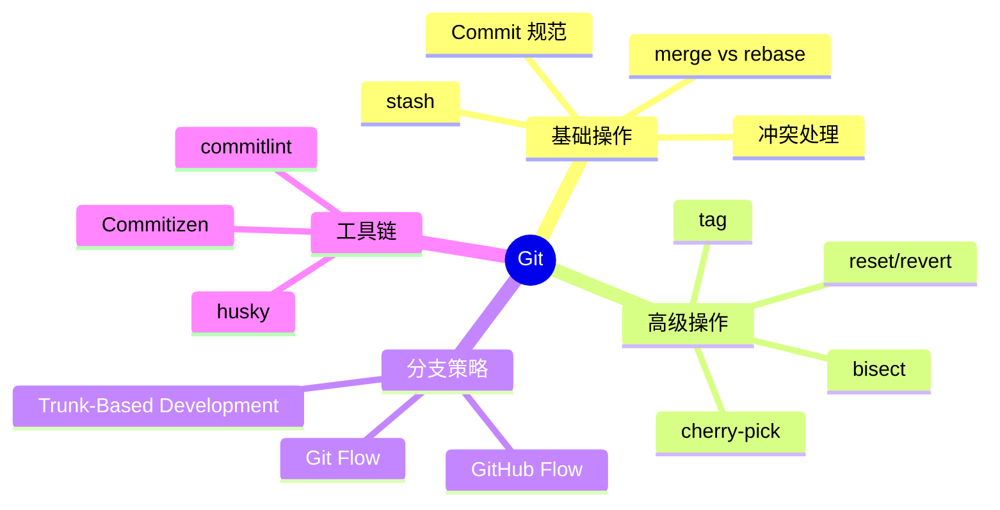

# Git 知识地图

## 推荐学习顺序

按知识依赖排序，⭐ 标注面试频率：

### 一、核心操作（日常必须）

1. ⭐⭐⭐⭐⭐ [Commit 规范](./commit-spec.md) — 提交是一切操作的基础
2. ⭐⭐⭐⭐⭐ [merge vs rebase](./merge-vs-rebase.md) — 分支合并的核心操作
3. ⭐⭐⭐⭐⭐ [冲突处理](./conflict-resolution.md) — 合并的自然延伸
4. ⭐⭐⭐⭐ [reset vs revert](./reset-vs-revert.md) — 撤销是另一面
5. ⭐⭐⭐⭐ [stash](./stash.md) — 未提交代码的管理

### 二、分支操作（建立在核心操作上）

6. ⭐⭐⭐⭐ [cherry-pick](./cherry-pick.md) — 跨分支选择提交
7. ⭐⭐⭐ [tag](./tag.md) — 为提交打标记

### 三、工作流与调试

8. ⭐⭐⭐⭐ [Git Flow](./git-flow.md) — 在核心操作上的流程组织
9. ⭐⭐ [reflog/rebase -i/内部原理](./reflog-rebase-interactive.md) — 理解内部机制
10. ⭐⭐ [diff/log/blame/hooks](./diff-log-blame-hooks.md) — 调试和自动化
11. ⭐⭐⭐ [bisect](./bisect.md) — 调试大杀器

## 知识点索引

| 知识点 | 频率 | 难度 | 状态 |
|--------|------|------|------|
| [Commit 规范](./commit-spec.md) | ⭐⭐⭐⭐⭐ | 初级 | filled |
| [merge vs rebase](./merge-vs-rebase.md) | ⭐⭐⭐⭐⭐ | 中级 | filled |
| [冲突处理](./conflict-resolution.md) | ⭐⭐⭐⭐⭐ | 中级 | filled |
| [cherry-pick](./cherry-pick.md) | ⭐⭐⭐⭐ | 中级 | filled |
| [stash](./stash.md) | ⭐⭐⭐⭐ | 初级 | filled |
| [reset vs revert](./reset-vs-revert.md) | ⭐⭐⭐⭐ | 中级 | filled |
| [Git Flow](./git-flow.md) | ⭐⭐⭐⭐ | 中级 | filled |
| [tag](./tag.md) | ⭐⭐⭐ | 初级 | filled |
| [bisect](./bisect.md) | ⭐⭐⭐ | 初级 | filled |

## 面试速览

| 面试信号 | 对应知识点 | 级别 |
|----------|-----------|------|
| 能说出 Angular 规范 + 工具链自动校验 | [Commit 规范](./commit-spec.md) | 初级+ |
| 能解释 rebase 让历史线性，merge 保留真实合并记录 | [merge vs rebase](./merge-vs-rebase.md) | 中级 |
| 能清晰描述冲突解决流程 + 预防策略 | [冲突处理](./conflict-resolution.md) | 中级 |
| 能对比 Git Flow / GitHub Flow / TBD 并说明选择理由 | [Git Flow](./git-flow.md) | 中高级 |
| 知道 bisect 二分定位 bug + 自动化脚本 | [bisect](./bisect.md) | 加分项 |
