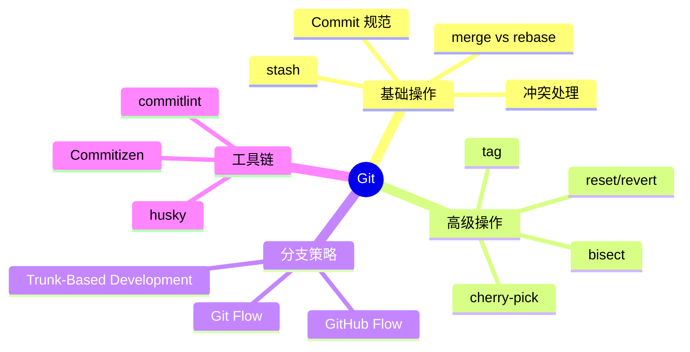

# Git 知识地图

## 推荐学习顺序

按面试出现频率和知识依赖关系排序：

1. ⭐⭐⭐⭐⭐ [Commit 规范](./commit-spec.md) -- 团队协作基础，CI/CD 第一步
2. ⭐⭐⭐⭐⭐ [merge vs rebase](./merge-vs-rebase.md) -- 面试必问，区分初中高级
3. ⭐⭐⭐⭐⭐ [冲突处理](./conflict-resolution.md) -- 日常痛点，实操考查重点
4. ⭐⭐⭐⭐   [cherry-pick](./cherry-pick.md) -- hotfix 场景高频使用
5. ⭐⭐⭐⭐   [stash](./stash.md) -- 临时切换分支，每个开发者都用
6. ⭐⭐⭐⭐   [reset vs revert](./reset-vs-revert.md) -- 代码回滚，撤销操作必考
7. ⭐⭐⭐⭐   [Git Flow](./git-flow.md) -- 分支策略选型，架构方向问题
8. ⭐⭐⭐     [tag](./tag.md) -- 发布管理，CI/CD 相关
9. ⭐⭐⭐     [bisect](./bisect.md) -- 调试利器，加分项

## 知识点索引

| 知识点 | 频率 | 难度 | 状态 |
|--------|------|------|------|
| [Commit 规范](./commit-spec.md) | ⭐⭐⭐⭐⭐ | 初级 | filled |
| [merge vs rebase](./merge-vs-rebase.md) | ⭐⭐⭐⭐⭐ | 中级 | filled |
| [冲突处理](./conflict-resolution.md) | ⭐⭐⭐⭐⭐ | 中级 | filled |
| [cherry-pick](./cherry-pick.md) | ⭐⭐⭐⭐ | 中级 | filled |
| [stash](./stash.md) | ⭐⭐⭐⭐ | 初级 | filled |
| [reset vs revert](./reset-vs-revert.md) | ⭐⭐⭐⭐ | 中级 | filled |
| [Git Flow](./git-flow.md) | ⭐⭐⭐⭐ | 中级 | filled |
| [tag](./tag.md) | ⭐⭐⭐ | 初级 | filled |
| [bisect](./bisect.md) | ⭐⭐⭐ | 初级 | filled |

## 面试速览

| 面试信号 | 对应知识点 | 级别 |
|----------|-----------|------|
| 能说出 Angular 规范 + 工具链自动校验 | [Commit 规范](./commit-spec.md) | 初级+ |
| 能解释 rebase 让历史线性，merge 保留真实合并记录 | [merge vs rebase](./merge-vs-rebase.md) | 中级 |
| 能清晰描述冲突解决流程 + 预防策略 | [冲突处理](./conflict-resolution.md) | 中级 |
| 能对比 Git Flow / GitHub Flow / TBD 并说明选择理由 | [Git Flow](./git-flow.md) | 中高级 |
| 知道 bisect 二分定位 bug + 自动化脚本 | [bisect](./bisect.md) | 加分项 |
