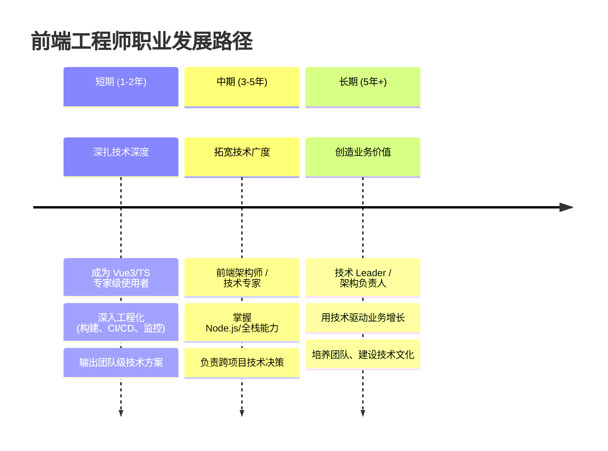

# 职业规划

> ⭐⭐⭐⭐⭐｜难度：中级

> "面试官问你职业规划，不是在查你的未来5年行程表——他是在评估三件事：你有没有上进心、你的方向跟这个岗位的发展路径是否重叠、以及你将来会不会因为'想做别的事'而离职。"

---

## 一句话总结

面试官问"你的职业规划是什么"，本质是在评估三件事：**你有没有自我驱动力**、**你的方向跟团队成长路径是否匹配**、**你在这家公司至少能待多久**。回答公式：短期深扎技术（1-2年做到团队里最懂的那个人）+ 中期走向架构思维（3-5年从模块到系统）+ 长期创造业务价值（5年+用技术驱动产品）。你的规划要跟投递岗位的成长空间对齐，让面试官觉得"这个人进来后能在我团队里稳定成长至少三年"。

---

## 核心机制

### 1. 三段式规划框架

对3年中级前端来说，一个得体、可信的职业规划应该覆盖三个时间段：

| 阶段 | 时间 | 核心目标 | 对中级前端的具体含义 |
|------|------|----------|---------------------|
| **短期** | 1~2年 | 技术深度 + 成为团队核心 | 在当前技术栈（Vue3/TS/工程化）上做到团队里最懂的那个人；能独立负责一个模块的技术方案设计和落地；开始输出团队级文档和分享 |
| **中期** | 3~5年 | 技术广度 + 架构能力 | 从"做好一个模块"到"设计一个系统"——能参与技术选型、架构设计、跨项目方案评审；同时具备后端/运维的基础能力，能够从全链路角度思考问题 |
| **长期** | 5年+ | 业务影响力 + 团队建设 | 不再只是一个"写代码的人"——而是能通过技术决策影响业务方向、能带小团队、能建设团队技术文化的人 |

### 2. 两条可选路径：技术专家 vs 技术管理

面试官可能会追问："你想走技术路线还是管理路线？"对3年中级前端来说，这个问题的标准答案是**技术先行**。

| 路径 | 特点 | 适用场景 |
|------|------|---------|
| **技术专家（IC）** | 垂直深入某个领域，成为团队里该领域的 Go-to Person | 大厂/中型公司，有明确的技术晋升通道 |
| **技术 Leader / 架构师** | 横向负责系统级设计和技术决策，兼顾小团队 mentoring | 中小公司/创业团队，需要多面手 |
| **纯管理（EM）** | 放弃一线 coding，专注团队建设、项目管理、跨部门协调 | 通常 7~10 年+ 再考虑，3年太早 |

**对3年中级来说，推荐的选择：**

> "目前这个阶段我还是想先把技术底盘打扎实——至少在 Vue3 生态、前端工程化和组件架构设计这几个方向做到足够深入。3~5年后如果团队有需要，我也愿意承担一些技术 Leader 的职责，带一两个新人、负责跨模块的技术评审。但这个阶段我不会强求纯管理的角色——我觉得技术是根基，技术不够深就去做管理是在透支自己。"

### 3. 为什么面试官要问这个——留存率预判

面试的本质是双向选择，面试官也在算一个账：我花了半年把你培养起来，你能不能在这个团队至少待 2~3 年？如果你说"我想做全栈"，结果这个岗位只有前端工作，你可能半年就走了。如果你说"我没想好"，面试官会觉得你没有内在驱动力。

所以你的职业规划应该跟这个岗位的成长空间尽量重合。面试前通过 JD 和面试官的描述，判断这个岗位能给你什么——然后在你的规划里有意识地靠拢。

---

## 面试实战

### 标准 3-5 年规划脚本（前端技术方向）

> 这是最通用的版本，适用于绝大多数后台管理系统前端岗位。填空部分按实际情况替换。

**脚本：**

"分三个阶段来说吧。

**短期（1~2年）：深扎技术深度。**

首先是把 Vue3 生态吃透——不只是会用，而是理解响应式系统的原理、Composition API 的设计思想、编译器的优化策略，能够在一个复杂项目中做对的技术决策。

其次是前端工程化这块——包括构建工具链（Vite 的插件和优化配置）、自动化测试（单元测试 + E2E）、CI/CD 流水线、以及线上监控（错误追踪 + 性能监控）。我希望从一个"会用工具的人"变成一个"能搭工具的人"。

还有一个实际的目标：我希望在这个阶段能够输出一些对团队有影响力的东西——不管是技术方案的文档、内部的技术分享、还是可复用的组件/工具，让团队因为我的存在而变得好一点点。

**中期（3~5年）：走向架构思维。**

这个阶段我希望从"做好一个模块"到"设计一个系统"。能够独立负责一个中等复杂度前端项目的架构设计——技术选型、目录结构、模块划分、数据流方案——并且在这个项目上证明自己的设计是经得起时间考验的。

同时也想拓宽技术广度。至少掌握 Node.js 的服务端开发能力（比如 NestJS），了解数据库设计和基本运维知识，做到能从全链路去分析一个问题，而不仅仅是前端层面的。这不一定要成为全栈工程师，但是**理解后端能让前端做得更好**。

如果团队需要，我也愿意承担一些技术 Leader 的职责——带一两个新人、参与跨项目技术评审、帮助团队建立更好的技术规范。

**长期（5年+）：创造业务价值。**

到那个阶段，我不希望自己只是一个非常好的"执行者"——我希望成为一个能用技术驱动业务的人。比如能够从技术角度发现产品机会、通过架构设计支撑业务的快速迭代、或者在团队内部建立技术文化、培养更多优秀的工程师。

这是我的大致规划。当然具体的路径可能会随着团队需要和个人兴趣做一些调整，但大方向是清晰的——技术深度是根基，然后再往上做广度、架构和影响力。"

---

### 如何回答"为什么不想走管理路线？"

如果面试官追问，注意不要表达出"管理就是整天开会没技术含量"这种态度——技术管理和技术执行是两种不同的能力模型，没有高下之分。

> "我觉得管理是一种责任，而不是一种晋升。目前这个阶段，我的技术能力还在快速上升期，如果把精力分到管理上，可能会两头都做不好。
>
> 我见过很多优秀的技术 Leader，他们的技术深度足够支撑团队的技术决策，再去带人、定规范才是有根基的。我希望自己先花几年把根基扎牢，如果将来团队需要，再往管理方向延伸——但前提是技术底子不会丢。
>
> 换句话说，我希望是'技术强了再考虑管理'，而不是'技术不行所以去做管理'。"

---

### 如何回答"如果你的规划跟岗位不符怎么办？"

这个问题考察的是你的灵活度和对现实的认识。

> "我理解岗位需求和个人发展不一定完全一致。如果我来贵司之后，实际需要做的事情跟我的规划有一些偏差，我会先保证把本职工作的交付质量做到位——这是基本素养。然后在做好本职的基础上，我会主动争取跟规划方向更接近的任务，或者利用业余时间学习补充。
>
> 其实我觉得，只要大方向在一个轨道上——比如都是做前端工程化/后台管理系统这个方向，具体的微调是完全可以接受的。职业规划是地图，不是铁轨。"

---

## 深度拓展

### 追问一：你觉得一个"高级前端"和一个"中级前端"的关键区别是什么？

这是一个很好的展示你对自己所处阶段认知的问题。

> "我觉得有三个维度。
>
> **第一是方案决策能力。** 中级前端拿到一个需求，更多是想'怎么把它写出来'。高级前端会先想'有没有更好的写法'——在功能实现之前，先做方案对比和取舍。比如一个复杂表单，是用 JSON Schema 驱动还是模板驱动，两种方案的维护成本差异在哪，高级前端能从团队和项目的视角去评估。
>
> **第二是影响力的范围。** 中级前端的输出主要是自己负责的那块业务代码。高级前端的输出是跨模块、跨项目的——一个工具库、一套规范、一个架构设计，能让整个团队甚至多个团队受益。
>
> **第三是对业务的理解深度。** 中级前端更多是在接需求、做需求。高级前端会主动关心用户体验、关心技术如何驱动业务价值——'这个功能用户其实不需要'，这种判断力是高级前端最值钱的东西。"

---

### 追问二：你为什么要走技术专家方向，而不是转管理？

面试官问这个是在考察你是否真的思考过两条路的取舍，而不是"因为别人都这么说"。

> "其实我认真想过这个问题。我观察过我们团队的技术 Leader，他的日常大概 60% 的时间在开会、对齐、写文档、做评审，真正写代码的时间不到 40%。我衡量了一下自己目前的状态——我写代码的时候是最兴奋的，解决一个技术难题带来的成就感远远大于协调好一个跨部门会议。
>
> 但这不意味着我排斥带人或做决策。我现在的想法是，先走 IC 路线做到 P7 甚至 P8 的水平，让自己在某个技术领域有不可替代的深度。到那个时候，如果团队需要我承担更多管理职责，我至少有技术底子兜底，不会变成一个'只会分活不会干活'的 Leader。如果不需要，我就继续做技术，这条路也能走得很远——大厂的技术专家薪资和职级天花板都不比管理线低。
>
> 总结就是：**技术是主食，管理是配菜**。先吃饱主食，再考虑加不加配菜。"

---

### 追问三：你觉得这个规划现实吗？凭什么觉得自己能做到？

这个问题很尖锐，面试官在试探你对自己能力的认知是否客观，以及你有没有行动计划而非空想。

> "坦白说，规划本身肯定有不确定性的——行业在变、技术在变、团队需求也在变。我列的这些目标不是'一定会实现'的承诺，而是'我会朝这个方向努力'的路线图。
>
> 为什么我觉得自己能做到短期目标？因为过去三年我已经证明了自己有持续学习的习惯和能力。我刚入行的时候接手的还是 Vue2 + JavaScript 的老项目，后来自学 Vue3 并推动项目迁移到 TypeScript、从 Webpack 切到 Vite——每一次技术栈的升级都是我自己主动推动的，不是被项目逼着学的。这说明我有**自学能力和技术敏感度**，这两点是实现短期规划的基础。
>
> 对于中期目标，我也在铺垫。比如最近我开始系统学习 Node.js 和 NestJS，用业余时间做了一个小的全栈项目，虽然不复杂，但它让我理解了'从前端到数据库'的完整链路。我还开始看一些系统设计的书，学着从架构层面思考问题而不仅是代码层面。
>
> 当然，如果两年后发现实际情况跟规划有偏差，我会调整。规划的意义不是'按图索骥'，而是给我一个方向感——让我在每一天做选择的时候，知道什么是重要的、什么是可以放一放的。"

---

### 追问四：如果短期目标没有达到怎么办？

面试官在考察你的抗压能力和 Plan B 思维。

> "分两种情况来看。
>
> 如果是我自身的原因——比如这一两年偷懒了、学习松懈了——那说明我的自驱力出了问题，我需要重新审视自己的优先级和时间管理。这种情况我不会找借口，而是直面问题，调整节奏重新出发。
>
> 如果是外部原因——比如公司业务方向调整，我被迫做了很多跟规划不相关的工作——那我也不会觉得自己'浪费了时间'。实际工作中积累的任何经验都是有用的。比如我被安排去做了半年的跨部门协调和项目推进，虽然跟技术深度无关，但它锻炼了我的沟通能力和项目视角——这些东西将来做架构师或技术 Leader 的时候肯定会用到。
>
> 而且说实话，我在意的不是'两年后我必须是团队里最厉害的那个人'这种硬指标。我在意的是**我是否在持续进步**。只要每一天、每一周、每个月我都能看到自己在往前走——不管是技术深度、项目经验、还是软技能——我就觉得这个规划是有意义的。进度可以慢一点，但不能停。"

---

## 项目实战

### 真实场景：一个3年经验的 Vue3 后台管理系统开发者怎么讲职业规划

假设你过去的项目经历是：在一家中型 SaaS 公司做了 3 年，技术栈是 Vue3 + TypeScript + Element Plus + Vite，负责公司内部 CMS 系统和数据看板的前端开发。你目前的职级是中级前端，准备跳槽到一家更大的公司。

**你应该这样把项目经验融入职业规划：**

> "结合我目前做的项目来说。我在上一家公司做了三年的后台管理系统——从最早的 Vue2 + Element UI 一路升级到 Vue3 + TypeScript + Element Plus，整个迁移过程我都是主力。这个过程让我意识到一件事：**当项目复杂度到了一定程度之后，决定开发效率的不是你代码写得有多快，而是你的架构设计有多合理。**
>
> 举个例子，我们的 CMS 系统有 40 多个页面，每个页面都有复杂的表单配置和权限控制。最开始没有统一的设计规范，每个同事写表单的方式都不一样——有人用模板驱动、有人用 JSON Schema、有人直接在 template 里硬编码。导致新人接手别人代码的时候理解成本极高，改一个字段可能要在五六个地方同步修改。
>
> 后来我主动推动了一套**统一表单配置方案**——基于 JSON Schema 的表单生成器，把表单字段、校验规则、布局都收敛到一个配置对象里。这件事做出来之后，新写一个表单页面的时间从平均半天降到了两小时，而且风格完全统一。这次经历让我对'架构'这个词有了真实的体感——**好的架构不是纸上谈兵，是在真实的痛苦中长出来的解决方案。**
>
> 所以我职业规划里说的'从模块到系统'，不是一句空话。我是真真切切感受到了一个模块写好之后，如果不往系统层面去想，天花板很快就到了。这也是为什么我特别想来贵司——我在 JD 上看到你们在做微前端和低代码平台，这两个方向正好是我职业规划中'架构能力'和'工程化深度'的下一步。我相信在这里我能把之前积累的组件设计和工程化经验放大到平台级别。"

**为什么这样回答有效：**
1. 用真实项目细节证明你说的规划不是编的——面试官能感受到"这个人真的做过这些事"
2. 把规划目标跟过去经历做了因果连接——"因为我经历了 X，所以我知道 Y 很重要，所以我的下一步是 Z"
3. 自然地接了目标公司的业务方向——说明你做过功课，不是海投

---

## 易错点

1. **"我没什么规划，走一步看一步"**：这是最致命的一种回答。面试官听到这句话会觉得你对自己没有任何要求——这对一个3年中级前端来说是很减分的。哪怕你真的没有很明确的长期规划，也从短期开始说："目前我特别想在这个方向深挖……"至少说明你在想这件事。

2. **规划过于宏大、脱离实际**："我计划3年内成为 CTO"——别说3年了，给你5年都够呛。规划要跟你的级别、当前的技能水平、行业的真实晋升速度匹配。对3年中级来说，3年后做到"高级前端 / 前端架构师"是合理的，"技术总监"就太急了。

3. **规划跟投递岗位完全无关**：你面的是一家 SaaS 公司的后台前端岗，你说的规划是"做 3D 可视化 / WebGL / 游戏引擎"——面试官只能觉得你是来过渡的，拿到别的 offer 立刻走。确保你的规划大方向跟你投的岗位是一致的。

4. **只有技术术语没有自我反思**："我想学会 Vue3、Vite、TypeScript、React、Next.js、Tailwind CSS"——这叫"学习清单"，不叫"职业规划"。职业规划要体现的是你在什么阶段达到什么能力层级，以及你对自己当前水平和行业趋势的理解，而不是你会用多少工具。

5. **只聊技术不聊业务**：越往后走，业务理解能力越重要。你的规划里至少要提一句"我希望未来能更深入地理解业务，用技术驱动产品价值"——这句话让面试官觉得你不只是一个只关心代码的码农。

6. **否定管理路线的价值**：说"我不做管理因为管理没技术含量"或"写代码才是正经事"——这是减分项。技术管理和技术执行是两种不同的核心能力，没有高下之分。正确的说法是"现阶段我更想在技术深度上积累"，而不是贬低另一条路。

7. **规划和企业发展阶段不匹配**：面的是早期创业公司却说"我想去大厂做螺丝钉打磨一个细分领域"，面试官会觉得你待不久。反过来，面的是大厂却大谈"我想做多面手什么都学一点"，可能跟大厂需要的深度专精不匹配。规划要跟目标公司的阶段对齐。

---

## 相关阅读

- [优缺点](./strength-weakness.md) — 你的优点应该支撑职业规划、你的缺点应该是规划中要弥补的方向
- [离职原因](./leave-reason.md) — 离职原因和职业规划是一体两面："为什么离开"和"想去哪里"互相呼应
- [项目介绍](./project-intro.md) — 你过去的项目经验是你实现职业规划的底气
- [自我介绍](./self-intro.md) — 自我介绍的"求职动机"部分和职业规划保持信息一致

---

## 更新记录

- 2026-07-18：frequency 调整为 ⭐⭐⭐⭐⭐（HR 面必问题），正文星级同步
- 2026-07-18：事实审计（Phase 3）——追问三移除过时的"毕业只会 jQuery"叙事，改为 Vue2 老项目起步并主动推动升级，与项目实战章节口径一致
- 2026-07-05：完成内容填充（Phase 2），新增三段式规划框架 + Mermaid 时间线、技术专家 vs 技术管理路径选择、标准3-5年规划脚本、"为什么不做管理"应对、"规划与岗位不符"应对、中高级前端区别追问
- 2026-07-05：深度拓展新增3个追问：为什么走技术路线、规划是否现实、短期目标未达成怎么办；新增项目实战章节（30+行，基于 CMS 后台真实场景的逐字回答示例）
