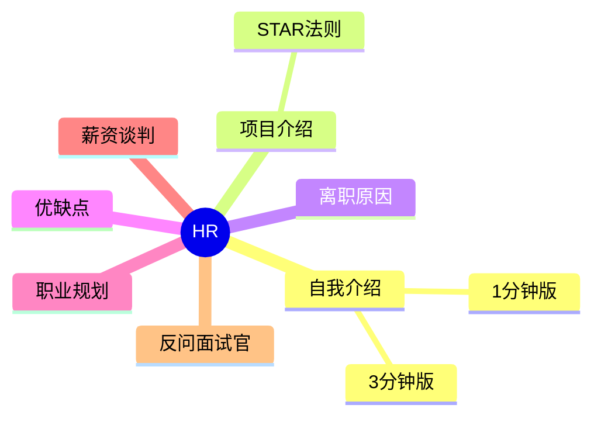

# HR 面试地图

## 知识点索引

| 主题 | 频率 | 难度 | 状态 |
|------|------|------|------|
| [自我介绍](./self-intro.md) | ⭐⭐⭐⭐⭐ | 中级 | draft |
| [项目介绍](./project-intro.md) | ⭐⭐⭐⭐⭐ | 中级 | draft |
| [离职原因](./leave-reason.md) | ⭐⭐⭐⭐ | 初级 | draft |
| [优缺点](./strength-weakness.md) | ⭐⭐⭐⭐ | 初级 | draft |
| [职业规划](./career-plan.md) | ⭐⭐⭐⭐ | 中级 | filled |
| [薪资谈判](./salary-negotiation.md) | ⭐⭐⭐⭐⭐ | 中级 | filled |
| [反问面试官](./reverse-questions.md) | ⭐⭐⭐⭐⭐ | 初级 | filled |
