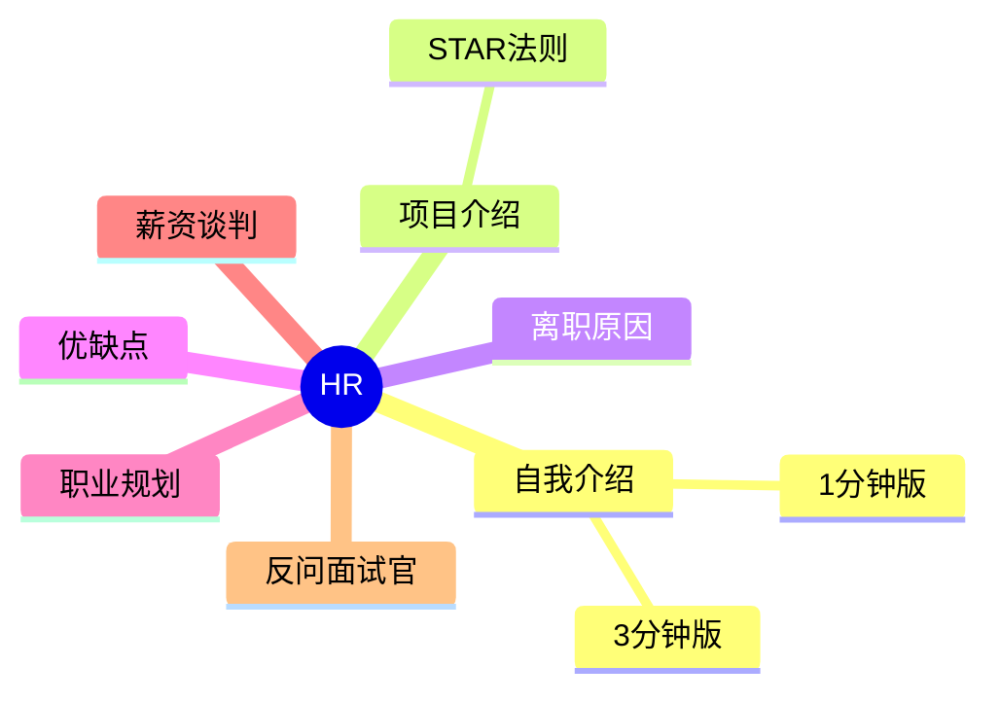

# HR 面试地图

## 推荐学习顺序

### 一、必备四件套（每场面试都会问）

1. ⭐⭐⭐⭐⭐ [自我介绍](./self-intro.md) — 1 分钟和 3 分钟两个版本，开场定调
2. ⭐⭐⭐⭐⭐ [项目介绍](./project-intro.md) — STAR 法则，技术面和 HR 面都用
3. ⭐⭐⭐⭐⭐ [离职原因](./leave-reason.md) — 正面表达，不吐槽前司
4. ⭐⭐⭐⭐⭐ [薪资谈判](./salary-negotiation.md) — 谈钱的话术和暗坑

### 二、进阶准备（二面/HR 面加分项）

5. ⭐⭐⭐⭐⭐ [职业规划](./career-plan.md)
6. ⭐⭐⭐⭐ [优缺点](./strength-weakness.md)
7. ⭐⭐⭐⭐⭐ [反问面试官](./reverse-questions.md) — 按面试官类型准备

### 三、题库自测

8. [HR 高频面试题](../面试题库/HR.md) — 17 道行为面试题过一遍

## 知识点索引

| 主题 | 频率 | 难度 | 状态 |
|------|------|------|------|
| [自我介绍](./self-intro.md) | ⭐⭐⭐⭐⭐ | 中级 | reviewed |
| [项目介绍](./project-intro.md) | ⭐⭐⭐⭐⭐ | 中级 | reviewed |
| [离职原因](./leave-reason.md) | ⭐⭐⭐⭐⭐ | 初级 | reviewed |
| [优缺点](./strength-weakness.md) | ⭐⭐⭐⭐ | 初级 | reviewed |
| [职业规划](./career-plan.md) | ⭐⭐⭐⭐⭐ | 中级 | reviewed |
| [薪资谈判](./salary-negotiation.md) | ⭐⭐⭐⭐⭐ | 中级 | filled |
| [反问面试官](./reverse-questions.md) | ⭐⭐⭐⭐⭐ | 初级 | filled |
