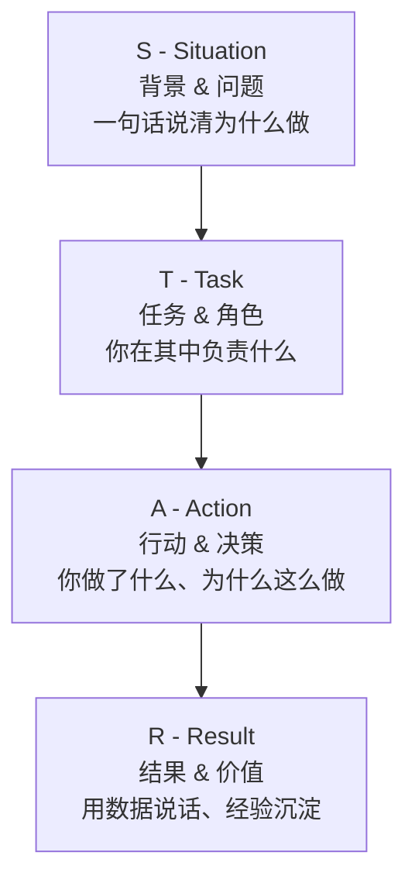

# 项目介绍

> ⭐⭐⭐⭐⭐｜难度：中级｜项目：★★★

> "面试官不怕你项目小，就怕你讲不清楚你做了什么。一个10人的大项目你只写了两个页面，不如一个你独立负责的组件库有说服力。"

---

## 一句话总结

Use STAR (Situation -> Task -> Action -> Result), highlight personal contribution and technical challenges.

STAR 法则不是一个格式要求，是一个**思维框架**。面试官问你"介绍一下这个项目"，他在用 STAR 的四个维度分别给你打分：S（项目复杂度够不够）、T（你对需求的理解深不深）、A（你的技术决策是否合理）、R（你有没有拿数据说话的习惯）。

---

## 核心机制

### 1. STAR 四要素详解



| 要素 | 时间占比 | 核心问题 | 对中级前端的要求 |
|------|----------|----------|-----------------|
| **S**ituation | 10% | 为什么做这个项目？当时的技术痛点是什么？ | 能一句话说清项目的业务价值和技术背景 |
| **T**ask | 15% | 你的角色是什么？你负责哪部分？团队多少人？ | 能区分"我做的"和"团队做的"，角色定位清晰 |
| **A**ction | 50% | 你具体做了什么？技术选型的理由？遇到了什么难点怎么解决的？ | **这是面试的重头戏**——突出技术决策、方案对比、踩坑经验 |
| **R**esult | 25% | 上线后的效果？有没有量化指标？沉淀了什么？ | 有数据说数据，没数据说影响（组件复用、团队效率提升） |

**为什么 Action 占 50%？** 因为中级前端和初级前端的核心差别不在"会不会写页面"，而在于"遇到一个需求，能不能选对方案、做对取舍"。面试官要通过 Action 来判断你是否有独立的技术判断力。

### 2. 后台管理系统的标准讲法

作为3年 Vue3 后台开发者，你的项目大概率属于以下几种之一。每种的核心卖点不同：

| 项目类型 | 核心卖点（面试官想听的） | 避开的坑 |
|----------|------------------------|---------|
| **中大型后台管理系统** | 权限体系（RBAC + 动态路由）、复杂表单 & 列表的组件抽象、页面性能优化（虚拟滚动、懒加载） | 不要只说"用了 Element Plus 搭页面"，那是1年水平 |
| **组件库/物料平台** | API 设计思路、TypeScript 类型推导、文档 & 测试体系、版本管理与 breaking change 策略 | 不要只说"封装了按钮组件" |
| **数据大屏/可视化** | 图表渲染性能、自适应方案、实时数据推送、跨屏适配 | 不要只说"用了 ECharts" |
| **跨平台（小程序/H5）** | 多端适配策略、性能优化、统一构建工具链 | 不要只说"写了一样的页面" |

### 3. 每个项目需准备 3 个"技术跟进点"

STAR 讲完只是一个引子。接下来面试官大概率会追问技术细节。每个项目你需要准备至少 3 个"能聊3分钟的技术点"：

```
项目：后台管理系统重构
├── 追问点1：路由权限怎么做？ → RBAC 模型设计 & 动态路由 addRoute 的时机
├── 追问点2：组件库怎么封装的？ → 二次封装的边界（什么时候直接透传、什么时候加逻辑）
└── 追问点3：首屏性能怎么优化？ → Vite code splitting + 路由懒加载 + CDN + gzip
```

这几个点你自己要先在心里过一遍——你不仅要能回答"怎么做的"，还要能回答"为什么不那样做"。

---

## 面试实战

### 模板1：后台管理系统项目（填空式）

> **S**：公司原有的后台管理系统是用 **【技术栈，如 Vue2 + Vuex + JS】**搭建的，运行了将近**【X】**年。最大的痛点是**【编译慢 / 代码耦合 / 新手上手难 / 没有类型约束】**，以及权限控制是前端硬编码的，每次业务方要调整一个按钮的权限都要发版。
>
> **T**：我作为前端负责人 / 核心开发，负责整个项目的技术方案设计和核心模块开发。团队共 **【X】** 人，我主要负责**【架构搭建 / 权限体系 / 组件抽象 / 性能优化】**这几个方向。
>
> **A**：我做了几个关键决策：第一，技术栈升级，从 Vue2 + Webpack 迁移到 Vue3 + Vite + TypeScript，配置了 ESLint + Prettier + Husky 的统一规范；第二，权限体系重新设计，跟后端约定 RBAC 模型，前端基于 `addRoute` 实现动态路由加载，按钮级权限用自定义指令 `v-permission` 控制 DOM 显隐；第三，把高频业务场景——比如搜索列表页、批量操作、导入导出——抽象成了可配置的 hooks（`useTable`、`useForm`、`usePermission`），减少模板代码 60% 以上。
>
> **R**：项目上线后，首屏加载从 **【X】s** 降到 **【X】s**，打包时间从 **【X】s** 降到 **【X】s**；新人接手一个标准的 CRUD 页面从原来的 **【X】天** 降到 **【X】天**；这套权限方案后来被 **【X】** 个项目直接复用。同时还沉淀了一份 **【X】页**的内部 Wiki 文档，覆盖了从项目初始化到部署的完整流程。

---

### 模板2：组件库项目（填空式）

> **S**：公司有 **【X】** 个后台项目在使用 Element Plus，但每个项目都在重复封装搜索表单、表格、弹窗这些组合组件。代码质量参差不齐，有的项目甚至直接 Copy Paste。而且 Element Plus 的样式统一性问题——比如不同项目的表格间距、按钮圆角都不一致——设计每次验收都提一大堆 UI Bug。
>
> **T**：我独立负责这个组件库从 0 到 1 的建设，包括技术选型、API 设计、文档搭建和内部推广。目标是用一套组件同时解决**复用**和**一致性**两个问题。
>
> **A**：技术选型上，基于 Vite + Vue3 + TS 搭建了 Monorepo（pnpm workspace），组件层面对 Element Plus 做了一层"约束式二次封装"——不是简单包一层，而是**限制用法、补充类型、提供合理默认值**。比如 `ProTable` 组件把 columns 配置和请求逻辑内聚在一起，使用者只需传一个 `request` 函数和 columns 配置就能得到一个完整的分页表格；`ProForm` 支持 JSON Schema 驱动，同时也保留 JSX 自定义插槽的灵活性。每个组件都有完整的 TS 类型导出，配合 VitePress 生成文档站点，核心组件用 Vitest + Vue Test Utils 写了单元测试。
>
> **R**：组件库上线后覆盖了 **【X】** 个项目，CRUD 页面开发效率提升约 **【50%】**，UI Bug 减少了 **【80%】以上**。更重要的是，新同事入职第二天就能基于组件库快速出页面，Onboarding 效率大幅提升。

---

### 如何回答"这是你一个人做的还是团队做的？"

这道题几乎必问，而且很考验你的诚实度和边界感。**标准回答思路：坦诚 + 区分角色 + 突出个人贡献。**

> "这个项目是团队协作的，前端部分一共 3 个人。我负责的是核心模块——包括项目脚手架搭建、权限体系设计和公共组件封装。另外两位同事主要负责具体业务页面的开发。所以在技术架构、组件设计和工程规范这块，是我主导的；而最终的项目成果是大家共同努力的结果。"

**这样说的好处：**
- "团队协作的"——诚实（面试官能通过追问判断出来）
- "我负责核心模块"——明确你的个人贡献范围
- "我主导技术架构"——突出你的技术价值
- "成果是大家共同努力"——团队意识，不抢功

**切忌两种极端：**
- 全说"我做的"——面试官追问一个细节你答不上来，立刻露馅且人品受质疑
- 全说"我们团队做的"——面试官无法识别你的个人贡献，相当于白讲

---

## 易错点

1. **业务细节过多**：面试官不关心"你们公司是做智慧园区的，涉及物业、停车、门禁、能耗 4 大板块"——他关心的是这个场景给你的前端工作带来了什么技术挑战。业务背景一句话带过即可，笔墨重点留给技术方案。

2. **满篇"我们"**：一场10分钟的项目介绍，如果你说了20个"我们"却只有3个"我"，面试官会在心里划掉"个人贡献"这一栏。正确的比例：S 和 T 阶段可以用"我们"，A 和 R 阶段必须用"我"。Action 是"我"做了什么决策，Result 是"我"的产出和价值。

3. **没有数据/指标**：中级前端和初级前端的另一个差别——初级说"我把页面加载变快了"，中级说"首屏加载从 3.8s 降到 1.1s，通过 Lighthouse 跑分从 62 提升到 91"。即使你没有精确数据，也尽量给一个量级："编译时间缩短了一半以上"、"新人上手时间从一周降到一两天"。

4. **技术方案只有"做了什么"没有"为什么"**：面试官不只想听你用了什么技术，更想听你为什么做这个选择。"我选了 Pinia 而不是 Vuex"——这句话没分量。正确的是："我选了 Pinia 而不是 Vuex，因为项目上了 TypeScript，Pinia 对 TS 的类型推导支持更好，而且 Composition API 风格的 Store 定义跟我们项目风格更一致。另外 Pinia 的模块拆分更自然，不需要嵌套 modules。"

5. **一个项目讲太长时间**：一个项目控制在 3 分钟左右讲完 STAR。面试官手里如果还有时间，他会追问技术细节——那时候你才展开。不要一次性倒出来，留一些"钩子"让面试官追问，让对话有来有回。

6. **没有"如果再做一次"的反思**：在 Result 部分加一句反思，会让面试官觉得你有复盘习惯。"如果再做一次，我会在项目初期就把组件测试框架搭好，而不是上线后再补。"——这一句话能让面试官对你加 10 分。

---

## 相关阅读

- [自我介绍](./self-intro.md) — 项目介绍是自我介绍中最核心的段落，两篇配合阅读
- [离职原因](./leave-reason.md) — 项目背后的职业选择逻辑
- [职业规划](./career-plan.md) — 你的项目经验如何支撑未来的技术方向
- [权限 RBAC](../项目实战/权限系统/permission-rbac.md) — 后台管理项目中最常被追问的技术点
- [Axios 封装](../项目实战/基础设施/axios-encapsulation.md) — 项目中不可或缺的基础设施

---

## 更新记录

- 2026-07-05：完成内容填充（Phase 2），新增 STAR 四要素详解 + Mermaid 流程图、后台管理系统 & 组件库双模板、团队贡献回答策略、3 个技术跟进点方法论
