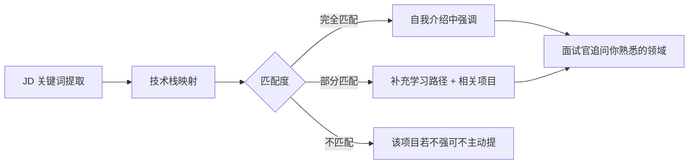

# 自我介绍

> ⭐⭐⭐⭐⭐｜难度：中级｜项目：★★★

> "面试官手里已经有你的简历了，为什么还让你做自我介绍？他不是想听你复述简历，他想看你会不会抓重点、有没有逻辑、表达能力怎么样。"

---

## 一句话总结

Self-intro is the first impression of an interview; prepare a 1-min and 3-min version with the structure "who I am -> what I know -> what I've done -> why I'm here".

面试官让你自我介绍时，他在同时做三件事：（1）给自己30秒翻一下你的简历；（2）听你的逻辑是否清晰；（3）从你的表达中找第一个追问的切入点。所以你的自我介绍不是信息的罗列，是**给面试官递话头**——你主动抛出哪些亮点，他就会顺着往下问。

---

## 核心机制

### 1. 两个版本，各自的分工

| 版本 | 时长 | 重点 | 适用场景 |
|------|------|------|----------|
| 1分钟版 | 50~70秒 | 快速建立画像：我是谁 + 什么段位 + 一个记忆点 | 一面开场、HR 轮、电话面试 |
| 3分钟版 | 2.5~3.5分钟 | 展开一个核心项目 + 技术纵深 + 动机表达 | 二面/三面、技术负责人面 |

**1分钟版的结构**（约200~250字）：

```
个人信息(姓名+年限+学历) → 技术栈标签(3~4个关键词) → 一句话项目亮点 → 求职动机
```

**3分钟版的结构**：

```
1分钟版的内容 → 展开1个STAR项目(90秒) → 技术纵深(30秒) → 求职动机(30秒)
```

核心原则：**1分钟版是名片，3分钟版是名片+说明书。** 两者必须共享同一个核心信息架构，只是颗粒度不同。面试官如果从1分钟版切换到3分钟版，不会觉得你在讲另一个人。

### 2. 为什么"一句话项目亮点"是关键

面试官一天面5~8人，到下午已经记不清谁是谁了。你必须在自我介绍的前20秒内给他一个**记忆锚点**。这个锚点不是你做的项目名称（每个候选人都做过管理系统），而是一个**带数据的成果**或**一个技术挑战的结论**。

- 差的："我在上家公司负责后台管理系统开发。"
- 好的："我在上家公司主导了后台管理系统的前端架构重构，从 Vue2 迁移到 Vue3 + TS，首屏加载从 4 秒优化到 1.2 秒，并封装了一套 30+ 业务组件的内部组件库，被 3 个以上项目复用。"

后者会让面试官在心里标记："这个人做过架构层面的东西，等一下重点问组件库封装和性能优化。"

### 3. 你必须准备的两个"自由变量"

自我介绍不是背诵，是**根据面试场景实时组装的**。你需要准备两个可以随时替换的模块：

**模块A：项目切面。** 根据你投递的岗位，有选择性地突出不同项目的某个侧面。比如投一个重交互的后台岗位，就突出组件封装和状态管理；投一个数据可视化方向的，就突出大屏适配和图表性能。

**模块B：技术栈映射。** 看一眼 JD，把你会的技术栈和对方要求的做一个心理映射表。在自我介绍时，有意识地多提对方 JD 里出现过的关键词（但不是生硬地背诵 JD）。



---

## 面试实战

### 1分钟版：填空题模板

> 下面这段是真实可用的脚本，`【】` 里的内容是你要替换的。替换完后大声读三遍，找到自然的停顿节奏，不要背得像机器人。

---

**脚本：**

"面试官你好，我叫**【你的名字】**，**【211/一本/本科】**学历，今年是前端开发的第**【3】**年。

技术栈这块主要用的是 **Vue3 + TypeScript**，搭配 Element Plus 做 UI 框架。过去两年主要在开发**【中型/大型】**后台管理系统，涉及到权限控制（RBAC）、动态路由、复杂表单和列表页这些场景。

我个人觉得最有代表性的一个项目，是把公司的一个老后台系统从 Vue2 重构到 Vue3 + TypeScript，同时抽象了一套**【30+】**的内部业务组件库，目前被**【3】**个项目在复用。这个过程中踩了不少性能优化和组件封装的坑，也沉淀了一些可以复用的方案。

这次看机会的原因主要是希望能在技术深度上再往上走一个台阶，比如前端工程化、全栈方向或者更复杂的架构设计——我看到贵司的技术栈和业务场景跟我的方向比较匹配，所以想过来聊聊。"

---

**逐句拆解：**

| 句子 | 面试官听到的心理标签 |
|------|---------------------|
| "Vue3 + TypeScript + Element Plus" | 技术栈匹配，不用重新培训 |
| "中型/大型后台管理系统" | 见过复杂业务，不是写 Demo 的 |
| "RBAC、动态路由、复杂表单" | 具体场景，不是泛泛而谈 |
| "Vue2 重构到 Vue3 + TS" | 有架构能力 |
| "30+ 组件库，3 个项目复用" | 有抽象能力，有影响力（不止自己用） |
| "技术深度、工程化、全栈" | 有上进心，方向清晰 |

### 3分钟版：在1分钟版基础上扩展

> 在1分钟版讲完后停顿半秒，观察面试官的表情。如果他在点头，说明节奏对；如果他在翻简历，说明还没找到感兴趣的点——这时候需要你主动展开。

---

**扩展段落（STAR 项目展开，约90秒）：**

"展开说一下刚才提到的重构项目。背景是这样的——当时公司的后台系统跑了将近3年，Vue2 + Vuex + JavaScript，业务逻辑混在一起，新人接手一个模块至少需要一周，编译一次要40多秒。

我发起这个重构的时候，定了三个目标：**一是**技术栈升级到 Vue3 + TS，利用类型系统减少低级 Bug；**二是**把公共逻辑拆成可复用的 hooks 和组件，降低新人的上手成本；**三是**性能优化，首屏和编译速度都要有明显提升。

我主要做了这么几件事：第一，搭建了基于 Vite 的工程脚手架，把 Webpack 切到 Vite，热更新从 5 秒降到毫秒级；第二，用 Pinia 替代 Vuex，按模块拆 Store，解决了原来 store 文件 2000 行的问题；第三，封装了一套基于 Element Plus 二次封装的业务组件，比如带权限控制的按钮组、可配置的搜索表单、批量操作的表格组件等等——每个组件向外暴露 TS 类型定义，配合 Storybook 提供文档。

最后的效果是这样的：首屏加载从 4.2 秒降到 1.2 秒，打包时间从 42 秒降到 11 秒；新人接手一个 CRUD 页面的时间从一周降到 1~2 天；组件库被其他 3 个项目接入，反馈不错。

如果说有什么遗憾——当时组件库的单元测试覆盖不够，只有几个核心组件写了测试。如果再做一次，我会从一开始就把 Vitest 配好，要求同事提交组件时附带测试用例。"

---

**技术纵深扩展（约30秒，选讲）：**

"在 Vue3 这块，我对响应式原理（Proxy vs Object.defineProperty）、Composition API 的设计思想、以及 TypeScript 的类型体操（泛型工具类型、条件类型）有一定的理解。平时写组件的时候会特别关注 TS 的类型推导是否完整、API 设计是否直觉——这些都会直接影响团队的开发体验。"

---

**为什么看机会的扩展（约20秒）：**

"上家公司技术和业务都挺稳定的，但我个人觉得 3 年左右是一个需要突破的阶段——如果一直做同质化的业务 CRUD，技术上很难再往上走。我希望下一个阶段能把精力更多放在前端基础设施、架构设计或者工程化方向上，而不仅仅是业务堆叠。"

---

### 面试信号：开场第一句就是唯一一次完全可控的机会

**面试官的第一句话几乎永远是"简单介绍下你自己"。** 这是整场面试中你唯一可以 100% 准备好的环节。如果这一分钟磕巴了，面试官的心理预期会立刻下调——他会觉得你连准备好的东西都讲不清楚，临场发挥更不靠谱。

反过来说，如果你这一分钟讲得流畅、有逻辑、有亮点，面试官的第一印象就是"这个人靠谱"，后面的追问你心理上也会更有信心。**开局决定了50%的面试走势。**

所以，面试前30分钟，不要在门口刷手机，而是把自我介绍的1分钟版和3分钟版各默念两遍，确保肌肉记忆。

---

## 易错点

1. **复述简历**：面试官手里有你的简历，你不用告诉他"我2019年毕业于XX大学，专业是XX"。他看得到。你要讲简历上没有的——为什么做这个项目、你的思考、你的收获。简历是静态的数据，自我介绍是动态的故事。

2. **流水账："我会用 Vue、React、Angular、Node.js、Docker……"** 列一堆技术名词不叫自我介绍，叫背单词。挑 3~4 个你最熟、跟岗位最相关的重点说，让面试官觉得你有深度而不是广度。

3. **话太多个人生活**："我是湖南人，大学在武汉读的，现在住浦东，平时喜欢打篮球和看动漫……"——留到破冰闲聊或反问环节再说。自我介绍的时间非常宝贵，不要浪费在简历上没有的信息上。

4. **超过3分钟**：面试官注意力最好的窗口就是前90秒。超过3分钟，他要么开始想下一个问题，要么开始走神。3分钟是硬上限，2分半是最佳长度。

5. **语速过快或过慢**：语速过快给人紧张、不自信的感觉；语速过慢给人反应慢的感觉。正常语速中文每分钟约 180~220 字，1分钟版控制在 200~250 字，读出来正好 50~70 秒。

6. **"我没什么特别突出的……"**：千万不要用谦虚做开场。面试不是谦虚的场合。你可以不说自己"最强"，但一定要说自己"最有代表性"的。每个做过2~3年的前端都有值得讲的东西，关键是选好自己的角度。

---

## 相关阅读

- [项目介绍](./project-intro.md) — 学会用 STAR 法则展开你的项目经历，这是自我介绍的核心弹药
- [优缺点](./strength-weakness.md) — 自我介绍之后常被问到，提前准备好不踩雷
- [离职原因](./leave-reason.md) — 自我介绍中"我为什么看机会"的深挖版本

---

## 更新记录

- 2026-07-05：完成内容填充（Phase 2），新增1分钟/3分钟双版本脚本模板、STAR 项目展开段落、面试信号分析、Mermaid 流程图
