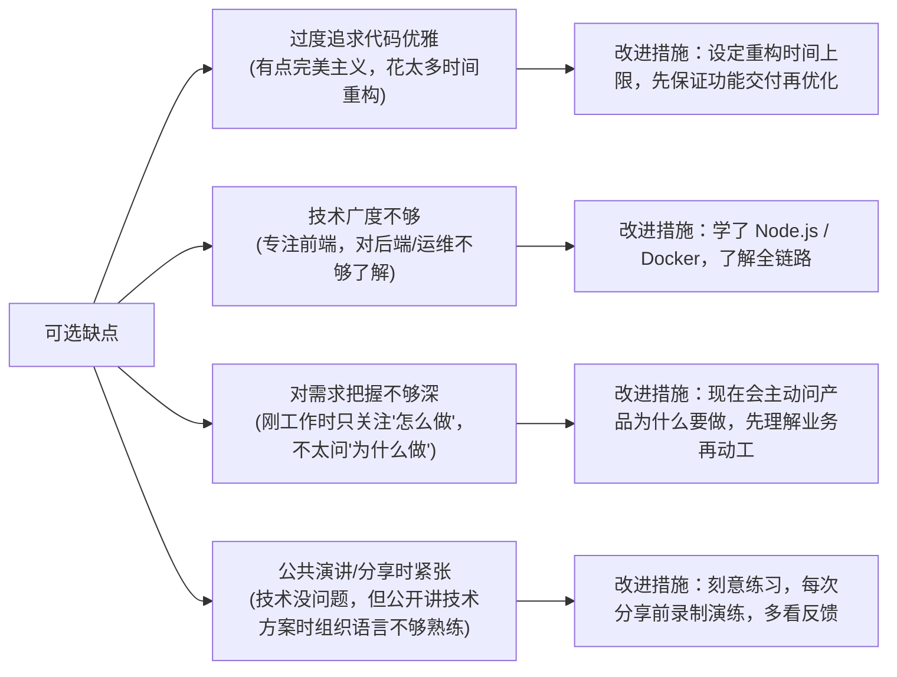

# 优缺点

> ⭐⭐⭐⭐｜难度：初级｜项目：★★★

> "优点面试官会验证——你说的每一条优点，他都会在后续的技术面中检验。缺点面试官会权衡——你说的是不是真缺点、这个缺点在他们团队里会不会是致命伤。所以两个都要'恰到好处'。"

---

## 一句话总结

Strengths must be specific + evidenced, weaknesses must be real + have improvement plan.

优缺点问题本质上考察两点：**自我认知**（你是否了解自己的长板和短板）和**成长性**（你对短板有没有行动力）。一个3年经验的开发者不应该给出"我最大的缺点是太认真"这种大一新生的回答——那说明你工作这三年根本没反思过自己。

---

## 核心机制

### 1. 优点：选什么 + 怎么证明

对中级前端来说，优点有五个高价值方向。每条优点你都需要配一个**具体的证据**——不能只扔一个形容词。

| 方向 | 优点关键词 | 1-2 句证据（必须有） | 适用场景 |
|------|-----------|---------------------|---------|
| **技术热情** | 自驱学习、关注技术动态 | "每周读 Vue 和 Vite 的 RFC，在公司内做过2次技术分享" | 团队有技术氛围、做技术产品的公司 |
| **学习能力** | 上手快、迁移能力强 | "项目从 Vue2 迁 Vue3 时，我两周内把 Composition API、Pinia、TSX 用法写成了团队指南" | 业务变化快、技术栈不固定的团队 |
| **代码质量意识** | 规范驱动、注重可维护性 | "在项目里主动推了 ESLint + Prettier + Husky + commitlint 的质量流水线，还写了团队的编码规范文档" | 有 Code Review 文化的团队 |
| **协作沟通** | 文档能力、跨职能沟通 | "跟后端对接口的时候我习惯先在 notion 上写 API 契约文档，把字段类型、边界情况都写清楚再联调，减少返工" | 前后端分离、多职能协作的项目 |
| **问题解决** | 定位快、善用工具 | "线上出 Bug 时我会先用 Sentry 看错误堆栈，结合用户操作日志复现问题，不依赖后端给接口日志" | 有线上运维责任的前端岗位 |

**选择建议：** 准备 2~3 个方向的优点，根据你面的岗位侧重不同方向。面一个有自研组件库的团队，优先说"代码质量意识"和"技术热情"；面一个业务型团队，优先说"协作沟通"和"问题解决"。

### 2. 缺点：选什么 + 怎么收回来

缺点选择有一个铁律：**必须是真的，但不能是致命的。** 对于中级前端，"致命的"是指这些：

| 致命缺点（绝对不能提） | 原因 |
|----------------------|------|
| "我代码写得不规范" | 3年了还不规范，基本素养问题 |
| "我沟通不太好" | 团队协作是大忌 |
| "我不喜欢写文档" | 中级前端的价值之一就是知识沉淀 |
| "我比较容易放弃" | 任何公司无法容忍 |
| "我总延期交付" | 基本职业素养 |

**安全的缺点选择策略：选一个当前岗位级别里"常见但不致命"的，而且你已经着手在改进的。**

对3年中级前端，这几个方向可以放心选：



### 3. 优缺点的"3+1"结构

每条标准回答应该是这个结构：

```
声明优点/缺点(1句) → 具体案例/证据(1-2句) → (如果是缺点)改进措施(1-2句)
```

---

## 面试实战

### 优点脚本 1：代码质量意识 + 工程化

> 适合：面的岗位对代码质量有要求、有 Code Review 文化、或者有自研组件库

**脚本：**

"我觉得我比较突出的一点是代码质量意识。我不是那种'功能跑通了就不管了'的人——我会很在意代码的可读性和可维护性。

举个例子：在上个项目里，我发现团队的代码风格不太统一，有的同事用 `any` 一撸到底，有的文件缩进 2 空格、有的 4 空格。我就自发搭了一套 ESLint + Prettier + Husky + commitlint 的质量流水线，把规则写到项目配置文件里，提交代码时自动检查和格式化。然后在团队周会上给大家讲了为什么要做这件事、怎么用。

推行之后效果挺明显的——Code Review 的时候不再争论格式问题了，大家的精力都集中在业务逻辑上。TypeScript 的类型覆盖率也从不到 40% 涨到了 70% 多。"

**为什么这样讲有效：**
- "功能跑通了就不管了"——先画对立面，形成反差
- "自发搭建"——主动性
- "在周会上讲"——有沟通和推动力
- 有数据（40% → 70%）——量化

---

### 优点脚本 2：技术深度 + 组件抽象能力

> 适合：面的岗位是基础设施/组件库/架构方向

**脚本：**

"我比较擅长的是组件抽象和 API 设计。我对于'这个组件怎么用起来最自然'这件事比较有感觉。

之前做组件库的时候，有一个典型的例子：很多后台页面都有一个搜索列表的交互模式——上面是搜索表单、中间是操作按钮栏、下面是分页表格。大部分项目里这个模式每次都要写 200 行左右的模板+逻辑代码。

我花了两天时间写了一个 `useTable` hook，把请求、分页、搜索、刷新、多选、导出这些动作全部内聚在一起，对外只暴露一个响应式对象。然后用它重构了一个典型页面，代码量从 200 行降到了 60 行左右。后来这个 hook 被其他同事主动用到自己的项目里，也给我提了几轮改进 PR。"

**为什么这样讲有效：**
- "API 设计"——中级前端的分水岭能力
- "200行 → 60行"——量化效果
- "同事主动用 + 提 PR"——有影响力，不是自嗨

---

### 优点脚本 3：学习能力 + 技术迁移

> 适合：面的岗位技术栈较新、需要快速学习

**脚本：**

"我觉得我的学习能力还是比较强的，尤其是从老技术栈向新技术栈迁移。我刚进上家公司的时候，项目还是 Vue2 + Vuex + JavaScript。

我当时花了两周时间，把 Vue3 的 Composition API、Pinia 的状态管理、TypeScript 的类型系统学了一遍，然后写了一个从零搭建 Vue3 + TS 项目的内部 Wiki，包括目录结构规范、TS 类型定义约定、组件封装范式等等。

后来团队做技术升级的时候，这份文档成了所有人的参考手册，至少帮团队省了两周的摸索时间。而且我发现教别人其实是巩固自己最好的方式，写文档的过程中我自己对很多概念的理解也更透彻了。"

---

### 缺点脚本 1：过度追求代码质量

> 这是一个真实且"好"的缺点——面试官听了会觉得"不是大问题，甚至有点加分"

**脚本：**

"说一个真实的缺点——我有时候在做功能的时候容易陷入'过度优化'。比如写一个组件，功能已经跑通了，但我会忍不住回头改三四遍——这里是不是该抽一个 composable、那个 Props 类型是不是可以更精确、API 命名能不能更直观……

结果就是一个小功能花的时间比预估多，虽然代码质量确实高了，但有时候对工期会有影响。后来我给自己定了一个规则：**先做到 80 分、按时交付，代码上加 `// TODO` 标记；等迭代结束后，如果还有时间，再回来做重构和优化。** 现在这个习惯改了不少，基本上能控制住了。"

**为什么这个缺点安全：**
- 本质是"太认真了"——但你说得真诚、具体、不像套话
- 有明确的改进措施（80分原则 + TODO 标记）
- 面试官心里：这是个交付意识在成长的工程师

---

### 缺点脚本 2：后端/运维知识广度不够

> 适合：前端岗位，且愿意往全栈/了解全链路方向发展

**脚本：**

"我的短板主要在后端和运维这块。以前做纯前端的时候，跟后端对接就是拿到接口文档开始写页面，不太关心接口后面发生了什么——数据库怎么设计的、服务怎么部署的、线上出问题怎么排查的。

但后来做了一次性能优化之后，我发现很多前端的问题其实根源在后端——比如列表加载慢，前端做了虚拟滚动也没用，因为接口本身返回慢，或者数据库没有加索引。

所以最近半年我业余时间在学 Node.js 和 Docker，也搭了一个简单的全栈小项目——用 NestJS 写接口 + PostgreSQL + 前端用 Vue3 对接——主要是为了理解后端的思维方式。现在跟后端同事沟通方案的时候，我更能听懂他们在说什么了。"

**为什么这个缺点安全：**
- 这是一个真实的能力边界（3年前端不会后端很正常）
- 有主动学习的行动力
- 最后一句"更能听懂"——这个缺点的改进对你的核心工作有价值

---

### 如何应对"你还有其他缺点吗？"这个连环追问

面试官如果追问，不是在刁难你，而是在试探两件事：你是否提前准备了不止一个缺点（深度准备）、以及你在压力下的反应。

**策略：提前准备 2 个缺点。** 第一个讲完带改进措施后，如果被追问第二个，就切换一个维度。比如第一个缺点讲的是"技术习惯"（过度优化），第二个就讲"软技能"（公开表达/跨团队沟通）。

> "还有一个——我刚工作的时候不太擅长在公开场合表达技术观点。比如技术评审会上我有想法，但总是犹豫要不要说，怕说错了。后来我发现这其实会影响自己的成长——你不说，别人就不会知道你的思考。所以我给自己定了小目标：每次评审会至少提一个问题，哪怕只是一个确认性质的问题。慢慢习惯了之后，现在基本敢在团队面前完整地讲自己的技术方案了。"

---

## 易错点

1. **把"我太努力了/我太追求完美了/我工作狂"当缺点**：这是老掉牙的套路，面试官一天能听到三次。他听到这句话的第一反应是"这个人不想说真实缺点"，然后在心里默默扣分。说实话，你要是真的完美主义，你怎么做到3个月不写一个单元测试的？别骗自己，也别骗面试官。

2. **选了一个致命缺点但不自知**：有些缺点在你看来是"小小的坦诚"，在面试官看来是"基本素质不过关"。简单来说，如果你的缺点可以被概括为"我不太适合在一个正常团队里工作"，那就绝对不要说。对中级前端来说，代码规范、沟通协作、责任感这三条是底线——任何一条被质疑都可能是致命伤。

3. **优点只有形容词，没有证据**："我的优点是认真负责、勤奋好学、乐于助人"——这些词放在任何岗位、任何求职者身上都合适，等于没说。每一条优点后面必须立刻跟一个**具体的故事**，让面试官能在脑子里看到一个画面。

4. **优点跟岗位不匹配**：你说你的优点是"对 Vue3 源码有深入研究"，结果面的岗位是用 React 的，这条优点对面试官来说价值直接减半。面试前看一眼 JD，选对方最在意的方向输出优点。

5. **说了缺点但没有改进措施**：这是最减分的——说明你意识到了问题但并没有行动。一个有3年经验的工程师和一个刚毕业的人的区别就在于：前者知道自己的短板而且已经着手在补，后者只是知道自己的短板。改进措施不需要多高大上，但要真实可落地。

---

## 相关阅读

- [自我介绍](./self-intro.md) — 优缺点是自我介绍之后最常见的追问，保持前后一致
- [职业规划](./career-plan.md) — 你的缺点选择应该跟职业发展方向呼应（比如想走全栈，那"后端不懂"就是合理缺点）
- [项目介绍](./project-intro.md) — 项目中的技术挑战是你"学习能力"和"问题解决"优点的最佳论据来源

---

## 更新记录

- 2026-07-05：完成内容填充（Phase 2），新增五大优点方向+证据模板、缺点安全/致命分级、3个优点脚本+2个缺点脚本+改进措施、"连环追问"应对策略、Mermaid 可选缺点流向图
