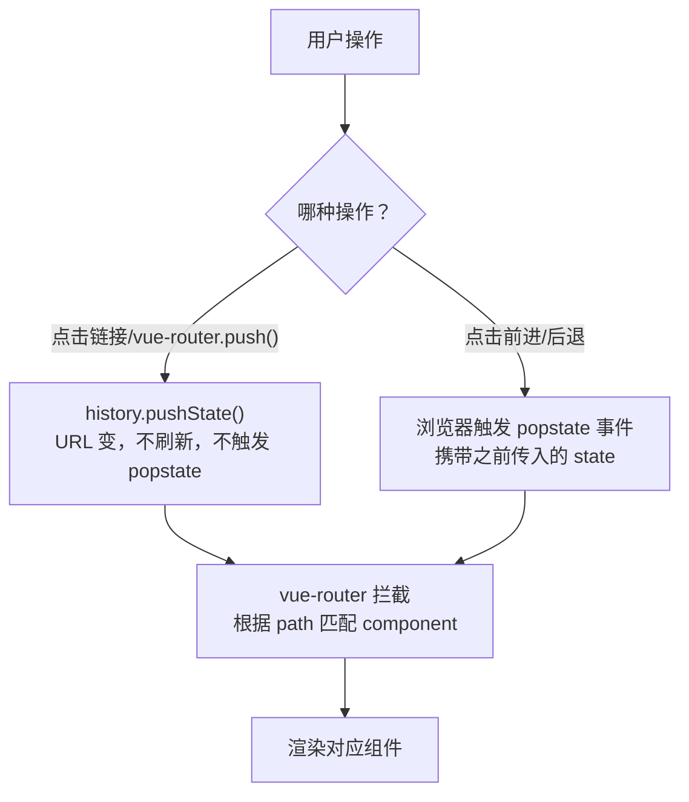

# History API 与 SPA 路由

> &#11088;&#11088;&#11088;&#11088;&#11088;｜难度：中级｜项目：&#9733;&#9733;&#9733;&#9733;

## 一句话总结

**History API 让 SPA 可以在不刷新页面的情况下改变 URL（`pushState`/`replaceState`），配合 `popstate` 监听浏览器前进后退，实现完整的前端路由——这就是 vue-router / react-router 的底层基石。**

## 核心机制

### 一、传统方式：hash（锚点）

```javascript
// URL 中的 # 及之后部分称为 hash（或 fragment）
// http://example.com/page#section1 → hash = "#section1"

// 1. 修改 hash → 不会触发页面刷新
window.location.hash = '#/user/123'

// 2. 监听 hash 变化
window.addEventListener('hashchange', (e) => {
  console.log('old:', e.oldURL)
  console.log('new:', e.newURL)
  // 根据 location.hash 渲染对应组件
})

// 3. hash 不会被发送到服务端
// 请求 http://example.com/page#/user/123
// 服务端只看到：GET /page
// #/user/123 是纯客户端行为
```

**hash 路由的优点**：兼容性完美（IE8+）、服务端无需配置、刷新不会 404。
**hash 路由的缺点**：URL 丑（带 `#`）、SEO 差（爬虫通常忽略 `#` 之后的内容）、锚点功能冲突。

### 二、现代方案：History API

```javascript
// 核心方法：history.pushState() 和 history.replaceState()

// pushState：新增一条历史记录，URL 改变但不刷新
history.pushState(
  { page: 1 },          // state 对象 —— 可通过 history.state 读取
  '',                    // title（目前浏览器都忽略这个参数）
  '/user/123'            // 新的 URL（同源限制）
)

// replaceState：替换当前历史记录，不新增
history.replaceState(
  { page: 2 },
  '',
  '/user/123/edit'
)

// popstate 事件：用户点击前进/后退按钮时触发
window.addEventListener('popstate', (e) => {
  console.log(e.state)   // pushState/replaceState 传入的 state 对象
  // 注意：pushState/replaceState 本身不触发 popstate
})
```



### 三、hash 模式 vs history 模式 —— vue-router 底层对比

```javascript
// ===== Hash 模式（createWebHashHistory）=====
// URL: http://example.com/#/user/123
// 实现核心：
window.addEventListener('hashchange', () => {
  const path = window.location.hash.slice(1) || '/'  // '/user/123'
  router.currentRoute = router.matcher.resolve(path)
})

// 手动跳转时修改 hash：
function push(path) {
  window.location.hash = path   // 修改 hash 不刷新
}

// ===== History 模式（createWebHistory）=====
// URL: http://example.com/user/123
// 实现核心：
window.addEventListener('popstate', (e) => {
  const path = window.location.pathname          // '/user/123'
  router.currentRoute = router.matcher.resolve(path)
})

// 手动跳转时 pushState：
function push(path) {
  history.pushState(null, '', path)  // 改变 URL 不刷新
  // router 自己调 resolve → 渲染组件
}
```

| 维度 | Hash 模式 | History 模式 |
|------|-----------|-------------|
| URL 外观 | `/#/user/123` | `/user/123` |
| SEO | 差（`#` 后内容被忽略） | 好（完整 URL，但需要 SSR 配合才能被爬虫真正看到） |
| 服务端配置 | 不需要（hash 不发送到服务端） | **必须配置 fallback**（否则刷新 404） |
| 锚点功能 | 冲突（`<a href="#section">` 会触发路由） | 无冲突 |
| 实现 | `hashchange` 事件 | `popstate` 事件 |
| 兼容性 | IE8+ | IE10+ |

## 深度拓展

### History 模式刷新 404 的原理和修复

```
用户访问 http://example.com/user/123 ：
1. 首次从首页进入 → 正常，SPA JS 加载后 vue-router 接管路由
2. 在 /user/123 页面刷新浏览器：
   → 浏览器向服务端发送 GET /user/123 请求
   → 服务端没有 /user/123 这个路径 → 404！
```

**修复：Nginx 配置 `try_files`**

```nginx
location / {
  try_files $uri $uri/ /index.html;
  # 1. 先尝试 $uri 对应的真实文件
  # 2. 再尝试 $uri/ 目录下的 index
  # 3. 都不存在 → 返回 /index.html（SPA 入口）
  #    vue-router 从 /index.html 启动后读到 /user/123 渲染对应组件
}
```

### `history.state` 和 `history.length`

```javascript
// state 对象 —— pushState/replaceState 的第一个参数
history.pushState({ id: 123, from: 'list' }, '', '/user/123')
console.log(history.state)  // { id: 123, from: 'list' }
// 刷新页面后 history.state 依然存在（浏览器会持久化）

// history.length —— 当前标签页的历史记录条数
console.log(history.length) // 无法被修改，只读
// 可以用来判断是否是"第一次进入页面"：
if (history.length === 1) {
  // 用户直接打开链接（新标签页），可以显示 loading 引导
}
```

### `history.scrollRestoration`

```javascript
// 浏览器默认会在前进/后退时恢复滚动位置
// 如果 SPA 自行管理滚动（如虚拟列表），需要禁用浏览器行为：
if ('scrollRestoration' in history) {
  history.scrollRestoration = 'manual'
  // vue-router 的 scrollBehavior 就是在此基础上实现的
}
```

### `history.back()` / `history.forward()` / `history.go()`

```javascript
history.back()       // 等同 history.go(-1)，等同于用户点"后退"
history.forward()    // 等同 history.go(1)
history.go(-2)       // 后退 2 步
history.go(0)        // 刷新当前页面
```

### SPA 路由的完整生命周期

```javascript
// vue-router 的导航守卫本质上是对 History API 的增强封装
router.beforeEach((to, from, next) => {
  // 1. 路由切换触发
  // 2. 被失活的组件里调用 beforeRouteLeave
  // 3. 全局 beforeEach
  // 4. 被激活的组件里调用 beforeRouteEnter
  // 5. 解析异步路由组件
  // 6. 导航被确认
  // 7. 全局 afterEach
  // 8. DOM 更新
  next()
})

// 这个流程完全建立在 pushState/replaceState/popstate 之上
// pushState 本身只改 URL，不触发任何守卫
// vue-router 在调用 pushState 前后手动触发守卫链
```

## 项目实战

### 后台管理系统的路由设计

1. **权限路由**：`router.beforeEach` 中检查 `history.state` 或 `sessionStorage` 中的 token，未登录跳转 `/login?redirect=/target-page`
2. **标签页导航**（Tab 式路由）：点击标签 `router.push()`，关闭标签 `router.replace()` 避免后退按钮回到已关闭的标签
3. **动态路由注册**（`addRoute`）：后端返回权限列表 → 前端动态 `router.addRoute()` → 已添加的路由才能通过 URL 访问
4. **history.replaceState 修复 query 参数**：列表页的筛选参数同步到 URL（`replaceState` 不产生历史记录），避免每次筛选都产生一条历史

### scrollBehavior 实现

```javascript
// vue-router 的 scrollBehavior 配置
const router = createRouter({
  history: createWebHistory(),
  scrollBehavior(to, from, savedPosition) {
    // savedPosition 仅在 popstate（前进/后退）时有值
    if (savedPosition) {
      return savedPosition          // 恢复到之前的滚动位置
    }
    if (to.hash) {
      return { el: to.hash }       // 有锚点则滚动到锚点
    }
    return { top: 0 }              // 新页面滚到顶部
  },
})
```

## 易错点

1. **`pushState` 的同源限制** —— 协议、域名、端口必须一致，否则抛出 DOMException。不同子域也不行
2. **`pushState` 不会触发 `popstate`** —— 只有用户点击前进/后退按钮（或 JS 调用 back/forward/go）才会触发 popstate。`pushState` 需要手动调用渲染逻辑
3. **Hash 模式下 `location.hash` 的 `#` 前缀** —— `location.hash` 返回值自带 `#`，解析 path 时需要 `slice(1)`
4. **history 模式下刷新 404** —— 这个不是 bug 而是设计如此，必须配置服务端 fallback
5. **state 对象大小限制** —— 不同浏览器对 `pushState` 的 state 对象有大小限制（通常 640KB），应只存关键数据（如 id、来源路由），大对象用 sessionStorage

## 面试信号表

| 面试官问 | 下一问大概率是 |
|----------|-------------|
| "vue-router 的 history 和 hash 模式有什么区别" | 追问 history 模式刷新 404 怎么解决 |
| "SPA 的路由是怎么实现的" | 追问 `popstate` 和 `hashchange` 的触发时机 |
| "如何监听 URL 变化" | 追问 `pushState` 为什么不会触发 `popstate` |
| "前进后退怎么恢复页面状态" | 追问 `history.state` 和 scrollBehavior |

## 相关阅读

- [浏览器 渲染流程](../浏览器/render-process.md)
- [Vue3 Router 原理](../Vue3/)
- [seo-ssr](./seo-ssr.md) —— history 模式与 SSR 的关系

## 更新记录

- 2026-07-09：新建（pushState/replaceState/popstate 全解 + hash vs history 底层实现对比 + 404 修复 + 项目实战）
