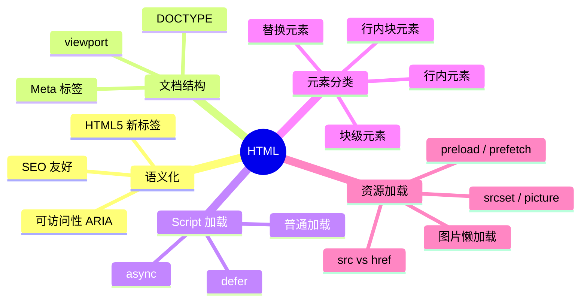

# HTML 知识地图

## 推荐学习顺序

1. ⭐⭐⭐⭐⭐ [HTML5 语义化](./html5-semantic.md)
2. ⭐⭐⭐⭐   [DOCTYPE / Meta](./doctype-meta.md)
3. ⭐⭐⭐⭐   [defer / async](./script-defer-async.md)
4. ⭐⭐⭐⭐   [块级 / 行内元素](./block-inline.md)
5. ⭐⭐⭐     [src / href](./src-href.md)
6. ⭐⭐⭐     [图片懒加载](./lazy-loading.md)

## 知识点索引

| 知识点 | 频率 | 难度 | 手写 | 状态 |
|--------|------|------|------|------|
| [HTML5 语义化](./html5-semantic.md) | ⭐⭐⭐⭐⭐ | 初级 | — | filled |
| [DOCTYPE / Meta](./doctype-meta.md) | ⭐⭐⭐⭐ | 初级 | — | filled |
| [defer / async](./script-defer-async.md) | ⭐⭐⭐⭐ | 中级 | — | filled |
| [块级 / 行内元素](./block-inline.md) | ⭐⭐⭐⭐ | 初级 | — | filled |
| [src / href](./src-href.md) | ⭐⭐⭐ | 初级 | — | filled |
| [图片懒加载](./lazy-loading.md) | ⭐⭐⭐ | 中级 | — | filled |
