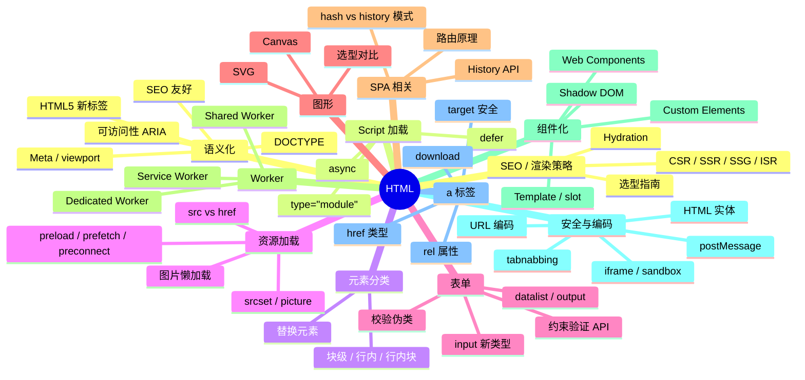

# HTML 知识地图

## 推荐学习顺序

### 一、语义与结构

1.  ⭐⭐⭐⭐⭐ [HTML5 语义化](./html5-semantic.md)
2.  ⭐⭐⭐⭐ [DOCTYPE / Meta](./doctype-meta.md)
3.  ⭐⭐⭐⭐ [块级 / 行内元素](./block-inline.md)
4.  ⭐⭐⭐ [HTML 实体与编码](./html-entities.md)

### 二、资源与加载

5.  ⭐⭐⭐⭐ [defer / async](./script-defer-async.md)
6.  ⭐⭐⭐ [src / href](./src-href.md)
7.  ⭐⭐⭐⭐ [a 标签全面解析](./a-tag.md)
8.  ⭐⭐⭐⭐⭐ [HTML5 表单与约束验证](./form-validation.md)
9.  ⭐⭐⭐⭐ [图片懒加载](./lazy-loading.md)

### 三、进阶主题

10. ⭐⭐⭐⭐ [Canvas vs SVG](./canvas-svg.md)
11. ⭐⭐⭐⭐⭐ [History API 与 SPA 路由](./history-api.md)
12. ⭐⭐⭐⭐ [iframe](./iframe.md)
13. ⭐⭐⭐⭐ [Web Worker](./web-worker.md)
14. ⭐⭐⭐ [Web Components](./web-components.md)
15. ⭐⭐⭐⭐⭐ [SEO / SSR / CSR / Hydration](./seo-ssr.md)
16. ⭐⭐⭐⭐ [可访问性 ARIA](./accessibility.md)
17. ⭐⭐⭐ [响应式图片/Resource Hints](./responsive-images-resource-hints.md)

## 知识点索引

| 知识点 | 频率 | 难度 | 状态 |
|--------|------|------|------|
| [HTML5 语义化](./html5-semantic.md) | ⭐⭐⭐⭐⭐ | 初级 | filled |
| [DOCTYPE / Meta](./doctype-meta.md) | ⭐⭐⭐⭐ | 初级 | filled |
| [块级 / 行内元素](./block-inline.md) | ⭐⭐⭐⭐ | 初级 | filled |
| [defer / async](./script-defer-async.md) | ⭐⭐⭐⭐ | 中级 | filled |
| [src / href](./src-href.md) | ⭐⭐⭐ | 初级 | filled |
| [a 标签全面解析](./a-tag.md) | ⭐⭐⭐ | 初级 | drafted |
| [HTML 实体与编码](./html-entities.md) | ⭐⭐⭐ | 初级 | drafted |
| [HTML5 表单与约束验证](./form-validation.md) | ⭐⭐⭐⭐⭐ | 中级 | drafted |
| [图片懒加载](./lazy-loading.md) | ⭐⭐⭐ | 中级 | filled |
| [Canvas vs SVG](./canvas-svg.md) | ⭐⭐⭐⭐ | 中级 | drafted |
| [History API 与 SPA 路由](./history-api.md) | ⭐⭐⭐⭐⭐ | 中级 | drafted |
| [iframe](./iframe.md) | ⭐⭐⭐⭐ | 中级 | drafted |
| [Web Worker](./web-worker.md) | ⭐⭐⭐⭐ | 高级 | drafted |
| [Web Components](./web-components.md) | ⭐⭐⭐⭐ | 高级 | drafted |
| [SEO / SSR / CSR / Hydration](./seo-ssr.md) | ⭐⭐⭐⭐⭐ | 高级 | filled |

## 相关阅读

- [面试题库：HTML](../面试题库/HTML.md) — 15 道 HTML 高频真题

## 更新记录

- 2026-07-12：学习顺序三组分类（语义与结构/资源与加载/进阶主题）
- 2026-07-05：初始创建
