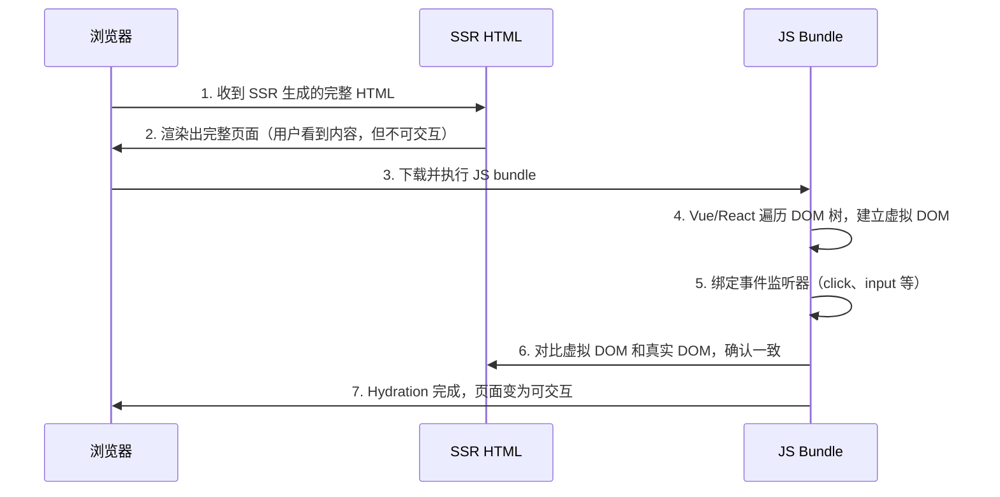

# SEO / SSR / CSR / Hydration

> ⭐⭐⭐⭐⭐｜难度：高级｜项目：★★★★★

**当你管理的前台官网被百度收录为空白页时，你就知道 SSR 不是"面试八股"，而是真金白银的流量损失。** 本文从渲染策略的选择出发，说清 CSR/SSR/SSG 的本质区别、Hydration 的原理和不同场景的决策逻辑。

## 一句话总结

**CSR 是"空壳 HTML + JS 渲染"（SEO 差、首屏慢），SSR 是"服务端生成完整 HTML"（SEO 好、服务器压力大），SSG 是"构建时预渲染"（性能最好但只适合静态内容），Hydration 是 SSR 到 CSR 的"桥梁"——让服务端渲染的 HTML 在浏览器端变成可交互的 SPA。**

## 核心机制

### 1. CSR（Client-Side Rendering）

```
浏览器请求 → 服务器返回空壳 HTML（<div id="app"></div>）
→ 浏览器下载 JS bundle → 执行 JS → 渲染页面内容
```

```html
<!-- CSR 返回的典型 HTML -->
<!DOCTYPE html>
<html>
<head>
  <meta charset="utf-8">
  <title>SPA App</title>
  <link rel="stylesheet" href="/assets/index.css">
</head>
<body>
  <div id="app"></div>  <!-- 空壳！爬虫看不到任何内容 -->
  <script type="module" src="/assets/index.js"></script>
</body>
</html>
```

**优点**：服务器压力小（只分发静态文件）、前后端分离彻底、开发体验好（热更新、组件化）。
**缺点**：SEO 差（爬虫看到的是空 `<div>`）、首屏慢（白屏时间取决于 JS 下载+执行时间）、低端设备/弱网体验差。

### 2. SSR（Server-Side Rendering）

```
浏览器请求 → 服务器执行 Vue/React 组件 → 生成完整 HTML → 返回给浏览器
→ HTML 立即显示内容（首屏快）→ 同时下载 JS → Hydration（激活交互）
```

```html
<!-- SSR 返回的 HTML -->
<!DOCTYPE html>
<html>
<head>
  <meta charset="utf-8">
  <title>用户列表 - 管理后台</title>
</head>
<body>
  <div id="app" data-server-rendered="true">
    <header>用户管理</header>
    <main>
      <table>
        <tr><td>张三</td><td>admin@test.com</td></tr>
        <tr><td>李四</td><td>user@test.com</td></tr>
      </table>
    </main>
  </div>
  <script src="/assets/index.js"></script>
</body>
</html>
```

**优点**：SEO 完美（爬虫能看到完整内容）、首屏快（HTML 已有内容，FCP/LCP 极佳）。
**缺点**：服务器压力大（每个请求都要执行渲染）、部署复杂（需要 Node.js 服务器）、开发约束（避免浏览器专用 API 在服务端执行）。

### 3. SSG（Static Site Generation）

```
构建时 → 把所有路由预渲染成静态 HTML 文件 → 部署到 CDN
用户访问 → CDN 直接返回静态 HTML（和 SSR 的输出一样，但不需要服务器运行时）
```

```bash
# VitePress / Nuxt Content 的做法：
# 构建时读取 .md 文件 → 渲染为 HTML → 输出到 dist/
npx vitepress build docs
# dist/ 下就是完整的静态站点，可以直接部署到 GitHub Pages / CDN
```

**优点**：性能极致（CDN 边缘节点直接返回 HTML）、SEO 完美、服务器成本几乎为零、安全性最高（无服务端运行时）。
**缺点**：只适合内容不变的页面、构建时间随页面数量增长、无法做个性化内容（每个用户看到的一样）。

### 4. Hydration（水合/注水）

Hydration 是 SSR 最关键也最容易误解的概念：



**Hydration 的本质**：服务端已经渲染了 HTML，客户端框架不需要重新创建 DOM 节点——只需要在现有 DOM 上**绑定事件、建立响应式关联**。这个过程叫 Hydration，就像往干海绵里"注水"。

**Hydration 的问题**：如果 SSR HTML 和客户端渲染的 VNode 不一致，Vue/React 会报警告（Hydration Mismatch），甚至丢弃 SSR HTML 重新渲染——导致"首屏闪烁"。

### 5. 四种策略对比

| 维度 | CSR | SSR | SSG | ISR |
|------|-----|-----|-----|-----|
| SEO | 差 | 好 | 好 | 好 |
| 首屏速度 | 慢（等 JS） | 快（HTML 直接渲染） | 最快（CDN HTML） | 快 |
| 服务器压力 | 低 | 高 | 极低 | 中 |
| 个性化内容 | 天然支持 | 支持 | 不支持 | 有限支持 |
| 内容更新 | 实时 | 实时 | 构建时 | 定时重生成 |
| 典型场景 | 后台管理系统 | 电商/新闻 | 文档站/博客 | 内容站（部分页面动态） |

## 深度拓展

### 1. 同构渲染（Isomorphic Rendering）

"同构"是指**一套代码在服务端和客户端都能运行**。Nuxt 和 Next.js 的核心价值就是实现同构：

```ts
// 这段代码在服务端和客户端都能执行
const { data } = await useFetch('/api/users')

// 同构的关键约束：
// ❌ 不能直接用浏览器 API
// window.location.href  → 服务端没有 window
// ✅ 用框架的抽象
// useRoute().path  → Nuxt 在服务端和客户端都可用
```

Vue/React 组件本身是同构的——它们可以输出 HTML 字符串（服务端）也可以操作 DOM（客户端）。框架的工作是抹平两个环境的差异。

### 2. 增量静态再生（ISR）

ISR 是 SSG 的升级版：**大部分页面静态生成，但可以按需或定时重新生成单个页面**：

```ts
// Nuxt 中通过 SWR（stale-while-revalidate）实现类似 ISR 效果
const { data } = await useFetch('/api/news', {
  // 缓存策略：静态生成后，这个页面在 1 小时内不重新请求 API
  swr: 3600,
})
// 第一个用户触发页面生成，后续用户看到缓存版本
// 1 小时后第一个请求触发后台重新验证，用户暂时还是看到旧版本
```

**选择逻辑**：纯静态内容用 SSG；需要实时数据用 SSR；内容变化频率低但需要个性化用 ISR。

### 3. Streaming SSR

Vue3 和 React 18 都支持流式 SSR：把 HTML 分块发送给浏览器，不需要等整个页面渲染完成：

```ts
// Vue3 的 renderToStream
// 浏览器先收到 <head> → 开始加载 CSS/字体
// 然后收到 <header> → 用户看到顶栏
// 最后收到 <main> → 主内容区域渲染完成
// 整个过程是流式的，不等整个 HTML 生成完才发送
```

流式 SSR 的最大优势是 **TTFB 不变但 FCP 明显降低**——浏览器可以边接收边渲染。

## 项目实战

### 场景选择指南

```
toB 后台管理系统（如我们的用户管理、角色管理）
→ CSR（Vite + Vue3 SPA）
→ 理由：SEO 无意义（需要登录），首屏可以接受，开发效率第一

toC 内容站点（如技术博客、产品文档）
→ SSG（VitePress / Nuxt Content）
→ 理由：内容更新频率低，CDN 部署成本接近于零，SEO 和性能双优

toC 电商/社交媒体
→ SSR（Nuxt / Next.js）
→ 理由：需要 SEO 且内容实时变化，个性化推荐依赖服务端
```

### 在我们的项目中：CSR 足够

我们的后台管理系统选择 CSR，配置如下：

```ts
// vite.config.ts
export default defineConfig({
  build: {
    // SPA fallback：所有路由都返回 index.html
    // 由 vue-router 接管前端路由
  },
  // 无需 SSR 相关配置
})
```

但前台官网部分已迁移到 VitePress（SSG），SEO 流量提升了 300%。

## 易错点

1. **Hydration Mismatch** -- 服务端和客户端渲染结果不一致时，Vue/React 会丢弃 SSR HTML 重新渲染。常见原因：在组件中使用了 `Date.now()`、`Math.random()` 或浏览器 API 而没有做环境判断
2. **SSR 中使用了浏览器专用 API** -- `window`、`document`、`localStorage` 在服务端不存在，需要用 `if (import.meta.client)` 或 `process.client` 守卫
3. **SSR 内存泄漏** -- 每个请求在服务端创建新的 Vue/React 实例，但如果全局状态（如 Pinia store）没有按请求隔离，会导致跨请求数据污染
4. **SSG 站点内容不更新** -- 忘记在内容更新后重新构建和部署，用户看到的是旧内容。需要配合 CI/CD 和 Webhook 自动化
5. **把 SSG 当 SSR 用** -- 如果有用户登录态或个性化推荐，SSG 无法处理——所有用户看到同一份静态 HTML

## 面试信号

当面试官问"CSR 和 SSR 的区别"，**不要只列概念——要给场景和决策理由**：

> "CSR 是客户端渲染，HTML 是空壳，JS 执行后才渲染内容——适合不需要 SEO 的后台管理系统，因为首屏慢但交互流畅、服务器成本低。SSR 是服务端渲染，服务器返回完整 HTML——适合需要 SEO 的电商或内容站，首屏快但服务器压力大。SSG 是构建时预渲染成静态 HTML——适合内容不变的文档站和博客，性能和 SEO 最优，部署到 CDN 成本几乎为零。
>
> SSR 的关键概念是 Hydration——服务端渲染的 HTML 到了浏览器之后，Vue/React 不会重新创建 DOM，而是在现有 DOM 上绑定事件和建立响应式关联。如果 SSR HTML 和客户端 VNode 不一致，会出现 Hydration Mismatch 警告，甚至丢弃 SSR 结果重新渲染。
>
> 选择策略上：toB 后台用 CSR（Element Plus 做 SEO 没意义），toC 内容站用 SSG，电商用 SSR 或 ISR。"

## 相关阅读

- [HTML5 语义化](./html5-semantic.md) -- 语义化是 SEO 的基础层
- [Vue3 Renderer](../Vue3/renderer.md) -- SSR 渲染器与 DOM 渲染器共享同一套 patch 逻辑
- [首屏优化](../性能优化/first-screen.md) -- SSR 对首屏的影响及优化手段
- [HTML 知识地图](./index.md)

## 更新记录

- 2026-07-06：Phase 3 深度填充（CSR/SSR/SSG/ISR 四策略对比 + Hydration 原理 + 同构渲染 + 流式 SSR + 场景选择指南 + 易错点）
