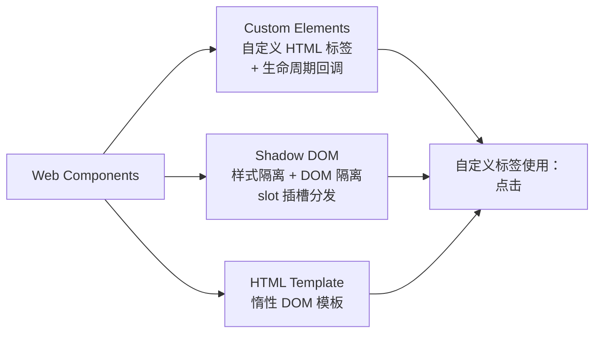

# Web Components

> &#11088;&#11088;&#11088;&#11088;｜难度：高级&#9733;&#9733;

## 一句话总结

**Web Components = Custom Elements（自定义 HTML 标签）+ Shadow DOM（样式/逻辑隔离）+ `<template>`（内容模板），三者组合让浏览器原生支持组件化——不依赖任何框架。**

## 核心机制

### 三大技术标准



### 一、Custom Elements

```javascript
// 1. 定义一个自定义元素
class UserCard extends HTMLElement {
  // 监听的属性列表（只有列表中的属性变化才会触发 attributeChangedCallback）
  static get observedAttributes() {
    return ['name', 'avatar', 'role']
  }

  constructor() {
    super()  // 必须首先调用 super()
    // 在 constructor 中只做初始化，不要操作 DOM 或属性
    this._internals = this.attachInternals?.()  // 表单关联（实验性）
  }

  // 元素被插入 DOM 时调用 —— 初始渲染、事件绑定放这里
  connectedCallback() {
    this.render()
  }

  // 元素被移出 DOM 时调用 —— 清理定时器、取消事件监听
  disconnectedCallback() {
    clearInterval(this._timer)
  }

  // 元素被移动到新文档时调用（如 iframe 之间移动）
  adoptedCallback() {
    console.log('移动到新文档')
  }

  // observedAttributes 中的属性变化时调用
  attributeChangedCallback(name, oldValue, newValue) {
    if (oldValue === newValue) return
    this.render()
  }

  render() {
    this.innerHTML = `
      <div class="card">
        
        <h3>${this.getAttribute('name') || '未知'}</h3>
        <span>${this.getAttribute('role') || '员工'}</span>
      </div>
    `
  }
}

// 注册自定义元素（名称必须包含连字符 `-`）
customElements.define('user-card', UserCard)

// 2. 使用（就像普通 HTML 标签一样）
// <user-card name="张三" avatar="/avatar.png" role="前端工程师"></user-card>

// 3. JS 操作
const card = document.querySelector('user-card')
card.setAttribute('name', '李四')       // 自动触发 attributeChangedCallback
card.remove()                          // 自动触发 disconnectedCallback
```

**自定义元素的两种类型**：

```javascript
// 类型 1：继承 HTMLElement（完全自定义）
class MyComponent extends HTMLElement { /* ... */ }
customElements.define('my-component', MyComponent)

// 类型 2：继承内置元素（扩展原生标签）
class MyButton extends HTMLButtonElement {
  connectedCallback() {
    this.addEventListener('click', () => {
      console.log('自定义按钮被点击')
    })
  }
}
customElements.define('my-button', MyButton, { extends: 'button' })
// 使用：<button is="my-button">扩展原生按钮</button>
// ⚠️ Safari 不支持继承内置元素，Apple 明确拒绝实现
```

### 二、Shadow DOM

Shadow DOM 是 Web Components **样式隔离**的核心：

```javascript
class StyledCard extends HTMLElement {
  constructor() {
    super()
    // 创建 Shadow DOM 根节点
    const shadow = this.attachShadow({ mode: 'open' })
    // mode: 'open'  → 外部可通过 element.shadowRoot 访问
    // mode: 'closed' → 外部无法访问（element.shadowRoot === null）
    //                    但 JS 沙箱逃逸后仍可访问，不是安全隔离

    // Shadow DOM 内的样式不会泄露到外部，外部样式也不会影响内部
    shadow.innerHTML = `
      <style>
        /* 这个 h1 样式只在 Shadow DOM 内生效，不会影响页面其他 h1 */
        h1 { color: var(--card-color, #3451b2); font-size: 18px; }
        /* :host 指向 Shadow DOM 的宿主元素（即 <styled-card> 本身） */
        :host { display: block; border: 1px solid #eee; border-radius: 8px; padding: 16px; }
        :host(:hover) { box-shadow: 0 2px 8px rgba(0,0,0,0.1); }
        /* :host-context 根据宿主祖先状态调整样式 */
        :host-context(.dark-mode) { background: #1a1a1a; color: white; }
        /* ::slotted 给通过 slot 传入的内容添加样式 */
        ::slotted(span) { font-weight: bold; }
      </style>
      <h1>卡片标题</h1>
      <slot name="header">默认头部</slot>
      <slot>默认内容（匿名 slot）</slot>
      <slot name="footer">默认底部</slot>
    `
  }
}
customElements.define('styled-card', StyledCard)
```

```html
<!-- 使用 -->
<styled-card style="--card-color: #f56c6c">
  <span slot="header">自定义头部</span>
  <p>卡片主体内容 —— 会落入匿名 slot</p>
  <div slot="footer">自定义底部</div>
</styled-card>

<!-- Shadow DOM 外部样式无法穿透：
     styled-card h1 { color: green !important; }   ← 无效！
     但 CSS 变量可以穿透 Shadow DOM 边界：
     styled-card { --card-color: #67c23a; }        ← 有效！
-->
```

**Shadow DOM 的边界规则**：

| 能否穿透 | CSS | JS |
|---------|-----|-----|
| 外部 → 内部 | ❌ 样式隔离（选择器无法穿透）<br>✅ CSS 变量/继承属性可穿透 | `mode='open'` 时可通过 `el.shadowRoot` 访问 |
| 内部 → 外部 | ❌ `:host` / `:host-context` 只能控制宿主 | 可以（事件冒泡被 retarget，但 `composed: true` 可穿透） |

### 三、HTML Template

```html
<!-- <template> 的内容不会被渲染、不会执行脚本、不会加载资源 -->
<template id="card-tpl">
  <style>
    .card { border: 1px solid #eee; padding: 16px; }
  </style>
  <div class="card">
    <h3 class="name"></h3>
    <p class="desc"></p>
  </div>
</template>
```

```javascript
class TemplateCard extends HTMLElement {
  connectedCallback() {
    const tpl = document.getElementById('card-tpl')
    // 克隆模板内容（深拷贝），true 表示递归克隆子节点
    const clone = tpl.content.cloneNode(true)
    clone.querySelector('.name').textContent = this.getAttribute('name')
    clone.querySelector('.desc').textContent = this.getAttribute('desc')
    this.appendChild(clone)
  }
}
customElements.define('template-card', TemplateCard)
```

**模板的 `slot` 机制**：需要配合 Shadow DOM 使用，内容从 Light DOM（用户提供的 DOM）投射到 Shadow DOM 中预定义的 `<slot>` 位置。

## 深度拓展

### Web Components vs Vue/React 组件

| 维度 | Web Components | Vue/React |
|------|---------------|-----------|
| 依赖 | **浏览器原生，零依赖** | 框架运行时 |
| 跨框架 | **天然跨框架**（任何框架都能用） | 需要封装（如 `@vue/composition-api`） |
| 响应式 | 需手动实现（attributeChangedCallback） | 框架内置（ref/reactive/state） |
| 模板语法 | 无（手动操作 DOM） | JSX / SFC template |
| SSR | 原生不支持（需 Declarative Shadow DOM） | 框架级支持 |
| 生态 | 弱（Lit 是主要增强库） | 极强（组件库、工具链） |
| 适用场景 | 跨框架共享的基础 UI 组件 | 应用级开发 |

### 事件模型的 retarget 行为

```javascript
// Shadow DOM 内的事件冒泡到外部时，event.target 会被 retarget
// 指向宿主元素（Shadow DOM 的边界），而不是内部的真实元素

// Shadow DOM 内部：
shadow.innerHTML = `<button id="inner-btn">点我</button>`
shadow.querySelector('#inner-btn').addEventListener('click', (e) => {
  console.log(e.target)  // <styled-card> —— 被 retarget 了！
})

// 获取真实 target：
console.log(e.composedPath()[0])  // <button id="inner-btn">
// composedPath() 不受 retarget 影响，返回完整的事件路径

// 控制是否穿透 Shadow DOM：
// 普通事件（如 click）：默认 composed: true（会冒泡穿透）
// 自定义事件：默认 composed: false（不会穿透），需显式设置
this.dispatchEvent(new CustomEvent('my-event', {
  bubbles: true,
  composed: true,  // ✅ 允许穿透 Shadow DOM
}))
```

### 微前端的 Web Components 方案

wujie（腾讯）和 micro-app（京东）的底层都依赖了 Web Components 的隔离能力：

```
wujie 的隔离思路：
  iframe（JS 硬隔离）
  + Web Component Shadow DOM（CSS 隔离）
  + proxy 将 iframe 的 DOM 渲染到主应用的 Web Component 中

  用户代码看到的是一个 <wujie-app> 自定义标签，
  内部 Shadow DOM 包裹着子应用的完整 DOM 结构，
  子应用的样式永远不会泄露到主应用。
```

## 易错点

1. **`constructor` 中不能操作 DOM/属性** —— 在 `constructor` 中 `this.setAttribute()` 或 `this.innerHTML` 会抛 DOMException。初始化逻辑放 `connectedCallback`
2. **自定义元素名称必须包含连字符 `-`** —— 这是 HTML 规范强制要求，为了不与现有/未来的原生标签冲突
3. **`attributeChangedCallback` 的触发时机** —— 只有在 `observedAttributes` 中声明的属性才触发。`data-*` 属性也需要显式声明
4. **Shadow DOM 的样式隔离不是安全边界** —— `mode: 'closed'` 仍然有办法绕过。Shadow DOM 是封装工具，不是安全沙箱
5. **表单参与** —— 自定义元素默认不参与原生表单（不包含在 `FormData` 中）。需要通过 `ElementInternals` API（`attachInternals`）或隐藏的原生 `<input>` 来实现

## 面试信号表

| 面试官问 | 下一问大概率是 |
|----------|-------------|
| "用过 Web Components 吗" | 追问 Shadow DOM 的样式隔离原理 |
| "Vue/React 组件和 Web Components 有什么区别" | 追问什么时候应该用 Web Components |
| "微前端怎么实现 CSS 隔离" | 追问 Shadow DOM 的 `::slotted` 和 `:host` |
| "slot 的工作原理" | 追问 Light DOM 和 Shadow DOM 的关系 |

## 相关阅读

- [iframe](./iframe.md) —— 微前端的 iframe 方案
- [HTML5 语义化](./html5-semantic.md) —— 语义化标签 vs 自定义标签
- [Vue3 渲染器原理](../Vue3/renderer.md)

## 更新记录

- 2026-07-09：新建（Custom Elements 生命周期 + Shadow DOM 样式隔离 + Template 克隆 + 事件 retarget + 微前端方案对比）
