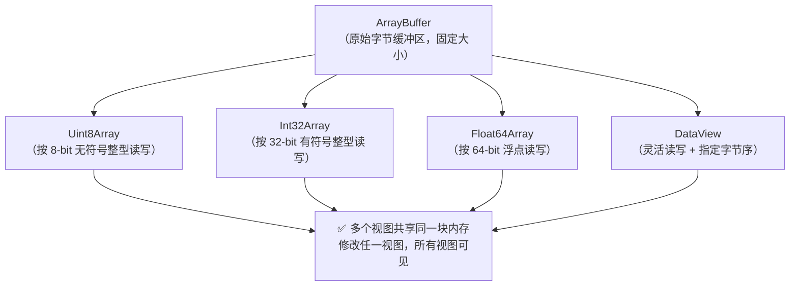

# ArrayBuffer / TypedArray

> &#11088;&#11088;&#11088;｜难度：高级&#9733;&#9733;&#9733;

## 一句话总结

**ArrayBuffer 是堆外内存中的一块"原始字节"，TypedArray 是操作这块字节的"视图"（按不同数据类型读写），DataView 是更灵活的"自定义视图"（可指定字节序）。** 这套体系是 Web 处理二进制数据的基石——文件上传、WebSocket 消息、音视频编解码、WebGL 数据传输都离不开它。

## 核心机制

### 三件套的关系：缓冲-视图-数据



**一句话**：ArrayBuffer = 买了一块地（原始内存），TypedArray = 用不同尺子量这块地（不同数据类型视角），DataView = 万能尺（可以任意位置任意类型读，还能指定大小端）。

### ArrayBuffer — 不能直接操作

```js
// ArrayBuffer 只是一段固定大小的连续内存
const buf = new ArrayBuffer(16)  // 16 字节
console.log(buf.byteLength)      // 16

// ❌ 不能直接读写
// buf[0] = 1  // 无效

// ✅ 必须通过 TypedArray 或 DataView
const view = new Uint8Array(buf)
view[0] = 255
view[1] = 128
console.log([...view])  // [255, 128, 0, 0, 0, 0, 0, 0, 0, 0, 0, 0, 0, 0, 0, 0]
```

### TypedArray — 11 种视图类型

| 类型 | 字节数 | 范围 | C 语言对应 |
|------|--------|------|-----------|
| `Int8Array` | 1 | -128 ~ 127 | `int8_t` |
| `Uint8Array` | 1 | 0 ~ 255 | `uint8_t` |
| `Uint8ClampedArray` | 1 | 0 ~ 255（钳制） | — |
| `Int16Array` | 2 | -32768 ~ 32767 | `int16_t` |
| `Uint16Array` | 2 | 0 ~ 65535 | `uint16_t` |
| `Int32Array` | 4 | -2^31 ~ 2^31-1 | `int32_t` |
| `Uint32Array` | 4 | 0 ~ 2^32-1 | `uint32_t` |
| `Float32Array` | 4 | IEEE 754 单精度 | `float` |
| `Float64Array` | 8 | IEEE 754 双精度 | `double` |
| `BigInt64Array` | 8 | -2^63 ~ 2^63-1 | `int64_t` |
| `BigUint64Array` | 8 | 0 ~ 2^64-1 | `uint64_t` |

**`Uint8ClampedArray` 的特殊之处**：溢出时"钳制"到 0~255 范围，专门用于 Canvas 像素数据：

```js
const clamped = new Uint8ClampedArray(2)
clamped[0] = 300    // → 255（钳制）
clamped[1] = -50    // → 0（钳制）

// vs 普通 Uint8Array：溢出会截断
const normal = new Uint8Array(2)
normal[0] = 300     // → 44（300 % 256）
normal[1] = -50     // → 206（-50 → 256-50）
```

### DataView — 需要控制字节序时用它

```js
const buf = new ArrayBuffer(8)
const view = new DataView(buf)

// setInt32(byteOffset, value, littleEndian)
view.setInt32(0, 0x12345678, false)  // 大端：12 34 56 78
view.setInt32(0, 0x12345678, true)   // 小端：78 56 34 12

// 读取时也可指定字节序
console.log(view.getInt32(0, false))  // 0x12345678（大端）
console.log(view.getInt32(0, true))   // 0x78563412（小端）

// 任意位置读写任意类型
view.setUint8(4, 42)                  // 在第 5 个字节位置写一个字节
```

**DataView vs TypedArray 的选择**：TypedArray 用于同类数据（如音频采样、像素值），DataView 用于混合数据（如网络协议头部，包含不同大小的字段）。

## 深度拓展

### TypedArray 与普通 Array 的关键区别

```js
const arr = [1, 2, 3]
const typed = new Uint8Array([1, 2, 3])

// 1. 长度固定
arr.push(4)           // ✅ [1, 2, 3, 4]
typed.push(4)         // ❌ TypeError: typed.push is not a function

// 2. 元素类型固定
arr[0] = 'hello'      // ✅ [1, 2, 3] → ['hello', 2, 3]
typed[0] = 'hello'    // → 0（字符串被转成 0）
typed[0] = 3.14       // → 3（浮点被截断为整数）

// 3. 初始化行为不同
new Array(5)          // [empty × 5]（稀疏）
new Uint8Array(5)     // [0, 0, 0, 0, 0]（全部初始化为 0）

// 4. .sort() 行为不同
new Uint8Array([3, 1, 2]).sort()         // [1, 2, 3]（数字排序）
[3, 1, 2].sort()                           // [1, 2, 3]（默认按字符串！）

// 5. .subarray() vs .slice()
// typed.subarray(begin, end) → 共享同一 ArrayBuffer 的视图（零拷贝）
// arr.slice(begin, end)      → 新数组（深拷贝）
const src = new Uint8Array([1, 2, 3, 4, 5])
const sub = src.subarray(1, 4)  // 视图 [2, 3, 4]
sub[0] = 99
console.log(src)                  // [1, 99, 3, 4, 5]  ← 原数组也被修改！
```

### 字节序（Endianness）—— 面试加分项

```
数值 0x12345678 在内存中的两种表示：

大端（Big Endian）：高位字节在低地址   →  12 34 56 78
小端（Little Endian）：低位字节在低地址 →  78 56 34 12

x86/ARM（绝大多数 CPU）用 小端
网络协议（TCP/IP）用 大端（所以叫"网络字节序"）
```

```js
// 检测本机字节序
const isLittleEndian = new Uint8Array(
  new Uint32Array([0x12345678]).buffer
)[0] === 0x78
```

## 项目实战

### 1. 大文件分片上传 —— ArrayBuffer 切片

```ts
// 用 Blob.slice() 或 File.slice() 分片（底层 ArrayBuffer 零拷贝）
const CHUNK_SIZE = 5 * 1024 * 1024  // 5MB

async function uploadFile(file: File) {
  const chunks = Math.ceil(file.size / CHUNK_SIZE)
  for (let i = 0; i < chunks; i++) {
    const start = i * CHUNK_SIZE
    const end = Math.min(start + CHUNK_SIZE, file.size)
    const chunk = file.slice(start, end)  // Blob，底层共享 ArrayBuffer

    const formData = new FormData()
    formData.append('file', chunk, file.name)
    formData.append('chunk', String(i))
    formData.append('chunks', String(chunks))

    await api.uploadChunk(formData)
  }
  await api.mergeChunks({ filename: file.name, chunks })
}
```

### 2. 计算文件 MD5（SparkMD5 + ArrayBuffer）

```ts
import SparkMD5 from 'spark-md5'

// 大文件逐块读入 ArrayBuffer 计算 hash，不阻塞主线程
function computeFileHash(file: File): Promise<string> {
  return new Promise((resolve) => {
    const spark = new SparkMD5.ArrayBuffer()
    const reader = new FileReader()
    let offset = 0
    const CHUNK = 2 * 1024 * 1024  // 2MB

    reader.onload = (e) => {
      spark.append(e.target!.result as ArrayBuffer)
      offset += CHUNK
      if (offset < file.size) readNext()
      else resolve(spark.end())  // 返回 MD5 hex
    }

    function readNext() {
      reader.readAsArrayBuffer(file.slice(offset, offset + CHUNK))
    }
    readNext()
  })
}
```

### 3. Canvas 像素操作 —— Uint8ClampedArray

```ts
// 图片灰度化：直接操作 Canvas 像素数据
function toGrayscale(canvas: HTMLCanvasElement) {
  const ctx = canvas.getContext('2d')!
  const imageData = ctx.getImageData(0, 0, canvas.width, canvas.height)
  const pixels = imageData.data  // Uint8ClampedArray [R,G,B,A, R,G,B,A, ...]

  for (let i = 0; i < pixels.length; i += 4) {
    const gray = pixels[i] * 0.299 + pixels[i + 1] * 0.587 + pixels[i + 2] * 0.114
    pixels[i] = gray       // R
    pixels[i + 1] = gray   // G
    pixels[i + 2] = gray   // B
    // A 不变
  }

  ctx.putImageData(imageData, 0, 0)
}
```

### 4. WebSocket 二进制消息解析

```ts
// 用 DataView 解析自定义二进制协议
ws.onmessage = (event) => {
  const buf = await event.data.arrayBuffer()
  const view = new DataView(buf)

  // 协议格式：[1B type][4B bodyLength][N B body]
  const type = view.getUint8(0)           // 消息类型
  const length = view.getUint32(1, false) // 体长度（大端）
  const body = new Uint8Array(buf, 5, length)

  switch (type) {
    case 0x01: handleText(body); break
    case 0x02: handleBinary(body); break
  }
}
```

### 5. SharedArrayBuffer —— 跨线程共享内存

```ts
// SharedArrayBuffer 允许 Worker 和主线程操作同一块内存
// 配合 Atomics 实现无锁同步
const sharedBuf = new SharedArrayBuffer(1024)
const sharedArr = new Int32Array(sharedBuf)

// Worker 中
Atomics.add(sharedArr, 0, 1)     // 原子 +1
Atomics.notify(sharedArr, 0, 1)  // 通知主线程

// 主线程
Atomics.wait(sharedArr, 0, 0)    // 阻塞等待变化

// ⚠️ 需要 COOP/COEP 头才能使用（安全策略限制）
```

## 易错点

1. **TypedArray 长度不可变** —— 没有 `push`/`pop`/`splice`，需要变长得创建新的然后复制
2. **TypedArray 的 `sort()` 是数字排序** —— `[3, 1, 11].sort()` → `[1, 11, 3]`（字符串排序），但 `new Uint8Array([3, 1, 11]).sort()` → `[1, 3, 11]`（数字排序）
3. **`subarray()` 共享内存** —— 修改子视图会影响原 ArrayBuffer，和普通数组 `slice()` 完全不同
4. **类型溢出静默截断** —— `new Uint8Array(1)[0] = 300` → `44`，不会报错
5. **SharedArrayBuffer 有安全限制** —— 需要 `Cross-Origin-Opener-Policy` 和 `Cross-Origin-Embedder-Policy` 头

## 面试信号表

| 面试官问 | 下一问大概率是 |
|----------|-------------|
| "ArrayBuffer 和 TypedArray 什么关系" | 追问为什么不直接操作 ArrayBuffer |
| "文件上传怎么处理大文件" | 追问 Blob.slice 底层和 ArrayBuffer 的关系 |
| "知道 WebSocket 怎么发二进制数据吗" | 追问 DataView 字节序 / 网络字节序 |
| "TypedArray 和普通数组有什么区别" | 追问 subarray 共享内存 / 类型固定 |
| "Canvas 像素操作用过吗" | 追问 ImageData.data 是什么类型（Uint8ClampedArray） |

## 相关阅读

- [Set / Map / WeakMap](./set-map-weakmap.md)
- [文件上传](../项目实战/业务场景/file-upload.md)
- [大文件上传](../项目实战/业务场景/big-file-upload.md)
- [WebSocket 实战](../项目实战/业务场景/websocket.md)

## 更新记录

- 2026-07-07：新建（ArrayBuffer/TypedArray/DataView 三件套 + 字节序 + 5 个项目实战）
