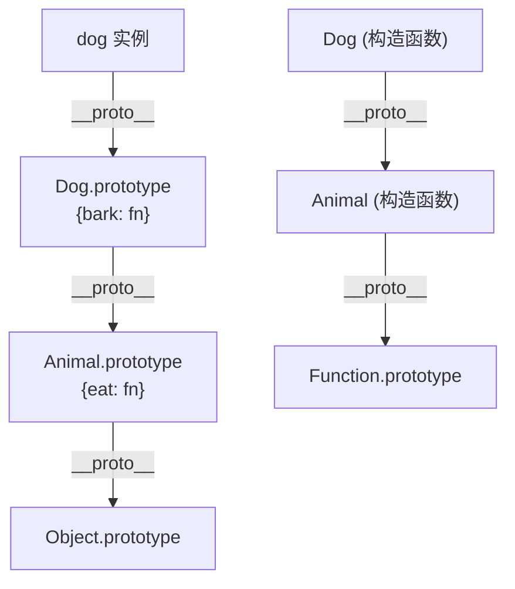

# class / extends / super

> &#11088;&#11088;&#11088;&#11088;&#11088;｜难度：中级&#9733;&#9733;

## 一句话总结

**class 本质是原型链继承的语法糖——`class A extends B` 编译后做的事只有两件：`A.prototype.__proto__ = B.prototype`（实例方法继承）和 `A.__proto__ = B`（静态方法继承）。理解了这个等式，所有 class 相关的面试题都迎刃而解。**

## 核心机制

### class 本质 = 构造函数 + 原型方法

```javascript
// ES6 class 写法
class Person {
  constructor(name) {
    this.name = name
  }
  sayHi() {
    console.log(`Hi, I'm ${this.name}`)
  }
  static create(name) {
    return new Person(name)
  }
}

// 等价的 ES5 写法
function Person(name) {
  this.name = name
}
Person.prototype.sayHi = function() {
  console.log("Hi, I'm " + this.name)
}
Person.create = function(name) {
  return new Person(name)
}

// 验证等价性
typeof Person            // 'function' —— class 本质上还是函数
typeof Person.prototype  // 'object'
Person.prototype.constructor === Person  // true
```

**关键差异**——class 不只是语法糖，它还做了三件 ES5 做不到的保护：

| 差异 | ES6 class | ES5 function |
|------|-----------|-------------|
| 必须 new | `Person()` → TypeError | `Person()` → 返回 undefined（严格模式）或 this=window |
| 不可枚举 | 原型方法默认不可枚举 | 需要 `Object.defineProperty` |
| 暂时性死区 | class 声明会提升但进入 TDZ（声明前访问报 ReferenceError） | function 声明会提升且可立即使用 |
| 内部标记 | `[[IsClassConstructor]]` 为 true | 无 |

### extends —— 继承的本质

```javascript
class Dog extends Animal {
  constructor(name, breed) {
    super(name)     // 必须先调 super()，否则 this 不存在
    this.breed = breed
  }
  bark() {
    console.log('Woof!')
  }
}
```

**extends 在底层做了两件事**：

```javascript
// 1. 实例方法继承：Dog.prototype.__proto__ = Animal.prototype
//    → dog.bark() 在自己身上找不到 → 找 Dog.prototype → 找 Animal.prototype
Object.setPrototypeOf(Dog.prototype, Animal.prototype)

// 2. 静态方法继承：Dog.__proto__ = Animal
//    → Dog.create() 在自己身上找不到 → 找 Animal.create()
Object.setPrototypeOf(Dog, Animal)

// 完整的原型链：
// dog → Dog.prototype → Animal.prototype → Object.prototype → null
// Dog → Animal → Function.prototype → Object.prototype → null
```



### super —— 三个角色

```javascript
class Dog extends Animal {
  constructor(name, breed) {
    // 1. super() 作为函数调用 —— 调用父类 constructor
    //    = Animal.call(this, name)
    //    必须在使用 this 之前调用
    super(name)
    this.breed = breed
  }

  eat(food) {
    // 2. super.method() 作为对象 —— 调用父类原型上的方法
    //    = Animal.prototype.eat.call(this, food)
    super.eat(food)
  }

  static create(name) {
    // 3. super 在静态方法中 —— 调用父类的静态方法
    return super.create(name)
  }
}
```

**`super()` 的内部步骤**：
1. 调用 `ParentClass.call(this, ...args)`
2. 返回的 `this` 是子类的实例（`this instanceof Dog === true`）
3. **必须先 super() 再访问 this**——因为子类没有自己的 `this` 对象，它继承父类的 `this` 然后扩展。这和 ES5 相反——ES5 是先创建子类实例，再"借"父类构造函数修饰它

## 深度拓展

### 继承内置类型——一个经典陷阱

```javascript
// ❌ ES5 方式继承 Array —— 无法正常工作
function MyArray() {
  Array.apply(this, arguments)
}
MyArray.prototype = Object.create(Array.prototype)
const arr = new MyArray(1, 2, 3)
arr.length  // 0  —— 不是 3！因为 Array 构造函数内部创建了一个新的 exotic object
arr.map(x => x * 2)  // [] —— 空的

// ✅ ES6 extends 正确处理了内置类型的继承
class MyArray extends Array {}
const arr2 = new MyArray(1, 2, 3)
arr2.length  // 3
arr2.map(x => x * 2)  // MyArray(3) [2, 4, 6]
```

**原因**：ES6 class extends 使用 `Reflect.construct`，它能正确处理内置类型的内部槽（internal slots）。`Array` 有一个 `[[DefineOwnProperty]]` 内部方法，ES5 的 `apply` 无法触发它来正确更新 `length`。

### new.target

```javascript
class Animal {
  constructor() {
    console.log(new.target)  // 指向实际被 new 的构造函数
    if (new.target === Animal) {
      throw new Error('Animal 不能直接实例化')
    }
  }
}
class Dog extends Animal {}
new Dog()   // new.target = Dog，通过检查
new Animal() // new.target = Animal，抛异常 —— 相当于"抽象类"
```

### 私有字段 `#`

```javascript
class Counter {
  #count = 0  // 真正的私有——外部完全无法访问

  increment() {
    this.#count++
  }

  get value() {
    return this.#count
  }
}
const c = new Counter()
c.#count  // SyntaxError —— 语法层面就拒绝访问
```

和 TypeScript `private` 的区别：TS private 只在编译时检查——运行时仍可访问。`#` 是语言级的，JS 引擎强制执行。

## 项目实战

### 后台管理系统中 class 的正确打开方式

1. **API 层封装**：用 class 封装带拦截器的请求类——构造函数初始化 baseURL/token，方法返回 Promise。比函数式好的一点是——实例可以持有状态（token、重试次数），不需要闭包传参
2. **不要用 class 组织 Vue 组件逻辑**——Vue3 的 Composition API 用 hook 函数（`useTable`、`useForm`）比 class 自然得多。class 的 `this` 绑定和响应式系统有摩擦
3. **class 适合简单的数据模型**：`class User { constructor(dto) { ... } }` 做前端 ORM 式的数据转换，比在组件里手写 map 干净

## 易错点

1. **`super()` 必须在使用 `this` 之前** —— 这是硬限制。`constructor() { this.name = 'x'; super() }` → ReferenceError
2. **class 声明不会提升** —— `new Foo()` 在 `class Foo {}` 声明之前 → ReferenceError。和 function 的提升行为完全不同
3. **class 中的方法没有自己的 `this`** —— 把方法单独提取出来调用，`this` 变成 undefined（class 内部默认严格模式）。React 的老大难问题 `this.handleClick = this.handleClick.bind(this)` 根源在此
4. **`extends` 之后 prototype 和 `__proto__` 都要继承** —— 只设 `prototype` 不设构造函数之间的 `__proto__` 就会丢失静态方法。这一条面试中考得最多

## 面试信号表

| 面试官问 | 下一问大概率是 |
|----------|-------------|
| "class 是语法糖吗" | 追问 class 和 ES5 构造函数的三点差异（new 强制/不可枚举/提升） |
| "extends 的内部机制" | 追问 `Dog.__proto__ === Animal` 和 `Dog.prototype.__proto__ === Animal.prototype` |
| "super 的原理" | 追问为什么 super() 之前不能访问 this |
| "class 和 TypeScript class 有什么区别" | 追问 `#` 私有字段和 `private` 的运行时差异 |

## 相关阅读

- [原型链](./prototype-chain.md)
- [this](./this.md)
- [new](./new.md)
- [call / apply / bind](./call-apply-bind.md)
- [TypeScript 泛型](../TypeScript/generics.md)

## 更新记录

- 2026-07-10：新建（class 本质 + extends 原型链双设 + super 三角色 + 内置类型继承 + 私有字段）
