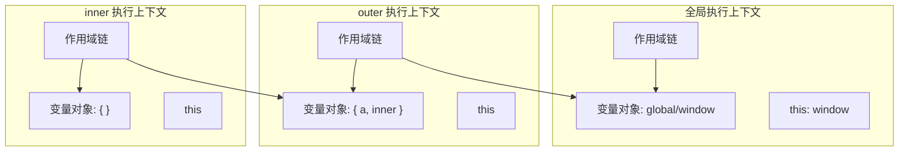

# 闭包

> &#11088;&#11088;&#11088;&#11088;&#11088;｜难度：中级｜项目：&#9733;&#9733;&#9733;

## 一句话总结

**闭包是函数记住并访问其词法作用域的能力，即使函数在其词法作用域之外执行**。这句话的关键是"记住" -- 内部函数会保存对外部变量的引用，让外部变量不会在函数执行完后被垃圾回收。

## 核心机制

### 为什么会有闭包？ -- 从执行上下文说起

每次函数调用都会创建一个**执行上下文（Execution Context）**，其中包含：



```ts
function outer() {
  const a = 1 // ① a 在 outer 的变量对象里
  function inner() {
    console.log(a) // ② inner 的作用域链引用了 outer 的变量对象
  }
  return inner
}

const fn = outer() // ③ outer 执行完，按理说 a 应该被回收
fn() // ④ 但 1 打印出来了 -- a 还活着，这就是闭包
```

**原理**：inner 函数内部属性 `[[Environment]]` 持有了 outer 的变量对象引用，即使 outer 执行完退出调用栈，这个引用还在，所以 GC 不会回收 outer 的变量对象。

### 闭包不一定会导致内存泄漏

这是最大的误解。闭包只是**保留了变量引用**，如果这些变量确实是程序需要的，那就不算泄漏。只有当闭包引用了不需要的变量、且闭包本身没有被释放时，才算浪费：

```ts
// 合理的闭包 — 防抖中的 timer 是我们需要保留的状态
function debounce(fn, delay) {
  let timer = null // timer 需要被"记住"，这是故意的
  return function (...args) {
    clearTimeout(timer)
    timer = setTimeout(() => fn.apply(this, args), delay)
  }
}

// 不必要的保留 — 闭包捕获了整个大对象，但只用了一个字段
function createHandler(bigObject) {
  return function () {
    console.log(bigObject.name) // bigObject 整个被保留，即使只用 name
  }
}
```

## 深度拓展

### 经典面试题：for 循环 + setTimeout

```ts
for (var i = 1; i <= 5; i++) {
  setTimeout(() => console.log(i), i * 1000)
}
// 输出：6 6 6 6 6 — 为什么？
// 因为 var i 在全局作用域，循环结束时 i = 6，5 个回调共享同一个 i
```

**let 为什么能解决？** let 有块级作用域，每次循环迭代创建一个新的绑定：

```ts
for (let i = 1; i <= 5; i++) {
  setTimeout(() => console.log(i), i * 1000)
}
// 输出：1 2 3 4 5 — 每次迭代的 i 是独立的
```

本质区别：var 是同一个变量有 5 个闭包；let 是 5 个变量各有 1 个闭包。

### 追问：闭包和模块模式的关系

模块模式的本质就是用闭包创建私有变量：

```ts
// IIFE 模块模式 — 2000-2015 年的标准做法
const CounterModule = (function () {
  let count = 0 // 私有变量，外部无法直接访问
  return {
    increment() { return ++count },
    decrement() { return --count },
    getCount() { return count },
  }
})()
// CounterModule.count // undefined — 外部访问不到
// CounterModule.getCount() // 0 — 通过闭包暴露的接口操作
```

ES Module 看起来没有 IIFE，但每个模块文件就是一个闭包 -- 模块内的变量默认是私有的，只有 export 的才能被外部访问。

### React hooks 本质就是闭包

```ts
function useCounter(initial = 0) {
  const [count, setCount] = useState(initial)
  // 每个渲染周期的 count 和 setCount 都被闭包"记住"
  useEffect(() => {
    // 这里的 count 是闭包捕获的当前渲染周期的值
    document.title = `Count: ${count}`
  }, [count])
  return { count, setCount }
}
```

这也是"stale closure"（过期闭包）问题的根源 -- 当 useEffect 的依赖数组没包含某个变量时，闭包捕获的就是旧值。解决方法是在依赖数组中明确声明所有闭包引用的变量，或使用 `useRef` 存储最新值（`.current` 不受闭包快照的影响）。

## 项目实战

### 1. Vue3 composable 的返回值本质就是闭包

```ts
// composables/useTable.ts — 项目中自动拆出来的逻辑
export function useTable<T>(fetchFn: () => Promise<T[]>) {
  const data = ref<T[]>([])
  const loading = ref(false)
  const error = ref<string | null>(null)

  async function loadData() {
    loading.value = true
    error.value = null
    try {
      data.value = await fetchFn()
    } catch (e) {
      error.value = (e as Error).message
    } finally {
      loading.value = false
    }
  }

  return { data, loading, error, loadData }
  // 这四个值和函数通过闭包共享同一个"作用域气泡"
  // 调用方解构出来的 data.value 能实时反应 loadData 的更新
}
```

Vue3 的 `ref` 和 `reactive` 本身就是闭包的巧妙运用 -- 内部维护的值对外不透明，通过 `.value` 的 getter/setter 暴露。

### 2. watch 的回调就是闭包

```ts
// 项目的搜索面板中使用
const keyword = ref("")
watch(keyword, (newVal) => {
  // 回调函数"记住"了 keyword 对应的响应式依赖
  // Vue 内部通过闭包追踪哪些响应式值被回调引用了
  if (newVal.length >= 2) {
    fetchSearchResults(newVal)
  }
})
```

### 3. useRequest hook 中的 loading/error 状态

```ts
// 项目封装的通用请求 hook
export function useRequest<T>(requestFn: () => Promise<T>) {
  const loading = ref(false)
  const data = shallowRef<T>()
  const error = shallowRef<Error>()

  // run 闭包捕获了这三个 ref
  async function run() {
    loading.value = true
    try {
      data.value = await requestFn()
      error.value = undefined
    } catch (e) {
      error.value = e as Error
    } finally {
      loading.value = false
    }
  }
  return { loading, data, error, run }
}
```

## 易错点

1. **闭包一定导致内存泄漏** -- 闭包只是保留引用，只有不需要的引用没被释放才算泄漏；V8 对短生命周期闭包有优化
2. **只有 return 函数才是闭包** -- 只要内部函数被外部引用就行：`setTimeout` 的回调、事件监听器、Promise.then 都是闭包
3. **Vue3 setup 中没有闭包** -- setup 函数的整个作用域就是一个巨大的闭包，所有在模板中使用的变量都被闭包捕获
4. **闭包里的变量是快照** -- 不是快照，是**引用**变量本身；如果变量被重新赋值，闭包看到的是最新值
5. **循环中创建闭包一定有问题** -- 只有 var 在循环中共享作用域才有问题，let 和 forEach 都天然隔离

## 面试信号表

| 面试官问 | 下一问大概率是 |
|----------|-------------|
| "闭包是什么" | 手写一个利用闭包的例子 |
| "手写完" | 追问内存泄漏场景 + 为什么 let 解决循环问题 |
| "let 为什么能解决" | 块级作用域 + TDZ |
| "闭包的实际应用" | 模块模式、柯里化、React/Vue hooks |

## 相关阅读

- [上一篇](./this.md)
- [下一篇](./promise.md)
- [this](./this.md)
- [防抖 / 节流](./debounce-throttle.md)
- [Promise](./promise.md)

## 更新记录

- 2026-07-05：Phase 2 深度填充（执行上下文模型 + 经典面试题 + Vue3 composable 实战 + Mermaid）
