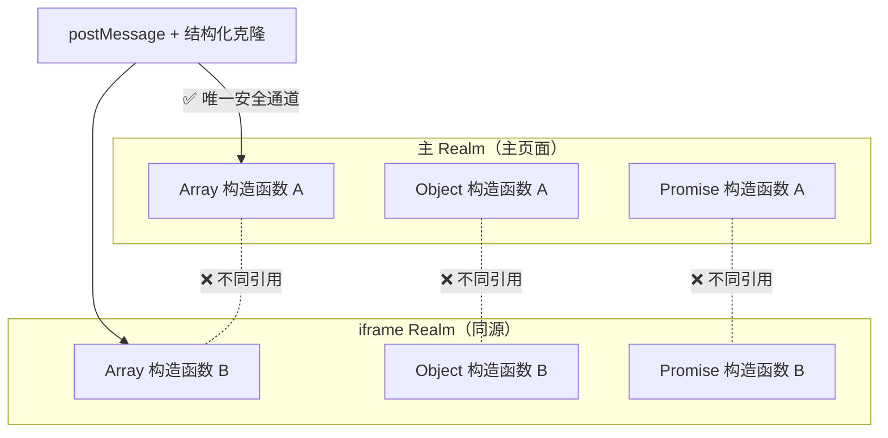

# 跨 Realm 场景

> &#11088;&#11088;&#11088;｜难度：高级｜项目：&#9733;&#9733;&#9733;

## 一句话总结

**每个 iframe / Worker / VM 沙箱都是一个独立的 Realm（全局执行环境），拥有自己的一套内置构造函数（Array、Object、Promise 等）。跨 Realm 通信时，`instanceof` 会失效、对象引用不能共享、只能通过 `postMessage` 的结构化克隆传递数据。** 微前端、Web Worker、同源 iframe 通信全是这个问题的变形。

## 核心机制

### 什么是 Realm



每个 Realm 包含：
- 独立的全局对象（`window` / `self`）
- 独立的内置构造函数原型链
- 独立的事件循环（同进程内共享线程）

**关键后果**：一个 Realm 里的 `Array` 构造函数和另一个 Realm 里的 `Array` 构造函数是**两个完全不同的对象**。

### instanceof 跨 Realm 失效 —— 最经典的坑

```js
// 主页面
const iframe = document.querySelector('iframe')
const iframeArray = iframe.contentWindow.Array
const arr = new iframeArray(1, 2, 3)

arr instanceof Array            // ❌ false！（iframe 的 Array ≠ 主页面的 Array）
Array.isArray(arr)              // ✅ true（规范层面的判断，跨 Realm 安全）

// 同理
iframe.contentWindow.Object !== Object   // true
iframe.contentWindow.Promise !== Promise // true
```

**原理**：`instanceof` 沿着原型链向上查找，检查 `Array.prototype` 是否在链上。iframe 的 `Array.prototype` 和主页面的 `Array.prototype` 是两个不同的对象，所以 `instanceof` 返回 `false`。

### 跨 Realm 安全的类型判断

```js
// ❌ 不安全（跨 Realm）
function isArray(val) { return val instanceof Array }
function isPromise(val) { return val instanceof Promise }
function isDate(val) { return val instanceof Date }
function isError(val) { return val instanceof Error }

// ✅ 跨 Realm 安全（使用 Object.prototype.toString）
function isArray(val) { return Object.prototype.toString.call(val) === '[object Array]' }
function isPromise(val) { return Object.prototype.toString.call(val) === '[object Promise]' }
function isDate(val) { return Object.prototype.toString.call(val) === '[object Date]' }
function isError(val) { return Object.prototype.toString.call(val) === '[object Error]' }

// ✅ 更简单：内置的跨 Realm 安全方法
Array.isArray(val)              // 专门为跨 Realm 设计
Number.isNaN(val)               // 比 isNaN 更严格
Number.isFinite(val)
```

### Symbol.toStringTag —— 自定义类型标识

```js
// 普通对象可被伪装成 Array
const fakeArr = {
  [Symbol.toStringTag]: 'Array',
  length: 0
}
Object.prototype.toString.call(fakeArr)  // '[object Array]'
Array.isArray(fakeArr)                   // false（Array.isArray 检查内部 [[ArrayData]]，无法伪装）

// 自定义类的跨 Realm 类型判断
class MyComponent {
  get [Symbol.toStringTag]() { return 'MyComponent' }
}
Object.prototype.toString.call(new MyComponent())  // '[object MyComponent]'
```

## 深度拓展

### postMessage 的结构化克隆 —— 能传什么、不能传什么

```js
// iframe 或 Worker 通信
const iframe = document.querySelector('iframe')

// ✅ 能被结构化克隆的类型（自动深拷贝，不共享引用）
iframe.contentWindow.postMessage({
  str: 'hello',          // 字符串
  num: 42,               // 数字
  bool: true,            // 布尔
  arr: [1, 2, 3],        // 数组
  obj: { a: 1 },         // 普通对象
  date: new Date(),      // Date
  regex: /test/g,        // 正则
  map: new Map([[1, 2]]),// Map
  set: new Set([1, 2]),  // Set
  buf: new ArrayBuffer(8),// ArrayBuffer / TypedArray
  blob: new Blob(['x']), // Blob / File
})

// ❌ 不能被结构化克隆
iframe.contentWindow.postMessage({
  fn: () => {},          // ❌ 函数
  el: document.body,     // ❌ DOM 节点
  err: new Error('x'),   // ❌ Error 对象（浏览器差异大）
  sym: Symbol('x'),      // ❌ Symbol
  weak: new WeakMap(),   // ❌ WeakMap / WeakSet
})

// ❌ Transferable：转移所有权（零拷贝），原对象变为不可用
const buf = new ArrayBuffer(1024 * 1024)  // 1MB
worker.postMessage({ buf }, [buf])        // buf 的所有权转移给 worker
console.log(buf.byteLength)               // 0（已转移，主线程不可再访问）
```

### structuredClone() —— 跨 Realm 安全的深拷贝

```js
// 比 JSON.parse(JSON.stringify()) 更强：支持循环引用、Date、Map、Set、ArrayBuffer 等
const obj = { a: 1, date: new Date(), map: new Map([[1, 2]]) }
obj.self = obj  // 循环引用

const cloned = structuredClone(obj)
// ✅ cloned.date 是真正的 Date 而非字符串
// ✅ cloned.map 是真正的 Map 而非空对象
// ✅ 循环引用被正确处理

// ❌ structuredClone 的限制（和 postMessage 一致）
structuredClone({ fn: () => {} })     // ❌ DataCloneError
structuredClone(document.body)        // ❌ DataCloneError
```

### 微前端中的跨 Realm 问题

```js
// qiankun / Module Federation / iframe 方案都面临这个问题
// 场景：子应用的 Array 实例被传到基座

// 问题 1：共享全局状态
// 子应用的 store 中的数组，传到基座后 instanceof 失效
// 解决：统一用 Array.isArray()，避免 instanceof

// 问题 2：事件对象跨 Realm
window.addEventListener('message', (e) => {
  // e 是 MessageEvent，但来源 iframe 的 MessageEvent 可能不同
  console.log(e instanceof MessageEvent)  // 可能为 false（不同 Realm）
})

// 问题 3：错误对象跨 Realm
try {
  iframe.contentWindow.eval('throw new Error("子应用错误")')
} catch (e) {
  console.log(e instanceof Error)  // ❌ 可能为 false
  // 安全判断：用 duck typing
  console.log(e && typeof e.message === 'string')  // ✅
}
```

### Web Worker 中的 Realm 隔离

```js
// Worker 是完全独立的 Realm
// main.js
const worker = new Worker('worker.js')
const sharedArr = [1, 2, 3]
worker.postMessage(sharedArr)       // ❌ 不可以！结构化克隆会复制一份
// worker 收到的 sharedArr 是副本，修改不影响主线程

// 正确做法：用 SharedArrayBuffer（需 COOP/COEP 头）
const sab = new SharedArrayBuffer(1024)
const view = new Int32Array(sab)
worker.postMessage(sab)      // ❌ 也不能直接传 SharedArrayBuffer（仍会被结构化克隆）

// 必须用 transfer 方式
worker.postMessage(sab)      // 这样也不行，需要显式 transfer：
// worker.postMessage(sab)   // → 实际会结构化克隆
// 正确方式：
// 实际上 postMessage 的第二个参数才能 transfer：
// worker.postMessage(sab, [sab])
```

## 项目实战

### 微前端子应用错误捕获

```ts
// qiankun 场景：子应用的 Error 传到基座后 instanceof Error = false
export function normalizeError(err: unknown): Error {
  // 跨 Realm 安全的 Error 判断
  if (err instanceof Error) return err

  // 来自 iframe 的 Error 对象，原型链断了
  if (
    typeof err === 'object' &&
    err !== null &&
    'message' in err &&
    'stack' in err
  ) {
    const error = new Error((err as any).message)
    error.stack = (err as any).stack
    error.name = (err as any).name || 'Error'
    return error
  }

  return new Error(String(err))
}
```

### 跨 iframe 类型安全工具函数

```ts
// utils/cross-realm.ts — 项目中的跨 Realm 安全工具
const toString = Object.prototype.toString

export const isArray = Array.isArray  // 直接用内置方法，天然跨 Realm 安全

export function isObject(val: unknown): val is Record<string, unknown> {
  return toString.call(val) === '[object Object]'
}

export function isDate(val: unknown): val is Date {
  return toString.call(val) === '[object Date]'
}

export function isPromise(val: unknown): val is Promise<unknown> {
  // 不能用 instanceof，跨 Realm 失效
  // 用 duck typing：有 then 方法就认为是 thenable
  return (
    !!val &&
    (typeof val === 'object' || typeof val === 'function') &&
    typeof (val as any).then === 'function'
  )
}

export function isRegExp(val: unknown): val is RegExp {
  return toString.call(val) === '[object RegExp]'
}

export function isMap(val: unknown): val is Map<unknown, unknown> {
  return toString.call(val) === '[object Map]'
}

export function isSet(val: unknown): val is Set<unknown> {
  return toString.call(val) === '[object Set]'
}
```

## 易错点

1. **用 `instanceof` 做微前端/iframe 的类型判断** —— 跨 Realm 必定失效，用 `Array.isArray()` 或 `Object.prototype.toString.call()`
2. **用 `constructor` 属性判断类型** —— 和 `instanceof` 一样的问题，每个 Realm 的 `constructor` 不同
3. **postMessage 传引用类型以为能共享** —— 结构化克隆是**深拷贝**，修改不会双向同步
4. **误以为 `structuredClone` 能克隆函数/DOM** —— 不能，和 postMessage 一样的限制
5. **在 Worker 中直接访问 DOM / window** —— Worker 是完全独立的 Realm，没有 DOM API

## 面试信号表

| 面试官问 | 下一问大概率是 |
|----------|-------------|
| "iframe 间怎么通信" | 追问 postMessage 的限制（哪些类型不能传） |
| "`Array.isArray()` 和 `instanceof Array` 区别" | 追问为什么会有 `Array.isArray`（跨 Realm 需要） |
| "微前端遇到过什么坑" | 跨 Realm 的 instanceof 失效 + 解决方案 |
| "深拷贝怎么实现" | 追问 `structuredClone` 比 JSON 强在哪里 + 局限 |

## 相关阅读

- [原型链](./prototype-chain.md) —— instanceof 底层查的是原型链
- [微前端概述](../微前端/overview.md)
- [qiankun](../微前端/qiankun.md)
- [Web Worker](../浏览器/web-worker.md)

## 更新记录

- 2026-07-07：新建（Realm 概念 + instanceof 失效 + 结构化克隆 + 微前端/Worker 实战）
