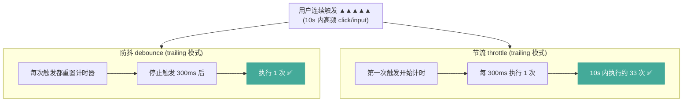

# 防抖 / 节流

> &#11088;&#11088;&#11088;｜难度：初级｜项目：&#9733;&#9733;&#9733;

## 一句话总结

**防抖是"等你停下来再执行"（连续触发只执行最后一次），节流是"每隔一段时间执行一次"（连续触发按固定频率执行）。** 两者都用于控制高频事件的执行频率，核心都是用闭包保存定时器状态。

## 核心机制

### 一张图说清楚区别



**防抖（debounce）**：从最后一次触发开始计时，延迟 N 毫秒后执行。如果期间再次触发，重新计时。

**节流（throttle）**：每隔 N 毫秒执行一次，不管触发多频繁。就像水龙头节流阀 -- 不管你拧多快，流量都是固定的。

### 防抖的两种模式

```ts
// trailing 模式（默认）：停止触发后才执行
// 场景：搜索框输入 → 用户停止输入 300ms 后发请求
const search = debounce((keyword: string) => {
  fetch(`/api/search?q=${keyword}`)
}, 300)

// leading 模式：第一次触发立即执行，后面忽略
// 场景：表单提交按钮 → 点第一下就提交，后续 2000ms 内再点无效
const submit = debounce(() => {
  api.submitForm(formData)
}, 2000, { leading: true, trailing: false })
```

### 节流的两种实现方式

```ts
// 方式 1：时间戳实现（第一次立即执行，最后一次不执行）
function throttle(fn: Function, delay: number) {
  let lastTime = 0
  return function (this: any, ...args: any[]) {
    const now = Date.now()
    if (now - lastTime >= delay) {
      fn.apply(this, args)
      lastTime = now
    }
  }
}

// 方式 2：定时器实现（第一次不立即执行，最后一次会执行）
function throttle(fn: Function, delay: number) {
  let timer: ReturnType<typeof setTimeout> | null = null
  return function (this: any, ...args: any[]) {
    if (timer) return
    timer = setTimeout(() => {
      fn.apply(this, args)
      timer = null
    }, delay)
  }
}
```

面试时写哪种看面试官要什么效果。实际项目一般用**时间戳 + 定时器结合的版本**，同时支持 leading 和 trailing。

## 手写实现

### 完整 debounce（含 leading + trailing + cancel）

```ts
interface DebounceOptions {
  leading?: boolean   // 是否在触发开始时立即执行
  trailing?: boolean  // 是否在触发结束后执行
  // TODO: maxWait 实现 — 最大等待时间（不管触发多频繁，最多等 N ms 一定执行）
}

function debounce<T extends (...args: any[]) => any>(
  fn: T,
  delay: number,
  options: DebounceOptions = {}
): { (...args: Parameters<T>): void; cancel: () => void; flush: () => void } {
  const { leading = false, trailing = true } = options
  let timer: ReturnType<typeof setTimeout> | null = null
  let lastCallTime = 0
  let lastInvokeTime = 0
  let lastArgs: Parameters<T> = [] as any
  let lastThis: any = undefined

  function invoke(thisArg: any, args: Parameters<T>) {
    fn.apply(thisArg, args)
    lastInvokeTime = Date.now()
  }

  function debounced(this: any, ...args: Parameters<T>) {
    const now = Date.now()
    lastCallTime = now
    lastArgs = args
    lastThis = this

    // leading: 第一次调用立即执行
    if (leading && !timer) {
      invoke(this, args)
    }

    if (timer) clearTimeout(timer)

    timer = setTimeout(() => {
      // trailing: 延迟后执行
      if (trailing && lastCallTime > lastInvokeTime) {
        invoke(this, args)
      }
      timer = null
    }, delay)
  }

  debounced.cancel = () => {
    if (timer) { clearTimeout(timer); timer = null }
  }

  debounced.flush = () => {
    if (timer) { clearTimeout(timer); invoke(lastThis, lastArgs); timer = null }
  }

  return debounced
}
```

### 完整 throttle（含 leading + trailing）

```ts
interface ThrottleOptions {
  leading?: boolean
  trailing?: boolean
}

function throttle<T extends (...args: any[]) => any>(
  fn: T,
  delay: number,
  options: ThrottleOptions = {}
): (...args: Parameters<T>) => void {
  const { leading = true, trailing = true } = options
  let timer: ReturnType<typeof setTimeout> | null = null
  let lastTime = 0

  return function (this: any, ...args: Parameters<T>) {
    const now = Date.now()

    // 第一次调用时，如果 leading = false，记录时间但不执行
    if (!lastTime && !leading) lastTime = now

    const remaining = delay - (now - lastTime)

    if (remaining <= 0) {
      // 时间到了，立即执行
      if (timer) { clearTimeout(timer); timer = null }
      fn.apply(this, args)
      lastTime = now
    } else if (!timer && trailing) {
      // 还没到时间，设置定时器在剩余时间后执行
      timer = setTimeout(() => {
        fn.apply(this, args)
        lastTime = leading ? Date.now() : 0
        timer = null
      }, remaining)
    }
  }
}
```

## 深度拓展

### 为什么 resize 用防抖、scroll 用节流？

```ts
// resize — 用户调整窗口大小，只需要最终尺寸
// 防抖：等用户停手了再重新计算图表
window.addEventListener("resize", debounce(() => {
  chartInstance.resize() // 重算 ECharts 尺寸
}, 200))

// scroll — 用户滚动时需要持续反馈
// 节流：每 200ms 检查一次是否触底，加载下一页
window.addEventListener("scroll", throttle(() => {
  if (isNearBottom()) loadMore()
}, 200))
```

**决策原则**：如果你的回调关心的是"最终状态"，用防抖；如果关心的是"过程状态"，用节流。

### requestAnimationFrame 节流 -- 16ms 的天然节流

```ts
// rAF 天然约 16ms 执行一次（60fps），适合动画和滚动相关
let ticking = false
window.addEventListener("scroll", () => {
  if (!ticking) {
    requestAnimationFrame(() => {
      updateScrollIndicator()
      ticking = false
    })
    ticking = true
  }
})
```

rAF 节流比 setTimeout 的好处：自动暂停（tab 不可见时不执行）、和浏览器渲染同步、不会掉帧。

### Vue3 中 useDebounce / useThrottle 的实现

```ts
// composables/useDebounce.ts — 项目中封装的组合式函数
export function useDebounce<T extends (...args: any[]) => any>(
  fn: T,
  delay: number = 300
): (...args: Parameters<T>) => void {
  let timer: ReturnType<typeof setTimeout> | null = null
  return (...args: Parameters<T>) => {
    if (timer) clearTimeout(timer)
    timer = setTimeout(() => fn(...args), delay)
  }
}

// 使用
const fetchSearchResults = useDebounce(async (keyword: string) => {
  const { data } = await api.search({ keyword })
  results.value = data
}, 300)
```

## 项目实战

### 1. 搜索框输入防抖（300ms -- 行业标准延迟）

```ts
// 项目中的搜索组件
const keyword = ref("")
const suggestions = ref<string[]>([])

const fetchSuggestions = useDebounce(async (kw: string) => {
  if (kw.length < 2) { suggestions.value = []; return }
  const { data } = await api.suggest({ keyword: kw })
  suggestions.value = data
}, 300)

// 模板中：<el-input v-model="keyword" @input="fetchSuggestions(keyword)" />
```

### 2. 表单提交按钮防抖（防止重复提交）

```ts
// leading: true 模式 — 立即执行，2s 内忽略后续点击
const handleSubmit = debounce(async () => {
  loading.value = true
  try {
    await api.submitForm(formData.value)
    ElMessage.success("提交成功")
  } finally {
    loading.value = false
  }
}, 2000, { leading: true, trailing: false })
```

### 3. 窗口 resize 防抖重新计算图表

```ts
// 后台 Dashboard 页面有多个 ECharts 图表
const handleResize = debounce(() => {
  chartInstances.forEach((chart) => chart.resize())
}, 200)

onMounted(() => window.addEventListener("resize", handleResize))
onUnmounted(() => window.removeEventListener("resize", handleResize))
// 注意防抖返回的函数引用变了，removeEventListener 需要用同一个引用！
```

### 4. 滚动加载节流（列表分页）

```ts
// 项目中的无限滚动列表
const handleScroll = throttle(() => {
  const el = scrollContainerRef.value
  if (!el) return
  const { scrollTop, scrollHeight, clientHeight } = el
  if (scrollTop + clientHeight >= scrollHeight - 100) {
    loadNextPage() // 距底部 100px 时加载下一页
  }
}, 200)
```

### 5. 文件上传进度条节流更新

```ts
// 上传进度回调非常高频（每秒几十次），用节流避免频繁渲染
const updateProgress = throttle((percent: number) => {
  uploadProgress.value = percent
}, 50) // 50ms 更新一次，够流畅也不浪费
```

## 易错点

1. **防抖和节流是同一个东西** -- 防抖等停手，节流按时执行，完全不同的行为
2. **防抖的延迟越小越好** -- 延迟太小=没防抖效果；太高=用户感知"卡顿"。搜索建议 300ms，提交按钮 2000ms
3. **Vue3 中可以直接用 lodash 的 debounce** -- lodash 的 debounce 返回的函数引用每次渲染都变，如果不缓存会导致每次渲染都创建新的防抖函数
4. **防抖函数用在事件监听器中，removeEventListener 失效** -- 防抖返回的是 wrapper 函数，需要保存引用才能正确移除
5. **节流函数的 lastTime 用全局变量** -- 应该用闭包保存状态，每个节流实例独立

## 面试信号表

| 面试官问 | 下一问大概率是 |
|----------|-------------|
| "防抖和节流区别" | 手写防抖 / 节流 |
| "手写 debounce" | leading/trailing 模式 |
| "项目里怎么用" | 搜索框防抖 + 滚动节流的延迟选择依据 |
| "为什么不用 lodash" | lodash debounce 在组件 render 中的坑 |

## 相关阅读

- [上一篇](./deep-clone.md)
- [闭包](./closure.md)（防抖节流本质就是闭包）
- [性能优化](../性能优化/index.md)
- [手写题：debounce / throttle](../手写题/debounce-throttle.md)

## 更新记录

- 2026-07-05：Phase 2 深度填充（手写含 leading/trailing + 5 个实战场景 + Mermaid + rAF 节流）
