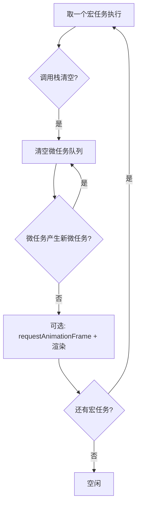

# Event Loop

> &#11088;&#11088;&#11088;&#11088;&#11088;｜难度：高级｜项目：&#9733;&#9733;&#9733;

## 一句话总结

**Event Loop 是 JavaScript 的运行机制，负责协调调用栈、微任务队列和宏任务队列的执行顺序**。一句话记住执行模型：**"一个宏任务，清空所有微任务，再一个宏任务，再清空所有微任务..."**

## 核心机制

### 浏览器 Event Loop 执行模型



**每一轮 Event Loop 做的事**：
1. 从宏任务队列取**一个**宏任务执行
2. 执行过程中产生的微任务进入微任务队列
3. 宏任务执行完，**清空**微任务队列（包括微任务产生的微任务）
4. 如果时间到了，执行 requestAnimationFrame 并渲染
5. 开始下一轮

### 任务分类速记表

| 类型 | 常见来源 | 队列特点 |
|------|---------|---------|
| **宏任务** | `setTimeout`, `setInterval`, I/O, `MessageChannel`, `<script>` 标签 | 每次取一个 |
| **微任务** | `Promise.then/catch/finally`, `MutationObserver`, `queueMicrotask` | 一次清空全部 |

### 必考输出顺序题

```ts
console.log("1") // 同步

setTimeout(() => console.log("2"), 0) // 宏任务

new Promise((resolve) => {
  console.log("3") // 同步 — Promise 构造函数同步执行！
  resolve()
})
  .then(() => console.log("4")) // 微任务

console.log("5") // 同步

// 输出：1 3 5 4 2
```

**解释**：
1. 第一轮：同步代码 `1, 3, 5` 依次执行
2. 宏任务 `setTimeout` 被放入宏任务队列
3. `.then` 回调被放入微任务队列
4. 同步代码执行完，清空微任务：输出 `4`
5. 第二轮：取一个宏任务 `setTimeout`，输出 `2`

### 复杂版 -- 微任务嵌套

```ts
Promise.resolve()
  .then(() => {
    console.log("1")
    return Promise.resolve() // 返回 Promise，extra then
  })
  .then(() => console.log("2"))

Promise.resolve()
  .then(() => console.log("3"))
  .then(() => console.log("4"))

// 输出：1 3 4 2
```

这题的坑在于：`return Promise.resolve()` 会产生一个额外的微任务来"解开"返回的 Promise，所以 `2` 比 `4` 晚。这是 Promise/A+ 规范规定的。

## 深度拓展

### 浏览器 vs Node Event Loop

Node 的 Event Loop 有 **6 个阶段**，每个阶段执行特定的回调：

```
   ┌───────────────────────────┐
┌─>│           timers          │  setTimeout / setInterval
│  └─────────────┬─────────────┘
│  ┌─────────────┴─────────────┐
│  │     pending callbacks     │  系统级回调（TCP 错误等）
│  └─────────────┬─────────────┘
│  ┌─────────────┴─────────────┐
│  │       idle, prepare       │  内部使用
│  └─────────────┬─────────────┘
│  ┌─────────────┴─────────────┐
│  │           poll            │  I/O 回调（核心阶段）
│  └─────────────┬─────────────┘
│  ┌─────────────┴─────────────┐
│  │           check           │  setImmediate
│  └─────────────┬─────────────┘
│  ┌─────────────┴─────────────┐
└──┤      close callbacks      │  socket.on('close')
   └───────────────────────────┘
```

**关键差异**：
- 浏览器每轮一个宏任务；Node 在 poll 阶段可能执行多个 I/O 回调
- Node 有 `setImmediate`（check 阶段）和 `process.nextTick`（不属于 Event Loop，在当前操作后立即执行，优先级高于微任务）
- 浏览器有渲染管线，Node 没有

### setTimeout(fn, 0) 真的是 0ms 吗？

不是。HTML 规范规定：嵌套层级超过 5 层后，最小延迟是 4ms。浏览器实现可能更严格：

```ts
// setTimeout 的延迟是"最小延迟"，不是精确延迟
setTimeout(() => console.log("run"), 0)
// 实际延迟 >= 0（首次）或 >= 4ms（嵌套超过 5 层）
```

### requestAnimationFrame 在哪个时机执行？

rAF 在浏览器渲染之前执行，属于"渲染帧回调"，不在宏任务/微任务体系中：

```
执行宏任务 → 清空微任务 → requestAnimationFrame → 样式计算 → 布局 → 绘制
```

所以高频动画用 rAF 而不是 setTimeout -- 它能保证在下一帧渲染前执行，避免掉帧。

### 微任务嵌套会导致页面卡顿吗？

**会**。因为微任务队列必须清空才能渲染，如果微任务不断产生新的微任务，渲染就永远排不上队：

```ts
// 危险：这会让页面永远不渲染
function blockRender() {
  Promise.resolve().then(() => {
    blockRender() // 无限产生微任务
  })
}
```

## 项目实战

### 1. Vue3 nextTick 的降级策略

```ts
// Vue3 源码中 nextTick 的实现思路（简化）
// 优先级：Promise.then > MutationObserver > setImmediate > setTimeout
function nextTick(fn?: () => void): Promise<void> {
  // 使用 Promise.then（微任务）实现
  const p = Promise.resolve()
  return fn ? p.then(fn) : p
}

// 项目中的使用场景
const count = ref(0)
count.value++
// DOM 还没更新 → 用 nextTick 等更新完
await nextTick()
console.log(document.querySelector(".count")?.textContent) // 此时 DOM 已更新
```

### 2. 大量数据更新使用 requestAnimationFrame 分片

```ts
// 项目中的表格有 10000 行数据时，一次性渲染会卡死
// 用 rAF 分片，每帧渲染 100 行
async function renderLargeList(items: any[], batchSize = 100) {
  return new Promise<void>((resolve) => {
    let index = 0
    function renderBatch() {
      const batch = items.slice(index, index + batchSize)
      data.value.push(...batch) // 追加到渲染数据
      index += batchSize
      if (index < items.length) {
        requestAnimationFrame(renderBatch) // 下一帧继续
      } else {
        resolve()
      }
    }
    requestAnimationFrame(renderBatch)
  })
}
```

### 3. 数据更新后立即获取 DOM

```ts
// 项目中的表单联动场景
const provinceCode = ref("")
const cityList = ref<City[]>([])

watch(provinceCode, async (code) => {
  cityList.value = await fetchCityList(code)
  await nextTick()
  // provinceCode 更新 → 城市下拉框重新渲染 → nextTick 等渲染完
  // 然后把焦点设到城市下拉框
  citySelectRef.value?.focus()
})
```

## 易错点

1. **setTimeout(fn, 0) 一定 0ms 后执行** -- 最小延迟 4ms（嵌套超过 5 层时），且需要等前面的宏任务和微任务执行完
2. **async 函数的 await 后面是宏任务** -- await 后面的代码是**微任务**（相当于 Promise.then 的回调）
3. **浏览器和 Node 的 Event Loop 完全一样** -- Node 有 6 个阶段，`process.nextTick` 是独立的微任务队列且优先级高于 Promise
4. **requestAnimationFrame 是微任务** -- rAF 是渲染帧回调，独立于宏/微任务体系
5. **微任务在宏任务之前执行的意思是微任务是宏任务的一部分** -- 微任务**不是**宏任务的一部分；它是独立阶段，在宏任务执行完、渲染之前清空

## 面试信号表

| 面试官问 | 下一问大概率是 |
|----------|-------------|
| 给代码让你写出输出顺序 | 必考，这是 Event Loop 的标准面试题 |
| "async/await 和 Promise 混用" | 异步执行顺序 + 微任务嵌套 |
| "setTimeout(fn, 0) 的作用" | 为什么不是 0ms + 最小延迟 4ms |
| "Node 和浏览器的区别" | Node Event Loop 6 个阶段 |

## 相关阅读

- [上一篇](./promise.md)
- [下一篇](./async-await.md)
- [Promise](./promise.md)
- [async/await](./async-await.md)
- [Node Event Loop](../Node/node-event-loop.md)

## 更新记录

- 2026-07-05：Phase 2 深度填充（执行模型 + 必考输出题 + nextTick + rAF 分片 + Mermaid）
