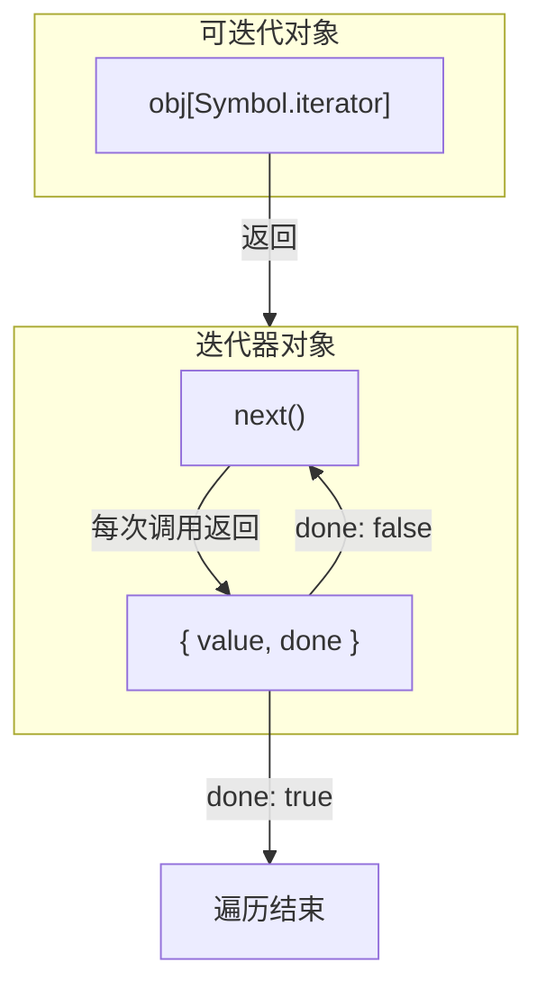

# 生成器 / 迭代器

> &#11088;&#11088;&#11088;｜难度：高级｜项目：&#9733;&#9733;

## 一句话总结

**迭代器是"知道如何遍历"的对象，生成器是"制造迭代器的工厂函数"**。`Symbol.iterator` 让任何对象可被 `for...of` 遍历，`function*` + `yield` 用同步写法写异步流程。面试重点在**手写自定义迭代器**和**红绿灯交替控制**这类生成器控制流的实战题。

## 核心机制

### 迭代器协议 —— 两个角色一张图



**可迭代协议**：对象实现 `[Symbol.iterator]()` 方法，返回迭代器对象。

**迭代器协议**：对象实现 `next()` 方法，每次调用返回 `{ value: any, done: boolean }`。

```js
// 手写一个 range 可迭代对象 —— 面试高频
const range = {
  from: 1,
  to: 5,
  [Symbol.iterator]() {
    let current = this.from
    const { to } = this
    return {
      next() {
        if (current <= to) return { value: current++, done: false }
        return { value: undefined, done: true }
      }
    }
  }
}

console.log([...range])        // [1, 2, 3, 4, 5]
for (const n of range) {}      // 正常工作
Array.from(range)               // [1, 2, 3, 4, 5]
```

**`for...of` 的本质**：先调 `Symbol.iterator` 拿迭代器，循环调 `next()`，直到 `done: true`。

### 哪些内置结构是可迭代的

```js
// 以下都有默认的 Symbol.iterator 实现
Array.prototype[Symbol.iterator]    // 数组
String.prototype[Symbol.iterator]   // 字符串 —— 逐字符
Map.prototype[Symbol.iterator]      // Map → [key, value] 对
Set.prototype[Symbol.iterator]      // Set → 值
arguments[Symbol.iterator]          // 类数组
NodeList.prototype[Symbol.iterator] // DOM 集合
TypedArray.prototype[Symbol.iterator]

// 普通对象 没有 —— 所以不能用 for...of
// 但可以手动加
```

### 迭代器的消费方式

```js
const arr = [1, 2, 3]
const it = arr[Symbol.iterator]()

// 1. 手动调用 next()
it.next()  // { value: 1, done: false }
it.next()  // { value: 2, done: false }
it.next()  // { value: 3, done: false }
it.next()  // { value: undefined, done: true }

// 2. for...of 自动消费
// 3. 展开运算符 [...arr]
// 4. Array.from(arr)
// 5. 解构 const [a, b] = arr
// 6. new Map(arr) / new Set(arr)
// 7. Promise.all(arr) / Promise.race(arr)
```

## 生成器

### function* —— 返回迭代器的函数

生成器本质上是一个**可以暂停和恢复的函数**。调用 `function*` 不会执行函数体，而是返回一个 Generator 对象（同时实现了迭代器协议和可迭代协议）。

```js
function* genNumbers() {
  yield 1       // ① 第一次 next()：停在这里，返回 1
  yield 2       // ② 第二次 next()：停在这里，返回 2
  yield 3       // ③ 第三次 next()：停在这里，返回 3
  return 'end'  // ④ 第四次 next()：{ value: 'end', done: true }
}

const gen = genNumbers()
console.log(gen.next())  // { value: 1, done: false }
console.log(gen.next())  // { value: 2, done: false }
console.log(gen.next())  // { value: 3, done: false }
console.log(gen.next())  // { value: 'end', done: true }

// Generator 本身也是可迭代的
console.log([...genNumbers()])  // [1, 2, 3] —— return 的值被忽略
```

### next() 双向通信 —— 生成器最容易被忽略的特性

`next(arg)` 的参数会变成**上一个 `yield` 表达式的返回值**：

```js
function* twoWay() {
  const a = yield '给我一个值'   // ① 第一个 next() 停在这里
  // ② 第二次 next(42)：a = 42
  const b = yield `收到 ${a}`    // ③ 返回 "收到 42"
  // ④ 第三次 next(100)：b = 100
  return a + b                  // ⑤ 返回 142
}

const g = twoWay()
console.log(g.next())     // { value: '给我一个值', done: false }
console.log(g.next(42))   // { value: '收到 42', done: false }
console.log(g.next(100))  // { value: 142, done: true }
```

### yield* —— 委托给另一个迭代器

```js
function* flatten(arr) {
  for (const item of arr) {
    if (Array.isArray(item)) {
      yield* flatten(item)  // 委托给递归的生成器
    } else {
      yield item
    }
  }
}
console.log([...flatten([1, [2, [3, 4]], 5])])  // [1, 2, 3, 4, 5]

// 等价效果：walk over any iterable
function* chain(...iterables) {
  for (const it of iterables) yield* it
}
console.log([...chain([1, 2], new Set([3, 4]), 'ab')])
// [1, 2, 3, 4, 'a', 'b']
```

## 深度拓展

### 经典手写题：让普通对象支持 for...of

```js
// 题目：给 obj = { a: 1, b: 2, c: 3 } 加上迭代能力
const obj = {
  a: 1, b: 2, c: 3,
  [Symbol.iterator]() {
    const entries = Object.entries(this)  // [['a',1], ['b',2], ['c',3]]
    let i = 0
    return {
      next() {
        if (i < entries.length) {
          return { value: entries[i++], done: false }
        }
        return { value: undefined, done: true }
      }
    }
  }
}

for (const [k, v] of obj) console.log(k, v)
// a 1
// b 2
// c 3
```

### 经典面试题：红绿灯交替控制器

这是生成器"用同步写法写异步逻辑"的典例：

```js
// 需求：红灯 3 秒 → 绿灯 2 秒 → 黄灯 1 秒，循环
function delay(color, ms) {
  return new Promise(resolve => {
    console.log(`${color} 亮`)
    setTimeout(resolve, ms)
  })
}

// 传统 async/await 需要写循环
async function trafficLight() {
  while (true) {
    await delay('红', 3000)
    await delay('绿', 2000)
    await delay('黄', 1000)
  }
}

// 生成器版本 —— 逻辑和数据分离
function* calc() {
  while (true) {
    yield { color: '红', ms: 3000 }
    yield { color: '绿', ms: 2000 }
    yield { color: '黄', ms: 1000 }
  }
}

// 执行器（通用，可复用）
function run(gen) {
  const g = gen()
  function next() {
    const { value, done } = g.next()
    if (done) return
    delay(value.color, value.ms).then(next)
  }
  next()
}

run(calc)
// 红 亮 → (3s) → 绿 亮 → (2s) → 黄 亮 → (1s) → 循环...
```

**这种模式的本质**：生成器负责**描述流程**（纯数据），执行器负责**驱动流程**（副作用）。这是 Redux-Saga 的核心思想。

### 生成器实现 Redux-Saga 风格 effect

```js
// 业务逻辑 —— 纯生成器，完全可测试
function* fetchUserSaga(action) {
  yield put({ type: 'LOADING', payload: true })
  try {
    const user = yield call(fetchUserApi, action.payload.id)
    yield put({ type: 'FETCH_USER_SUCCESS', payload: user })
  } catch (err) {
    yield put({ type: 'FETCH_USER_FAIL', payload: err.message })
  } finally {
    yield put({ type: 'LOADING', payload: false })
  }
}

// 测试时直接逐次 next() 验证 yield 值，无需 mock 网络
const gen = fetchUserSaga({ payload: { id: 1 } })
gen.next()  // { value: put({ type: 'LOADING', ... }), done: false }
gen.next()  // { value: call(fetchUserApi, 1), done: false }
```

## 异步迭代

### for await...of —— 消费异步数据源

```js
// 需求：逐条读取分页数据，每页异步获取
async function* fetchPages(url, totalPages) {
  for (let i = 1; i <= totalPages; i++) {
    const res = await fetch(`${url}?page=${i}`)
    yield await res.json()
  }
}

// 消费方：按顺序处理，每页到达就处理
for await (const pageData of fetchPages('/api/users', 5)) {
  console.log('处理一页数据:', pageData.length)
}
```

### 异步生成器实现防抖搜索

```js
// 用户输入 → 防抖 → 异步搜索 → 逐结果返回
async function* searchDebounced(input$) {
  let timer
  for await (const keyword of input$) {
    clearTimeout(timer)
    yield new Promise(resolve => {
      timer = setTimeout(async () => {
        const results = await fetch(`/api/search?q=${keyword}`)
        resolve(await results.json())
      }, 300)
    })
  }
}
```

## 项目实战

### Vue3 响应式数组的迭代代理

Vue3 的 `ref` 数组通过 Proxy 代理后，`Symbol.iterator` 仍然正常工作，因为 Proxy 默认转发内部方法：

```js
// Vue3 内部：reactive 数组仍然可以用 for...of
// defineProperty ❌（Vue2 需要重写数组方法）
// Proxy ✅（Vue3 默认支持，无需特殊处理）

const list = reactive([1, 2, 3])
for (const item of list) {}     // ✅
const [a, b] = list             // ✅
Array.from(list)                 // ✅
```

### 分页列表的懒加载迭代

```js
// composables/usePageIterator.ts
export async function* usePageIterator<T>(
  fetchFn: (page: number) => Promise<{ list: T[], total: number }>
): AsyncGenerator<T> {
  let page = 0
  let total = Infinity
  while (page * 20 < total) {
    page++
    const res = await fetchFn(page)
    total = res.total
    for (const item of res.list) yield item
  }
}

// 消费方：无需关心分页，统一按元素处理
for await (const item of usePageIterator(params => api.getUsers(params))) {
  tableData.value.push(item)
}
```

## 易错点

1. **Generator 对象既是迭代器又是可迭代对象** —— `gen[Symbol.iterator]()` 返回自身，所以可以 `for...of gen` 也可以 `[...gen]`
2. **`yield` 表达式的值来自 `next(arg)`，不是 `return`** —— 第一次 `next()` 的参数会被忽略（因为没有上一个 `yield`）
3. **`for...of` 忽略 `done: true` 时的 value** —— `return` 的值不会被 `[...gen]` 收集
4. **异步生成器 `next()` 返回 Promise** —— `async function*` 的 `g.next()` 返回 `Promise<{value, done}>`
5. **`for await...of` 不能用于同步可迭代对象** —— 两者不兼容；但可以手动加 `Symbol.asyncIterator`

## 面试信号表

| 面试官问 | 下一问大概率是 |
|----------|-------------|
| "什么是迭代器" | 手写 `[Symbol.iterator]` 让普通对象支持 `for...of` |
| "Generator 用过吗" | 追问 `yield*` 的用途 / `next()` 双向通信 |
| "同步迭代和异步迭代的区别" | 手写 `async function*` + `for await...of` |
| "Redux-Saga 为什么用 Generator" | Generator 的 yield 天然描述副作用流程，易于测试 |
| "for...of 和 for...in 的区别" | 追问原型链上的可枚举属性 |

## 相关阅读

- [Promise](./promise.md)
- [async / await](./async-await.md)
- [Set / Map / WeakMap](./set-map-weakmap.md)

## 更新记录

- 2026-07-07：新建（迭代器协议 + 生成器双向通信 + 红绿灯手写 + 异步迭代）
