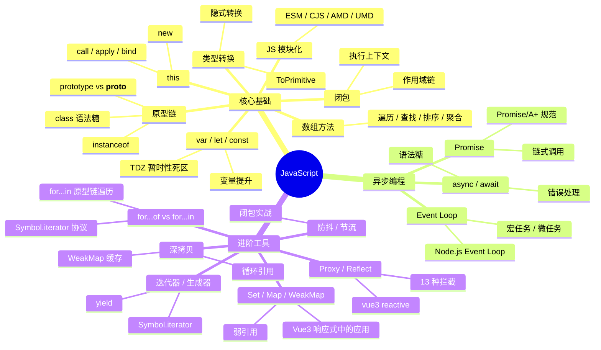

# JavaScript 知识地图

## 推荐学习顺序

### 一、核心基础

1. ⭐⭐⭐⭐⭐ [this](./this.md)
2. ⭐⭐⭐⭐   [call / apply / bind](./call-apply-bind.md)
3. ⭐⭐⭐⭐   [new](./new.md)
4. ⭐⭐⭐⭐   [原型链](./prototype-chain.md)
5. ⭐⭐⭐⭐⭐ [class / extends / super](./class-extends.md)
6. ⭐⭐⭐⭐⭐ [闭包](./closure.md)
7. ⭐⭐⭐⭐⭐ [var / let / const](./var-let-const.md)
8. ⭐⭐⭐⭐   [数组方法大全](./array-methods.md)
9. ⭐⭐⭐⭐   [JS 模块化](./modules.md)
10. ⭐⭐⭐⭐⭐ [类型转换](./type-coercion.md)

### 二、异步编程

11. ⭐⭐⭐⭐⭐ [Event Loop](./event-loop.md) — 先理解 JS 怎么调度异步任务
12. ⭐⭐⭐⭐⭐ [Promise](./promise.md) — 再学最核心的异步模式
13. ⭐⭐⭐⭐   [async / await](./async-await.md) — Promise 的语法糖

### 三、进阶工具

14. ⭐⭐⭐⭐⭐ [Set / Map / WeakMap](./set-map-weakmap.md)
15. ⭐⭐⭐⭐   [Symbol](./symbol.md)
16. ⭐⭐⭐⭐   [Object 系列 API](./object-api.md)
17. ⭐⭐⭐⭐⭐ [Proxy / Reflect](./proxy-reflect.md)
18. ⭐⭐⭐     [深拷贝](./deep-clone.md)
19. ⭐⭐⭐     [防抖 / 节流](./debounce-throttle.md)
20. ⭐⭐⭐⭐   [for...of vs for...in](./for-of-for-in.md)
21. ⭐⭐⭐     [生成器 / 迭代器](./generator-iterator.md)
22. ⭐⭐⭐     [ArrayBuffer / TypedArray](./arraybuffer-typedarray.md)
23. ⭐⭐⭐     [跨 Realm 场景](./cross-realm.md)

## 知识点索引

| 知识点 | 频率 | 难度 | 手写 | 状态 |
|--------|------|------|------|------|
| [this](./this.md) | ⭐⭐⭐⭐⭐ | 中级 | — | draft |
| [call / apply / bind](./call-apply-bind.md) | ⭐⭐⭐⭐ | 中级 | [✅](../手写题/bind-call-apply.md) | draft |
| [new](./new.md) | ⭐⭐⭐⭐ | 中级 | [✅](../手写题/new.md) | draft |
| [原型链](./prototype-chain.md) | ⭐⭐⭐⭐ | 中高级 | — | draft |
| [class / extends / super](./class-extends.md) | ⭐⭐⭐⭐⭐ | 中级 | — | draft |
| [闭包](./closure.md) | ⭐⭐⭐⭐⭐ | 中高级 | — | draft |
| [var / let / const](./var-let-const.md) | ⭐⭐⭐⭐⭐ | 初级 | — | draft |
| [类型转换](./type-coercion.md) | ⭐⭐⭐⭐⭐ | 中级 | — | draft |
| [Promise](./promise.md) | ⭐⭐⭐⭐⭐ | 中级 | [✅](../手写题/promise.md) | draft |
| [async / await](./async-await.md) | ⭐⭐⭐⭐ | 中级 | — | draft |
| [Event Loop](./event-loop.md) | ⭐⭐⭐⭐⭐ | 中高级 | — | draft |
| [数组方法大全](./array-methods.md) | ⭐⭐⭐⭐ | 初级 | — | draft |
| [JS 模块化](./modules.md) | ⭐⭐⭐⭐ | 中级 | — | draft |
| [Set / Map / WeakMap](./set-map-weakmap.md) | ⭐⭐⭐⭐⭐ | 中级 | — | draft |
| [Proxy / Reflect](./proxy-reflect.md) | ⭐⭐⭐⭐⭐ | 高级 | ✅ react | draft |
| [深拷贝](./deep-clone.md) | ⭐⭐⭐ | 中级 | [✅](../手写题/deep-clone.md) | draft |
| [防抖 / 节流](./debounce-throttle.md) | ⭐⭐⭐ | 初级 | [✅](../手写题/debounce-throttle.md) | draft |
| [for...of vs for...in](./for-of-for-in.md) | ⭐⭐⭐⭐ | 中级 | — | draft |
| [生成器 / 迭代器](./generator-iterator.md) | ⭐⭐⭐ | 中级 | — | draft |
| [ArrayBuffer / TypedArray](./arraybuffer-typedarray.md) | ⭐⭐⭐ | 高级 | — | draft |
| [跨 Realm 场景](./cross-realm.md) | ⭐⭐⭐ | 高级 | — | draft |

## 相关阅读

- [面试题库：JavaScript](../面试题库/JavaScript.md) — 32 道 JS 高频真题
- [面试回答：JavaScript](../面试回答/JavaScript/promise.md) — 12 篇 JS 逐字回答稿（Promise/Event Loop/闭包/原型链/this/深拷贝/async/new/var/并发/defineProperty 等）
- [手写题](../手写题/index.md) — 7 道手写实现

## 更新记录

- 2026-07-12：学习顺序三组分类（核心基础/异步编程/进阶工具），类型转换归入核心基础；补 class-extends/for-of-for-in/generator-iterator 入学习顺序；mindmap 补 for-of-for-in
- 2026-07-11：学习顺序编号修复（补 #13）；mindmap 三组缩并（核心基础/异步编程/进阶工具）；学习顺序微调（原型链提到闭包前）
- 2026-07-05：初始创建
