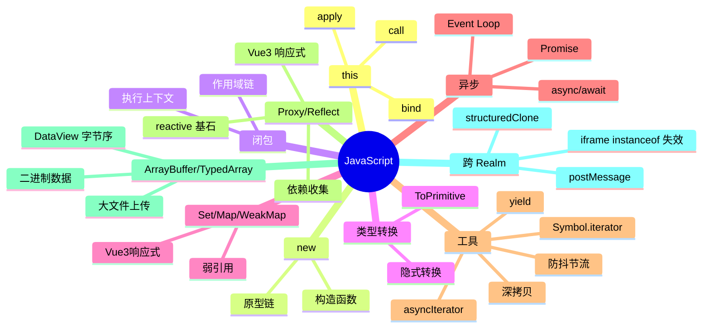

# JavaScript 知识地图

## 推荐学习顺序

1. ⭐⭐⭐⭐⭐ [this](./this.md)
2. ⭐⭐⭐⭐⭐ [闭包](./closure.md)
3. ⭐⭐⭐⭐⭐ [Promise](./promise.md)
4. ⭐⭐⭐⭐⭐ [Event Loop](./event-loop.md)
5. ⭐⭐⭐⭐⭐ [类型转换](./type-coercion.md)
6. ⭐⭐⭐⭐⭐ [Set / Map / WeakMap](./set-map-weakmap.md)
7. ⭐⭐⭐⭐   [async/await](./async-await.md)
8. ⭐⭐⭐⭐   [call/apply/bind](./call-apply-bind.md)
9. ⭐⭐⭐⭐   [原型链](./prototype-chain.md)
10. ⭐⭐⭐⭐   [new](./new.md)
11. ⭐⭐⭐     [深拷贝](./deep-clone.md)
12. ⭐⭐⭐    [防抖节流](./debounce-throttle.md)
14. ⭐⭐⭐⭐⭐ [Proxy / Reflect](./proxy-reflect.md)
15. ⭐⭐⭐    [ArrayBuffer / TypedArray](./arraybuffer-typedarray.md)
16. ⭐⭐⭐    [跨 Realm 场景](./cross-realm.md)

## 知识点索引

| 知识点 | 频率 | 难度 | 手写 | 状态 |
|--------|------|------|------|------|
| [this](./this.md) | ⭐⭐⭐⭐⭐ | 中级 | — | draft |
| [call/apply/bind](./call-apply-bind.md) | ⭐⭐⭐⭐ | 中级 | [✅](../手写题/bind-call-apply.md) | draft |
| [new](./new.md) | ⭐⭐⭐⭐ | 初级 | [✅](../手写题/new.md) | draft |
| [闭包](./closure.md) | ⭐⭐⭐⭐⭐ | 中级 | — | draft |
| [class / extends / super](./class-extends.md) | ⭐⭐⭐⭐⭐ | 中级 | drafted |
| [for...of vs for...in](./for-of-for-in.md) | ⭐⭐⭐⭐ | 初级 | drafted |
| [类型转换](./type-coercion.md) | ⭐⭐⭐⭐⭐ | 中级 | — | filled |
| [Set / Map / WeakMap](./set-map-weakmap.md) | ⭐⭐⭐⭐⭐ | 中级 | — | filled |
| [原型链](./prototype-chain.md) | ⭐⭐⭐⭐ | 中级 | — | draft |
| [Promise](./promise.md) | ⭐⭐⭐⭐⭐ | 中级 | [✅](../手写题/promise.md) | draft |
| [Event Loop](./event-loop.md) | ⭐⭐⭐⭐⭐ | 高级 | — | draft |
| [async/await](./async-await.md) | ⭐⭐⭐⭐ | 中级 | — | draft |
| [深拷贝](./deep-clone.md) | ⭐⭐⭐ | 中级 | [✅](../手写题/deep-clone.md) | draft |
| [防抖节流](./debounce-throttle.md) | ⭐⭐⭐ | 初级 | [✅](../手写题/debounce-throttle.md) | draft |
| [Proxy / Reflect](./proxy-reflect.md) | ⭐⭐⭐⭐⭐ | 高级 | ✅ react | draft |
| [ArrayBuffer / TypedArray](./arraybuffer-typedarray.md) | ⭐⭐⭐ | 高级 | — | draft |
| [跨 Realm 场景](./cross-realm.md) | ⭐⭐⭐ | 高级 | — | draft |
