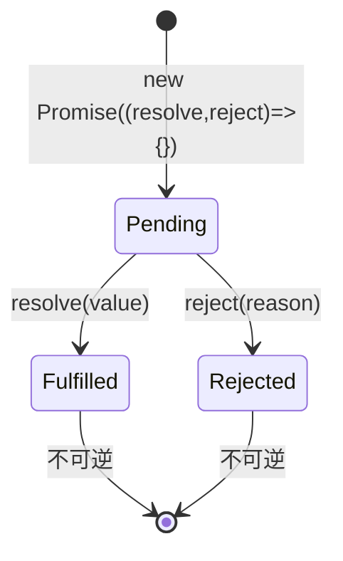

# Promise

> &#11088;&#11088;&#11088;&#11088;&#11088;｜难度：中级&#9733;&#9733;&#9733;

**这是 JavaScript 面试最重要的知识点，没有之一。** 从手写 Promise 到 Event Loop 时序，从这里延伸出 async/await、微任务、错误处理等一连串追问。

## 一句话总结

**Promise 是管理异步操作的对象，通过不可逆的状态机（pending -> fulfilled/rejected）和 then 回调队列，将嵌套回调转为链式调用，解决回调地狱。**

## 核心机制

### 状态机 -- 不可逆



三个关键规则：

1. **状态不可逆**：一旦从 pending 变为 fulfilled 或 rejected，就再也改不了了
2. **结果不可变**：resolve/reject 的值被存住，状态改变后无法覆盖
3. **then 永远返回新 Promise**：这是链式调用的基础

```ts
// 状态只改变一次
const p = new Promise((resolve, reject) => {
  resolve("first")
  reject("second")  // 无效，状态已经是 fulfilled
  resolve("third")  // 无效
})
p.then(console.log) // "first" — 只有第一次有效
```

### then / catch / finally 的返回值规则

```ts
// then 返回新 Promise 的规则：
Promise.resolve(1)
  .then((v) => v * 2)        // 返回普通值 → 包装成 Promise.resolve(2)
  .then((v) => Promise.resolve(v * 2)) // 返回 Promise → 自动展开
  .then((v) => { throw new Error("oops") }) // 抛出异常 → 包装成 reject
  .then(() => {}, (err) => console.log(err.message)) // "oops" — 错误被 catch

// catch 其实是 then(undefined, onRejected) 的语法糖
Promise.reject("err")
  .catch((e) => "recovered") // catch 也返回新 Promise，可以继续 .then
  .then((v) => console.log(v)) // "recovered" — 错误被恢复

// finally 不改变正常传递的值——回调 return 值被忽略，原值透传
// ⚠️ 但回调抛异常或返回 rejected Promise 会覆盖链的状态
Promise.resolve("data")
  .finally(() => "ignored") // 返回值被忽略
  .then((v) => console.log(v)) // "data" — 原值透传

Promise.resolve("ok")
  .finally(() => Promise.reject("err")) // rejected 覆盖了原来的值
  .catch(e => console.log(e)) // "err"
```

### Promise Resolution Procedure

这是手写 Promise 最难的部分：**resolve(promise) 时，需要递归等待内部 promise 的状态**。

```ts
function resolvePromise(promise2, x, resolve, reject) {
  // 1. 不能自己等自己（循环引用）
  if (promise2 === x) return reject(new TypeError("Chaining cycle"))

  // 2. 如果 x 是 Promise 实例，采用它的状态
  if (x instanceof Promise) {
    x.then(
      (v) => resolvePromise(promise2, v, resolve, reject), // 递归
      reject
    )
    return
  }

  // 3. 如果 x 是 thenable 对象（有 .then 方法的对象）
  if (x !== null && (typeof x === "object" || typeof x === "function")) {
    let called = false
    try {
      const then = x.then
      if (typeof then === "function") {
        then.call(x,
          (v) => { if (!called) { called = true; resolvePromise(promise2, v, resolve, reject) } },
          (r) => { if (!called) { called = true; reject(r) } }
        )
      } else {
        resolve(x)
      }
    } catch (e) {
      if (!called) { called = true; reject(e) }
    }
    return
  }

  // 4. 普通值直接 resolve
  resolve(x)
}
```

这就是为什么 `resolve(promise)` 会等待 -- 内部递归解开所有的 thenable。

## 深度拓展

### Promise.all / race / allSettled / any 的实现差异

```ts
// Promise.all — 全部成功才成功，一个失败就失败
// 场景：并发请求多个接口，需要全部数据才能渲染页面
Promise.all([fetchUsers(), fetchRoles(), fetchPermissions()])
  .then(([users, roles, perms]) => renderPage(users, roles, perms))

// Promise.allSettled — 等所有 settle，不管成功失败
// 场景：批量上传文件，需要知道每个文件的结果
Promise.allSettled(files.map((f) => upload(f)))
  .then((results) => {
    const success = results.filter((r) => r.status === "fulfilled")
    const failed = results.filter((r) => r.status === "rejected")
  })

// Promise.race — 第一个 settle 的结果
// 场景：请求超时控制
Promise.race([
  fetch("/api/data"),
  new Promise((_, reject) => setTimeout(() => reject(new Error("timeout")), 5000)),
])

// Promise.any — 第一个 fulfilled 的结果，全失败才 reject
// 场景：从多个 CDN 加载资源，哪个快用哪个
Promise.any([fetch(cdn1), fetch(cdn2), fetch(cdn3)])
```

### Promise 的错误冒泡机制

```ts
new Promise((_, reject) => reject(new Error("source")))
  .then(() => { /* 跳过 */ })
  .then(() => { /* 跳过 */ }) // 没有 onRejected 的处理函数会一直往下传
  .catch((err) => console.log(err)) // 捕获 — 直到遇到 catch
  .then(() => { /* 继续 */ }) // catch 后的 then 正常执行
```

类比：Promise 链的错误冒泡和 try/catch 一样，没有 catch 的错误会变成 **unhandled rejection**（在 Node 中会触发 `unhandledRejection` 事件，甚至导致进程退出）。

## 手写实现

完整 Promise/A+ 实现的核心骨架（完整版过长，这里展示核心结构）：

```ts
enum State { PENDING, FULFILLED, REJECTED }

class MyPromise<T = unknown> {
  private state = State.PENDING
  private value: T | undefined
  private reason: any
  // 因为 then 可以多次调用，所以回调是数组
  private onFulfilledCallbacks: Array<(value: T) => void> = []
  private onRejectedCallbacks: Array<(reason: any) => void> = []

  constructor(executor: (resolve: (value: T) => void, reject: (reason: any) => void) => void) {
    const resolve = (value: T) => {
      if (this.state !== State.PENDING) return
      // 注意：骨架从简——完整版的 resolve 还需判断 value 是否为 thenable 并递归展开
      // （原生 resolve(promise) 会等待内部 promise，正是走这套 Resolution Procedure）
      this.state = State.FULFILLED
      this.value = value
      // 发布：执行所有等待中的 then 回调
      this.onFulfilledCallbacks.forEach((fn) => fn(value))
    }
    const reject = (reason: any) => {
      if (this.state !== State.PENDING) return
      this.state = State.REJECTED
      this.reason = reason
      this.onRejectedCallbacks.forEach((fn) => fn(reason))
    }
    try {
      executor(resolve, reject)
    } catch (e) {
      reject(e)
    }
  }

  then(onFulfilled?: any, onRejected?: any): MyPromise {
    // 值穿透：如果没传回调，默认透传
    onFulfilled = typeof onFulfilled === "function" ? onFulfilled : (v: any) => v
    onRejected = typeof onRejected === "function" ? onRejected : (r: any) => { throw r }

    const promise2 = new MyPromise((resolve, reject) => {
      const runCallback = (fn: Function, val: any) => {
        // 微任务：使用 queueMicrotask 或 setTimeout
        queueMicrotask(() => {
          try {
            const x = fn(val)
            resolvePromise(promise2, x, resolve, reject) // 核心递归
          } catch (e) {
            reject(e)
          }
        })
      }

      if (this.state === State.FULFILLED) {
        runCallback(onFulfilled, this.value)
      } else if (this.state === State.REJECTED) {
        runCallback(onRejected, this.reason)
      } else {
        // PENDING 状态 — 订阅（收集回调）
        this.onFulfilledCallbacks.push((val) => runCallback(onFulfilled, val))
        this.onRejectedCallbacks.push((val) => runCallback(onRejected, val))
      }
    })
    return promise2
  }
}
```

面试时如果被要求手写，核心得分点是：**状态机不可逆 + then 返回新 Promise + resolvePromise 递归 + 微任务调度**。

## 项目实战

### 1. 请求拦截器封装

```ts
// Axios 请求/响应拦截器返回 Promise，实现链式处理
const service = axios.create({ baseURL: "/api" })

service.interceptors.request.use((config) => {
  const token = useAuthStore().token
  if (token) config.headers.Authorization = `Bearer ${token}`
  return config // 返回 config，继续后续拦截器
})

service.interceptors.response.use(
  (response) => response.data, // 剥离外层，只返回 data
  async (error) => {
    if (error.response?.status === 401) {
      await refreshToken() // 刷新 token
      return service(error.config!) // 重试原请求
    }
    return Promise.reject(error) // 继续抛出让业务层处理
  }
)
```

### 2. 文件上传并发控制

```ts
// 项目中的批量文件上传，控制同时最多 3 个并发
async function uploadWithConcurrency(files: File[], limit = 3) {
  const results: UploadResult[] = []
  const queue = [...files]

  async function worker() {
    while (queue.length > 0) {
      const file = queue.shift()!
      try {
        const res = await uploadFile(file)
        results.push({ file: file.name, status: "success", url: res.url })
      } catch (e) {
        results.push({ file: file.name, status: "failed", error: e })
      }
    }
  }

  // 启动 limit 个 worker 并行工作
  await Promise.all(Array.from({ length: limit }, () => worker()))
  return results
}
```

### 3. Element Plus 表单验证返回 Promise

```ts
// Element Plus 表单验证底层就是 Promise
const formRef = ref<FormInstance>()
async function handleSubmit() {
  try {
    await formRef.value?.validate() // validate 返回 Promise
    // 验证通过 → 提交
    await submitForm(formData)
    ElMessage.success("提交成功")
  } catch {
    ElMessage.error("请检查表单填写")
  }
}
```

## 易错点

1. **Promise.then 是宏任务** -- then/catch/finally 的回调是**微任务**，在 Event Loop 中比宏任务优先执行
2. **async 一定比 Promise 快** -- async/await 本质是 Promise + Generator 的语法糖，不存在快慢之分
3. **Promise.resolve 一定同步执行** -- resolve/reject 是同步的，但 then 的回调是异步（微任务）的
4. **catch 后不能继续 then** -- catch 返回新的 Promise，可以继续 .then，此时值是 catch 的返回值
5. **Promise.all 遇到 reject 后其余请求取消** -- Promise.all 不会取消其他请求，只是忽略它们的结果；被 reject 的 Promise 对应的网络请求可能还在进行

## 面试信号表

| 面试官问 | 下一问大概率是 |
|----------|-------------|
| "Promise 为什么能链式调用" | then 返回新 Promise → Promise Resolution Procedure |
| "Promise Resolution Procedure" | 手写 Promise |
| "手写 Promise" | then 回调的微任务调度时机 |
| "Promise.all 和 allSettled 区别" | 手写 all / allSettled |

## 相关阅读

- [上一篇](./closure.md)
- [下一篇](./event-loop.md)
- [Event Loop](./event-loop.md)
- [async/await](./async-await.md)
- [手写题：Promise](../手写题/promise.md)

## 更新记录

- 2026-07-05：Phase 2 深度填充（状态机 + Resolution Procedure + 手写骨架 + 项目实战）
