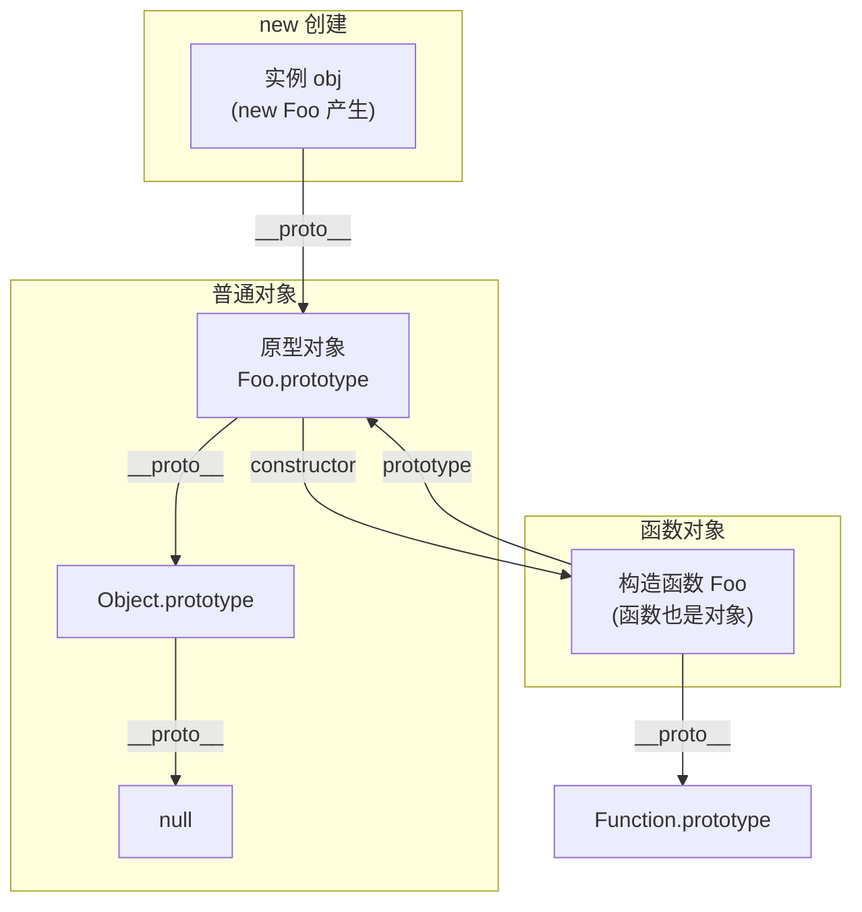
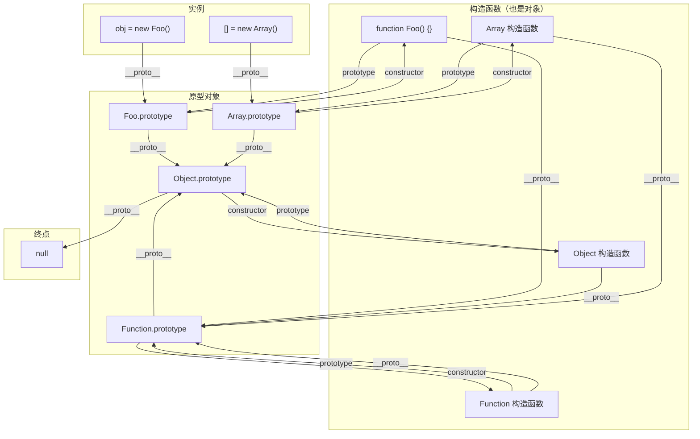

# 原型链

> &#11088;&#11088;&#11088;&#11088;｜难度：中级｜项目：&#9733;&#9733;&#9733;

## 一句话总结

**原型链是 JavaScript 实现继承的机制，通过 `__proto__` 箭头将对象串联起来，直到 `null`**。当访问对象的属性不存在时，引擎沿着这条链逐级向上查找，找到即返回，找不到返回 `undefined`。

## 核心机制

### 三角关系：构造函数、实例、原型对象

这是面试必须能白板画出来的关系：



```ts
function Foo() {}
const obj = new Foo()

// 三条关键连线
obj.__proto__ === Foo.prototype          // true — 实例到原型
Foo.prototype.constructor === Foo         // true — 原型到构造函数
Foo.__proto__ === Function.prototype      // true — 构造函数也是函数

// 属性查找过程
obj.toString() // ① obj 自身没有 → ② Foo.prototype 没有 → ③ Object.prototype 有 → 调用
```

**三个东西，两条线**：

| 概念 | 是什么 | 谁有 |
|------|--------|------|
| `prototype` | 构造函数的属性，指向原型对象 | 只有函数有 |
| `__proto__` | 对象的内部属性，指向构造函数的 prototype | 所有对象有（除了 `Object.create(null)`） |
| `constructor` | 原型对象上的属性，指回构造函数 | prototype 上的默认属性 |

### Object.create(null) -- 为什么没有原型？

```ts
const map = Object.create(null)
map.__proto__  // undefined — 没有原型链
map.toString() // TypeError — 找不到 toString
map.hasOwnProperty // TypeError — 没有任何 Object.prototype 的方法
```

`Object.create(null)` 创建的是**纯粹的数据容器**，不继承任何东西。项目中用它当作无污染的字典（比 `{}` 更干净，不会和 `toString` / `constructor` 等 key 冲突）。

## 深度拓展

### 完整的原型链 —— Function 和 Object 的特殊关系

面试中画完三角关系后，面试官常追问："那 Function 和 Object 自己的 `__proto__` 指向哪？"这道题区分"背了三角关系"和"真正理解原型链"。

**三条反直觉的等式**：

```ts
// ① 函数的原型对象也是对象 —— 所以指向 Object.prototype
Function.prototype.__proto__ === Object.prototype   // true

// ② Function 是自己的实例 —— 因为 Function 本身也是函数
Function.__proto__ === Function.prototype           // true

// ③ Object 构造函数也是函数 —— 所以指向 Function.prototype
Object.__proto__ === Function.prototype             // true
```

**完整的原型链图**：



**一张表记住所有特殊指向**：

| 表达式 | 结果 | 原因 |
|--------|------|------|
| `obj.__proto__` | `Foo.prototype` | 实例指向构造函数的 prototype |
| `Foo.prototype.__proto__` | `Object.prototype` | 原型对象本身也是普通对象 |
| `Foo.__proto__` | `Function.prototype` | 函数也是对象，由 Function 构造 |
| `Function.__proto__` | `Function.prototype` | Function 自己是函数，所以指向自己的 prototype |
| `Object.__proto__` | `Function.prototype` | Object 构造函数也是函数 |
| `Function.prototype.__proto__` | `Object.prototype` | 一切原型对象最终都是对象 |
| `Object.prototype.__proto__` | `null` | 原型链终点 |

**记忆口诀**：所有 `__proto__` 最终汇入 `Object.prototype`，然后指向 `null`。函数走 `Function.prototype` 中转，Object.prototype 是万川归海的那一点。

**面试中的问法**："`Function instanceof Object` 和 `Object instanceof Function` 结果分别是什么？"

```ts
Function instanceof Object   // true
// Function.__proto__ === Function.prototype → Function.prototype.__proto__ === Object.prototype ✅

Object instanceof Function   // true
// Object.__proto__ === Function.prototype ✅
```

两个都返回 `true`——这就是"鸡生蛋蛋生鸡"的原型链体现，面试官用这道题判断你是否真的画过完整的图。

### 追问：instanceof 原理

**`A instanceof B` 就是沿着 `A.__proto__` 链往上找，看能不能找到 `B.prototype`**：

```ts
function myInstanceof(obj: any, constructor: Function): boolean {
  let proto = Object.getPrototypeOf(obj) // obj.__proto__
  while (proto) {
    if (proto === constructor.prototype) return true
    proto = Object.getPrototypeOf(proto) // 继续往上
  }
  return false
}

// 验证
console.log([] instanceof Array)  // true — [].__proto__ === Array.prototype
console.log([] instanceof Object) // true — [].__proto__.__proto__ === Object.prototype
console.log(1 instanceof Number)  // false — 原始类型 1 没有 __proto__
```

面试时问"原型链"大概率追踪到让你手写 instanceof。

### 追问：class extends 和寄生组合继承的关系

```ts
// ES6 class
class Parent { sayHi() { console.log("hi") } }
class Child extends Parent { sayBye() { console.log("bye") } }

// 本质上是：
// Child.prototype = Object.create(Parent.prototype)
// Child.prototype.constructor = Child
// Object.setPrototypeOf(Child, Parent) // 静态方法继承
```

class 语法是寄生组合继承的语法糖，核心操作和手写继承完全一致 -- 只是多了一层静态方法/属性的继承（`Child.__proto__ === Parent`）。

### 彩蛋：typeof null === 'object' 是怎么回事？

这是一个历史 Bug。JavaScript 在底层用 3 位二进制标记类型：对象是 `000`。null 在内存中表示为全零的机器码，前 3 位也是 `000`，所以 `typeof null` 返回 `"object"`。这个 bug 从第一个版本就存在，因修复会破坏大量现有代码而保留至今。原型链的终点 `Object.prototype.__proto__ === null`，面试官有时会顺着问到。

## 项目实战

### 1. Vue3 中很少直接操作原型

Vue3 用 Proxy 实现响应式，不再需要像 Vue2 那样在原型上拦截属性：

```ts
// Vue2 — 依赖 Object.defineProperty 在原型上做文章
// Vue3 — Proxy 代理整个对象，原型链对响应式透明
const state = reactive({ count: 0 }) // Proxy 代理，不碰原型
```

但原型链知识在手写深拷贝时直接用到：

```ts
function deepClone(obj, hash = new WeakMap()) {
  if (obj === null || typeof obj !== "object") return obj
  if (hash.has(obj)) return hash.get(obj)

  // 沿着原型链获取构造函数信息，保留正确的类型
  const clone = new (Object.getPrototypeOf(obj).constructor)()
  hash.set(obj, clone)

  for (const key of Reflect.ownKeys(obj)) { // 包括 Symbol key
    clone[key] = deepClone(obj[key], hash)
  }
  return clone
}
```

### 2. Element Plus 组件继承中的原型使用

```ts
// Element Plus 中，ElInput 等组件通过原型链继承公共 mixin
// 虽然源码用了 TS 的 class，但本质是原型继承
class FormItem {
  validate(trigger: string) {
    // 验证逻辑
  }
}
// ElFormItem extends FormItem → 原型链 = ElFormItem.prototype → FormItem.prototype
```

### 3. 项目中的权限检查 -- 基于原型链的装饰器

```ts
// 为所有 API 类添加权限检查（通过原型链批量扩展）
function withPermission<T extends { new (...args: any[]): any }>(Base: T) {
  return class extends Base {
    checkPermission(code: string): boolean {
      return usePermissionStore().hasPermission(code)
    }
  }
}
class UserApi { /* ... */ }
const SecuredUserApi = withPermission(UserApi)
// SecuredUserApi.prototype.__proto__ === UserApi.prototype
```

## 易错点

1. **`__proto__` 和 `prototype` 是同一个东西** -- `prototype` 是函数独有的属性（原型对象），`__proto__` 是所有对象的内部链接（指向原型对象）
2. **所有对象最终都指向 Object.prototype** -- `Object.create(null)` 没有原型链，常用于作为纯净字典
3. **class 和 function 的继承机制完全不同** -- 底层都是原型链，class 只是语法糖
4. **`Object.getPrototypeOf()` 和 `__proto__` 完全等价** -- 功能等价但前者是标准方法，后者是历史遗留属性
5. **构造函数的 `prototype.constructor` 一定准确** -- 可以被人为修改，不可靠；用 `Object.getPrototypeOf()` 更好
6. **`Function.__proto__` 等于 `Function.prototype` 是设计错误** -- 这是 ECMAScript 规范明确定义的，不是 bug。它保证了 `Function instanceof Function` 为 true——逻辑上函数当然是函数的实例

## 面试信号表

| 面试官问 | 下一问大概率是 |
|----------|-------------|
| "原型链是什么" | 画三角关系图（需要白板能力） |
| "画完三角关系" | instanceof 原理 → 手写 instanceof |
| "手写 instanceof" | "那 Object.create(null) 呢" |
| "class 继承和原型继承" | class extends 底层实现 |
| "Function 和 Object 的 __proto__ 指向哪" | Function.__proto__ === Function.prototype / Object.__proto__ === Function.prototype |
| "Function instanceof Object 和反过来" | 两个都返回 true——原型链的鸡生蛋蛋生鸡 |

## 相关阅读

- [上一篇](./call-apply-bind.md)
- [下一篇](./new.md)
- [new](./new.md)
- [this](./this.md)
- [手写题：深拷贝](../手写题/deep-clone.md)（利用原型链保留构造函数类型）

## 更新记录

- 2026-07-05：Phase 2 深度填充（三角关系图 + instanceof 手写 + 项目实战 + Mermaid）
