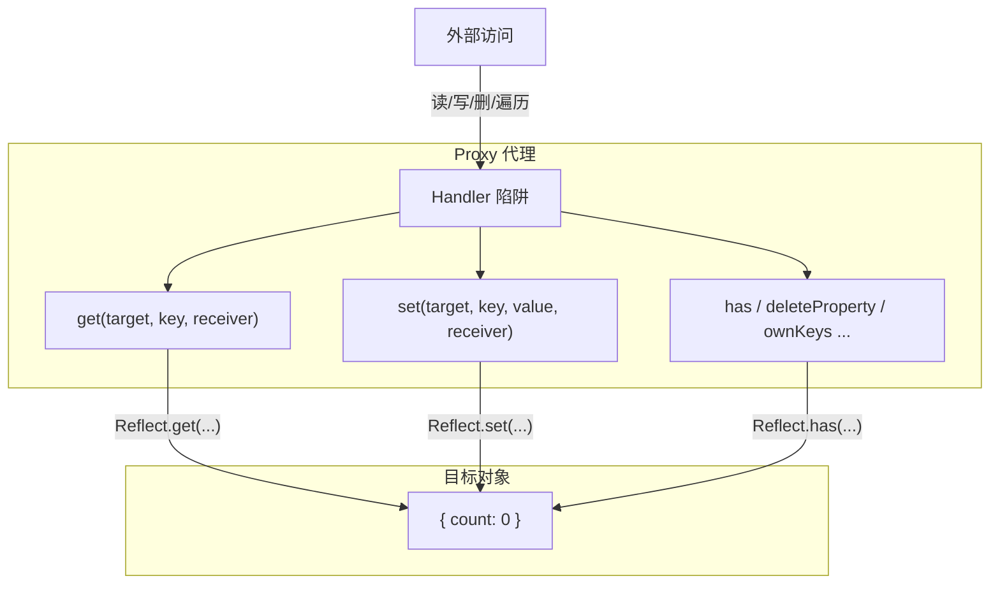

# Proxy / Reflect

> &#11088;&#11088;&#11088;&#11088;&#11088;｜难度：高级｜项目：&#9733;&#9733;&#9733;&#9733;

## 一句话总结

**Proxy 是对象的"代理人"，拦截并自定义对象的基本操作；Reflect 是操作对象的"标准工具"，确保行为与原生一致**。两者配合是 Vue3 `reactive` 的绝对基石——Proxy 负责拦截（支持数组、属性增删），Reflect 负责修正 `this` 指向逃逸问题。面试 Vue3 岗位必问。

## 核心机制

### Proxy —— JS 的元编程接口

Proxy 可以拦截对象 13 种底层操作，远不止 `get`/`set`：



```js
// Proxy 基础语法
const target = { count: 0 }
const p = new Proxy(target, {
  get(target, key, receiver) {
    console.log(`读取 ${String(key)}`)
    return Reflect.get(target, key, receiver)
  },
  set(target, key, value, receiver) {
    console.log(`设置 ${String(key)} = ${value}`)
    return Reflect.set(target, key, value, receiver)
  }
})

p.count      // 读取 count  → 0
p.count = 1  // 设置 count = 1
```

### Proxy 13 种拦截器一览

| 拦截器 | 对应操作 | Vue3 使用 |
|--------|---------|-----------|
| `get` | `obj.key` | ✅ 依赖收集 |
| `set` | `obj.key = v` | ✅ 触发更新 |
| `deleteProperty` | `delete obj.key` | ✅ 属性删除 |
| `has` | `key in obj` | ✅ |
| `ownKeys` | `Object.keys(obj)` | ✅ |
| `getPrototypeOf` | `Object.getPrototypeOf()` | — |
| `setPrototypeOf` | `Object.setPrototypeOf()` | — |
| `isExtensible` | `Object.isExtensible()` | — |
| `preventExtensions` | `Object.preventExtensions()` | — |
| `getOwnPropertyDescriptor` | `Object.getOwnPropertyDescriptor()` | — |
| `defineProperty` | `Object.defineProperty()` | — |
| `apply` | `fn()` | — |
| `construct` | `new Fn()` | — |

### Proxy vs Object.defineProperty —— Vue2 → Vue3 的根本变化

**这是面试最高频的对比：**

```js
// ===== Vue2: Object.defineProperty =====
const obj = {}
Object.defineProperty(obj, 'count', {
  get() { /* 收集依赖 */ },
  set(v) { /* 触发更新 */ }
})

// ❌ 问题 1：新增属性无法监听
obj.newProp = 1     // 不会触发 set → Vue2 需要 Vue.set()

// ❌ 问题 2：删除属性无法监听
delete obj.count    // 不会触发 → Vue2 需要 Vue.delete()

// ❌ 问题 3：数组索引/长度修改无法监听
const arr = [1, 2, 3]
// Vue2 重写了 7 个数组方法（push/pop/shift/unshift/splice/sort/reverse）
arr[0] = 99         // 不会触发更新
arr.length = 0      // 不会触发更新

// ❌ 问题 4：需要递归遍历所有属性
// 初始化时 Object.defineProperty 要对每个属性递归处理，性能差

// ===== Vue3: Proxy =====
const state = reactive({ count: 0, items: [1, 2, 3] })

// ✅ 新增属性 → set 拦截器捕获
state.newProp = 1     // 触发更新

// ✅ 删除属性 → deleteProperty 拦截器捕获
delete state.count    // 触发更新

// ✅ 数组索引修改 → set 拦截器捕获
state.items[0] = 99   // 触发更新

// ✅ 懒代理：只代理访问到的嵌套对象，不递归遍历
```

### Reflect —— 为什么有了 Proxy 还要配合 Reflect？

**核心原因：修正 `this` 指向逃逸问题。**

```js
// 问题演示：没有 Reflect 的 Proxy
const parent = {
  name: 'parent',
  getName() {
    // this 指向谁？
    return this.name
  }
}

const proxy = new Proxy(parent, {
  get(target, key) {
    console.log('访问:', key)
    return target[key]  // ⚠️ 直接返回原始方法
  }
})

const child = Object.create(proxy)
child.name = 'child'
console.log(child.getName())
// 期望：访问 child 时触发 get 拦截 → 打印 "访问: getName" → 返回 'child'
// 实际：target[key] 返回的是 parent.getName，其中的 this 指向 parent
//      而不是 child（原始对象的方法调用 this 逃逸到了 target 上）
// 输出：'parent'（❌ 错误！期望 'child'）
```

```js
// 正确做法：使用 Reflect 传递 receiver
const proxy2 = new Proxy(parent, {
  get(target, key, receiver) {
    console.log('访问:', key)
    // Reflect.get 的第三个参数 receiver 保证 this 指向正确的调用者
    return Reflect.get(target, key, receiver)
  }
})

const child2 = Object.create(proxy2)
child2.name = 'child'
console.log(child2.getName())  // 'child' ✅ 正确
// Reflect.get(target, key, receiver) 中的 receiver = child2
// this 正确地指向了 child2
```

**一句话记死**：`Reflect` 方法的 `receiver` 参数解决了 Proxy 代理下 `this` 指向逃逸到原始对象的问题。

## 深度拓展

### 手写简易 reactive

```js
// 面试手写题核心：Proxy + Reflect + 依赖收集 + 触发更新
function reactive(target) {
  if (typeof target !== 'object' || target === null) return target

  return new Proxy(target, {
    get(target, key, receiver) {
      // 依赖收集
      if (activeEffect) {
        track(target, key)
      }
      const result = Reflect.get(target, key, receiver)
      // 懒代理：嵌套对象只在被访问时才转为 reactive
      return typeof result === 'object' && result !== null
        ? reactive(result)
        : result
    },

    set(target, key, value, receiver) {
      const oldValue = target[key]
      const result = Reflect.set(target, key, value, receiver)
      // 值确实变了才触发更新
      if (oldValue !== value && !(Number.isNaN(oldValue) && Number.isNaN(value))) {
        trigger(target, key)
      }
      return result
    },

    deleteProperty(target, key) {
      const hadKey = Object.prototype.hasOwnProperty.call(target, key)
      const result = Reflect.deleteProperty(target, key)
      if (hadKey) {
        trigger(target, key)
      }
      return result
    },

    has(target, key) {
      return Reflect.has(target, key)
    },

    ownKeys(target) {
      return Reflect.ownKeys(target)
    }
  })
}

// 简易依赖系统（完整版在响应式原理中）
let activeEffect = null
const targetMap = new WeakMap()

function track(target, key) {
  let depsMap = targetMap.get(target)
  if (!depsMap) targetMap.set(target, (depsMap = new Map()))
  let deps = depsMap.get(key)
  if (!deps) depsMap.set(key, (deps = new Set()))
  deps.add(activeEffect)
}

function trigger(target, key) {
  const depsMap = targetMap.get(target)
  if (!depsMap) return
  const deps = depsMap.get(key)
  if (deps) deps.forEach(effect => effect())
}
```

### Proxy 不可被 Polyfill —— 也是优势

Proxy 是 ES6 的原生能力，**无法被 Babel/Polyfill 完全模拟**。这意味：
- Vue3 **放弃 IE11**（IE 不支持 Proxy）
- 如果用 Proxy，代码就是真正的底层拦截，没有兼容层带来的 bug
- 性能：Proxy 的 getter/setter 不需要像 `Object.defineProperty` 那样递归初始化

### 项目中无感知的 Proxy

```js
// Vue3 项目中，你每天都在用 Proxy 而"无感"
const state = reactive({ user: { name: 'Alice' } })
state.user = { name: 'Bob' }      // ✅ set 触发 → 组件更新
state.user.age = 25                // ✅ 深层 get(user) → reactive → set(age) → 更新
delete state.user.name             // ✅ deleteProperty 触发
state.items = [1, 2, 3]
state.items.push(4)                // ✅ 数组方法触发 get+set → 更新

// Vue3 devtools 中，ref/reactive 对象显示为 Proxy { ... }
// 这是正常现象，说明响应式已生效
```

## 易错点

1. **Proxy 不等于性能更好** —— 初始化确实快（懒代理），但 get/set 每次都要走 Proxy 拦截，高频操作可能比 Vue2 的 defineProperty 慢（现代引擎已极大优化）
2. **Reflect 不是可选的** —— 不用 Reflect 的 receiver 参数会导致 this 指向原始对象而非代理对象，多层原型链时会出 bug
3. **Proxy 不能代理基本类型** —— `reactive(1)` 会报错，这就是为什么 Vue3 需要 `ref()` 包装基本类型
4. **== 比较不等价** —— `proxyObj === targetObj` 为 false，Proxy 创建的是全新包装对象
5. **with 语句中的 Proxy** —— 在 with 中使用 Proxy 可能导致意外行为，因为 with 会调用 `has` 和 `get` 陷阱

## 面试信号表

| 面试官问 | 下一问大概率是 |
|----------|-------------|
| "Vue3 响应式和 Vue2 有什么不同" | 追问 Proxy 相比 defineProperty 的具体优势（数组、增删、懒代理） |
| "Proxy 有哪些拦截器" | 追问为什么还需要 Reflect 配合（this 逃逸） |
| "手写一个 reactive" | 追问深层嵌套对象怎么处理（懒代理）、数组方法怎么处理 |
| "Proxy 能在浏览器里 Polyfill 吗" | 追问为什么 Vue3 不支持 IE11 / 为什么 Proxy 不可被完整模拟 |

## 相关阅读

- [响应式原理](../Vue3/reactivity.md) —— Proxy + Reflect 在 Vue3 中的完整实现
- [深拷贝](./deep-clone.md)
- [Set / Map / WeakMap](./set-map-weakmap.md) —— WeakMap 在依赖收集中是关键数据结构

## 更新记录

- 2026-07-07：新建（Proxy 13 陷阱 + Reflect receiver + 手写 reactive + vs defineProperty 对照）
