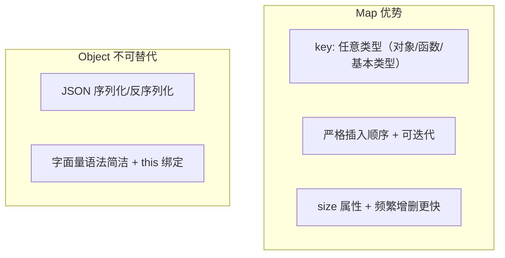

# Set / Map / WeakMap

> &#11088;&#11088;&#11088;&#11088;&#11088;｜难度：中级｜项目：&#9733;&#9733;&#9733;

## 一句话总结

**Map 是 Object 的进化版 -- 任意类型 key、保持插入顺序、可迭代、频繁增删更快；WeakMap 是 Map 的内存安全版 -- 对象 key + 弱引用，关联数据但不阻止 GC**。Vue3 响应式系统的核心正是 WeakMap → Map → Set 三层嵌套。

## 核心机制

### Map vs Object



```js
// key 类型的决定性差异
const map = new Map()
map.set({}, '对象 key').set(() => {}, '函数 key')
map.set(1, '数字 key').set('1', '不同的 key')

const obj = {}
obj[{}] = 'a'       // key → '[object Object]'
obj[() => {}] = 'a' // 覆盖了上一个！

// Map 保持插入顺序；Object 数字 key 会排在前
console.log([...new Map([['z',1],['a',2],['m',3]]).keys()]) // ['z','a','m']
```

### WeakMap vs Map -- 弱引用的核心价值

```js
// 普通 Map：外部置 null 后，Map 内部强引用仍阻止 GC
let obj = { name: 'Alice' }
const map = new Map(); map.set(obj, 'metadata')
obj = null   // map 仍持有 { name: 'Alice' } → 内存不释放

// WeakMap：key 的引用是"弱"的，不阻止 GC
let obj2 = { name: 'Bob' }
const wm = new WeakMap(); wm.set(obj2, 'metadata')
obj2 = null  // { name: 'Bob' } 失去所有强引用 → 可被 GC
             // WeakMap 对应 entry 自动消失 — 无需手动清理
```

**WeakMap 的三个限制**（弱引用的代价）：key **必须是对象**（基本类型无 GC）、**不可迭代**（GC 时机不确定）、**没有 `size`**

## 深度拓展

### Set vs Array
```js
// 数组去重一行搞定
const unique = [...new Set([1, 2, 2, 3, 3, 3])] // [1, 2, 3]

// Set.has → O(1) vs Array.includes → O(n)，十万级数据快 100 倍+

// 集合运算（算法题高频）
const a = new Set([1, 2, 3]), b = new Set([2, 3, 4])
new Set([...a, ...b])                   // 并集 {1,2,3,4}
new Set([...a].filter(x => b.has(x)))   // 交集 {2,3}
new Set([...a].filter(x => !b.has(x)))  // 差集 {1}
```

### WeakSet -- 轻量级"标记"集合

```js
const processed = new WeakSet()
function handle(item) {
  if (processed.has(item)) return // 已处理，跳过
  processed.add(item)
}
// item 被释放后，WeakSet 中记录自动消失，无泄漏风险
```

### DOM 节点关联数据

```js
const nodeData = new WeakMap()
function mount(node) {
  nodeData.set(node, { clicks: 0 })
  node.addEventListener('click', () => nodeData.get(node).clicks++)
}
// 节点删除 → WeakMap entry 自动 GC，零泄漏
// 普通 Map 必须手动 delete，遗忘即泄漏
```

### Vue3 响应式 -- 区分度答案
```js
// targetMap: WeakMap<object, Map<PropertyKey, Set<ReactiveEffect>>>
//            ↓              ↓              ↓
//        响应式对象       对象的属性      依赖此属性的 effect 集合

// 模拟 Vue3 依赖收集
const targetMap = new WeakMap()          // ① 外层 WeakMap

function track(target, key) {
  let depsMap = targetMap.get(target)
  if (!depsMap) targetMap.set(target, depsMap = new Map())  // ② Map
  let dep = depsMap.get(key)
  if (!dep) depsMap.set(key, dep = new Set())               // ③ Set
  dep.add(activeEffect)
}

function trigger(target, key) {
  targetMap.get(target)?.get(key)?.forEach(effect => effect())
}
```

**理由**：WeakMap（外）→ 对象销毁后自动 GC；Map（中）→ 按属性名查找；Set（内）→ 自动去重。**面试时把这三点说清楚，比背 API 有说服力 10 倍。**

## 项目实战

### 私有属性 -- WeakMap 经典用法

```js
const _private = new WeakMap()
class Counter {
  constructor() { _private.set(this, { count: 0 }) }
  increment() { return ++_private.get(this).count }
  get value()  { return _private.get(this).count }
}
// 外部完全无法访问 _private.get(this) — 真正的私有
```

## 易错点

1. **Map 替代 Object？** -- JSON.stringify(Map) → `{}`，API 交互仍需 Object
2. **WeakMap 的 key 弱引用，value 不是** -- 只有 key 回收后整个 entry 才移除
3. **Set 对对象去重是按引用** -- `new Set([{a:1},{a:1}])` 有两个元素
4. **`new Map([[1,2]])` 是二维数组** -- 每个元素是 `[key,value]` 对
5. **忘记 WeakMap 不可遍历** -- 需要迭代的场景用 Map

## 面试信号表

| 面试官问 | 下一问大概率是 |
|----------|-------------|
| "Map 和 Object 的区别" | 追问 WeakMap 弱引用机制 |
| "WeakMap 弱引用什么意思" | 追问 Vue3 响应式为什么用 WeakMap |
| "数组去重怎么做" | 追问 Set.has vs Array.includes 性能 |
| "Vue3 怎么追踪依赖" | 追问 targetMap 三层结构 |

## 相关阅读

- [原型链](./prototype-chain.md)
- [Vue3 响应式](../Vue3/reactivity.md)
- [垃圾回收](../浏览器/gc.md)

## 更新记录

- 2026-07-06：Phase 2 深度填充（Map vs Object 全维度对比 + WeakMap 弱引用 + Vue3 targetMap 三层结构 + Mermaid 架构图）
