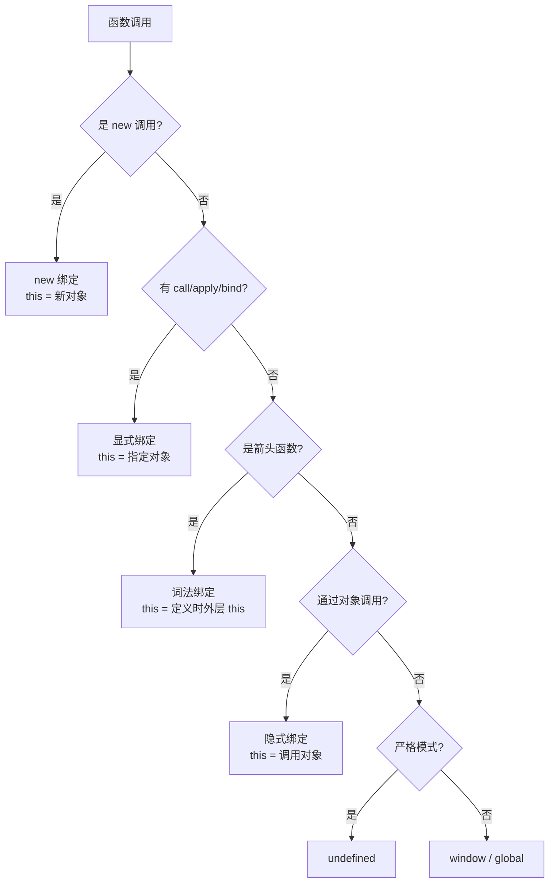

# this

> &#11088;&#11088;&#11088;&#11088;&#11088;｜难度：中级&#9733;&#9733;&#9733;

## 一句话总结

**this 是函数执行时的上下文对象，由调用方式决定，而非定义时决定**——this 的绑定是动态的（由调用点决定），但这不同于"动态作用域"（JavaScript 使用的是词法作用域，变量解析沿定义时嵌套结构查找，而非调用栈）。谁调用函数，this 就指向谁（严格模式下 undefined）。

## 核心机制

面试时，把这"五条规则 + 一个优先级"讲清楚就够了：

### 五种绑定规则

```
优先级从高到低：new 绑定 > 显式绑定 > 隐式绑定 > 默认绑定
```

**1. 默认绑定** -- 独立函数调用，this 指向全局对象（严格模式下为 undefined）。现代代码推荐使用 `globalThis` 统一获取全局对象，兼容浏览器、Node 和 Worker 环境：

```ts
// 非严格模式
function foo() { console.log(this) }
foo() // window（浏览器）/ global（Node）/ globalThis

// 严格模式
"use strict"
function foo() { console.log(this) }
foo() // undefined
```

**2. 隐式绑定** -- 通过对象调用，this 指向该对象：

```ts
const obj = {
  name: "admin",
  sayName() { console.log(this.name) }
}
obj.sayName() // "admin" — 调用点是 obj
```

**隐式丢失**是最大的坑 -- 把方法赋给变量后，this 就跑丢了：

```ts
const fn = obj.sayName
fn() // ""（非严格模式 this → window，window.name 默认为 ""）
// 严格模式下 this → undefined，访问 .name 抛 TypeError

// setTimeout 回调也是隐式丢失
setTimeout(obj.sayName, 100) // this → window
```

**3. 显式绑定** -- call / apply / bind 强制指定 this：

```ts
function greet() { console.log(this.name) }
const user = { name: "Tom" }
greet.call(user)  // "Tom"
greet.apply(user) // "Tom"
const bound = greet.bind(user)
bound()           // "Tom"
```

**4. new 绑定** -- 通过 new 调用，this 指向新创建的实例对象：

```ts
function Person(name) {
  this.name = name // this → 新创建的 {}
}
const p = new Person("Jack")
console.log(p.name) // "Jack"
```

**5. 箭头函数** -- 没有自己的 this，继承外层作用域的 this（lexical this）：

```ts
const obj = {
  name: "outer",
  fn: () => {
    console.log(this.name) // this 不是 obj，而是定义时外层作用域的 this
  }
}
obj.fn() // undefined（外层可能是 window）
```

**addEventListener 的 this 绑定**：事件监听器回调中，`this` 默认指向绑定事件的 DOM 元素（即 `event.currentTarget`），这也是隐式绑定的一种：

```ts
document.querySelector("#btn")?.addEventListener("click", function () {
  console.log(this) // → 绑定事件的 DOM 元素（#btn）
})
// 箭头函数则没有这个效果 -- this 仍然是外层词法作用域的 this
document.querySelector("#btn")?.addEventListener("click", () => {
  console.log(this) // → 外层 this（非严格模式为 window）
})
```

### 优先级验证

```ts
const obj1 = {
  name: "obj1",
  fn: function () { console.log(this.name) }
}
const obj2 = { name: "obj2" }

// new > 显式：new 不能和 call/apply 同时用，但 new bound 函数时，new 的 this 优先
function Foo(name) { this.name = name }
const BoundFoo = Foo.bind(obj1)
const instance = new BoundFoo("newObj")
console.log(instance.name) // "newObj" — new 覆盖了 bind 的 this
```

## 深度拓展

### 追问：箭头函数的 lexical this 到底怎么理解？

箭头函数的 `[[ThisMode]]` 内部属性为 `lexical`（普通函数是 `global` 或 `strict`），这意味着它的 this 在**定义时**就确定了，从外层作用域"偷"过来。这让它在回调场景非常有用：

```ts
// 经典问题：setTimeout 里的 this 为什么指向 window？
const obj = {
  name: "admin",
  sayName() {
    setTimeout(function () {
      console.log(this.name) // undefined — this → window
    }, 100)
    setTimeout(() => {
      console.log(this.name) // "admin" — 箭头函数继承了 sayName 的 this
    }, 100)
  }
}
```

**面试信号**：如果你的项目 Vue2 转 Vue3，你一定会被问到"为什么要移除 this"。答案是：Vue3 的 Composition API 在 setup 函数中执行时，由于 setup 是普通函数被调用（而非组件实例的方法调用），this 就是 undefined -- 这反而是设计意图，逼迫你远离 this 的隐式依赖。

### 追问：Vue3 setup 中 this 为什么是 undefined？

```ts
// Vue3 源码中调用 setup 的方式（简化）
function setupStatefulComponent(instance) {
  const setup = instance.type.setup
  if (setup) {
    // 直接调用 setup，没有 bind(instance)
    const setupResult = setup(instance.props, { attrs, slots, emit, expose })
    //                          ↑ 普通函数调用，this → undefined（严格模式模块）
  }
}
```

这是故意的。Composition API 的设计哲学是**函数式** -- 所有响应式数据通过 ref/reactive 显式声明，而不是挂到 this 上找隐式属性。好处是：更好的类型推导、更清晰的依赖关系、更易 tree-shaking。

## 项目实战

### 1. Axios 拦截器中 this 指向丢失

```ts
// ❌ 错误写法 — this 在拦截器回调中丢失
class ApiService {
  private baseURL = "/api"
  private router = useRouter()

  setupInterceptors() {
    axios.interceptors.response.use(
      this.handleResponse, // 传入时 this 丢失！
      this.handleError
    )
  }

  handleResponse(response) {
    // this.router 是 undefined — this 不是 ApiService 实例
    this.router.push("/login")
  }
}

// ✅ 正确写法 — 箭头函数保留外层 this
class ApiService {
  setupInterceptors() {
    axios.interceptors.response.use(
      (response) => this.handleResponse(response), // 箭头函数，this 指向实例
      (error) => this.handleError(error)
    )
  }
}
```

### 2. 组件 methods 中箭头函数 vs 普通函数

```ts
// Vue3 Options API（不推荐 arrow function 定义 method）
export default defineComponent({
  data() { return { count: 0 } },
  methods: {
    // ✅ 普通函数：this 正确指向组件实例
    increment() { this.count++ },
    // ❌ 箭头函数：this 是 setup 外的 this（undefined），取不到 data
    decrement: () => { this.count-- }
  }
})
```

实际项目中我的团队更喜欢 Composition API，完全不需要关心 this：

```ts
// Vue3 Composition API — 和 this 说再见
const count = ref(0)
const increment = () => { count.value++ } // 箭头函数，闭包引用 count
```

## 易错点

1. **箭头函数可以 bind(this)** -- 箭头函数的 this 是词法绑定的，`call/apply/bind` 对它无效，不会报错但也改不了
2. **Vue3 setup 里有 this** -- setup 执行时组件实例还没完全初始化，this 是 undefined
3. **严格模式下 this 默认指向 window** -- 严格模式下独立函数调用的 this 是 undefined
4. **对象方法用箭头函数** -- `{ name: "x", fn: () => this.name }` 中的 this 不是当前对象
5. **class 的方法提取后 this 丢失** -- `const f = obj.method; f()` 也会隐式丢失

## 面试信号表

| 面试官问 | 下一问大概率是 |
|----------|-------------|
| "箭头函数和普通函数区别" | this 指向 + 能否 new |
| "call 和 apply 区别" | 手写 bind |
| "手写 bind" | new 优先级覆盖 |
| "Vue3 为什么移除 this" | Composition API 设计哲学 |



## 相关阅读

- [下一篇](./closure.md)
- [call / apply / bind](./call-apply-bind.md)
- [new](./new.md)
- [闭包](./closure.md)

## 更新记录

- 2026-07-05：Phase 2 深度填充（this 五种绑定 + Vue3 实战 + 决策树 Mermaid）
