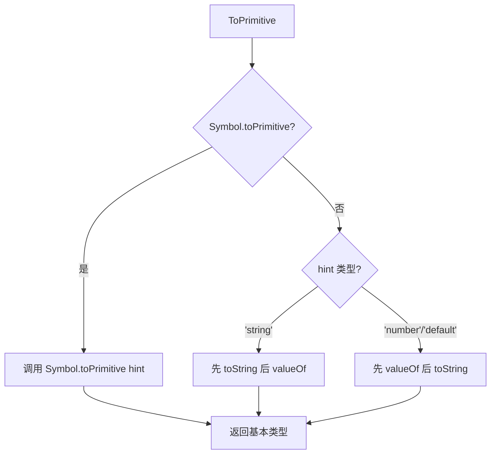

# 类型转换

> &#11088;&#11088;&#11088;&#11088;&#11088;｜难度：中级｜项目：&#9733;&#9733;&#9733;

## 一句话总结

**JavaScript 的类型转换不是魔法，而是由 ECMAScript 规范精确定义的抽象操作**。理解 `ToPrimitive` 的调用顺序（`Symbol.toPrimitive` > `valueOf` > `toString`），就能推导出所有看似诡异的结果。每次面试必问，因为 `==` 隐式转换和 `+` 运算符的歧义性是最常见的 bug 来源。

## 核心机制

### ToPrimitive -- 一切类型转换的入口

当 JS 需要把对象转为基本类型时，调用 `ToPrimitive(input, PreferredType)`：



```js
// 优先级演示：Symbol.toPrimitive 最高
const obj = {
  [Symbol.toPrimitive](hint) { return hint === 'string' ? 'hello' : 42 },
  valueOf() { return 100 },
  toString() { return 'oops' }
}
console.log(+obj)      // 42    (hint: number)
console.log(`${obj}`)  // hello (hint: string)
console.log(obj + '')  // 42    (hint: default)
// Symbol.toPrimitive 存在时，valueOf/toString 被完全忽略
```

## 深度拓展

### `==` 隐式转换 -- 4 条规则

```js
// 1. null == undefined 为 true，不与任何其他值 ==
null == undefined          // true
null == 0                  // false

// 2. 字符串 == 数字 → 字符串转数字
'42' == 42                 // true（Number('42') → 42）
'' == 0                    // true（Number('') → 0）

// 3. 布尔 == 任何 → 布尔先转数字
true == 1                  // true（Number(true) → 1）
true == '1'                // true（true → 1 → '1' → 1）
// 注意：true == 2 是 false，因为 1 != 2

// 4. 对象 == 基本类型 → ToPrimitive
[42] == 42                 // true（[42].toString() → '42' → 42）
```

### 终极面试题：`[] == ![]` 为什么是 true？

```js
[] == ![]
// ① ![] → false（对象转布尔都是 true，!true → false）
[] == false
// ② 规则 3：布尔转数字 → false → 0
[] == 0
// ③ 规则 4：ToPrimitive([], 'default') → [].valueOf() → 仍是 []
//    继续 [].toString() → ''
'' == 0
// ④ 规则 2：Number('') → 0
0 == 0  // ⑤ true
```

**对比陷阱**：`{} == !{}` → false。因为开头的 `{}` 被解析为**空代码块**（不是对象），最终是 `{}; false` → false。括号包裹可纠正：`({}) == !{}`。

### `+` 运算符：有字符串拼接，否则转数字

```js
1 + '2'          // '12'
1 + 2 + '3'      // '33'（先 1+2=3，再 3+'3'='33'）
'1' + 2 + 3      // '123'

1 + true         // 2   (true → 1)
1 + null         // 1   (null → 0)
1 + undefined    // NaN (undefined → NaN)

// 经典坑：[1,2] + [3,4] → '1,23,4'
// [1,2].toString() → '1,2'  +  [3,4].toString() → '3,4' = '1,23,4'
```

### `{} + []` vs `[] + {}`：位置决定一切

```js
{} + []          // 0  — {} 是空代码块，+[] → Number([]) → 0
[] + {}          // '[object Object]'
({} + [])        // '[object Object]' — 括号强制 {} 为对象
```

### Boolean 转换：8 个 falsy 值

```js
// 只有这 8 个值转布尔为 false，其他一切都是 true
false, 0, -0, 0n, '', null, undefined, NaN, document.all

!!{}                 // true  — 空对象也是 true
!![]                 // true  — 空数组也是 true
!!new Boolean(false) // true  — 所有对象为 true
```

### Number() vs parseInt()：完全不同

```js
Number('')         // 0   — 空字符串 → 0
parseInt('')       // NaN — 找不到数字

Number('42px')     // NaN — 整体解析失败
parseInt('42px')   // 42  — 逐字符解析，遇非数字停

Number(null)       // 0
parseInt(null)     // NaN

// parseInt 第二个参数 radix 必传，否则 '08' 行为不确定
parseInt('10', 2)  // 2（二进制）
```

## 易错点

1. **`[] == ![]` 背答案而不是推导** -- 面试官要听到 ToPrimitive 调用顺序 + == 规则
2. **`new Boolean(false)` 转布尔是 true** -- 所有对象转布尔都是 true
3. **`undefined` → NaN，`null` → 0** -- 规范规定，死记即可
4. **`+` 单目也是类型转换** -- `+'42'` → 42，`+[]` → 0，等价于 Number()
5. **`'2' > '12'` → true** -- 字符串比较是逐位 Unicode 编码比较，不是数字比较

## 面试信号表

| 面试官问 | 下一问大概率是 |
|----------|-------------|
| "== 和 === 有什么区别" | 追问 `[] == ![]` 完整推导过程 |
| "为什么 `[] + []` 是空字符串" | 追问 `{} + []` vs `[] + {}` |
| "`null == undefined` 是 true 吗" | 追问 `null > 0` / `null >= 0` 的结果 |
| "`typeof null` 是什么" | 追问 JS 原始类型有哪些 |

## 相关阅读

- [this](./this.md)
- [闭包](./closure.md)

## 更新记录

- 2026-07-06：Phase 2 深度填充（ToPrimitive 优先级 + == 四条规则 + `[] == ![]` 推导 + Mermaid 流程图）
