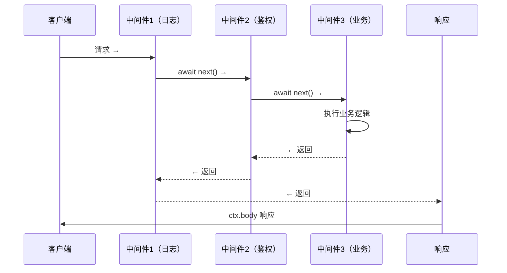

# Express / Koa

> ⭐⭐⭐｜难度：中级｜项目：★★★

## 一句话总结

> Express 是 Node.js 最经典的 Web 框架，中间件线性执行，回调风格。Koa 是 Express 原班人马的重写版，使用 async/await 和洋葱模型，更轻量、更现代。核心差异：Express 通过 `res.send()` 终结响应，Koa 通过 `ctx.body` 赋值 + `await next()` 控制流，中间件完全由 async/await 驱动。

面试时这样开口："Express 和 Koa 都是 TJ Holowaychuk 打造的。Express 诞生于 2010 年，是 Node 生态的基石，目前仍是最流行的 Node Web 框架。Koa 是同一团队在 2015 年的重写版本，原生支持 async/await，中间件采用洋葱模型。Koa 更轻量——不内置路由、模板引擎、静态文件服务，这些全交给社区插件。实际选择上，老项目用 Express，新项目追求简洁和现代化用 Koa，或者直接用更上层的 Egg.js/Nest.js。"

## 核心机制

### 1. Express 中间件：线性执行，回调风格

Express 的中间件按照注册顺序**从上到下依次执行**。每个中间件通过调用 `next()` 把控制权交给下一个：

```js
const express = require('express')
const app = express()

app.use((req, res, next) => {
  console.log('1. 请求进来了')
  req.startTime = Date.now()
  next()                              // 交给下一个中间件
  console.log('5. 响应发出去了，耗时:', Date.now() - req.startTime)
})

app.use((req, res, next) => {
  console.log('2. 鉴权检查')
  next()
})

app.get('/user', (req, res, next) => {
  console.log('3. 处理 /user 路由')
  res.json({ name: 'Alice' })         // res.send/res.json 后不会再执行后续中间件
  // 但当前函数里 next() 后面的代码还会执行！
  console.log('4. 这一行还会打印')
})

app.listen(3000)
```

**Express 的执行特点**：

1. 中间件按注册顺序线性执行，`next()` 是交接信号
2. `res.send()` / `res.json()` 会**发送响应并终结请求**，后续中间件**不会执行**
3. 但在当前中间件内部，`res.send()` 后面的同步代码**仍然会执行**（这是常见的坑）
4. Express 不强制 `await next()`——因为它的中间件不是 async 驱动的

**Express 错误处理中间件**：通过四个参数 `(err, req, res, next)` 签名来捕获错误：

```js
app.use((err, req, res, next) => {
  console.error('服务器错误:', err.stack)
  res.status(500).json({ error: 'Internal Server Error' })
})
// 错误处理中间件必须放在所有普通中间件之后
// 且必须有 4 个参数（Express 通过参数个数判断）
```

### 2. Koa 中间件：洋葱模型，async/await 驱动

Koa 的核心是**洋葱模型**——请求从外到内穿过所有中间件（`next()` 之前的部分），到达最内层后，再从内到外返回（`next()` 之后的部分）：

```js
const Koa = require('koa')
const app = new Koa()

// 中间件 1（最外层）
app.use(async (ctx, next) => {
  console.log('1. 洋葱皮 → 进入')
  await next()                              // 进入下一层
  console.log('6. 洋葱皮 → 出来')
})

// 中间件 2
app.use(async (ctx, next) => {
  console.log('2. 中间层 → 进入')
  await next()
  console.log('5. 中间层 → 出来')
})

// 中间件 3（最内层 / 核心业务）
app.use(async (ctx) => {
  console.log('3. 洋葱芯 → 执行')
  ctx.body = { name: 'Alice' }              // 响应数据，不直接发送
  console.log('4. 洋葱芯 → 完成')
})

app.listen(3000)
// 输出顺序：1 → 2 → 3 → 4 → 5 → 6
```

**洋葱模型的 Mermaid 图**：



Koa 的 `ctx`（context）封装了原生的 `req` 和 `res`，提供了大量便捷属性：

| ctx 属性 | 等价于 | 说明 |
|----------|--------|------|
| `ctx.request` | Node 原生 req 的封装 | 请求信息 |
| `ctx.response` | Node 原生 res 的封装 | 响应信息 |
| `ctx.req` | 原生 `req` | 直接访问，不推荐 |
| `ctx.res` | 原生 `res` | 直接访问，不推荐 |
| `ctx.body` | `ctx.response.body` | 设置响应体 |
| `ctx.status` | `ctx.response.status` | 设置 HTTP 状态码 |
| `ctx.state` | 用户自定义命名空间 | 中间件间传递数据（类似 req.xxx） |

### 3. Koa vs Express 核心对比

| 维度 | Express | Koa |
|------|---------|-----|
| 诞生时间 | 2010 | 2015（v1）、2017（v2 async/await） |
| 中间件风格 | 回调（`(req, res, next) => {}`） | async/await（`async (ctx, next) => {}`） |
| 执行模型 | 线性（没有洋葱返回流） | 洋葱模型（`await next()` 之前进入，之后返回） |
| 内置功能 | 路由、静态文件、模板引擎、body-parser | **无**（路由、静态服务等全部需要插件） |
| 请求/响应 | 直接操作 `req` / `res` | 通过 `ctx` 封装 `req` + `res` |
| 错误处理 | 4 参数错误中间件 + `next(err)` | `try/catch` + `ctx.onerror` 事件 |
| 包体积 | ~20 个依赖 | 零依赖（核心极简） |
| 生态 | 最丰富（Express 中间件成千上万） | 偏小（但关键插件都有） |

## 深度拓展

### 追问：洋葱模型的本质是什么？为什么它好？

洋葱模型的本质是**请求和响应在同一套中间件体系中完成了"入站"和"出站"两个阶段**。每个中间件都可以：

- 在 `await next()` **之前**做前置处理（日志记录、鉴权、参数校验、限流）
- 在 `await next()` **之后**做后置处理（响应时间计算、日志汇总、统一错误包装）

实际应用：

```js
// 场景：统一的响应格式包装
app.use(async (ctx, next) => {
  try {
    await next()                              // 执行后面的中间件
    // 如果后面的中间件设置了 ctx.body，在这里包装响应加上 code/message
    if (ctx.body) {
      ctx.body = {
        code: 0,
        message: 'success',
        data: ctx.body
      }
    }
  } catch (err) {
    // 统一错误处理
    ctx.status = err.status || 500
    ctx.body = { code: -1, message: err.message }
  }
})

// 后面的业务中间件只需关心业务逻辑
app.use(async (ctx) => {
  if (!ctx.query.id) {
    ctx.throw(400, '缺少 id 参数')           // Koa 内置的抛出 HTTP 错误方法
  }
  ctx.body = await getUserById(ctx.query.id)  // 只设置数据，包装由外层统一处理
})
```

这种模式在前端 BFF 层（Backend For Frontend）中非常有用——外层中间件统一处理鉴权、日志、响应包装，内层只写业务逻辑。

### 追问：Express 能实现洋葱模型吗？

可以从 Express 中间件中手动模拟，但不是原生的：

```js
// Express 模拟洋葱模型（koa-compose 的原理）
const middleware1 = (req, res, next) => {
  console.log('1. 进入')
  next()
  console.log('1. 出来')     // Express 中可以写，但 res 已经发送后可能无效
}
```

Express 的问题是：
1. `res.send()` 之后 Express **不会**再执行后续中间件（即使你在 next() 后写了代码，如果前面已经 send 了，你的修改也发不出去了）
2. Express 中间件是回调风格的，不支持 `await next()`，不能保证异步操作的顺序
3. 大量 Express 插件内部直接 `res.send()`，打断了潜在的"返回流"

所以 Koa 的洋葱模型是**语言特性（async/await）和框架设计共同作用的结果**，Express 从设计上就无法原生支持。

### 追问：Koa 为什么不内置路由？

这是 Koa 的设计哲学——**核心极简，功能靠社区插件组合**。Express 内置了路由，但这也意味着你不用也得带着。Koa 把路由的选择权交给开发者：

```js
// 用 koa-router 插件
const Router = require('koa-router')
const router = new Router()

router.get('/users', async (ctx) => {
  ctx.body = await getUsers()
})
router.post('/users', async (ctx) => {
  ctx.body = await createUser(ctx.request.body)
})

app.use(router.routes())
app.use(router.allowedMethods())  // 处理 405 Method Not Allowed
```

这和 Node.js 本身的哲学一致——核心只提供必要的最小 API，生态提供完整的解决方案。

## 项目实战

### 实战 1：用 Koa 搭建前端 BFF 层

在现代前端架构中，BFF（Backend For Frontend）层用于聚合后端微服务、代理请求、做数据裁剪：

```js
const Koa = require('koa')
const Router = require('koa-router')
const axios = require('axios')

const app = new Koa()
const router = new Router()

// 统一日志中间件
app.use(async (ctx, next) => {
  const start = Date.now()
  await next()
  const ms = Date.now() - start
  console.log(`${ctx.method} ${ctx.url} - ${ctx.status} - ${ms}ms`)
})

// 统一错误处理
app.use(async (ctx, next) => {
  try {
    await next()
  } catch (err) {
    ctx.status = err.status || 500
    ctx.body = { code: -1, message: err.message }
    ctx.app.emit('error', err, ctx)          // 触发错误事件，做日志上报
  }
})

// 代理 /api 请求到后端微服务
router.get('/api/user/:id', async (ctx) => {
  const { data } = await axios.get(`http://user-service:3001/user/${ctx.params.id}`)
  ctx.body = data
})

// 页面数据聚合：需要从多个服务拿数据
router.get('/api/homepage', async (ctx) => {
  const [userInfo, banners, articles] = await Promise.all([
    axios.get('http://user-service:3001/me'),
    axios.get('http://content-service:3002/banners'),
    axios.get('http://content-service:3002/articles?limit=10'),
  ])
  ctx.body = {
    user: userInfo.data,
    banners: banners.data,
    articles: articles.data,
  }
})

app.use(router.routes())
app.listen(4000)
```

### 实战 2：Mock 服务

前端独立开发时，用 Express 或 Koa 快速搭建 Mock 服务：

```js
const Koa = require('koa')
const Router = require('koa-router')

const app = new Koa()
const router = new Router()

// 模拟延迟（测试 loading 状态）
router.get('/api/users', async (ctx) => {
  await new Promise(resolve => setTimeout(resolve, 800))  // 模拟 800ms 网络延迟
  ctx.body = [
    { id: 1, name: 'Alice', role: 'admin' },
    { id: 2, name: 'Bob', role: 'user' },
  ]
})

// 模拟 30% 概率报错（测试错误处理）
router.post('/api/order', async (ctx) => {
  if (Math.random() < 0.3) {
    ctx.throw(500, '服务器繁忙，请稍后重试')
  }
  ctx.body = { orderId: Date.now(), status: 'success' }
})

app.use(router.routes())
app.listen(4000)
// 配置 Vite proxy 将 /api 代理到 localhost:4000 即可使用
```

## 易错点

- **Express 中 `res.send()` 之后继续执行代码**：`res.send()` 后面如果还有 `next()` 调用或数据库操作，可能导致响应已发送但仍执行耗时操作，浪费资源
- **Express 错误处理中间件的参数个数**：必须是 4 个参数 `(err, req, res, next)`——Express 靠 `Function.length` 判断是不是错误处理中间件
- **Koa 中忘记 `await next()`**：如果忘记 await，后续中间件会异步执行，洋葱模型的"返回流"会失效，`next()` 后面的代码不会按预期执行
- **`ctx.body` 只在没有响应时有效**：Koa 2 中如果 `ctx.body` 没有被设置，响应 body 为空；多次设置 `ctx.body` 不会报错但只有最后一次生效
- **混淆 `ctx.req` 和 `ctx.request`**：`ctx.req` 是 Node 原生对象，`ctx.request` 是 Koa 封装对象。应该用 `ctx.request`（或直接 `ctx.body` / `ctx.query` 这些快捷属性）
- **在生产环境用 `ctx.throw()` 而不捕获**：`ctx.throw` 会抛出错误，必须在洋葱模型外层 try/catch 捕获，否则进程崩溃

## 面试信号

当面试官问"Express 和 Koa 的区别"，不要只说"Koa 更轻量"。核心结构应该是：

> "两者的本质区别在中间件模型。Express 是线性回调模型——中间件按顺序执行，`res.send()` 后请求就终结了，后续中间件不会执行。Koa 是洋葱模型——通过 `async/await` 实现请求从外到内再回到外的完整闭环，每个中间件在 `await next()` 之前做前置处理、之后做后置处理。这使得 Koa 特别适合做 BFF 层——外层统一处理鉴权、日志、错误包装，内层只写业务逻辑。另外 Koa 通过 `ctx` 封装了原生的 `req` 和 `res`，API 更优雅。但 Express 生态更成熟，中间件数量碾压 Koa，老项目基本都在用 Express。如果面试的是大厂 Node 岗位，建议再延伸一下 Egg.js（基于 Koa，约定优于配置）和 Nest.js（装饰器 + DI，类似 Angular/Spring），展示你对 Node 生态圈有全景认知。"

如果能画出来洋葱模型的执行顺序图（说出 1→2→3→4→5→6 的执行结果），直接拿下面试官的认可。

## 相关阅读

- [CommonJS / ESM](./commonjs-esm.md)
- [Node Event Loop](./node-event-loop.md)
- [Express 官方文档](https://expressjs.com/)
- [Koa 官方文档](https://koajs.com/)
- [Egg.js](https://eggjs.org/)
