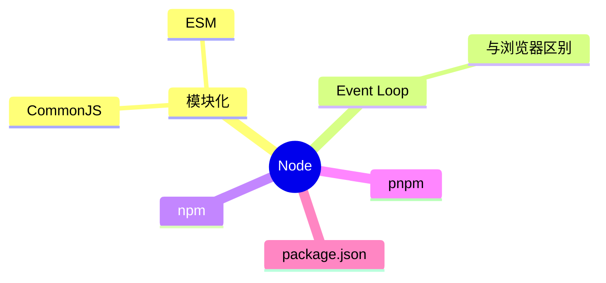

# Node 知识地图

## 推荐学习顺序

1. ⭐⭐⭐⭐⭐ [CommonJS / ESM](./commonjs-esm.md)
2. ⭐⭐⭐⭐⭐ [Node Event Loop](./node-event-loop.md)
3. ⭐⭐⭐⭐   [npm / pnpm](./package-manager.md)

## 知识点索引

| 知识点 | 频率 | 难度 | 手写 | 状态 |
|--------|------|------|------|------|
| [CommonJS / ESM](./commonjs-esm.md) | ⭐⭐⭐⭐⭐ | 中级 | — | draft |
| [Node Event Loop](./node-event-loop.md) | ⭐⭐⭐⭐⭐ | 高级 | — | draft |
| [npm / pnpm](./package-manager.md) | ⭐⭐⭐⭐ | 初级 | — | draft |
