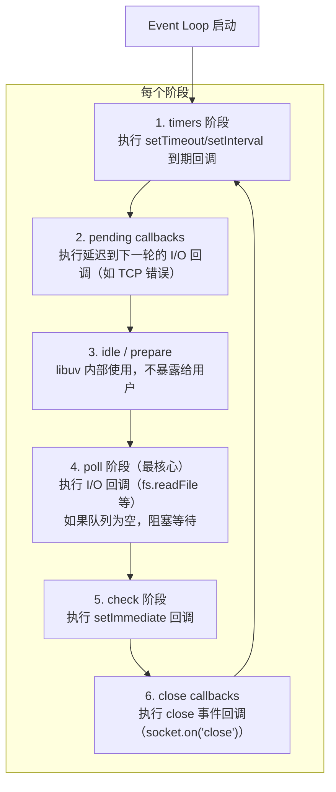

# Node Event Loop

> ⭐⭐⭐⭐⭐｜难度：高级｜项目：★★★

**Node Event Loop 和浏览器 Event Loop 是两套完全不同的模型。** 面试必问"Node 的 6 个阶段分别做什么"和"process.nextTick 和 Promise 谁先执行"。答对这两题，Event Loop 就过关了。

## 一句话总结

**Node.js Event Loop 基于 libuv 实现，有 6 个阶段（timers -> pending callbacks -> idle/prepare -> poll -> check -> close callbacks），process.nextTick 在每个阶段结束后的独立微任务队列中优先于 Promise 执行，这与浏览器的两队列宏/微任务模型有本质区别。**

## 核心机制

### 6 阶段详解 + 执行流程图



**关键点**：
- **每个阶段执行完该阶段的所有回调后，立即清空 nextTick 队列和微任务队列**（nextTick 先于 Promise）
- **poll 阶段是核心**：如果没有 setImmediate，poll 阶段会阻塞等待新事件；如果有 setImmediate，poll 阶段为空后会跳到 check 阶段
- **浏览器是"一个宏任务 -> 清空微任务 -> 可能渲染"的简单循环**；Node 是 6 阶段 + 独立 nextTick/微任务队列的复杂循环

### process.nextTick vs Promise 的执行顺序

```ts
// 这是面试必考题
setTimeout(() => console.log("1. setTimeout"), 0)
setImmediate(() => console.log("2. setImmediate"))

Promise.resolve().then(() => console.log("3. Promise"))

process.nextTick(() => {
  console.log("4. nextTick")
  process.nextTick(() => console.log("5. 嵌套 nextTick"))
  Promise.resolve().then(() => console.log("6. nextTick 中的 Promise"))
})

console.log("7. 同步代码")

// 输出：
// 7. 同步代码       — 同步优先
// 4. nextTick       — 同步代码结束后，nextTick 最先执行
// 5. 嵌套 nextTick  — nextTick 队列也要清空（包括嵌套）
// 3. Promise        — nextTick 清空后，才执行微任务
// 6. nextTick 中的 Promise — 前面 nextTick 产生的微任务
// 1. setTimeout 还是 2. setImmediate？ — 见下文分析
```

**核心规则**：`nextTick` > `Promise` > 宏任务各阶段。nextTick 的队列是独立于微任务队列的，且优先级更高。

### setImmediate vs setTimeout(fn, 0) -- 胜负取决于调用位置

```ts
// 情况1：在主模块（或 timer 阶段）调用
setTimeout(() => console.log("timeout"), 0)
setImmediate(() => console.log("immediate"))
// 输出顺序不确定！取决于主模块执行完到 timer 阶段的耗时
// 如果耗时 < 1ms，timeout 还没到期，先执行 immediate
// 如果耗时 > 1ms，timeout 已到期，先执行 timeout

// 情况2：在 poll 阶段（如 fs.readFile 回调）调用
fs.readFile("./test.txt", () => {
  setTimeout(() => console.log("timeout"), 0)
  setImmediate(() => console.log("immediate"))
})
// 输出：immediate → timeout
// 100% 确定！因为 poll 阶段之后就是 check 阶段
// setImmediate 在 check 阶段执行，所以一定先于下一轮的 timer
```

## 深度拓展

### 为什么 Node Event Loop 和浏览器不一样？

**设计目标不同**。浏览器的 JS 引擎和执行环境是一体的，主要处理用户交互、渲染和网络请求，所以是简单的"宏任务-微任务-渲染"循环。Node 的设计目标是 **I/O 密集型服务端**，libuv 提供了完整的异步 I/O 能力（文件系统、网络、子进程），需要精细控制不同类型 I/O 的执行顺序，所以分成了 6 个阶段。

### poll 阶段的阻塞行为

poll 阶段有两个关键分支：

```ts
// 伪代码：poll 阶段的逻辑
function poll() {
  if (有 setImmediate 回调) {
    执行完当前 poll 队列后，不阻塞，直接跳到 check 阶段
  } else if (有 timer 即将到期) {
    计算到最近 timer 的时间，阻塞等待那么久
  } else {
    阻塞等待任意新事件
    // 此时 process.nextTick 或 Promise 产生的回调
    // 会在新事件到达后立即执行
  }
}
```

**实践意义**：`setImmediate` 的存在会阻止 poll 阶段的阻塞等待。如果你的服务在某种场景下需要尽快响应，可以用 `setImmediate` 确保不会在 poll 阶段卡住。

### Worker Threads 的 Event Loop

Node 的 Worker Threads 也有独立的 Event Loop，使用独立的 libuv 实例。这意味着：

```ts
// worker 中的 setImmediate 和主线程的 setImmediate 完全独立
// 它们有各自的 6 阶段循环，不共享宏任务/微任务队列
import { Worker, isMainThread, parentPort } from "node:worker_threads"

if (isMainThread) {
  const worker = new Worker(__filename)
  setImmediate(() => console.log("主线程 immediate"))
  // 主线程和 worker 的 immediate 谁先执行？不确定
} else {
  setImmediate(() => console.log("Worker immediate"))
}
```

### Node 11 之后微任务行为变化

Node 11 之前，微任务在每个阶段结束时执行。Node 11+ **对齐浏览器行为**，微任务在**每个宏任务执行结束后**执行，而不是等整个阶段结束：

```ts
// Node 10：两个 timeout 都在 timer 阶段执行，微任务在 timer 阶段结束后统一执行
// Node 11+：第一个 timeout 执行后立刻清空微任务，再执行第二个 timeout
setTimeout(() => {
  console.log("timeout 1")
  Promise.resolve().then(() => console.log("promise 1"))
}, 0)
setTimeout(() => {
  console.log("timeout 2")
  Promise.resolve().then(() => console.log("promise 2"))
}, 0)

// Node 10 输出：timeout 1, timeout 2, promise 1, promise 2
// Node 11+ 输出：timeout 1, promise 1, timeout 2, promise 2
```

## 项目实战

### 1. 文件 I/O 操作后的回调时机

```ts
// 后台管理系统中，用 Node 做 SSR 渲染或文件处理时
// 理解 poll 阶段有助于排查时序问题
import fs from "node:fs"

console.log("开始")

fs.readFile("./template.html", "utf-8", (err, data) => {
  // 这个回调在 poll 阶段执行
  console.log("文件读取完成")

  // 在 poll 阶段中用 setImmediate → 立即跳到 check 阶段
  setImmediate(() => console.log("immediate 在文件读取后"))
  setTimeout(() => console.log("timeout 在文件读取后"), 0)
  // 输出：文件读取完成 → immediate → timeout（确定顺序！）
})

// 模拟 I/O 密集操作的异步调度
// 如果需要在 I/O 回调后尽快执行某段逻辑，用 setImmediate
// 如果不想阻塞 poll 阶段，用 process.nextTick（但要小心递归）
```

### 2. SSR 渲染中的异步数据获取

```ts
// 后台管理系统 SSR 场景：在渲染前并行获取所有数据
async function renderPage(url: string) {
  console.time("render")

  // 多个异步 I/O 操作并行（读取模板 + 查询数据 + 获取权限）
  const [template, pageData, permissions] = await Promise.all([
    fs.promises.readFile("./template.html", "utf-8"),
    fetchPageData(url),
    fetchPermissions(),
  ])
  // 三个操作完成后，它们的回调在 poll 阶段依次执行
  // Promise.all 在三个都 fulfilled 后，其 .then 作为微任务执行

  console.timeEnd("render")
  return composeHTML(template, pageData, permissions)
}
```

### 3. 定时器的精度问题

```ts
// 后台管理系统的定时任务（如定时刷新 token、轮询消息数）
// Node 中 setTimeout 的延迟不是精确的

// ❌ 不要用 setTimeout 做精确的定时任务
let count = 0
setInterval(() => {
  count++
  console.log(`第 ${count} 次`, new Date().toISOString())
  // 如果 poll 阶段阻塞了 2 秒，这个回调也会延迟 2 秒执行
}, 1000)

// ✅ 对于需要精确时间的任务，记录时间戳来判断
const startTime = Date.now()
setInterval(() => {
  const elapsed = Date.now() - startTime
  const expectedCount = Math.floor(elapsed / 1000)
  console.log(`应该执行 ${expectedCount} 次，实际已执行 ${++count} 次`)
}, 1000)
```

## 易错点

1. **nextTick 是微任务** -- 不准确。nextTick 有**独立的队列**，在每个阶段结束后先于 Promise 执行。严格来说它不属于"微任务"（微任务通常指 Promise.then 回调）
2. **setImmediate 比 setTimeout(fn, 0) 早** -- 不一定，取决于调用位置。主模块中调用顺序不确定（受系统时间影响），poll 阶段中调用则 setImmediate 一定先执行
3. **nextTick 递归会导致 Event Loop 饿死** -- 如果在 nextTick 回调中递归调用 nextTick，会一直卡在 nextTick 队列里，永远进不了下一个阶段（包括微任务和宏任务）。这会让 I/O 完全得不到处理
4. **Node 的 fs.readFile 是异步的所以不阻塞** -- fs.readFile 的 I/O 确实在 libuv 线程池中执行，不阻塞 JS 主线程。但它对应的回调在 poll 阶段执行，如果 poll 阶段回调太多，依然会阻塞后续的 check 阶段和 timer 阶段
5. **import 时顶层 await 会阻塞 Event Loop** -- 顶层 `await` 会阻塞整个模块的加载，直到 Promise resolve。在服务端入口文件中使用顶层 await 时，服务启动会延迟

## 相关阅读

- [Node 知识地图](./index.md)
- [CommonJS / ESM](./commonjs-esm.md)
- [npm / pnpm](./package-manager.md)
- [JavaScript Event Loop](../JavaScript/event-loop.md)

## 更新记录

- 2026-07-05：Phase 2 深度填充（6 阶段详解 + nextTick vs Promise + setImmediate vs setTimeout + Worker Threads + 项目实战）
