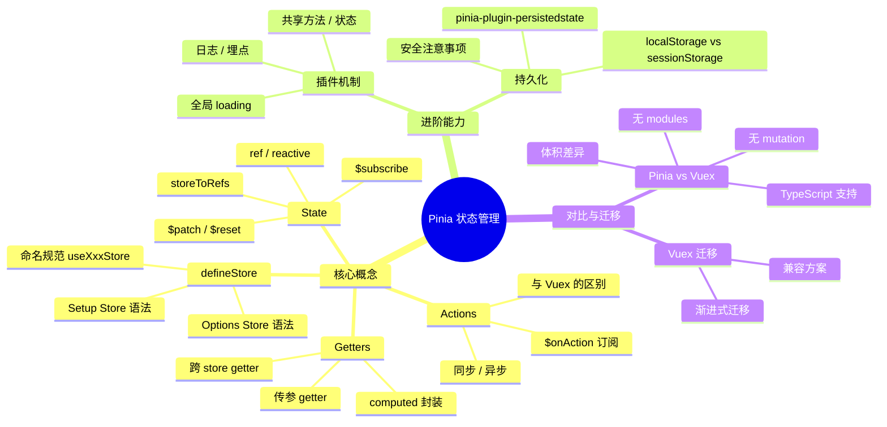

# Pinia 知识地图

> Pinia 是 Vue 生态的官方状态管理库，取代 Vuex 成为 Vue3 项目的默认选择。掌握 Pinia 是中高级前端面试的硬性指标。

## 知识体系总览

## 推荐学习顺序

1. **defineStore** -- 理解两种 Store 定义方式，掌握命名规范和实例化时机
2. **state** -- 学会定义响应式状态、解构保持响应式、批量更新和订阅变化
3. **getters** -- 用 computed 封装派生状态，掌握传参和跨 store 访问
4. **actions** -- 编写同步/异步业务逻辑，订阅 action 实现埋点和错误处理
5. **persist** -- 实现状态持久化，理解 localStorage/sessionStorage 的适用场景
6. **vs-vuex** -- 对比 Pinia 和 Vuex 的核心差异，掌握迁移策略
7. **plugins** -- 编写自定义插件，封装全局逻辑

## 知识点索引

| 知识点 | 重要程度 | 文件 | 核心内容 |
|--------|---------|------|---------|
| defineStore | ⭐⭐⭐⭐⭐ | [defineStore.md](./defineStore.md) | Setup Store vs Options Store、命名规范、实例化时机 |
| state | ⭐⭐⭐⭐⭐ | [state.md](./state.md) | 响应式定义、storeToRefs、$patch、$subscribe |
| getters | ⭐⭐⭐⭐ | [getters.md](./getters.md) | computed 封装、传参 getter、跨 store 访问 |
| actions | ⭐⭐⭐⭐⭐ | [actions.md](./actions.md) | 异步 action、$onAction 订阅、与 Vuex 区别 |
| 持久化 | ⭐⭐⭐⭐⭐ | [persist.md](./persist.md) | pinia-plugin-persistedstate 插件、安全注意事项 |
| Pinia vs Vuex | ⭐⭐⭐⭐⭐ | [vs-vuex.md](./vs-vuex.md) | 核心差异对比、迁移建议 |
| 插件 | ⭐⭐⭐ | [plugins.md](./plugins.md) | 插件机制、全局 loading、共享方法 |

## 面试高频考点

- **storeToRefs 和直接解构的区别**：解构会丢失响应式，storeToRefs 只解构 state 和 getters
- **Pinia 为什么没有 mutation**：action 可以直接修改 state，简化了 Vuex 的 mutation + action 两层模型
- **token 为什么不能放在 localStorage 持久化**：XSS 攻击可读取 localStorage，token 应存 httpOnly cookie
- **Setup Store 和 Options Store 的选择**：Setup Store 更灵活（可用 inject/watch），Options Store 更直观
- **$patch 的对象形式和函数形式**：函数形式适合复杂批量更新，能访问到当前 state

## 相关阅读

- [响应式原理](../Vue3/reactivity.md) -- Pinia state 底层依赖 reactive/ref
- [computed / watch](../Vue3/computed-watch.md) -- Pinia getters 本质是 computed
- [组合式 API](../Vue3/composition-api.md) -- Setup Store 基于 Composition API
- [权限系统 RBAC](../项目实战/权限系统/permission-rbac.md) -- 权限状态管理的实战场景

## 更新记录

- 2026-07-06：初始创建，完成 Pinia 知识地图
