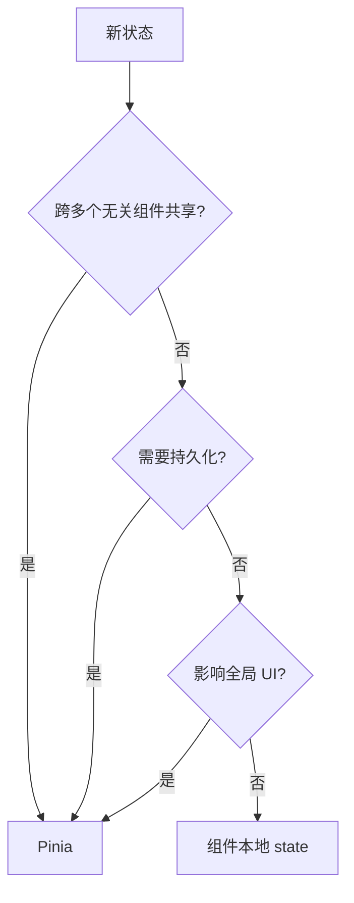

# 状态边界划分

> 不是所有状态都该进 Pinia。知道什么该全局化、什么该局部化，是区分「会用 Pinia」和「用好 Pinia」的分水岭。

## 一句话总结

判断一个状态该放 Pinia 还是组件本地 state，核心看三点：是否跨无关组件共享、是否需要持久化、是否影响全局 UI。表单草稿、UI 开关、一次性数据应留在组件内；用户信息、权限数据、全局配置才进 store。

## 核心机制

### 判断三原则

满足以下**任一**条件，放 Pinia：



**原则一：跨无关组件共享**

两个组件不在同一个父组件下，无法通过 props 传递，必须通过全局状态中转。

```ts
// 场景：用户信息在顶部导航栏显示头像，在侧边栏显示菜单权限，在编辑页面校验身份
// 这三个组件互相独立，没有共同的父组件能通过 props 下发 userInfo
// -> 放 Pinia
```

**原则二：需要持久化**

页面刷新后仍需要保留的数据（token、用户偏好、草稿），放 Pinia + persist 插件。

```ts
// 多步骤表单的草稿数据——页面刷新不能丢
export const useFormDraftStore = defineStore('formDraft', () => {
  const step1Data = ref({})
  const step2Data = ref({})
  // 配合 persist 插件持久化到 localStorage
  return { step1Data, step2Data }
})
```

**原则三：影响全局 UI**

全局 loading、主题色、国际化语言——任何影响全局界面的状态。

```ts
// 主题切换影响所有页面
export const useAppStore = defineStore('app', () => {
  const theme = ref<'light' | 'dark'>('light')
  const locale = ref('zh-CN')
  return { theme, locale }
})
```

### 本地 state 的适用场景

以下场景**不需要**进 Pinia，用组件本地 `ref` / `reactive` 即可：

| 场景 | 为什么不需要 Pinia |
|------|-------------------|
| 表单草稿（非多步骤） | 只在当前组件使用，提交后即丢弃 |
| UI 开关（弹窗、抽屉、折叠面板） | 只影响当前组件的视觉状态 |
| 一次性数据（API 返回的列表数据） | 用完即弃，不需要跨组件共享 |
| 动画状态 | 生命周期短，严格绑定当前组件 |
| 当前页面的筛选/排序条件 | 切换页面后不需要恢复 |

```vue
<script setup lang="ts">
// ✅ 这些都是组件本地状态，不需要 Pinia
const dialogVisible = ref(false)           // 弹窗开关
const formData = reactive({ name: '' })    // 单步表单
const tableData = ref([])                  // 当前页数据
const loading = ref(false)                 // 当前组件 loading
</script>
```

## 深度拓展

### 过度全局化的代价

把所有状态都丢进 Pinia 的问题：

**隐式耦合**：多个组件共享同一个 store 属性，修改一处影响多处，组件间依赖关系变得不可见。props 的显式传递虽然麻烦，但依赖链路一目了然。

**调试困难**：`$subscribe` 或 DevTools 中看到 state 变化，不知道是哪个组件触发的。组件本地 state 的修改来源只有组件自身。

**store 膨胀导致类型推断变慢**：一个 store 文件数千行，TypeScript 对大型 `reactive` 对象的类型推断开销显著增加，IDE 卡顿。

**内存占用**：Pinia store 中的数据在页面生命周期内持续存在，不会随组件卸载释放。一次性数据（如表格列表）放进 store 就是长期占用内存。

## 项目实战

### 典型分层方案

```
全局 Store（所有页面通用）
  user        -- 用户信息、token、权限列表
  permission  -- 动态路由、菜单树
  app         -- 主题、语言、侧边栏折叠

局部 Store（特定页面/模块使用）
  formDraft   -- 多步骤表单草稿（配合持久化）
  search      -- 列表页的高级搜索条件（切换 tab 后保留）

组件本地（不需要 Store）
  dialogVisible   -- 弹窗显隐
  currentStep     -- 当前步骤（非持久化场景）
  tableData       -- 表格数据
  formModel       -- 单页表单的绑定数据
```

### 多步骤表单：用 Pinia + 持久化

```ts
// stores/useApplyFormStore.ts
export const useApplyFormStore = defineStore('applyForm', () => {
  const currentStep = ref(1)
  const basicInfo = ref({ name: '', phone: '' })
  const projectInfo = ref({ title: '', description: '' })

  // 提交后清理草稿
  async function submit() {
    const res = await api.submit({ ...basicInfo.value, ...projectInfo.value })
    if (res.ok) {
      basicInfo.value = { name: '', phone: '' }
      projectInfo.value = { title: '', description: '' }
      currentStep.value = 1
    }
  }

  return { currentStep, basicInfo, projectInfo, submit }
})

// 配置 persist 插件：页面刷新后草稿不丢失
// pinia-plugin-persistedstate 会自动将 state 存到 localStorage
```

### 弹窗开关：用本地 state

```vue
<script setup lang="ts">
// ✅ 弹窗显隐是 UI 状态，组件本地处理
const visible = ref(false)
const userId = ref<number | null>(null)

function openDialog(id: number) {
  userId.value = id
  visible.value = true
}

function closeDialog() {
  visible.value = false
  userId.value = null
}
</script>
```

## 易错点

**把所有状态都放 Pinia**

> "免得以后传 props 麻烦"——结果 store 里塞满了几十个组件的一次性状态。Pinia 不是万能垃圾桶。

**担心重渲染一刀切用本地 state**

> 怕全局状态变化导致不相关组件重渲染，于是所有数据都封在组件里。结果兄弟组件间数据同步靠 `$bus` 或层层 ref 暴露，比 Pinia 更难维护。真正该做的是合理划分子 store，让组件只订阅自己需要的 store。

**SSR 场景公用实例污染**

> 服务端渲染时，Pinia store 实例在请求之间共享。如果在 SSR 的 store 中放了请求级数据（如当前用户 ID），且没有在每个请求前重置 store，会导致用户 A 的数据泄露给用户 B。解决方式：使用 `Pinia` 的 `createPinia()` + 每个请求新建 pinia 实例。

**新标签页是独立 Pinia 实例**

> `window.open()` 打开的新标签页有自己全新的 JS 运行环境，和原页面不共享内存。Pinia 状态不会跨标签页同步——这不是 Pinia 的问题，是 JS 单线程模型的限制。跨标签页状态共享需要 `BroadcastChannel`、`SharedWorker` 或 `localStorage` + `storage` 事件。

## 面试信号

| 面试官问 | 你要能答 |
|----------|---------|
| "你们项目里什么放 Pinia 什么不放" | 能说出三原则 + 能举例表单草稿、UI 开关不放的原因 |
| "把所有状态都放 Pinia 有什么问题" | 隐式耦合、调试困难、store 膨胀、内存占用 |
| "多步骤表单的状态管理方案" | Pinia + persist 持久化，避免刷新丢失 |
| "SSR 下 Pinia 有什么注意事项" | 每个请求新建 pinia 实例，防止状态跨请求污染 |

## 相关阅读

- [state](./state.md) -- Pinia state 的定义和使用
- [defineStore](./defineStore.md) -- Store 的创建和命名规范
- [persist](./persist.md) -- 持久化方案：什么该持久化、什么不该
- [进阶(组件外/TS/SSR)](./advanced.md) -- SSR 安全使用 Pinia

## 更新记录

- 2026-07-18：初始创建
