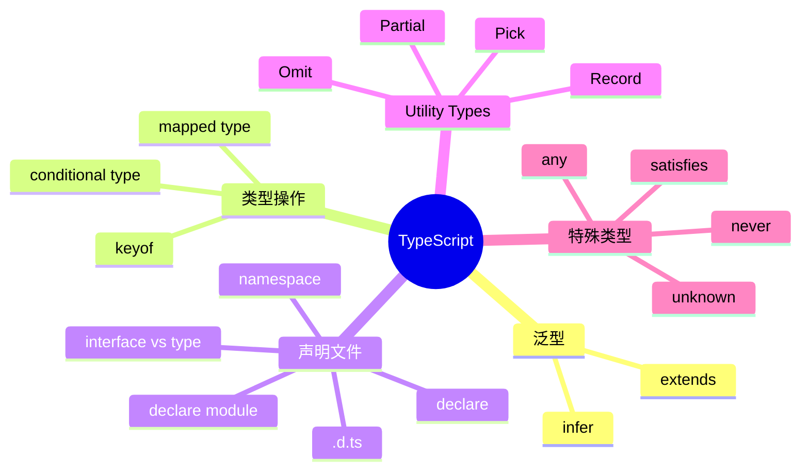

# TypeScript 知识地图

## 推荐学习顺序

1. ⭐⭐⭐⭐⭐ [泛型](./generics.md)
2. ⭐⭐⭐⭐⭐ [声明文件 / declare](./declaration.md)
3. ⭐⭐⭐⭐⭐ [Utility Types](./utility-types.md)
4. ⭐⭐⭐⭐   [extends / infer](./extends-infer.md)
5. ⭐⭐⭐⭐   [any / unknown / never](./any-unknown-never.md)
6. ⭐⭐⭐     [keyof / mapped / conditional](./keyof-mapped-conditional.md)
7. ⭐⭐⭐     [satisfies](./satisfies.md)

## 知识点索引

| 知识点 | 频率 | 难度 | 手写 | 状态 |
|--------|------|------|------|------|
| [泛型](./generics.md) | ⭐⭐⭐⭐⭐ | 中级 | — | draft |
| [声明文件 / declare](./declaration.md) | ⭐⭐⭐⭐⭐ | 中高级 | — | filled |
| [extends / infer](./extends-infer.md) | ⭐⭐⭐⭐ | 高级 | — | draft |
| [keyof / mapped / conditional](./keyof-mapped-conditional.md) | ⭐⭐⭐ | 高级 | — | draft |
| [Utility Types](./utility-types.md) | ⭐⭐⭐⭐⭐ | 中级 | — | draft |
| [satisfies](./satisfies.md) | ⭐⭐⭐ | 初级 | — | draft |
| [any / unknown / never](./any-unknown-never.md) | ⭐⭐⭐⭐ | 初级 | — | draft |
