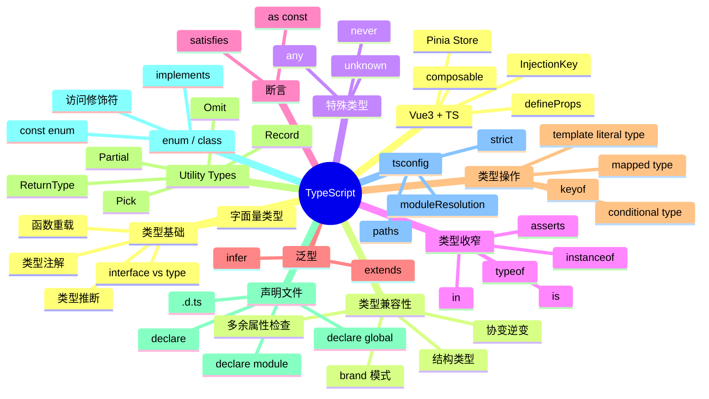
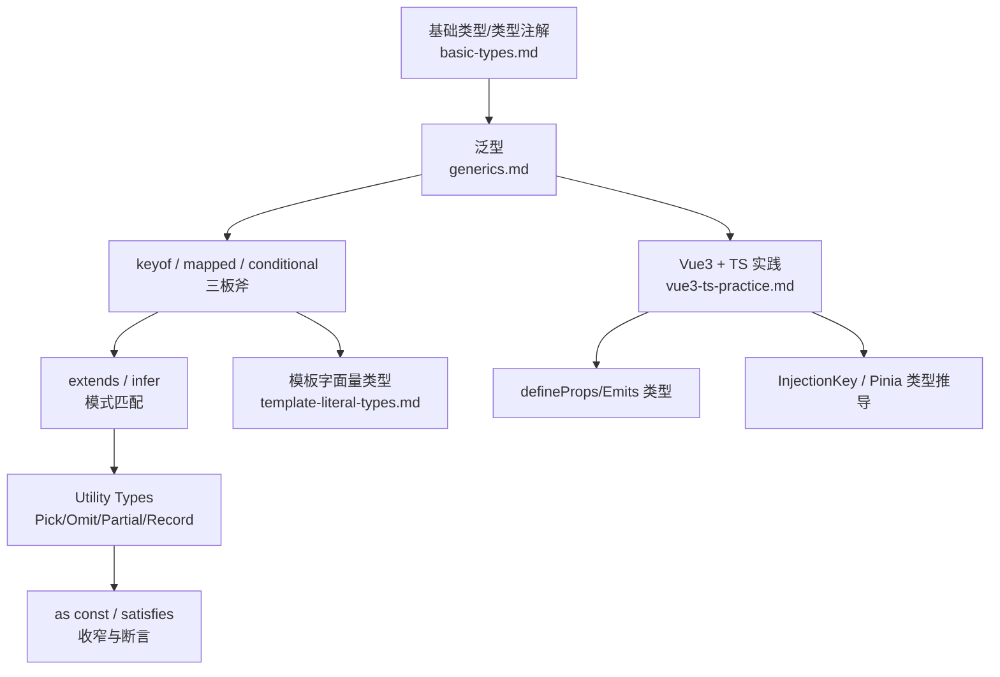

# TypeScript 知识地图

## 推荐学习顺序

### 一、类型基础

1.  ⭐⭐⭐⭐⭐  [基础类型 / 类型注解](./basic-types.md) 🆕 — 类型推断 + 字面量 + 函数重载 + interface vs type
2.  ⭐⭐⭐⭐    [any / unknown / never](./any-unknown-never.md)
3.  ⭐⭐⭐       [类型兼容性](./structural-typing.md) 🆕 — 结构型 vs 标称型
4.  ⭐⭐⭐       [enum / class 类型](./enum-class.md) 🆕

### 二、类型收窄 & 断言

5.  ⭐⭐⭐⭐     [类型收窄](./type-narrowing.md) 🆕 — typeof / instanceof / in / is / asserts
6.  ⭐⭐⭐       [as const / const assertion](./as-const.md) 🆕
7.  ⭐⭐⭐       [satisfies](./satisfies.md)

### 三、类型操作

8.  ⭐⭐⭐⭐⭐   [泛型](./generics.md)
9.  ⭐⭐⭐⭐⭐   [Utility Types](./utility-types.md)
10. ⭐⭐⭐       [keyof / mapped / conditional](./keyof-mapped-conditional.md)
11. ⭐⭐⭐⭐     [extends / infer](./extends-infer.md)

### 四、类型声明

12. ⭐⭐⭐⭐⭐   [声明文件 / declare](./declaration.md)

### 五、工程化

13. ⭐⭐⭐       [tsconfig.json 配置](./tsconfig.md) 🆕 — 含模块解析
14. ⭐⭐⭐⭐⭐   [Vue3 + TS 最佳实践](./vue3-ts-practice.md) 🆕

## 知识点索引

| 知识点 | 频率 | 难度 | 状态 |
|--------|------|------|------|
| [基础类型 / 类型注解](./basic-types.md) 🆕 | ⭐⭐⭐⭐⭐ | 初级 | draft |
| [any / unknown / never](./any-unknown-never.md) | ⭐⭐⭐⭐ | 初级 | draft |
| [类型兼容性](./structural-typing.md) 🆕 | ⭐⭐⭐ | 中高级 | draft |
| [enum / class 类型](./enum-class.md) 🆕 | ⭐⭐⭐ | 中级 | draft |
| [类型收窄](./type-narrowing.md) 🆕 | ⭐⭐⭐⭐ | 中级 | draft |
| [as const / const assertion](./as-const.md) 🆕 | ⭐⭐⭐ | 中级 | draft |
| [satisfies](./satisfies.md) | ⭐⭐⭐ | 初级 | draft |
| [泛型](./generics.md) | ⭐⭐⭐⭐⭐ | 中级 | draft |
| [Utility Types](./utility-types.md) | ⭐⭐⭐⭐⭐ | 中级 | draft |
| [keyof / mapped / conditional](./keyof-mapped-conditional.md) | ⭐⭐⭐ | 高级 | draft |
| [extends / infer](./extends-infer.md) | ⭐⭐⭐⭐ | 高级 | draft |
| [声明文件 / declare](./declaration.md) | ⭐⭐⭐⭐⭐ | 高级 | reviewed |
| [tsconfig.json 配置](./tsconfig.md) 🆕 | ⭐⭐⭐ | 中级 | draft |
| [Vue3 + TS 最佳实践](./vue3-ts-practice.md) 🆕 | ⭐⭐⭐⭐⭐ | 中级 | draft |

> 🆕 标记为本次 TypeScript 模块补齐新增的 7 篇知识点

## 跨模块连线——类型系统递进金字塔

> **面试怎么用**：TS 学习路径不是背 API——是从基础类型→泛型→类型操作→工程实践的递进金字塔。面试官问"TS 会到什么程度"，你沿着这个金字塔从上往下讲。

---

## 更新记录
