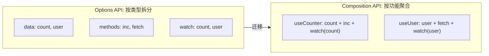

# Composition API

> "Options API 和 Composition API 哪个好" —— 面试官要的不是站队，而是你能说清楚两者的设计取舍和适用场景。核心不是 API 换了名字，而是**逻辑组织方式的范式迁移**。

## 一句话总结

Composition API 让代码从"按选项类型拆分"（data/methods/watch 分散各处）变成**"按功能聚合"**（一个功能的所有逻辑写在一起），通过 `setup()` 函数和 `composable` 模式实现真正灵活的逻辑复用。

## 核心机制

### 1. setup 的执行时机

`setup()` 在**解析 props 之后**执行，早于 Options API 的 `beforeCreate` 钩子。此时组件内部实例已创建（props 已挂上），但 Options API 上下文尚未建立——所以 `this` 不可用。

```ts
// script setup 是 setup() 的语法糖，编译结果等价于：
// <script setup>
//   const count = ref(0)
// </script>
// ↓ 编译后 ↓
import { ref, defineComponent } from 'vue'
export default defineComponent({
  setup() {
    const count = ref(0)
    return { count }
  }
})
```

`<script setup>` 在编译时做了几件事：
1. 自动 `return` 顶层绑定
2. 自动注册子组件（import 的组件可直接在 template 用）
3. `defineProps`/`defineEmits`/`defineExpose` 编译宏不需要 import
4. `.value` 在 template 中自动解包

### 2. composable 的设计模式

composable 的本质是**返回响应式数据 + 操作函数的工厂函数**：

```ts
// 一个标准的 composable
export function useMouse() {
  const x = ref(0)
  const y = ref(0)

  function update(e: MouseEvent) {
    x.value = e.pageX
    y.value = e.pageY
  }

  onMounted(() => window.addEventListener('mousemove', update))
  onUnmounted(() => window.removeEventListener('mousemove', update))

  return { x, y }  // 返回 readonly 版本更好，防止外部意外修改
}
```

与 React Hooks 的关键区别：
- **不需要依赖数组** —— Vue 的响应式自动追踪
- **没有调用顺序限制** —— setup 只执行一次，不像 React 每次渲染都执行
- **不需要 useCallback/useMemo** —— computed 自动缓存，watch 自动追踪

### 3. Options API vs Composition API



**什么时候用 Composition**：组件逻辑复杂（超过 3 个关注点）、需要跨组件复用逻辑、使用 TypeScript（类型推断更好）

**什么时候 Options 够用**：简单表单页、纯展示组件、团队尚未适应新写法

## 项目实战

### 后台管理系统四大必备 composable

```ts
// 1. useTable — 表格分页/搜索/排序一条龙
export function useTable(fetchFn: (params: any) => Promise<{ list: any[], total: number }>) {
  const loading = ref(false)
  const list = ref<any[]>([])
  const total = ref(0)
  const query = reactive({ page: 1, pageSize: 20, keyword: '', sortField: '', sortOrder: '' })

  const fetchData = async () => {
    loading.value = true
    try {
      const res = await fetchFn(query)
      list.value = res.list
      total.value = res.total
    } finally {
      loading.value = false
    }
  }

  watch(() => [query.page, query.pageSize, query.keyword], fetchData)

  onMounted(fetchData)

  return { loading, list, total, query, fetchData, refresh: fetchData }
}

// 2. useRequest — 统一管理 loading/error/data
export function useRequest<T>(fn: (...args: any[]) => Promise<T>) {
  const loading = ref(false)
  const error = ref<Error | null>(null)
  const data = shallowRef<T | null>(null)

  const execute = async (...args: any[]) => {
    loading.value = true; error.value = null
    try {
      data.value = await fn(...args)
    } catch (e) {
      error.value = e as Error
    } finally {
      loading.value = false
    }
  }

  return { loading, error, data, execute }
}

// 3. usePermission — 按钮级权限检查
export function usePermission() {
  const userStore = useUserStore()
  const hasPermission = (code: string) => userStore.permissions.includes(code)
  const hasAnyPermission = (...codes: string[]) => codes.some(c => hasPermission(c))
  const hasAllPermissions = (...codes: string[]) => codes.every(c => hasPermission(c))
  return { hasPermission, hasAnyPermission, hasAllPermissions }
}
// template: <el-button v-if="hasPermission('user:delete')">删除</el-button>

// 4. useTheme — 主题/暗黑模式切换
export function useTheme() {
  const isDark = useDark()              // 来自 @vueuse/core
  const toggle = useToggle(isDark)

  watch(isDark, (val) => {
    document.documentElement.classList.toggle('dark', val)
  })

  return { isDark, toggle }
}
```

## 易错点

**❌ Composition API 比 Options API 快**
性能没有任何差异。编译产物是同一套运行时。差异只在**开发体验**和**逻辑复用能力**。

**❌ setup 中可以用 this**
`setup()` 执行时 Options API 上下文尚未建立，`this` 是 `undefined`（严格模式下）。所有数据和方法通过 return 暴露。

**❌ composable 只能在 setup 中使用**
composable 本质就是一个普通函数，可以在任何 JS/TS 文件中调用。但因为它内部通常使用了生命周期钩子、ref/reactive 等，必须在**组件的 setup 上下文**中（或另一个 composable 中）调用才能正常工作。

**❌ 所有逻辑都应该抽成 composable**
过度抽象。3 行数据 + 1 个方法的组件，Options API 更直观。composable 的核心价值是**跨组件复用**和**复杂组件内聚**。

## 面试信号表

| 面试官问 | 下一问大概率是 |
|----------|-------------|
| "Composition API 和 Options API 有什么区别" | 追问逻辑复用——为什么 mixin 做不到而 hook 可以 |
| "setup 函数为什么不能是 async" | 追问 async setup 需要 Suspense 配合的底层原因 |
| "ref 和 reactive 怎么选" | 追问基本类型用 ref、对象解构用 toRefs 的实战场景 |
| "watchEffect 和 watch 有什么区别" | 追问自动依赖收集 vs 显式指定、immediate 默认行为 |

## Vue3 + TypeScript

> Vue3 是 TypeScript 一等公民——Composition API 的纯函数特性让类型推导天然精确。

### defineProps / defineEmits 类型写法

```vue
<script setup lang="ts">
// 运行时声明（类型为 Vue 推断）
const props = defineProps({ count: { type: Number, required: true } })

// 纯类型声明（更精确）
const props = defineProps<{
  count: number
  title?: string
  items: { id: number; name: string }[]
}>()

// 带默认值
const props = withDefaults(defineProps<{
  count?: number
  title?: string
}>(), {
  count: 0,
  title: 'Default Title'
})

// emits 类型（下面的具名元组语法为 Vue 3.3+）
const emit = defineEmits<{
  update: [id: number, value: string]     // 具名元组：参数1是id，参数2是value
  delete: [id: number]                     // 单参数
}>()
```

### defineSlots / defineModel 类型

```vue
<script setup lang="ts">
// slot 类型（Vue 3.3+）
const slots = defineSlots<{
  default(props: { item: Item }): any
  header(props: { title: string }): any
}>()

// defineModel 类型（Vue 3.4+）
const count = defineModel<number>('count', { default: 0 })
</script>
```

### 泛型组件（Vue 3.3+）

```vue
<script setup lang="ts" generic="T extends { id: number }">
const props = defineProps<{
  items: T[]
  columns: { key: keyof T; label: string }[]
}>()
// T 从传入的 items 类型自动推断——无需手动指定
</script>
```

### Composable 的类型推导

```typescript
// composable 的返回类型自动推断——无需手动声明
function useCounter(initial = 0) {
  const count = ref(initial)    // Ref<number>
  const double = computed(() => count.value * 2)  // ComputedRef<number>
  function increment() { count.value++ }
  return { count, double, increment }
  // 类型：{ count: Ref<number>; double: ComputedRef<number>; increment: () => void }
}
```

### 常见 TS 模式

```typescript
// 1. 用 ExtractPropTypes 从 props 定义提取类型
import type { ExtractPropTypes } from 'vue'
const propsDef = { count: { type: Number, required: true } }
type Props = ExtractPropTypes<typeof propsDef>

// 2. 用 InstanceType 获取组件实例类型（通用组件实例类型是 ComponentPublicInstance）
import type { ComponentPublicInstance } from 'vue'
type MyModalInstance = InstanceType<typeof MyModal>
const modalRef = ref<ComponentPublicInstance | null>(null)

// 3. template ref 的类型
const inputRef = ref<HTMLInputElement | null>(null)
// 模板中 <input ref="inputRef"> → inputRef.value?.focus()
```

## 相关阅读

- [响应式原理](./reactivity.md) — ref/reactive 是 composable 的基石
- [生命周期](./lifecycle.md) — composable 中可以注册生命周期钩子
- [项目实战] — 完整的后台管理系统 composable 体系

## 更新记录

- 2026-07：完整填充（Phase 2），加入后台系统四大 hook 实战、Options vs Composition 对照
